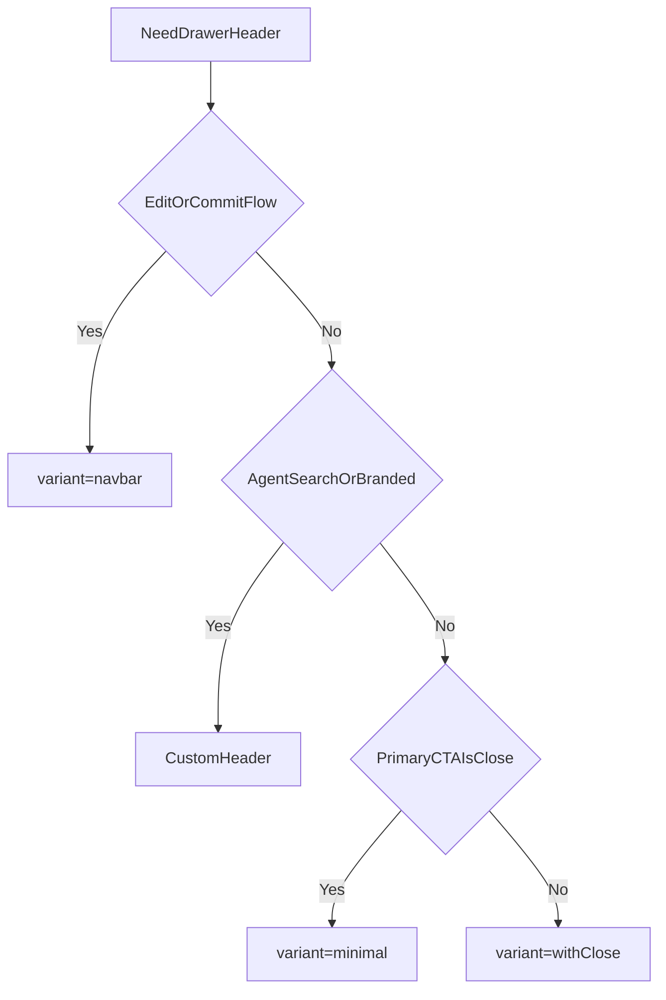

## Bottom drawer headers audit

This inventory captures the header patterns used inside bottom drawers/sheets.
It focuses on in-drawer header rows, not the drawer handle itself.

### Standard header variants (current)
All standard drawers should use `BottomDrawerHeader` from `src/ui/layout/BottomDrawerHeader.tsx`.

- `default`: custom left/right actions, no implicit close
- `withClose`: title + X close (auto-injected when `onClose` provided)
- `navbar`: centered title with explicit left/right actions (Cancel/Done pattern)
- `minimal`: title-only for inline micro-sheets or CTA-driven dismissal

Decision tree (defaulting to the most consistent patterns):

### Inventory by pattern (current usage)

#### Minimal title (inline drawers)
Use `BottomDrawerHeader` with `variant="minimal"`.
- `src/features/activities/ActivitiesScreen.tsx` (Quick Add: Reminder/Due/Repeat/Estimate)
- `src/features/activities/ActivityDetailScreen.tsx` (Remind me/Due/Repeat/Location, Duration, Record audio, Send to)
- `src/features/arcs/GoalDetailScreen.tsx` (Quick add: Target date/Status/Reminder/Due/Repeat/Duration)

#### Title + close icon (X)
Use `BottomDrawerHeader` with `variant="withClose"` and `onClose`.
- `src/ui/FilterDrawer.tsx`
- `src/ui/SortDrawer.tsx`
- `src/features/goals/ShareGoalDrawer.tsx`
- `src/features/goals/JoinSharedGoalDrawerHost.tsx`
- `src/features/onboarding/CreditsInterstitialDrawer.tsx`
- `src/features/plan/ActivityEventPeek.tsx`
- `src/features/plan/PlanEventPeekDrawerHost.tsx`
- `src/features/plan/PlanRecommendationsSheet.tsx`
- `src/features/activities/ActivityDetailScreen.tsx` (Schedule activity)

#### Nav-bar row (Cancel / Title / Done)
Centered title with left/right text actions.
- `src/features/arcs/ArcDetailScreen.tsx` (`ArcNarrativeEditorSheet`)

#### Tabbed header (SegmentedControl as header)
Header is a tab switcher.
- `src/features/arcs/GoalDetailScreen.tsx` (members/activity sheet)

#### Branded header
Brand lockup + Pro + close button.
- `src/features/paywall/PaywallDrawer.tsx`

#### Agent header
Custom `AgentModeHeader` toggling AI/Manual.
- `src/features/activities/ActivityCoachDrawer.tsx`
- `src/features/arcs/ArcsScreen.tsx` (NewArcModal)
- `src/features/goals/GoalsScreen.tsx` (Goal creation in drawer)

#### Search header
Title + subtitle + search input in header area.
- `src/features/account/ExecutionTargetsSettingsScreen.tsx` (destination library)
- `src/features/activities/ActivitySearchDrawer.tsx` (activity search)

#### Other custom headers
Special layouts that don't fit the standard title row.
- `src/features/arcs/ArcBannerSheet.tsx` (form sheet with tabs + footer CTA)
- `src/features/goals/SharedGoalActivityDrawer.tsx` (title + subtitle, no close)
- `src/features/activities/QuickAddDock.tsx` (`UnderKeyboardDrawer` dock-style surface)

### Usage guidelines
- Prefer `variant="withClose"` for modal drawers unless a primary CTA is the clear dismissal.
- Use `variant="minimal"` only when a footer CTA is the primary exit.
- Avoid text "Close" buttons; use the close icon for consistency.
- Keep long descriptions outside the header to avoid subtitle truncation.

### Migration guide (future drawers)
1. Start with `BottomDrawerHeader`.
2. Choose a variant using the decision tree above.
3. Only use custom headers for agent mode, search, or branded paywall contexts.

### Notes
- `KwiltBottomSheet` is deprecated and currently appears unused outside `src/ui/BottomSheet.tsx`.

