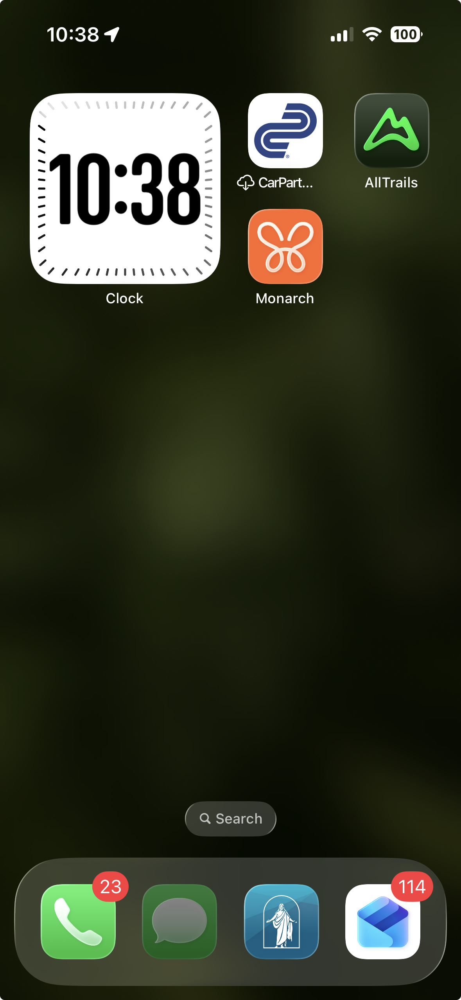

# iOS Clock Widget Reference

This reference captures the playful home-screen clock widget pattern: a large central value, a small identity label, and border ticks that make progress visible without adding explanatory UI.

## What Kwilt Money Should Borrow

- One dominant value in the center.
- A small identity cue below or above the value.
- A border made of ticks that can encode progress.
- A square rounded-corner shape that feels at home on iOS.
- Personality without adding more words.

## Budget Translation

For a budget lane widget:

- Center value: current percent consumed, for example `34%`.
- Identity: budget icon and lane name, for example `Shopping`.
- Tick border: active ticks represent percent consumed.
- Tick color: calm state color, such as pine for under pace, turmeric for watch, madder for running hot, red for maxed.
- Secondary information, if present: remaining amount or freshness outside the central value.

## Guardrails

- Do not put transaction details in the widget.
- Do not turn the tile into a dashboard.
- Do not use a color treatment that makes normal spending feel alarming.
- Do not hide stale data; freshness still matters somewhere in the widget or its detail surface.
