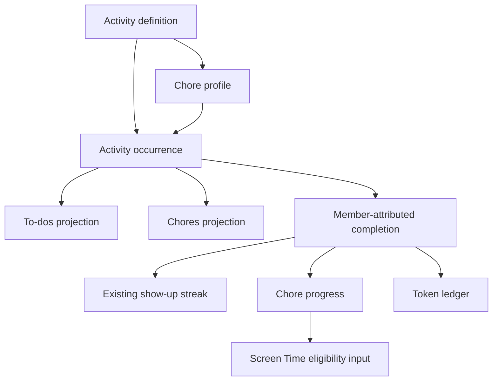

# Activity-backed Chores system design

## Status

Working system direction accepted during the Chores exploration on August 17, 2026. This document locks the decisions made so far and names the remaining design questions. Shared-iPad identity follows the accepted [Caregiver-anchored Household Mode](../shared-household-device-profiles/03-converge.md). This document does not authorize implementation.

## Core decision

Kwilt does not expose a generic **Activities** product surface. `Activity` is the existing underlying doing object; **To-dos** is its current capability-owned representation.

Chores will use the same foundation:

> **To-dos and Chores are separate user-facing capabilities over one canonical Activity and occurrence truth.**

A chore is an Activity with a household-aware Chore profile. The profile adds participation, availability, review, chore credit, tokens, and benefit-link behavior. It does not create a second task or completion store.

The diagram shows projections, not copies. Completing the occurrence from To-dos or Chores operates on the same identity and produces the same completion fact.

## Why this is the smallest coherent foundation

- To-dos are already Activities under the hood; introducing another foundational doing object would duplicate title, instructions, recurrence, occurrence, assignment, completion, offline, and sync behavior.
- Chores need a distinct household experience and additional lifecycle policy, but those differences can attach to an Activity rather than replace it.
- A child should not need to understand the word Activity or move between duplicate lists.
- A parent can later assign an ordinary Activity to a child without falsely making every assigned responsibility a chore.
- Improvements to recurrence, household assignment, and member-attributed completion can serve both To-dos and Chores.

## Canonical concepts

### Activity definition

The stable description of something that can be done: title, instructions or steps, media, tags, estimated effort, location, and recurrence/availability intent.

An Activity may remain personal or participate in an authorized Household relationship. Household participation does not expose the creator's surrounding private Activities, Goal, or Arc.

### Activity occurrence

One concrete opportunity to perform an Activity. Occurrences, not definitions, are started, claimed, submitted, approved, completed, skipped, expired, or corrected.

The current recurrence model already creates distinct dated Activity occurrences. Chores requires that foundation to expand beyond one serialized open copy so it can also represent:

- one shared occurrence per local day;
- one occurrence available until completed during a week;
- a bounded number of valid completions during a week;
- completion-relative cooldowns; and
- manually reopened as-needed work.

Completing one occurrence never retires its reusable Activity definition or completes future occurrences.

### Chore profile

Capability-owned behavior attached to an Activity or recurring series:

- household identity and authority boundary;
- participation policy;
- obligation: required, elective, or bonus;
- availability and repeatability policy;
- trusted completion or caregiver-review policy;
- chore-count credit;
- token value;
- qualifying scope for household agreements; and
- current expectation/version participation, with an optional effective period.

The profile determines Chore behavior without adding Chore fields to ordinary personal To-do editing.

### Participation

Household scope and responsibility are different facts.

- **Assigned:** one named member is responsible for the occurrence.
- **Open:** eligible household members may choose it from the shared Chores pool.
- **Claimed:** an eligible member has taken temporary responsibility for an open occurrence.
- **Everyone:** each eligible member receives an independently completable occurrence. Deferred beyond the first learning slice.
- **Together:** the household completes one shared outcome. Deferred beyond the first learning slice.

The household is the authority and visibility scope; a person or team performs an occurrence.

## Projection rules

### Chores

Chores owns the household agreement experience:

- a quiet **Chores** inventory with the active-member identity control in the header;
- compact expectation progress rather than a dashboard;
- **For [member]** for required, assigned, and already-claimed occurrences;
- **Household** for currently available open work with a direct **Take** action;
- choosing, claiming, releasing, completing, and asking for help;
- review state;
- personal chore progress and token balance;
- caregiver catalog, policy, correction, and redemption controls; and
- a factual Screen Time eligibility explanation.

### To-dos

To-dos remains the personal responsibility surface. A chore occurrence appears in a child's To-dos when:

1. it is explicitly assigned to that child; or
2. the child claims it from the shared pool.

Mere eligibility does not place every available household chore in To-dos. Unclaimed shared-pool work remains in Chores, preventing the personal list from becoming the household catalog.

An assigned or claimed chore row may identify itself tersely as a Chore and show useful value or state, such as `2 tokens` or `Waiting for approval`. It uses the canonical occurrence completion action, not a mirrored checkbox.

### Cross-surface invariant

- One occurrence ID exists across both projections.
- Starting, releasing, submitting, approving, rejecting, correcting, or completing from any authorized surface updates that occurrence.
- A chore cannot be completed once in To-dos and again in Chores.
- A caregiver view observes the child's occurrence; it does not copy it into the caregiver's personal To-dos.

### Household Mode identity and attribution

On a designated shared iPad, one assigned caregiver account remains authenticated beneath a restricted Household Mode. The capability-menu avatar and the Chores-header member chip show the same active child and open the same household member switcher.

- The switcher lists eligible dependent children and the assigned caregiver only.
- Selecting a child establishes that member as the actor and requests the child's household member code when configured.
- Selecting the caregiver requires fresh Face ID, Touch ID, or device-passcode authentication and exits to the caregiver's full ordinary Kwilt.
- Device authentication does not identify a child and does not prove which enrolled adult supplied the biometric or passcode.
- A caregiver viewing a child's chores on a personal device remains the recorder/manager, not the child actor.
- The canonical completion preserves performer, recorder, approver, and authorizer as separate facts when they differ.

Chores must never infer the performer from the underlying authenticated caregiver session while a child actor context is active.

## Completion, approval, and credit

The performing member, not the creator, assignee history, surface, or device, receives completion attribution.

### Trusted completion

For a chore without review, the authorized member's completion immediately becomes qualifying truth.

### Caregiver review

For a chore requiring review:

1. the child submits the occurrence;
2. the occurrence becomes **Waiting for approval** and is no longer available for another child to claim;
3. an authorized caregiver approves, rejects for rework, or corrects it;
4. approval makes the original performance qualifying;
5. rejection reopens the same occurrence for the responsible child without awarding credit; and
6. correction appends history rather than silently rewriting the actor or outcome.

Approval is a policy on the Chore profile or occurrence, not a universal Activity lifecycle stage.

### Derived outcomes

One qualifying completion can produce several distinct projections:

- **Show-up:** advances the performing child's existing Kwilt show-up streak once for the local performance day. It does not create a separate Chore streak or multiply streak credit by token value.
- **Chore progress:** normally contributes one qualifying occurrence to the person's active count/window.
- **Tokens:** appends the configured one-, two-, or three-token earning entry.
- **Screen Time:** becomes an input fact to the active Screen Time criterion; it does not itself prove device enforcement.

If review occurs later, approval qualifies the original member-attributed performance. The system should preserve the performance timestamp and deterministically reconcile derived streak and agreement state rather than crediting the caregiver's approval day.

## Ownership and authority

### Activity foundation owns

- stable definition and series identity;
- occurrence identity;
- shared safe content projection;
- scheduling/availability primitives that are genuinely common;
- responsibility or eligible-member references;
- performer-attributed execution facts; and
- idempotent offline mutation/reconciliation.

### Household and Household Mode own

- eligible child membership and capability activation;
- the shared-device designation and assigned caregiver;
- household member code management and reset;
- bounded active-child actor sessions;
- caregiver re-entry and safe relock policy; and
- the distinction between a Household Mode actor switch and a caregiver view scope.

### Chores owns

- whether an Activity participates in Chores;
- household chore catalog organization;
- open-pool and claim behavior;
- chore-specific availability limits;
- review policy and decisions;
- chore qualification and count progress;
- token ledger and manual cash redemption; and
- the current household expectation, version history, and optional effective periods.

### To-dos owns

- the child's personal responsibility projection;
- ordinary personal filters, ordering, and detail presentation; and
- the compact rendering of assigned or claimed chore occurrences.

### Screen Time owns

- access criteria referencing qualifying Chore facts;
- eligibility evaluation, exceptions, and overrides;
- device-delivery state and receipts; and
- the distinction between agreement satisfied and restriction actually changed.

### Existing show-up streak owns

- daily deduplication;
- streak continuity, grace, repair, and celebration policy; and
- the child's current show-up summary.

Chores emits or synchronizes one qualifying Activity-completion fact; it does not maintain another streak counter.

## Current-system changes implied

This direction extends rather than merely reskins the current Activity implementation:

- `kwilt_activities` is currently user-owned and owner-only; household-safe Activity projections require household-member authority without exposing unrelated personal data.
- current recurrence produces one next copy when the open occurrence is completed or skipped and intentionally avoids accumulating missed copies; chore availability requires bounded parallel/capacity semantics.
- current Activity status is a single personal lifecycle; review and claim need occurrence-scoped Chore policy and events without forcing those states into every To-do.
- current show-up state is user-local/user-owned; a dependent child's approved completion needs person/member attribution and deterministic synchronization to that child's streak identity.

These are deliberate foundation extensions. They should not surface as new fields or controls for solo To-do users.

## Locked decisions

1. Activity remains the canonical doing object; there is no second Chore task store.
2. There is no new generic Activities product surface.
3. To-dos and Chores are separate capability-owned projections.
4. A Chore profile adds household participation, availability, review, credit, tokens, and agreement behavior.
5. Assigned chore occurrences appear in the child's To-dos.
6. Claimed shared-pool occurrences appear in the claimant's To-dos.
7. Merely available pooled chores remain in Chores and do not flood To-dos.
8. Both surfaces mutate one canonical occurrence and completion history.
9. Completion attribution belongs to the member who performed the chore.
10. A qualifying chore completion contributes to that child's existing show-up streak regardless of assignment or pool origin.
11. One occurrence contributes at most one completion/streak fact; token value remains a separate unit.
12. Chores supplies qualifying facts to Screen Time but does not own device enforcement.
13. **Season is not a required domain object.** Chore availability, household expectations, and benefit links may each have an optional effective start/end when their behavior genuinely changes over time.
14. Chores is a direct capability with a Groceries-like inventory: quiet header, compact progress, **For [member]**, and **Household** sections.
15. One mode-aware identity control appears in both the capability-menu avatar and Chores header and opens the same member switcher.
16. A designated shared iPad remains anchored to one assigned caregiver account beneath Household Mode.
17. Child member codes select and attribute the acting child; they are not account passwords or caregiver credentials.
18. Returning to the assigned caregiver requires fresh Face ID, Touch ID, or device-passcode authentication and restores the caregiver's full account.
19. Caregiver view scope and child actor identity remain separate; performer, recorder, approver, and authorizer are never silently collapsed.

## Next system questions

These remain to be clarified before the learning-release brief is build-ready:

1. **Series versus occurrence assignment:** when a caregiver assigns today's recurring chore, does the choice apply only today or to this and future occurrences, and how is that asked without recurrence-editor language?
2. **Claim lease:** when should an abandoned shared-pool claim expire automatically, and when should the child release it explicitly?
3. **Review queue:** where should caregiver review live so it is visible without turning the caregiver's To-dos into an approval inbox?
4. **Caregiver-recorded completion:** when may a caregiver record work on behalf of a dependent profile, and how does the UI make performer and recorder explicit?
5. **Occurrence capacity:** should `three times per week` create three visible slots, or one available card with `3 left` that emits distinct occurrences as each completion begins?
6. **Correction effects:** what child-facing explanation is required when a caregiver reverses a completion that had already affected tokens, a streak, or Screen Time?
