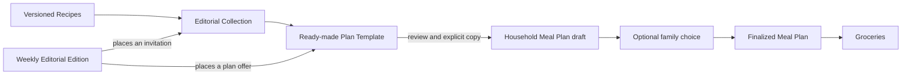

# Converge: Typed Editorial Collections, Plans, And Editions

## Decision

Build a capability-owned editorial graph with four contracts:

1. `EditorialCollection` — a Recipes-owned editorial destination.
2. `MealPlanTemplate` — a Meal-Planning-owned prepared proposal.
3. `MealEditorialEdition` — a deterministic composition of inventory
   placements for a time window.
4. `MealPlan` — the existing household-owned draft/finalized record created by
   explicit adoption, never the template itself.

## Ownership

| Contract | Owner | Owns | Must not own |
| --- | --- | --- | --- |
| `EditorialCollection` | Recipes | authored narrative, sections, recipe references, imagery, attribution | household plan state or grocery claims |
| `MealPlanTemplate` | Meal Planning | suggested horizon, ordered meal references, serving assumptions, basket logic, editorial rationale | a person's dates, family responses, or finalization |
| `MealEditorialEdition` | Meals discovery presentation | slots, schedule, fallback, availability, placement cap | recipe truth, plan mutation, personalized taste conclusions |
| `MealPlan` | Meal Planning | household candidates, invitations, responses, servings, optional placement, finalization | live dependency on an editorial template |

## Minimum data shape

### EditorialCollection

- immutable `id`, stable `slug`, and integer `version`;
- title, deck, hero media, attribution, and editorial owner;
- theme tags such as cuisine, season, cost posture, cooking effort, and occasion;
- one primary job intent such as achievable discovery, escaping the rotation,
  cuisine exploration, budget planning, effort reduction, stock use, or
  technique learning;
- ordered sections with a title, short note, and `CollectionMealEntry` records;
- each entry contains a versioned Recipe reference, an editorial discovery role
  (`familiar_anchor | adjacent_discovery | stretch`), `whyTry`, `whyDoable`, and
  optional first-time equipment, ingredient, or technique context;
- zero or more related `MealPlanTemplate` ids;
- `draft | published | retired` lifecycle and publish timestamps;
- locale and availability constraints.

### MealPlanTemplate

- immutable `id`, stable `slug`, and integer `version`;
- source Collection id/version and editorial owner;
- suggested horizon: meal count, next shop, date-range shape, or open;
- ordered `MealPlanTemplateSlot` records containing a default versioned Recipe
  reference, reviewed alternatives, an editorial plan role, and an optional
  ingredient, prep, or leftover relationship to another slot;
- default serving assumption and optional sequence/leftover notes;
- basket rationale: shared ingredients, package reuse, or preparation bridge;
- a structured promise with `editorial` or `price_evidenced` basis;
- explicit pantry, retailer, geography, serving, and freshness assumptions when
  the promise includes a numeric cost;
- `draft | validated | published | retired` lifecycle.

### MealEditorialEdition

- edition id, locale, `startsAt`, and `endsAt`;
- at most two editorial placements in the long Meals browse;
- a placement slot, destination kind/id/version, card treatment, and CTA intent;
- deterministic eligibility and fallback; no per-launch randomness;
- suppression rules, including removal of the generic planning offer when an
  active plan already makes it redundant.

## Collection-page grammar

Every Collection uses the same small grammar:

1. hero image, title, and one editorial premise;
2. two to four authored sections;
3. meal cards that communicate why the food is worth trying and why this Recipe
   is achievable;
4. an optional temporary choose-some mode with a persistent selection tray and
   `Review selected meals` action;
5. an optional ready-made-plan module;
6. one closing path appropriate to the current state: keep browsing, review the
   selected meals, or review the complete plan.

This is not a general block editor. The fixed grammar preserves quality and
keeps pages from becoming marketing microsites.

## Adoption contract

`Review this plan` opens a proposal that can change servings, remove or swap
meals, and optionally assign days. Nothing durable changes yet.

`Choose meals` is a separate path. It holds a reversible Collection selection
while the user browses and opens individual Recipes. `Review selected meals`
then presents the same servings, constraint, and active-draft conflict review
used by a complete template. The selection itself is presentation state, not a
new durable capability record.

On explicit adoption:

1. Resolve every template reference to a valid published Recipe version.
2. Copy immutable Recipe snapshots and the template provenance into a new or
   selected household draft.
3. Record the template id/version only as origin metadata; end the live link.
4. Use an idempotency key so a repeated tap cannot duplicate the plan.
5. If a draft already exists, offer `Choose meals to add` or `Start the next
   plan`; never silently merge or replace.
6. Keep the result in `draft` state. The organizer may ask the family and must
   explicitly finalize it.
7. Allow Groceries to compile only from the finalized household version.

## Rotation contract

- Rotate at a calendar boundary and keep the edition stable for the household.
- Prefer one food/cuisine/season story and one practical plan story.
- Prefer different primary job intents, not merely different visual themes.
- Place the first invitation after two or three shelves and the second only in
  a sufficiently long browse after five or six shelves.
- Do not notify users that an edition changed.
- Keep retired destinations readable when reached from old provenance, while
  removing them from new editions.
- Count an impression only when the card becomes meaningfully visible.

## Editorial and claim gates

Publication fails when:

- a recipe or media reference is missing, retired, or lacks usable rights;
- a plan contains duplicate meals or violates its declared meal-count horizon;
- the grocery compiler cannot preserve ingredient provenance;
- a cuisine-led Collection lacks reviewed sourcing and attribution;
- a strongly recommended Recipe lacks accurate media, reviewed makeability
  facts, and at least `cooked-once` evidence for the learning release;
- a numeric price claim lacks store/geography, serving count, pantry
  assumptions, quote time, and fee treatment;
- accessibility labels, fallback artwork, or destination routes are missing.

`Budget-minded`, `uses inexpensive staples`, and `shares ingredients` may be
editorial claims with documented reasoning. `Five dinners for $50` is a price
claim and requires fresh external evidence.

## Authoring and delivery

Start with typed, repository-owned records and validators so content quality,
references, and claims are reviewable in Git. Keep loading behind a repository
interface so published records can later come from signed hosted manifests or a
CMS without changing the app-facing contracts. Do not build remote targeting or
a general CMS for the learning release.

## Learning contract

Track the smallest non-invasive funnel:

- placement meaningfully viewed;
- Collection opened;
- meal opened or favorited;
- meal selected, removed before review, or swapped from a template slot;
- plan review started;
- template adopted;
- number of swaps/removals, without logging private meal text;
- family choice started;
- plan finalized;
- grocery list successfully derived;
- completed cooking outcome explicitly marked `make again`, `not for us`, or
  corrected with a short private note.

Do not build a household taste profile from passive dwell time. Later
personalization may use explicit favorites, dietary settings, previous repeats,
and availability, with the reason visible to the user.

## Reductive decisions

- No user-facing “template library.” Ready-made plans live in relevant
  Collections and rotating offers.
- No saved-Collection state in the first release; favorite meals and copied
  household plans already preserve the useful outcomes.
- No generic campaign object, notification program, or infinite promotional
  feed.
- No live link between editorial content and household state.
- No AI-authored cultural framing or silent substitution.
- No assumption that every Collection or plan spans seven days.

## Capability delta

Today Maya can browse meals and build a plan one candidate at a time. After this
system, she can enter an authored point of view, understand why unfamiliar food
is appealing and achievable, choose only the meals she wants or review a
coherent prepared plan, and explicitly create a household-owned draft with its
reasoning and provenance intact.

Still intentionally unsupported: automatic finalization, automatic checkout,
public user collections, opaque taste ranking, and unqualified dollar promises.

## Bet

We're betting that trusted narrowing, appetite, believable execution, and a
short path into Meal Planning will move more households into a finalized plan
than either a large undifferentiated inventory or a blank planner. If people
admire Collections but rarely select meals, improve the makeability evidence
and choose-some flow before adding promotion frequency or personalization. If
people select individual meals but rarely adopt complete plans, keep the
editorial discovery layer and remove plan-template complexity.

## Success signal

Across several natural planning cycles, households both choose subsets from
Collections and adopt complete templates, materially edit at least some drafts,
finalize without plan-authority confusion, and successfully derive Groceries.
Qualitative dogfood should describe the experience as “a useful starting
point,” not as Kwilt choosing dinner for the household.
