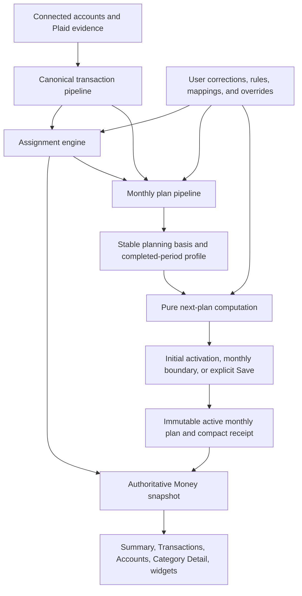

# Iteration 3: Converged Governed Household Money Plan

## Decision

Build the **Governed Adaptive Plan** as the complete Money planning system.

Kwilt automatically turns connected-account evidence into current transaction truth inside a stable broad category model and a target-backed monthly plan. The system acts only where the user has not already governed the result. Current transactions update continuously; automatic monthly limits update at the next period boundary; explicit user saves apply immediately with their whole-plan consequence visible. Every structural or amount mutation uses one consequence engine and one authoritative plan version.

The existing Transparent Versioned Shadow Planner remains the active-plan mechanism. This revision completes the system around it.

The accepted reductions from the subsequent audit are recorded in [`05-simplification-audit.md`](./05-simplification-audit.md) and incorporated below.

## Capability delta

### Today

- A new user can connect an account yet see no credible category reality.
- Plaid category evidence is stored but does not produce effective Kwilt assignments.
- A first category set and its limits are not generated end to end in the unified runtime.
- Variable-income evidence can be classified, but the user-facing distinction between observed income and the stable planning basis is incomplete.
- Flexible capacity can be consumed in category-id order rather than distributed coherently.
- Category create, merge, split, archive, account change, and amount change do not yet share one complete consequence policy.

### After this revision

- A first account sync populates the stable starter categories and current meters automatically when evidence supports assignment.
- A target-backed plan activates automatically when a trustworthy planning-income basis exists.
- A user without a supported basis still receives useful transaction truth and one focused next step.
- Current-month income volatility never reflows monthly limits in real time.
- The user can lump, split, rename, create, merge, and correct categories; those decisions permanently outrank inference.
- Every category amount fits, rebalances, or becomes over target through deterministic whole-plan math shown before a user-requested change is applied.
- Adding another account updates current truth immediately and automatic monthly limits at the next period boundary.
- Summary, category detail, transactions, accounts, settings, widgets, and Chat read the same authoritative snapshot and active plan.

## System overview

There is one live-money pipeline and one monthly-plan pipeline. Evidence evaluation, candidate computation, and promotion are stages inside the monthly pipeline, not separate product clocks. Onboarding and UI surfaces consume this system; none owns a separate first-use version.

## Product objects

### Evidence scope

`EvidenceScope` records:

- included account ids and connection ids
- account types and inclusion status
- covered transaction date range
- last successful sync per connection
- canonicalization status
- known excluded accounts
- evidence hash and policy version

It does not claim that the connected accounts are the user's complete household. User-facing receipts say `Based on 2 connected accounts` rather than `Your complete household plan`.

### Canonical transaction

`CanonicalTransaction` represents one economic event after:

- pending-to-settled reconciliation
- removed-transaction handling
- provider duplicate resolution
- included-account transfer pairing
- sign and currency normalization
- money-meaning classification

Only canonical events feed assignment totals, spending profiles, income receipts, and plan evidence.

### Provider classification

Plaid primary, detailed, confidence, taxonomy version, merchant, and description fields remain immutable provider evidence. They never become user-governed category identity directly.

### Provider-to-category mapping policy

A versioned internal mapping translates provider evidence into broad category tags such as:

- housing
- utilities
- connectivity
- food at home
- food away
- transportation
- health
- childcare
- shopping
- subscriptions
- other spending

It supports inference and explanation. It is policy/configuration, not a separately persisted household taxonomy, visible hierarchy, or user object.

### Spend category

`SpendCategory` is the visible household container. It has:

- immutable category id
- current name, icon, color, and status
- optional presentation group
- category lineage for split, merge, and archive
- creation provenance: system starter, user-created, split, merge, or migration
- current mapping constraints

Renaming never changes identity. Merge and split create lineage so historical plans, receipts, rules, and assignments remain interpretable.

### Assignment decision

`AssignmentDecision` records:

- canonical transaction id
- effective spend category id or exclusion
- source and source reference
- confidence
- reason code
- policy version
- governed/reviewed timestamp
- predecessor decision when revised

Valid sources include:

- split allocation
- user correction
- user exclusion
- money-meaning decision
- merchant/source rule
- household mapping
- provider inference
- system fallback

### Planning-income basis

`PlanningIncomeBasis` is the stable monthly amount to which the living percentage applies. It contains:

- mode: `system_stable`, `system_variable`, or `user_set`
- monthly basis amount
- supporting source receipts
- evidence periods
- confidence
- policy version
- activation date
- last evaluated date
- predecessor basis

Observed income this month is never the active planning basis by itself.

### Computed category spending profile

The planner computes a category spending profile from completed-period evidence for one visible category:

- supported fixed component
- observed flexible share
- starter-template share
- blended flexible allocation weight
- current exposure
- completed-period samples
- confidence and freshness
- evidence hash

Actual current-month spending can update exposure and forecast, but cannot directly increase the active limit.

### Living target intent

`LivingTargetIntent` contains the chosen percentage, provenance, and update time. It never assigns a purpose to the remainder of income.

### User constraints

- `UserAmountOverride`: explicit total category amount.
- `PlanningBasisOverride`: explicit monthly planning-income basis.
- `CategoryMappingConstraint`: provider, merchant, source, or semantic-family mapping chosen by the user.
- `AccountInclusionConstraint`: whether a connected account contributes to Money truth and plan evidence.
- `CategoryFundingConstraint`: the user-governed `monthly` or `reserve` rhythm, stable monthly contribution, optional expected need, and any explicit opening reserve correction.

User constraints have durable precedence until the user removes them.

### Funding rhythm and lumpy needs

`monthly` and `reserve` are the only funding rhythms in this revision. Monthly categories receive a monthly amount and ordinarily reset; the existing rollover toggle remains a distinct optional policy for a monthly category. Reserve categories receive a stable monthly contribution and carry availability across periods:

`available = prior reserve + current contribution - counted spend`

Only the current contribution participates in the monthly living-target allocation. Accumulated reserve availability is balance-sheet context for the category and must never be added to `plannedCents`, treated as new income, or redistributed to make the current plan fit.

A reserve category may contain an expected-need amount and due month. The deterministic forecast projects real accumulated availability through the due month and reports covered, shortfall, or past-due truth. When a new need is too near, the consequence engine may propose a catch-up contribution equal to the remaining shortfall divided across the real contribution opportunities before the due month. That proposal uses the same protected-first whole-plan consequence engine; it never invents an opening balance, jumps the stable contribution to the peak month, or compresses protected categories silently.

The starter policy may mark obvious categories such as Gifts and occasions as reserve using a versioned default. Historical inference requires at least 12 completed periods plus repeated same-month-of-year or bounded-season concentration. One event is never recurrence. Low-confidence lumpy evidence remains exposure-only or a contextual suggestion, and all defaults and inferences remain user-governable.

### Plan objects

- `AllocationCandidate`: computed projection from evidence scope, basis, target, categories, profiles, constraints, and allocator policy. Persist only when a held next-month result must survive across sessions.
- `MonthlyLivingPlan`: immutable promoted candidate used by all product surfaces.
- `PlanConsequencePreview`: computed hypothetical before/after plan shown inline before Save.
- `PlanChangeReceipt`: compact committed trigger, affected categories, plan facts, evidence facts, and reversal lineage.

## State composition

The product exposes two health concepts. More detailed engine states remain internal.

### Current truth state

- `syncing`
- `ready`
- `stale`
- `error_with_last_truth`
- `no_accounts`

### Plan health

- `basis_needed`
- `ready`
- `over_target`
- `no_plan`

`Needs review` is a transaction count and filter, not another global product mode. A new credit-card-only user can therefore have current money ready and plan basis needed; a provider outage can show stale current money while retaining the active plan; protected commitments above target show plan over target.

## Exact precedence contracts

### Canonicalization and money meaning

1. explicit split/meaning correction
2. user-governed source rule
3. confirmed paired transfer/refund relationship
4. deterministic provider/account/counterparty evidence
5. unknown; do not infer plan eligibility

### Transaction assignment

1. explicit split allocation
2. explicit correction or exclusion
3. explicit money-meaning decision when it determines category behavior
4. user-governed merchant/source rule
5. household category mapping constraint
6. high-confidence provider plus merchant inference
7. conservative fallback or Needs review

Automation may modify only levels 6 and 7. It may never overwrite levels 1-5.

### Category identity

1. current user-governed visible category and lineage
2. existing compatible category mapping
3. compact starter-category mapping
4. Other spending or Needs review

After the initial category model is active, the system does not silently split, merge, rename, or create visible categories. New evidence maps into existing categories, Other spending, or Needs review. Contextual category-structure suggestions require an explicit user action.

### Category amount

1. explicit user amount override, subject to supported fixed floor
2. supported fixed component
3. system-managed flexible allocation
4. exposure-only amount or zero

### Planning-income basis

1. explicit user-set planning basis
2. supported stable recurring basis
3. supported conservative variable basis
4. prior trustworthy basis through temporary uncertainty
5. basis needed; never zero by default

## Stable starter category template

### Inputs

- canonical posted outflows
- provider primary/detailed/confidence and taxonomy version
- merchant identity and recurrence
- completed-period totals
- existing categories, aliases, mappings, and rules
- current EvidenceScope
- versioned broad starter template and default allocation weights

### Policy

1. Give every zero-category household the same compact, versioned broad starter template rather than deriving its visible inventory from an incomplete first account.
2. The template covers stable household jobs such as Housing, Food, Transportation, Utilities, Health, Family, Personal, Fun, Debt and fees, and Other. Exact vocabulary remains a replay/dogfood calibration item.
3. Use `HIGH` and `VERY_HIGH` provider evidence to assign activity into that template, not to create its shape.
4. Default ambiguous lower-level services such as Phone and Internet into Utilities; let the household split them later.
5. Fold weak or sparse evidence into Other only when confidence supports spending treatment; leave conflicts in Needs review.
6. Persist category provenance and the provider-mapping policy version.
7. Never expose raw provider labels as final category names merely because they exist.
8. After creation, user rename, split, merge, archive, and create decisions permanently govern the household set. Automation never silently changes its visible structure.

This makes category completeness independent of account completeness. Thresholds for inference and split proposals remain versioned calibration parameters.

## Automatic assignment algorithm

For each canonical transaction without a governed effective assignment:

1. Resolve matching user rules and household mappings.
2. Map provider and merchant evidence through the versioned category mapping policy.
3. Resolve the mapped tag into the current user-governed visible category model.
4. Require sufficient confidence for automatic persistence.
5. Persist the AssignmentDecision and its reason.
6. Rebuild and publish the complete Money snapshot atomically after the assignment batch.
7. Leave weak or conflicting evidence in Needs review without blocking unrelated transactions.

Initial sync may backfill every eligible ungoverned historical transaction. Later syncs classify only new, modified, or previously ungoverned rows unless a user mapping change explicitly previews a historical backfill.

## Stable planning-income policy

### Stable recurring income

- Require supported recurrence across completed periods.
- Exclude off-pattern amounts according to a versioned inlier policy.
- Use a conservative central estimate.
- Do not change the basis after one late, missing, or unusually large deposit.
- Re-evaluate when cadence or amount changes persist across enough receipts to constitute a new pattern.

### Established variable income

- Require more completed-period evidence than stable payroll.
- Use a conservative calibrated range, not current-month income or the maximum month.
- Evaluate a new basis only at completed-period boundaries.
- Do not promote a new variable basis more frequently than the policy cadence unless the user changes account scope or planning basis explicitly.
- Require a sustained material change before automatic promotion.

### Sparse or ambiguous income

- Exclude transfers, refunds, asset proceeds, windfalls, loans, and unknown inflows from the automatic ordinary planning basis.
- Preserve a prior trustworthy basis during temporary uncertainty.
- For a new plan, ask one focused question for a monthly planning amount or offer to connect an income-bearing account.

### User-set basis

- Remains fixed until the user changes or removes it.
- Current deposits, account syncs, and model updates cannot overwrite it.
- The product may show a contextual evidence comparison without creating a recommendation inbox.

## Allocation algorithm

Let:

- `B` = active PlanningIncomeBasis amount
- `p` = LivingTargetIntent percentage
- `T = round(B * p)` = target capacity
- `F_i` = supported fixed floor for category `i`
- `U_i` = optional user total-amount override
- `P_i = max(F_i, U_i)` when an override exists, otherwise `F_i`
- `E_i` = completed-period household evidence share
- `S_i` = versioned starter-template share
- `Q` = confidence in household evidence given coverage and history
- `W_i = Q * E_i + (1 - Q) * S_i` = blended flexible weight

### Step 1: reserve protected amounts

`protectedTotal = sum(P_i)`

For reserve categories, `P_i`, the flexible allocation, or the user override represents the stable monthly contribution. Prior accumulated availability is excluded from this sum.

If `protectedTotal > T`:

- preserve every `P_i`
- allocate no unsupported flexible capacity
- mark `overTarget = protectedTotal - T`
- name protected contributors in the consequence result

### Step 2: calculate flexible capacity

`R = max(0, T - protectedTotal)`

Eligible system-managed flexible categories exclude fixed-only and user-overridden categories. Normalize their blended weights across the eligible set.

### Step 3: allocate without category-order bias

Distribute all remaining capacity `R` by normalized `W_i`. A household with strong, complete history therefore leans toward its observed proportions; a new or partial household leans toward the broad starter weights. Policy-versioned smoothing can bound extreme month-to-month movement, but category id or display order never determines priority.

Once a planning basis exists, the living target is fully allocated. History informs relative distribution; it is not a cap that leaves ordinary target capacity sitting in a planner-maintenance bucket.

### Step 4: compute plan facts

- planned total
- over-target amount
- fixed, override, flexible, evidence, and starter-weight components per category
- allocation source and evidence receipt
- candidate hash and policy version

The same normalized inputs must produce the same candidate. Unless protected amounts exceed the target, `sum(category limits) = T`.

## Consequence engine

Every hypothetical plan mutation calls one pure `PlanConsequenceEngine` before a user-requested apply or an automatic promotion.

### Supported mutations

- living target change
- planning basis change
- account include/exclude/add/remove
- category create/archive/merge/split
- category amount create/change/remove override
- category mapping/rule change with historical backfill
- fixed-component evidence change
- allocator policy version change

### Output

- before and after plan facts
- current actuals unchanged statement
- affected categories only, with before/after components
- capacity source: flexible redistribution or over target
- changed evidence scope or planning basis
- protected constraints
- materiality reasons
- reversibility and safe reversal boundary
- plain-language cause

### Raising a category amount

1. Reduce eligible system-managed flexible categories proportionally through the same normalized-weight policy.
2. Never reduce fixed floors or other user overrides.
3. Show any remaining over-target amount.

### Lowering a category amount

1. Release capacity.
2. Redistribute it proportionally across eligible system-managed flexible categories.
3. Never assign a moral purpose to money outside the living target.

### Category structural changes

Create, merge, split, and archive previews include assignment movement, mapping/rule lineage, affected profiles, plan redistribution, and historical receipt continuity. Rename-only changes do not invoke allocation unless identity mapping also changes.

## Two-rhythm execution model

### Live-money rhythm

Triggers:

- successful Plaid sync
- pending settlement or removal
- account-scope change
- user transaction correction
- rule or mapping change

Responsibilities:

- canonicalize current events
- classify money meaning
- apply governed assignment precedence
- persist eligible inferred assignments
- rebuild and publish the authoritative Money snapshot

It may change actuals and meters immediately. It does not change active monthly limits merely because spending changed.

### Monthly-plan rhythm

Triggers:

- initial canonical history ready
- completed-period close
- material historical correction
- account-scope change
- category mapping/structure change
- planning-basis or target change
- fixed-pattern threshold crossing
- allocator policy version change

Responsibilities:

- build EvidenceScope
- compute the stable planning basis and category profiles
- project and compare the next monthly plan
- preserve the current month's active limits during ordinary sync, income, spending, and account-scope changes

Activation rules:

- **Initial supported plan:** activate immediately; show `Your plan is ready`.
- **Explicit user edit:** show the whole-plan consequence inline and commit through one `Save`; add a second confirmation only for destructive structural changes or unsafe history loss.
- **Automatic maintenance:** compute during the month and activate at the next period boundary with one compact receipt when facts changed.
- **Blocked or ambiguous plan:** retain the active plan and ask one focused question only when the next plan cannot be coherent.

The user-visible answer to timing is: activity updates now; automatic limits update next month; changes you explicitly save apply now.

## Surface ownership

### Money Setup

- Capture living percentage.
- Connect at least one account or allow an explicit later path.
- Run canonicalization and starter category derivation after real sync.
- Activate category truth immediately when supported.
- Activate the first target-backed plan when a basis exists.
- If basis is missing, ask only for a monthly planning amount or income-bearing account.
- Never require category-by-category or plan review.

### Summary

- Own whole-plan truth: actual, planned, outside-plan, forecast, freshness, and confidence.
- Show plan notices and access to plan receipts.
- Keep evidence scope in receipt/detail rather than persistent warning chrome.
- Never imply that the non-living remainder has a purpose.

### Accounts

- Own connection, health, freshness, inclusion, and evidence-scope expansion.
- Show whether an account feeds current truth and plan evidence.
- Adding an account is not a separate planning flow; current truth updates now and the automatic plan incorporates it next month.

### Transactions

- Own current evidence inventory and Needs review.
- Show effective visible category, not raw provider taxonomy as the primary label.
- User corrections teach durable rules or mappings only through explicit choice.

### Transaction Detail

- Own category, split, exclusion, and money-meaning correction.
- Explain current rule or mapping truth.
- Preview historical backfill before a durable rule or category-structure change.

### Category Detail

- Own local actuals, planned amount, forecast, source, and activity.
- Explain the current limit's components and provenance on demand.
- Link to category settings and amount impact.
- For reserve categories, show contribution, accumulated availability, and expected-need coverage instead of monthly pacing language.

### Category Settings

- Own rename, presentation, archive/merge, mapping management, and amount adjustment entry.
- Start local actions; use the consequence engine for plan-affecting results.
- Own the `Monthly` / `Reserve` rhythm and optional expected need. Contribution changes use the ordinary consequence-aware Save; expected-need edits use the same governed mutation and receipt path without creating a planner destination.

### Money Settings

- Own living percentage and planning basis alongside the active evidence basis.
- Open compact plan history from the latest change or Settings.
- Do not add an automatic-promotion toggle or become a global spreadsheet planner; the monthly timing contract is the default behavior.

### Widgets and app controls

- Consume only the authoritative snapshot and active plan.
- Never calculate an independent category or limit truth.

### System automation / Chat

- Read and explain authoritative Money truth and receipts.
- Stage or navigate to governed native corrections where confirmation is required.
- Never generate dollar amounts with an LLM or bypass assignment/plan precedence.
- Automatic system classification and allocation use the same domain contracts as user actions, not a parallel conversational mutation path.

## Experience sequences

### First supported plan

`living percentage -> connect account -> sync -> canonicalize -> create stable starter categories -> assign eligible history -> establish planning basis -> allocate -> atomically promote -> Summary`

Visible result: `Your plan is ready`, followed by immediately believable meters. Receipt detail names connected accounts, evidence periods, planning basis, and fixed/user-set protection.

### First plan without income basis

`living percentage -> connect spending account -> sync -> categories and assignments ready -> Summary current truth -> focused basis question`

The app is useful before the planning basis is resolved. It never fills limits from arbitrary historical spend and calls them target-backed.

### Later account addition

`Accounts -> Plaid sync -> canonicalize/dedupe/transfers -> assign new evidence -> current truth updates -> compute next plan -> activate at next monthly boundary -> compact receipt if facts changed`

### Ambiguous Phone structure

Initial default: Phone is in Utilities. From the transaction or Utilities category, the user may create Phone, preview moved history and limit effects, and apply one durable mapping and plan version.

### Category amount change

`Category Settings -> Adjust amount -> enter amount -> inline affected categories and target facts -> Save -> compact receipt -> updated category`

## Failure and refusal states

- No accounts: explain the value of connection; no fake data.
- Account sync pending: preserve prior truth; no premature plan.
- Stale evidence: show freshness, hold prior plan, block promotion.
- Missing basis: ask one monthly planning-basis question; never use zero.
- Ambiguous transfer/duplicate: hold affected evidence out without blocking unrelated truth.
- Weak assignment evidence: Needs review or Other spending according to policy.
- Atomic write failure: no partial active state and no success notice.
- Fixed/override over target: preserve protected amounts and show over-target truth.
- Unsafe reversal: explain why Undo is no longer available; never partially revert.

## Reductive decisions

Do not add:

- a global budget-builder destination
- category setup carousel
- taxonomy editor
- confidence-score dashboard
- generic recommendations inbox
- current-income budget reflow
- a normal unassigned-capacity bucket inside the living target
- per-transaction AI explanation badges
- approval queue for routine automatic work
- savings/giving/debt meaning for the remainder
- live LLM allocation

Enhance existing surfaces and remove any first-use state that duplicates the durable system.

## Persistence and migration boundary

Use additive migration and compatibility adapters.

### Extend existing records

- transaction effective assignment source, confidence, reason, policy version, and user-governance marker
- category provenance, provider-mapping tags, and lineage
- plan version EvidenceScope and policy metadata
- planning-income basis mode and predecessor
- plan-version allocation facts and blended weights

### Add focused records where necessary

- household category mapping constraints
- assignment-decision history only where existing correction/rule history cannot preserve user precedence
- category lineage edges for merge/split/archive
- normalized evidence-scope facts on committed plan versions

### Preserve

- current category ids, legacy ids, and routes
- user corrections, exclusions, splits, and merchant rules
- living-target intent and plan versions
- user overrides and receipts
- prior active plan through rollout and rollback

Do not destructively remap existing user-governed data. Backfill only ungoverned assignments, with dry-run counts and idempotent policy versioning.

Spending profiles, allocation candidates, and consequence previews are deterministic computations. Cache them only for performance, and persist a candidate only when a held next-month result must survive across sessions.

## Policy calibration still required

The system structure is closed. These numeric policies require replay calibration before production-default exposure:

- starter-template vocabulary and default weights
- provider confidence combination rules
- fixed-pattern detection thresholds
- evidence/default blending confidence and weight smoothing
- variable-income lookback and conservative estimator
- sustained planning-basis change threshold
- user-facing receipt-notice threshold
- Other spending versus Needs review boundary

Each parameter belongs to a versioned deterministic policy and fixture/replay suite, not UI copy or an LLM prompt.

## Acceptance evidence

### Pure-domain fixtures

- same normalized inputs produce the same candidate and hashes
- category order cannot change allocation
- flexible categories compress and restore proportionally by normalized blended weights
- every supported plan fully allocates the living target unless protected amounts exceed it
- fixed and user overrides survive every recomputation
- partial account scope is named and does not imply completeness
- current-month income changes do not alter active limits
- stable and variable income fixtures produce supported bases
- transfers, duplicates, refunds, assets, loans, and windfalls do not inflate income/spend
- user mappings and corrections always outrank provider inference
- merge/split lineage preserves rules, assignments, and receipt interpretation
- every supported mutation yields correct before/after consequences

### Historical replay

- zero-category users receive the stable compact set regardless of partial account scope
- automatic assignments materially reduce uncategorized outflows without increasing wrong governed assignments
- first limits fully reconcile to the target and outperform independent current amounts
- adding a second account does not double count transfers, create category churn, or rewrite current-month limits
- variable-income plans remain stable through ordinary month-to-month volatility
- category structure stabilizes as user governance accumulates

### Authenticated runtime

- initial sync -> categories -> assignments -> plan -> terminate/relaunch -> exact database and UI reconciliation
- missing-basis path remains useful and asks one focused question
- add account -> current truth -> held next plan -> monthly-boundary receipt -> relaunch
- Phone in Utilities -> create Phone -> backfill preview -> apply -> relaunch
- raise and lower category amounts -> exact affected categories -> apply -> undo where safe
- stale sync and write failure preserve prior active truth

### TestFlight / repeated use

- same-account and multi-account totals remain trustworthy
- user corrections are not overwritten
- monthly limits do not visibly churn with variable income
- plan receipts explain material changes without creating plan-management work
- Andrew can cross at least two period boundaries and two account-scope changes without rebuilding the plan manually

## Accepted trade-offs

- Internal domain complexity increases so the visible experience can remain simple.
- Starter weights influence recommendations when household evidence is partial, so evidence scope and confidence must remain inspectable.
- Some users must answer one planning-basis question before receiving target-backed limits.
- The system defaults ambiguous categories broadly and relies on contextual user splits later.
- Numeric policy calibration remains a learning task even after the structural model is accepted.

## Rejected trade-offs

- Faster first limits built from unsupported income or incomplete assignments.
- Provider taxonomy as permanent household truth.
- Stable-looking limits achieved by ignoring later account evidence.
- Comprehensive control achieved through a planner dashboard.
- Automatic rebalancing that hides affected categories from user-requested changes.
- Conservative refusal that leaves all categories empty.

## Bet

We are betting that users will trust and keep using an automatically maintained household plan when current truth updates quickly, monthly limits change slowly, the system is honest about evidence scope, and ordinary corrections permanently govern future behavior.

If users still feel compelled to audit or rebuild the plan, the next move is not more explanation. It is to identify which underlying precedence, category-shape, planning-basis, or consequence rule failed to match their mental model.

## Success signal

After connecting a realistic partial account set, Maya sees recognizable categories and believable current spending without manual categorization. When a trustworthy basis exists, category limits reconcile to her living target and remain stable through ordinary income variation. Adding an account or changing one category produces an understandable, reversible whole-plan result. Over repeated use, she corrects exceptions rather than administering the system.
