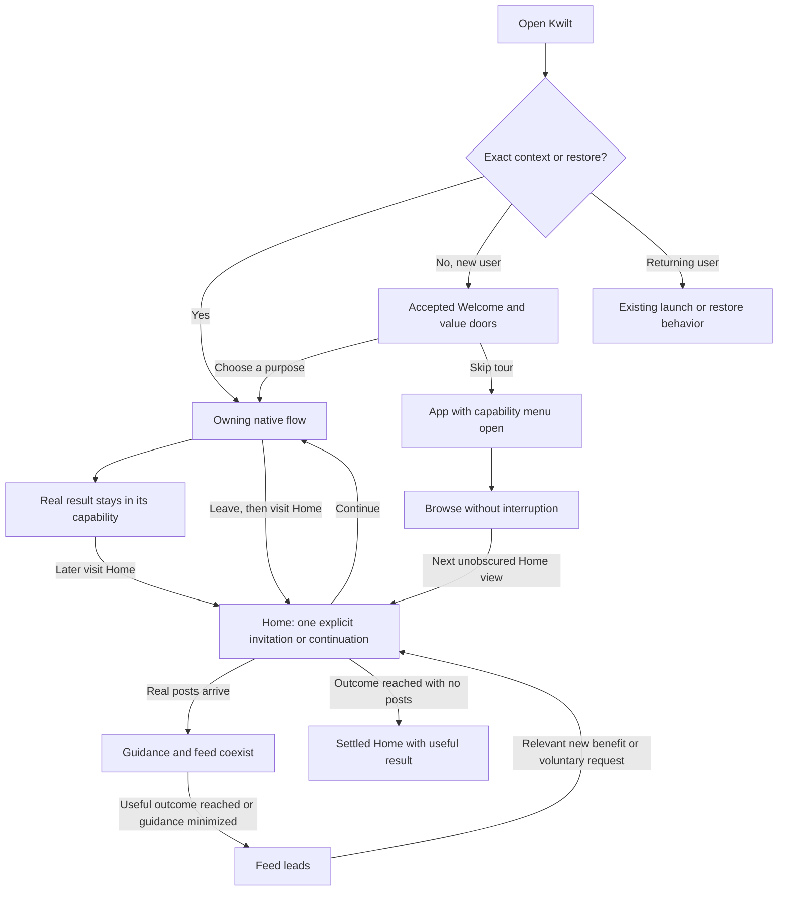

# Home: from getting started to shared life

Developed September 10, 2026. Andrew approved pursuing the inline recommendation direction. A first native slice now covers Household invitations, Money setup and Meals, with personal Later/decline/hide controls and a Your next steps view. See the [implementation plan](../../superpowers/plans/2026-09-10-home-recommendations.md); the broader readiness vision below remains proposed.

**Onboarding helps you choose a useful beginning. The capability helps you do it. Home helps you continue a useful path, discover meaningful capabilities you have not used, and bring people in when relevant. As life appears, the feed takes the space.**

## Read first

**Current review:** the implemented visual treatments and component sketches have not landed. [Home across situations](09-home-situations-and-composition.md) reframes the work around independent entry, feed, household and per-capability states. The persistent two-offer composition below records the earlier implementation hypothesis; it is not visual acceptance or a settled universal Home layout.

Home now has two explicit purposes: **Continue something useful** and **Discover another useful capability**. Discovery is ongoing and does not wait for current setup to finish. The selected placement is one persistent inline region above the feed, with a featured offer and one quiet complementary row. Native checks cover this initial placement; comparisons with other placements remain learning work.

- [Placement and discovery](07-recommendation-placement-and-discovery.md): feed, bottom guide, inline offer and separate-tab alternatives, plus how continuation and discovery coexist.

- [Product brief](../../feature-briefs/home-getting-started.md): complete proposed behavior, readiness model, progress rules, ownership and acceptance scenarios for resumption and proactive invitations.
- [System audit](00-system-alignment.md): current source evidence, accepted onboarding direction, historical conflicts and implementation gaps.
- [Decision](03-converge.md): alternatives, trade-offs and recommendation.
- [Learning release](04-learning-release.md) and [evaluation](05-evaluate-learning.md): how to prove the concept without prematurely changing production first install.

## One coherent journey

Future Home default applies only to unscoped shell entry in the promoted new-user cohort. The diagram does not replace required identity/authority checks, native cancellation behavior or the separate production onboarding gate.

## Maya across several visits

1. Maya chooses Meals from the existing reel. Native Recipes helps her choose meals; Home carries a short sequence toward a useful meal plan and grocery list. It does not ask her to choose her purpose again.
2. A real personal plan exists. Home shows **Meals chosen ✓**, recommends **Build your grocery list**, and previews **Review the list**. **Choose meals with someone** is a visible optional invitation; if gathering input is her expressed purpose, that invitation leads before finalizing meals instead.
3. Maya taps **Invite someone**. The owner explains the Household/content scope and she reviews whom to invite. Home carries the same invitation if she leaves before sending. A confirmed send becomes a waiting state; she can continue independently.
4. Her partner receives a concrete reason to join and, after the required acceptance, is guided to the specific authorized meal plan or choice. They contribute without setting up the whole app. Membership and actual content participation remain separate facts. Missing exact-link support is an implementation gap to resolve, not a promised existing capability.
5. The shared meal interaction now has a real cause. Kwilt invites an appropriate next interaction through the owner or suggests a real moment to review and share. No personal post appears automatically. Home shows actual activity while keeping unfinished guidance available.
6. After Maya adds a child, Kwilt offers **Set up how Sam will use Kwilt**. If she chooses Screen Time, the sequence states what is ready, what remains and which steps need Sam's phone. Other children do not become missing setup. Connecting the phone is distinct from applying controls.
7. **Do this later** parks a step in a quiet visible row. **Not for me** declines a suggestion. Neither requires guessing how to recover it, and neither sends a reminder automatically.
8. Once the chosen outcome works, Home acknowledges the result and shows where to find it again. Guidance can settle with an empty feed; an incoming post can coexist with unfinished setup.

## Proposed Home shapes

| Early, active chosen path | First real content | Established use |
| --- | --- | --- |
| Home header | Home header | Home header |
| One recommended action plus a short visible sequence | Compact continuation | Feed |
| Ready, next and parked steps; full overview link | Actual content stays accessible | Getting started remains in overflow |
| Confirmed result, existing feed or calm empty area | Rest of feed | No completion score or setup obligation |

These are composition concepts, not pixel mockups or native proof. Maintain the gray full-screen canvas. Normal text should allow actual content to begin on the first screen in the mixed state; large text should expand accessibly.

## Further design review

[Deeper review and improvements](06-deeper-review.md) explains the weaknesses found and how the sequence, recipient experience, progress and Home transition changed. The product brief incorporates these decisions.

## Decisions worth reviewing

- Preserve the accepted reel, direct capability destinations and unobstructed Skip tour exit. Skipping the tour does not decline inline help on a later Home view.
- Invite every useful setup/adoption step explicitly: trigger → benefit → action → verified result → next invitation. Do not rely on spontaneous discovery.
- Use Home as the future new-user unscoped shell default, without moving existing users or bouncing successful work away from its result.
- Show progress only within finite chosen paths; no global app or household score.
- Read capability-owned evidence; keep household membership, grants, device connection and applied controls distinct.
- Distinguish Later, Not for me and help. Keep parked steps findable without promoting them again.
- Design invitation recipient value and the first shared interaction explicitly.
- Let useful outcomes, user preference and actual feed needs determine composition; post count does not measure setup success.
- Keep this private to eligible adult Home and retain the feed's existing publication boundaries.
