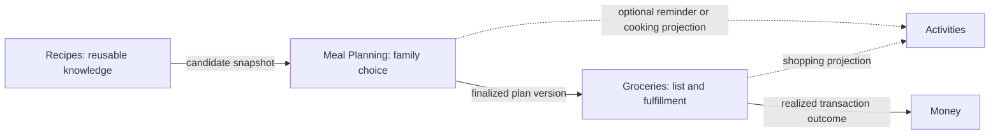

# Capability Decision: Recipes, Meal Planning, and Groceries

Related platform exploration: [Activities as a context-and-action host](../activity-context-action-cards/00-frame.md). Meal Planning should be the first native provider used to prove that contract before external connectors broaden its privacy and authorization surface.

Status: accepted product direction\
Decision date: August 5, 2026\
Implementation status: design only

## Decision

Kwilt's household feeding loop has three capability owners:

1. **Recipes** owns reusable food knowledge.
2. **Meal Planning** owns choosing what the household intends to eat.
3. **Groceries** owns turning a finalized plan into products, savings, and
   fulfillment.

This is a domain, authority, and lifecycle decision. It does not by itself
require three permanent rows in global navigation. A calm shared entry may link
the capabilities while their records, permissions, mutations, and receipts stay
separate.

## Why Meal Planning is not a To-do

An Activity is the atomic unit of doing. A MealPlan is a collaborative decision
with state that Activities cannot truthfully own:

- a variable horizon such as next shop, next five meals, a date range, or open;
- candidate meals that are not yet commitments;
- selected participants and plan-specific invitations;
- one private response per participant;
- pass, suggestion, withdrawal, and round-close behavior;
- organizer finalization authority;
- servings and optional day placement across several meals;
- a finalized version from which Groceries derives a list; and
- revisions that make an already-derived GroceryList stale.

Forcing this into a checklist would confuse preference with commitment and
completion with finalization. It would also turn changed dinner ideas into
overdue work.

Activities still participate through optional projections:

- **Choose meals for the next shop** as a reminder;
- **Cook tacos** as a scheduled occurrence;
- **Pick up groceries** as executable work; and
- a `shopping_list` Activity projection for the current GroceryList.

Completing, deleting, or rescheduling a projection does not finalize, delete, or
rewrite its source MealPlan. Each projection keeps an origin reference and can
navigate back to the owning capability.

## Family choice contract

The initial Meal Planning participation mechanic is **Ask the family**:

1. The organizer creates a candidate tray inside one MealPlan.
2. The organizer selects specific eligible Household members.
3. Each invited member privately chooses up to three candidates, passes, or
   suggests one idea from their own device.
4. Responses may be revised or withdrawn until the round closes.
5. The aggregate appears after all responses arrive or the organizer closes the
   round.
6. The organizer finalizes the plan; the aggregate informs but does not govern.
7. Only finalized meals flow to Groceries.

Guardrails:

- Household membership is eligibility, not access to every MealPlan.
- A child must have Meal Planning activated and be invited to the specific
  round.
- The round exposes candidate snapshots and response controls, not the
  organizer's Recipe library, Activities, Money, calendar, dietary notes, or
  retailer accounts.
- Use **picks** and **what sounds good**, not election, winner, loser, or defeat
  language.
- Do not expose who rejected another person's favorite.
- Do not auto-finalize by majority. The organizer remains responsible for
  budget, time, availability, and dietary safety.
- Notifications remain calm and bounded; no repeated pressure loop.

## Cadence contract

`MealPlan` does not mean calendar week. Every cycle declares a horizon:

```text
next_shop
meal_count
date_range
open
```

Day placement is optional. A two-week stock-up, three dinners before travel,
and a Friday-through-Monday plan are all first-class. The same household may use
different horizons across consecutive cycles.

Groceries derives one or more lists from finalized entries and declared shopping
windows. It never assumes one list per Monday–Sunday week.

## Capability-to-capability contract



- Recipes supplies immutable/versioned snapshots so later recipe edits do not
  silently change an open choice round.
- Meal Planning supplies a finalized plan version, servings, and provenance.
- Groceries supplies derived-list status and receipt evidence; it does not write
  back family preferences as facts without explicit confirmation.
- Money may reconcile the resulting merchant transaction and actual total; it
  does not own meal choice, products, coupons, or item-level receipt truth.

## First proof gate

The capability boundary is justified when one household completes three cycles
on its natural cadence and at least two real multi-device choice rounds show:

- invited participants respond willingly;
- the organizer chases less or guesses less;
- family input changes or strengthens the finalized plan;
- no uninvited member or unrelated account can access the round;
- optional Activities behave as projections rather than hidden plan owners; and
- the finalized plan produces a grocery list the household actually uses.

One account, one shared device, local state, or two simulators using the same
identity do not prove the participation contract.
