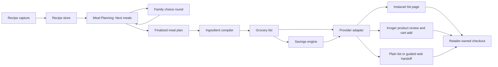

# Kwilt Meals, Recipes, and Groceries Strategy

Status: product and technical feasibility exploration\
Research date: August 5, 2026\
Proof level: official-documentation review plus current-checkout inspection;
no API credentials, live catalog calls, production-key approvals, or retailer
checkout tests were performed.

## Executive answer

Kwilt can deliver most of the dream without negotiated retailer partnerships.
It cannot honestly deliver fully autonomous purchase and delivery across common
grocery chains with the public interfaces available today.

The strongest no-negotiation product is:

> A private, ad-free, AI-native family recipe home that turns photos, URLs, and
> spoken family knowledge into reviewed clean Recipes, helps the household
> choose its next meals, turns the finalized plan into one reviewable grocery
> list, then hands that list to Instacart or an
> authenticated Kroger cart for the user to finish pickup or delivery—after a
> calm savings review identifies worthwhile promotions and lower-cost choices.

The critical boundary is the last mile:

- **Kwilt can own:** recipe capture, clean reading, family provenance, optional
  sharing, collaborative meal selection, flexible planning horizons, serving
  math, ingredient consolidation, pantry
  review, list collaboration, retailer matching proposals, comparable unit-cost
  math, offer-rule evaluation, and handoff/receipt reconciliation.
- **A public API can help:** Instacart can generate shoppable recipe/list pages;
  Kroger can expose locations/products and add confirmed UPCs to an authenticated
  customer cart. Kroger product responses can also expose location-specific
  regular and promotional prices.
- **The retailer must own:** product confirmation where required, live price and
  availability truth, account-specific loyalty/coupon activation unless an
  authorized API says otherwise, substitutions, delivery or pickup slot,
  payment, checkout, fulfillment, and order support.

This is enough to create substantial value. The user does not need Kwilt to
charge the card. The user needs Kwilt to eliminate rediscovery, arithmetic, and
re-entry, then leave them at one trustworthy review-and-buy step. Couponing
materially strengthens the value theory, but the actual promise should be
broader: **the best trustworthy total economic outcome with the least work**.
That includes shelf price, unit price, promotions, coupons, rebates, fees,
memberships, minimums, and the cost of splitting a trip—not merely the largest
coupon badge.

The one part of the dream that is not safe to promise is “a huge ad-free catalog”
made by copying recipes from the open web. Kwilt can support a huge **private
library** made from family recipes, user-authored recipes, user-initiated imports,
licensed/open content, and Kwilt-authored recipes. It should not build a public
substitute for publishers by copying expressive instructions and photos at
scale.

## 1. The value theory

The value theory is plausible, but its strongest form is more specific than
“people like help with chores.”

Household feeding is a high-frequency coordination loop with six repeated
costs:

1. **Recall:** What do we like and what worked last time?
2. **Choice:** What is realistic until the next shop or across the next few
   meals, and what does the family actually want?
3. **Translation:** What ingredients and quantities does that imply?
4. **Reconciliation:** What do we already have, and which requests overlap?
5. **Execution:** How do those concepts become actual store products, pickup,
   or delivery?
6. **Economics:** Which worthwhile savings apply, and what will the basket
   actually cost after discounts and fulfillment fees?

Recipe managers often solve recall. Meal planners often solve choice. Grocery
lists solve reconciliation. Retailers solve fulfillment. Deal apps expose
offers. The real Kwilt bet is that continuity across all six is more valuable
than another best-in-class point tool.

### User-voice job

When feeding my household becomes another recurring coordination burden, help
me move from meals we actually like to groceries arriving at home with as little
re-searching, list arithmetic, and store re-entry as possible, so ordinary
family life feels lighter rather than more administered.

### Target user

The primary persona is Maya, Kwilt's aspirational family organizer. She wants
family life to move with less reminding and setup. She is not seeking a food
dashboard or an optimized diet program.

Nina, the AI-native life operator, is a second design lens for the operating
contract: every food operation should be callable naturally while its evidence,
authority, proposal, confirmation, and receipt remain inspectable.

Ruth is a secondary food-domain persona: the extended-family knowledge
keeper who wants a useful recipe to survive across households with attribution
and without forcing everyone into one account or paid family space.

### Product principles

- Reuse before discovery.
- A flexible planning horizon before a rigid calendar or fixed weekly cadence.
- Reviewable automation before silent automation.
- Import from the evidence people already have before asking for structured
  entry; photo and URL import are first-release criteria.
- Private recipe ownership before household sharing.
- One-off recipe copies before live family collections.
- Ingredient concepts remain provider-neutral; retailer SKUs are mappings.
- Retailer truth must be explicit: a link is not a cart, and a cart is not an
  order.
- Optimize total landed cost, not coupon count or nominal discount.
- Never say **applied** without authoritative provider acknowledgement, and
  never say **saved** without checkout or receipt evidence.
- Reduce household work; do not create pantry, diet, or planning administration.

## 2. Competitive reality and Kwilt's opening

The basic feature bundle is established, not novel:

- Paprika imports recipes from the web, presents a clean cooking view, plans
  meals, combines grocery items, and tracks pantry items.
- AnyList imports and shares recipes, supports a meal-plan calendar and queue,
  consolidates ingredients, and offers guided online shopping across Instacart,
  Walmart, Kroger banners, Safeway/Albertsons, Amazon Fresh, and H-E-B.
- Samsung Food saves web recipes, supports discovery and household lists, builds
  meal plans, and connects shopping lists to Walmart, Instacart, and Amazon Fresh
  in the United States.

Sources: [Paprika](https://paprikaapp.com/),
[AnyList](https://www.anylist.com/),
[AnyList online shopping](https://help.anylist.com/articles/feature-overview-online-shopping/),
and [Samsung Food](https://samsungfood.com/).

Therefore “recipes + calendar + list” is table stakes. Kwilt should not enter
with feature count as the differentiation.

Kwilt's credible opening is:

1. **Family continuity:** a recipe can remain personal, be sent as an
   independent attributed copy, or later become part of a deliberate family
   collection.
2. **Whole-life context:** the meal plan can respect the real planning
   horizon—late practice, travel, budget pressure, guests—without becoming a
   new productivity system.
3. **Calm execution:** the product progressively offers the next transformation
   only after the user has expressed intent.
4. **Truthful agent help:** Chat can propose candidates for the current horizon,
   show why, and prepare a reviewable planning action while typed capability
   operations own every mutation and receipt.
5. **Privacy posture:** no ad network, no sponsored ranking in the initial
   product, no household visibility implied by membership.

The strategic warning is equally important: AnyList is inexpensive and mature.
If Kwilt merely recreates it, the build is not justified. The integrated loop
must feel meaningfully better because it already understands the household's
real life and preserves the family's own knowledge.

## 3. Recommended product architecture

The concise, implementation-facing decision record is
[Capability Decision: Recipes, Meal Planning, and Groceries](capability-boundaries.md).
The implementation-grade aggregate and public-publication contract is
[Household Food Domain Model](object-models.md).

### Three capabilities, one continuous household loop

The product should have three capability owners:

| Capability | Owns | Does not own |
| --- | --- | --- |
| **Recipes** | Recipe capture, clean cooking view, provenance, versions, personal/family collections, and recipe-specific sharing | Planning rounds, grocery quantities, retailer products, or checkout |
| **Meal Planning** | Planning horizon, candidate meals, family invitations and responses, constraints, finalized meal selections, servings, and optional day placement | The canonical recipe record, grocery fulfillment, or generic To-do completion |
| **Groceries** | Derived grocery lists, Already have review, household additions, product mappings, savings, retailer handoffs, and receipt reconciliation | Recipe authorship or family meal-choice authority |

These are capability and authority boundaries, not necessarily three permanent
global-navigation rows. Kwilt may present a calm shared entry such as **Food** or
linked contextual entry points, while retaining three manifests, data owners,
permission contracts, and independent lifecycles underneath. Navigation should
not force false domain ownership.

The central durable objects are:

- `Recipe`;
- `MealPlan`, including its planning horizon and choice lifecycle; and
- `GroceryList`.

Supporting participation records such as `MealChoiceRound` and
`MealChoiceResponse` belong to Meal Planning. Product, price, offer, and receipt
records belong to Groceries.

### AI is an operating layer, not a fourth capability

Every reasonable user-meaningful food operation should be callable by AI from
native Food, Unified Chat, an Activity action card, and future connectors, but
all channels use the same capability-owned operation, validation, proposal, and
receipt. This extends Kwilt's canonical agent manifest rather than creating an
AI-owned copy of food state.

AI can transcribe, extract, search, propose, explain, and execute at the
declared authority level. Import always produces an evidence-backed draft for
review. Invitations, public publication, consequential product selection,
authorized coupon activation, and cart mutations require explicit
confirmation. Checkout, payment, rights attestation, unsupported coupon
application, and unsupported economic claims remain handoffs or exclusions.

The full decision, operation families, and first learning release are in
[`food-ai-operating-layer`](../food-ai-operating-layer/03-converge.md).

### Private sharing and public publication are different systems

A private Recipe has stable identity, immutable content versions, provenance,
credits, lineage, explicit access grants, collections, and media-rights state.
An independent copy retains lineage and attribution without remaining coupled
to the sender's edits. Collaboration grants a role on one private Recipe.

Public distribution uses a separate `RecipePublication` that points to one
exact reviewed Recipe version and an opted-in `PublicCreatorProfile`. The user
chooses the public name, attribution, media, rights attestation, and Kwilt/web
distribution scopes. Private edits never silently republish. Reporting,
moderation, rights complaints, withdrawal, and child-publication policy are
launch requirements for discoverable sharing.

### Relationship to Activities

Kwilt's current type system already has a `shopping_list` Activity. Preserve that
as the executable projection:

- Recipe is reusable reference knowledge, not a task.
- MealPlan is Meal-Planning-owned choice and coordination state, not a second
  global Plan and not an Activity with extra fields.
- GroceryList can project into an Activity because shopping is executable work.
- “Cook chicken soup Tuesday” may become an Activity only if the user chooses to
  place it in the day plan.
- “Choose meals for the next shop” may create a reminder Activity, but completing
  or deleting that Activity does not finalize or delete the MealPlan.

This intentionally extends the four-object model instead of corrupting it. A
recipe forced into `instructions` would lack ownership, version, ingredient,
serving, and provenance contracts. A MealPlan forced into Activities cannot
truthfully represent candidates, private responses, participant state,
finalization authority, multiple meal occurrences, or a variable planning
horizon. It would also turn dinner ideas into overdue tasks.

### Ownership and participation

Every Recipe begins Person-owned and private.

Supported sharing ladder:

1. **Send a copy:** recipient gets an independent Recipe with “From Ruth”
   provenance. No household membership or paid seat required.
2. **Live-share one recipe:** selected contributors work on one authoritative
   Recipe; access and exit behavior are explicit.
3. **Create a family collection:** only after repeated collaboration earns a
   durable named group.

A household MealPlan can reference:

- household-owned recipes;
- personal recipes whose owner explicitly included them; and
- independent copies already owned by the household or planner.

Household membership alone must not reveal every personal Recipe. Broader-family
recipe sharing must not grant access to household Money, Screen Time, chores, or
meal plans.

Meal Planning uses capability-specific participation:

- Household membership makes a person eligible; it does not expose every plan.
- A child with Meal Planning activated may be invited to a specific choice
  round from their own device.
- The invitation exposes only the candidate snapshot and response controls
  needed for that round—not the organizer's private Recipes, Money, calendar,
  Activities, dietary notes, or retailer account.
- A participant may choose, decline, or suggest an idea. The organizer retains
  finalization authority because time, cost, availability, and dietary safety
  may constrain the result.
- Leaving or closing a round ends access according to an explicit retention
  rule; it does not create blanket future-plan access.

## 4. The intended experience

### A. Capture a recipe

Entry paths:

- Share a recipe URL to Kwilt.
- Paste a URL in Meals.
- Scan or photograph a handwritten card.
- Paste text from email or Notes.
- Dictate a family recipe.
- Create manually.
- Save an explicitly licensed, open, or Kwilt-authored recipe.

The import result is a draft, not a silent fact. Show:

- title;
- source and author/provenance;
- servings;
- ingredients;
- instructions;
- imported image only when rights permit;
- fields that need review.

The user can save immediately even if parsing is incomplete. Capture-first
matters more than perfect normalization.

### B. Read and cook without ads

The cooking view should be owned by the saved Recipe:

- large, legible ingredients and steps;
- optional step focus;
- screen-awake mode;
- serving adjustment;
- timers detected from text;
- household notes such as “double the sauce”;
- source link and attribution available without dominating the cooking surface;
- offline access to user-owned content.

“Ad-free” should mean Kwilt does not inject advertising and does not require the
source page after a lawful, user-owned save. It must not mean that Kwilt strips a
publisher's site and republishes it as a competing public catalog.

### C. Plan the next meals together

Begin with **Next meals**, not a hard-coded calendar week. A planning cycle may
be framed as:

- until the next grocery shop;
- the next 3, 5, or 7 meals;
- a date range such as Friday through Monday;
- a two-week stock-up period; or
- an intentionally open set with no dates yet.

The organizer can add:

- a Recipe;
- leftovers;
- eat out;
- undecided;
- a plain meal note such as “tacos”; or
- an idea suggested by a participant.

Optional day placement stays subordinate to choosing the meals. This supports
families that shop every few days, weekly, bi-weekly, or irregularly and avoids
making a changed dinner feel late or failed.

#### Family choice round

From the candidate tray, the organizer can choose **Ask the family**:

1. select the specific Household members invited to this round;
2. choose a simple response rule, initially **Pick up to three**;
3. send a capability-owned invitation to each activated device;
4. each participant privately selects what sounds good, passes, or suggests one
   idea;
5. after everyone responds or the organizer closes the round, show a calm
   aggregate such as **Tacos · 4 picks**;
6. the organizer finalizes the plan, with an explanation when practical
   constraints override the most-picked option;
7. the finalized selections—not every candidate—flow to Groceries.

This is participation, not majority-rule governance. Avoid winner/loser
language, rankings of family members, pressure reminders, or exposing who
rejected whose favorite. A child gets a meaningful voice without receiving
budget authority, dietary-safety responsibility, or access to private household
context.

Useful suggestions should be bounded and explainable:

- family favorites and recent family picks;
- not cooked recently;
- fits available time on an optionally chosen day;
- uses an ingredient already selected;
- fits explicit dietary/allergy constraints without revealing whose constraint
  it is; and
- repeats a meal that worked in a similar planning horizon.

Never infer allergies, impose health goals, silently place meals, or turn
participation into a popularity contest.

### D. Make the grocery list

`Make grocery list` performs a deterministic transformation with visible
provenance:

1. scale each Recipe to planned servings;
2. extract normalized ingredient concepts;
3. combine compatible quantities;
4. retain incompatible measurements separately;
5. attach source Recipe(s) to every line;
6. group by a small aisle vocabulary;
7. let the user mark **Already have**;
8. let the user correct, split, merge, add, or remove lines;
9. include household staples added directly.

Example:

```text
Yellow onions — 3
  2 · Chicken soup
  1 · Tacos
```

If Kwilt is unsure whether “1 bunch scallions” and “4 green onions” are
equivalent, it should not merge them silently.

### E. Shop ingredients

The first provider-neutral state machine should be:

```text
list_ready
  -> provider_link_requested
  -> provider_link_created
  -> opened_for_product_review
  -> user_reported_checkout_complete | abandoned | expired
```

For Kroger, add:

```text
products_proposed
  -> products_confirmed
  -> cart_add_requested
  -> cart_add_acknowledged
  -> retailer_checkout_required
```

Do not create an `ordered` state without retailer order evidence.

### F. Find worthwhile savings

Couponing should be a Groceries behavior, not a fourth top-level capability and
not a scavenger hunt the user has to manage. The user action is **Find savings**.
The system response is one calm, ranked review:

> **About $8.40 available**\
> 3 worthwhile changes · prices checked 12 minutes ago

Each recommendation must explain the action and certainty:

- **Promo included:** Smith's reports the promotional product price.
- **Switch size:** the larger package is $0.11 less per ounce and fits this
  planning cycle's required amount.
- **Ready to activate:** an official retailer offer appears applicable; open
  the retailer to confirm and activate it.
- **Member price unverified:** sign-in or checkout is required before Kwilt can
  know the final price.
- **Rebate after purchase:** this is cash back, not a checkout discount.

The list should not become a field of sale badges. Default to recommendations
that change the basket meaningfully, preserve household preferences, and do not
create waste. Let the user expand the arithmetic.

The savings state machine is deliberately evidentiary:

```text
offer_found
  -> eligibility_unknown | eligible
  -> activation_required | promotion_included
  -> activation_confirmed | retailer_confirmation_required
  -> checkout_estimate
  -> receipt_verified
  -> savings_realized
```

Only a provider response or user-confirmed retailer state can produce
`activation_confirmed`. Only itemized order or receipt evidence can produce
`savings_realized`.

## 5. Public API feasibility

### Feasibility tiers

For this strategy, “without a formal partnership” has four practical tiers:

| Tier | Meaning | Acceptable now? |
| --- | --- | --- |
| 0 | Kwilt-owned code/data and standard OS share/deep links | Yes |
| 1 | Public developer signup, published terms, standard review | Yes, with a launch dependency noted |
| 2 | Self-service affiliate program or paid API subscription | Maybe; no strategic negotiation, but terms and economics matter |
| 3 | Bespoke commercial agreement, private API, meetings/negotiation | No |

### Retailer/platform matrix

| Provider | Public consumer-facing capability | What Kwilt can do | What it cannot do publicly | Access posture | Recommendation |
| --- | --- | --- | --- | --- | --- |
| Instacart Developer Platform | Create shoppable recipe/list pages; nearby retailers; ingredient/product matching on Instacart | Send the complete reviewed list and open a store/product review flow for pickup or delivery | Claim an order from link creation; control final product choices, substitutions, slot, payment, or checkout | Tier 1: developer application plus production review/demo; docs estimate 30–40 days | First broad fulfillment adapter |
| Kroger Public APIs | Locations, products, customer OAuth, add confirmed UPCs to cart | Search a selected Kroger-family store, present matches, add confirmed items to the authenticated cart | Read or reconcile cart, remove items, choose slots/substitutions, apply payment, or checkout through the public API | Tier 1: public developer account/app; user OAuth required | Second adapter after Instacart |
| Walmart Marketplace APIs | Seller catalog, inventory, pricing, orders, fulfillment | Nothing appropriate for a consumer's grocery cart through the documented Marketplace APIs | Search and populate a shopper's personal grocery cart through a public consumer API | Seller/approved-solution-provider program, not the needed use case | Use Instacart where available or a user-guided web handoff; do not build on Marketplace APIs |
| Target | Developer portal and approved affiliate/data-feed terms exist, but no documented open shopper-cart API was found | Link to Target or use a user-guided handoff | Reliably populate and manage a consumer cart through a documented public API | Opaque/approved-use access; not a no-negotiation cart path | Defer direct integration |
| Harmons | Harmons' eShop is an Instacart-operated white-label storefront | Reach Harmons through Instacart coverage when returned for the user's location | Use a documented direct Harmons shopper-cart API; none was found | Instacart path is the available documented platform relationship | Treat as Instacart coverage, not a direct adapter |
| Amazon / Amazon Fresh | Creators API exposes affiliate catalog data | Product discovery/links where program terms allow | Public Fresh grocery-cart, slot, and checkout control | Associates/affiliate eligibility; not a grocery fulfillment API | Not an initial grocery adapter |
| Safeway / Albertsons / H-E-B and others | No equivalent open consumer cart API established in this review | Instacart coverage or plain-list/user-guided handoff | Cross-chain direct cart management without partner access | Varies; commonly partner or private | Let Instacart provide breadth before chain-by-chain work |

Negative findings are phrased deliberately: “no documented open shopper-cart
API was found” is not proof that no private or invitation-only interface exists.
It is proof that Kwilt should not put that interface on the no-partnership
roadmap.

### Savings and coupon feasibility matrix

| Source | Publicly useful now | Missing authority | No-negotiation conclusion |
| --- | --- | --- | --- |
| Kroger Public Products API | Location-aware `price.regular` and `price.promo` values for product comparison | No documented public coupon discovery, clip, activation, eligibility, or redemption endpoint | Build promotion-aware Smith's/Kroger comparisons; deep-link users to retailer coupon surfaces when needed; never claim a coupon was applied |
| Instacart Developer Platform | Shopping-list pages, product matching, nearby retailers, and retailer-owned product/cart review | The documented developer endpoints do not expose a household's coupon wallet or coupon activation state | Let Instacart apply/display its marketplace pricing and promotions after handoff; Kwilt cannot pre-certify the final discount |
| Target Circle | Many deals apply automatically when the member identifies themselves; personalized bonuses and digital coupons can require activation in Target's app/site | No documented open consumer API to enumerate or activate a shopper's Target Circle coupons | Explain that Target will auto-apply eligible Circle deals; deep-link to the official Circle review, but do not scrape or automate the account |
| Walmart consumer offers | Walmart's documented developer APIs address sellers, marketplace providers, and advertising—not a shopper coupon wallet | No documented open shopper coupon activation API found | Treat Walmart deal activation as retailer-owned and defer direct automation |
| Manufacturer offer networks such as Ibotta Performance Network | APIs and publisher distribution can support embedded digital offers at substantial scale | This is a commercial publisher/retailer relationship, not an anonymous self-service public coupon feed | A credible later partnership path, explicitly outside the current no-negotiation release |
| User receipts/order confirmations | Item-level paid price, discounts, fees, and actual outcome when available | Requires user permission, parsing, and source-specific evidence quality | The strongest provider-neutral way to close the truth loop; start with user-supplied receipt capture before retailer receipt integrations |

Coupon aggregators and browser automation are not an acceptable shortcut.
Scraping logged-in loyalty accounts, storing retailer passwords, or silently
driving retailer pages would be brittle, difficult to secure, and unable to
prove that an offer remained eligible at checkout. Kwilt should use OAuth and
documented write scopes when they exist; otherwise it should produce an
official deep link and an exact next action.

### The north-star savings experience

The dream remains strategically sound:

1. the household connects retailer loyalty accounts through authorized flows;
2. Kwilt maps the reviewed list to products and fetches current prices/offers;
3. a basket optimizer evaluates package size, brand preferences, offer rules,
   expected waste, delivery/pickup fees, memberships, and store splitting;
4. Kwilt activates eligible offers only where the provider grants an explicit
   write scope and returns acknowledgement;
5. the user reviews one recommended basket and finishes retailer checkout;
6. itemized receipt/order data reconciles estimated versus realized savings;
7. Kwilt remembers confirmed product preferences and which interventions were
   genuinely worth the household's attention.

This is **Savings Autopilot**, not **Coupon Manager**. The distinction matters:
the user should never need to become good at couponing, and Kwilt should not
recommend buying an unwanted product merely because its coupon is impressive.

Official current references:

- [Kroger public APIs](https://www.postman.com/kroger/the-kroger-co-s-public-workspace/documentation/ki6utqb/kroger-public-apis)
- [Kroger product-list price fields](https://www.postman.com/kroger/the-kroger-co-s-public-workspace/request/cx3ttq9/product-list)
- [Kroger partner APIs and commercial-access boundary](https://www.postman.com/kroger/the-kroger-co-s-public-workspace/collection/nryx3kn/kroger-partner-apis)
- [Instacart shopping-list flow](https://docs.instacart.com/developer_platform_api/guide/concepts/shopping_list/)
- [Target Circle deal behavior](https://help.target.com/help/targetguesthelparticledetail?articleId=ka95d000000gSMnAAM&articleTitle=How+does+Target+Circle+work%3F)
- [Target coupons and offer rules](https://help.target.com/help/subcategoryarticle?childcat=Coupons+%26+deals&parentcat=Promotions+%26+Coupons)
- [Ibotta Performance Network overview](https://ipn.ibotta.com/hubfs/Retailer%20partner%20solutions.pdf)

### Instacart: best breadth, reviewed production access

The Instacart Developer Platform is explicitly marketed to app developers
building recipe, meal-planning, and shopping-list experiences. The relevant
endpoint is:

```http
POST /idp/v1/products/products_link
Authorization: Bearer <server-side-api-key>
```

Kwilt supplies a title and `line_items`; Instacart returns a shareable URL. The
user opens that page, selects a store, reviews matched products, adds products to
their cart, and completes checkout on Instacart.

Relevant current facts:

- development and production environments are separate;
- a production-key request triggers integration review;
- the pre-launch checklist requires a short screen recording and exact CTA/
  messaging treatment;
- Instacart says it will request the demo within five business days;
- its getting-started guide estimates 30–40 days from access request through
  demo approval and production access;
- affiliate conversion setup is optional after approval;
- product matching is not guaranteed;
- generated links can expire, so Kwilt must store expiry and regenerate;
- checkout does not occur merely because the API call succeeded.

Official references:

- [Developer Platform introduction](https://docs.instacart.com/developer_platform_api)
- [Create shopping list page](https://docs.instacart.com/developer_platform_api/api/products/create_shopping_list_page)
- [Production approval](https://docs.instacart.com/developer_platform_api/guide/concepts/launch_activities/approval_process/)
- [Pre-launch checklist](https://docs.instacart.com/developer_platform_api/guide/concepts/launch_activities/pre-launch_checklist)
- [Getting started and timing](https://docs.instacart.com/developer_platform_api/get_started/overview)

Assessment: this is not a bespoke six-month retailer negotiation, but it is not
zero-touch or guaranteed. Treat production approval as an external launch gate,
not as a partnership roadmap.

### Kroger: strongest direct public cart handoff

Kroger's verified public API workspace documents:

- location search;
- product search/details;
- customer authorization through OAuth 2.0 authorization code flow; and
- `PUT /cart/add` for an authenticated customer.

Cart-add accepts UPC, quantity, and modality. It is a write handoff, not a full
cart or order API. The user still reviews and completes the order with the
retailer.

Kroger is especially relevant because its banners include Smith's, King Soopers,
Kroger, Fred Meyer, Ralphs, Fry's, Harris Teeter, and others. Store selection is
essential because products and prices are location-sensitive.

The safe experience is:

1. user chooses and connects their Kroger-family store;
2. Kwilt searches each normalized grocery concept;
3. Kwilt shows one proposed product plus alternatives and confidence;
4. user confirms or skips uncertain mappings;
5. Kwilt sends confirmed UPCs to cart-add;
6. Kwilt says **Added to Kroger cart—review and check out there**;
7. the user opens Kroger.

Official Kroger reference:

- [Kroger verified public API workspace and cart-add](https://www.postman.com/kroger/the-kroger-co-s-public-workspace/request/mwiie4o/add-to-cart)
- [Kroger public developer setup](https://www.postman.com/kroger/the-kroger-co-s-public-workspace/collection/qg005u4/kroger-knowledge-check-answers)

Assessment: a high-value no-bespoke-partnership integration, but narrower in
retailer coverage and more product-matching work than the Instacart list-page
flow.

### Walmart: the documented APIs solve the seller's job

Walmart's official Marketplace documentation says its APIs are for sellers and
approved solution providers to manage items, seller inventory, pricing, orders,
fulfillment, returns, and reports. The Item Search API can query Walmart's global
catalog in that seller context, but that does not establish authority to access
or modify an ordinary customer's shopping cart.

Official reference:

- [Introduction to Walmart Marketplace APIs](https://developer.walmart.com/us-marketplace/docs/introduction-to-marketplace-apis)
- [Marketplace scopes](https://developer.walmart.com/us-marketplace/docs/api-scope-walmart-marketplace)

Assessment: do not mistake catalog/search endpoints for a consumer grocery-cart
API. A direct Walmart cart integration is outside the no-partnership plan.

### Target: affiliate content is not cart authority

Target has a developer portal and affiliate/partner terms that refer to approved
API use and a merchandiser product data feed. This review did not find public
documentation for authorizing an ordinary Target shopper and populating that
shopper's grocery cart.

Official references:

- [Target Developer Portal](https://developer.target.com/)
- [Target Partners terms](https://partners.target.com/termsandconditions)

Assessment: use normal links or a guided handoff only. Do not plan a direct cart
adapter without a materially different public interface appearing.

### Harmons: use its Instacart-operated storefront relationship

Harmons' own terms state that its white-label eShop and delivery service are
operated by Instacart. Its customer FAQ describes delivery and pickup through
that storefront. This makes Harmons a strong candidate for Instacart coverage,
subject to what the nearby-retailers API returns for the user's ZIP code.

Official references:

- [Harmons eShop FAQ](https://shop.harmonsgrocery.com/store/harmons/pages/faq)
- [Harmons storefront terms](https://shop.harmonsgrocery.com/terms)

Assessment: do not spend time seeking a direct Harmons API first. Prove the
Instacart path with a Utah ZIP code using a development key.

## 6. Recipe sources and the ad-free promise

### Source strategy

Use a source ladder with explicit rights:

| Source | Full clean storage? | Discovery use? | Notes |
| --- | --- | --- | --- |
| User-authored/family recipe | Yes | Private/shared by user choice | Preserve author, contributor, story, and version history |
| User-initiated URL import | Cautious; store the user's imported draft with source and takedown/export controls | Do not republish as Kwilt's public catalog | Parse structured data; do not crawl at scale or bypass access controls |
| Open/public-domain recipe | Yes under its actual license/status | Yes with attribution where required | Verify each dataset, photo, and text license separately |
| Kwilt-authored recipe | Yes | Yes | Cleanest seed catalog and brand voice |
| Licensed API/content | Per contract | Yes within plan terms | Paid self-service may be acceptable; caching and instructions are common constraints |
| Web recipe search metadata | Usually title/image/link only per provider terms | Yes as a link-out discovery layer | Does not satisfy ad-free cooking until the user lawfully saves or adapts it |

### Import implementation

For a user-supplied public URL:

1. fetch server-side with strict SSRF defenses, content-size/time limits, and no
   authentication cookies;
2. honor provider blocks and do not bypass CAPTCHAs or bot controls;
3. parse `application/ld+json` for `schema.org/Recipe`;
4. fall back to bounded page metadata, not arbitrary whole-site crawling;
5. normalize fields into a draft;
6. show the user what was captured and what needs correction;
7. retain canonical source URL, source name, import timestamp, and import method;
8. avoid copying article prose, comments, ads, or unrelated page material;
9. copy photography only when the user owns it or the source/license permits it;
10. support export, deletion, correction, and a content complaint/takedown path.

[`schema.org/Recipe`](https://schema.org/Recipe) improves extraction reliability;
it does not grant a license.

### Copyright boundary

The U.S. Copyright Office explains that a mere ingredient list, underlying
process, or simple directions may lack copyright protection, while creative
explanation, narrative, photography, illustrations, and sufficiently expressive
directions can be protected. Fair use is fact-specific, and only a court can
finally determine it.

References:

- [U.S. Copyright Office, Writing and Copyright](https://www.copyright.gov/engage/docs/literary_works.pdf)
- [U.S. Copyright Office, Fair Use FAQ](https://www.copyright.gov/help/faq/faq-fairuse.html)

Product implication: private, user-initiated portability with provenance is a
more defensible starting posture than bulk ingestion or public republication,
but it is not a blanket legal safe harbor. Before public launch, counsel should
review import, storage, sharing, takedown, and publisher-terms policy. This
document is product research, not legal advice.

### Third-party recipe APIs

Recipe APIs are useful for search, nutrition, and ingredient normalization, but
they do not automatically solve the ad-free catalog problem.

Edamam's current public offering illustrates the distinction:

- more than two million web recipes are searchable, but Edamam says it does not
  own those recipe copyrights and does not provide their cooking instructions;
- results link back to the source;
- caching is tightly constrained by plan;
- Edamam-owned or fully licensed content includes instructions, at higher plans
  or through licensing.

Reference: [Edamam Recipe Search API](https://developer.edamam.com/edamam-recipe-api).

USDA FoodData Central is excellent, openly reusable ingredient/nutrition data
under CC0, but it is not a recipe catalog. It can later support food identity or
nutrition calculations without owning the meal experience.

Reference: [USDA FoodData Central API](https://fdc.nal.usda.gov/api-guide/).

Recommendation:

- do not put Edamam or Spoonacular in the critical path for the learning
  release;
- use a small in-house ingredient grammar plus user correction;
- evaluate a paid/licensed provider only after real usage reveals a concrete
  need for discovery, nutrition, or normalization;
- require a contract review covering instructions, images, caching, user saves,
  attribution, termination, and export before adopting any recipe API.

## 7. Technical design

### Provider-neutral architecture



### Proposed data model

```text
Recipe
  id
  owner_principal
  title
  yield_quantity / yield_unit
  ingredient_lines[]
  instruction_sections[]
  provenance
  source_url / source_author / imported_at / import_method
  rights_basis
  version
  visibility

RecipeIngredient
  display_text
  quantity / quantity_max
  unit
  food_concept
  preparation
  optional
  group
  parse_confidence

MealPlan
  id
  owner_principal
  household_id
  horizon_kind: next_shop | meal_count | date_range | open
  horizon_start / horizon_end / target_meal_count
  shopping_windows[]
  candidates[]
  finalized_entries[]
  status: draft | collecting_choices | ready_to_finalize | finalized | archived
  version

MealCandidate
  id
  recipe_id | note
  proposed_by_member_id
  servings
  optional_day / meal_slot
  source_owner_snapshot
  status: candidate | selected | declined

MealChoiceRound
  id
  meal_plan_id / meal_plan_version
  invited_member_ids[]
  response_rule: pick_up_to
  selection_limit
  status: draft | open | closed | cancelled
  closes_at
  finalized_by_member_id / finalized_at

MealChoiceResponse
  round_id / participant_member_id
  selected_candidate_ids[]
  suggested_candidate_id
  submitted_at / withdrawn_at

MealPlanEntry
  candidate_id
  recipe_id | note
  servings
  optional_day
  meal_slot
  source_owner_snapshot
  finalized_from_round_id

GroceryList
  id
  owner_principal
  source_meal_plan_id
  items[]
  revision

GroceryItem
  canonical_concept
  display_text
  amount
  sources[]
  aisle
  state: needed | already_have | purchased | skipped
  user_correction

RetailerConnection
  provider
  external_account_reference
  oauth_tokens_encrypted
  scopes
  expires_at

ProductMapping
  provider
  retailer_location
  grocery_concept
  external_product_id / upc
  preference_source
  confidence
  last_confirmed_at

PriceQuote
  provider / retailer_location / product_id
  regular_price / promo_price / member_price
  unit_price
  fulfillment_markup_unknown
  fetched_at / expires_at / evidence_source

Offer
  provider / external_offer_id
  kind: promotion | loyalty_price | coupon | basket_offer | rebate
  product_scope / basket_scope
  qualification_rules
  valid_from / expires_at
  activation_requirement
  eligibility_state / activation_state
  stackability_unknown

SavingsPlan
  grocery_list_revision
  candidate_baskets[]
  merchandise_subtotal
  expected_discounts
  known_fees / unknown_fees
  estimated_total
  freshness / confidence
  accepted_recommendations[]

SavingsOutcome
  savings_plan_id
  evidence_kind: receipt | retailer_order | user_report
  actual_merchandise_subtotal
  actual_discounts / actual_fees / actual_total
  realized_savings
  reconciled_at

RetailerHandoff
  provider
  grocery_list_revision
  status
  external_url
  expires_at
  receipt_metadata
```

### Meal Planning lifecycle and authority

Meal Planning needs server-authoritative, versioned participation rather than a
shared mutable checklist:

- opening a choice round freezes a candidate snapshot and plan version;
- each invited member can read only that round's candidate projection and
  mutate only their own response;
- responses are idempotent and may be revised until the round closes;
- late or stale responses cannot modify a closed round;
- the organizer may add a participant suggestion to the candidate set, but that
  creates a new plan version or a deliberate follow-up round;
- finalization records the chosen candidates, servings, author, time, and source
  round;
- Groceries compiles only from a finalized plan version;
- reopening a finalized plan creates a revision and marks derived GroceryLists
  stale rather than silently rewriting them.

Activities receive optional projections with origin references. They never
become the authorization or persistence layer for choice responses, plan
finalization, or grocery derivation.

### Ingredient compiler

Keep the first compiler deterministic and conservative:

1. parse number/range/fraction;
2. normalize a bounded unit set;
3. separate food concept from preparation text;
4. convert only safe compatible units;
5. combine exact or high-confidence concepts;
6. retain recipe-line provenance;
7. flag uncertain merges for review;
8. learn only from explicit user corrections.

TDD is required because serving math, unit conversion, merging, provider payload
generation, and idempotent handoffs are pure/branching logic.

Important edge cases:

- “1 1/2 cups” versus “1-2 cups”;
- count versus weight for produce;
- “one 14-ounce can” packaging;
- divided ingredients;
- ingredients used in multiple instruction stages;
- optional garnishes;
- “to taste” amounts;
- liquids and solids with the same unit name;
- non-combinable preparation states, such as whole versus crushed tomatoes;
- serving scaling that produces impractical package quantities.

### Product matching

Never make a retailer SKU canonical. The canonical item remains “whole milk,
1 gallon”; provider mappings are preferences.

Matching order:

1. explicit household favorite at this retailer/location;
2. last user-confirmed mapping;
3. UPC supplied by a trusted source;
4. provider search constrained by brand/health preference;
5. generic keyword search;
6. no match, requiring user choice.

Show confidence and the reason for preference. Never infer an allergy-safe
product from title matching alone.

### Backend and mobile boundaries

- API keys stay in a Supabase Edge Function or equivalent trusted backend.
- Kroger OAuth uses authorization code + PKCE; refresh tokens are encrypted and
  revocable.
- Instacart link generation is server-side and idempotent per grocery-list
  revision.
- Recipe imports are server-side for network safety but user-initiated.
- The mobile app stores offline user-owned Recipe and GroceryList projections.
- Authority and external handoff mutations require server acknowledgement.
- Analytics exclude recipe text, grocery names, family notes, and credentials.
- Remote configuration can disable a provider without disabling Meals or
  Groceries.

### Reliability and receipts

For every external action, record:

- requested provider and list revision;
- exact payload hash, without leaking ingredient text into logs;
- provider response code and request ID;
- resulting URL or acknowledgement;
- expiry/freshness;
- user-visible next step;
- whether Kwilt can verify anything after handoff.

Retries must be idempotent. A stale list revision must never overwrite or claim
to represent the current list. If Kroger cart-add is retried after an ambiguous
network failure, duplicate-add risk must be surfaced and resolved before an
automatic retry.

For savings, preserve the estimate as it was shown. Do not rewrite history when
prices refresh. A receipt reconciliation compares estimated goods, discounts,
fees, and total with actual evidence. A bank transaction can confirm the
merchant and total but cannot prove which products or coupons produced that
total; itemized receipts or retailer order data are required for that claim.

### Basket optimizer

The optimization target is not `maximum_discount`. It is a constrained total:

```text
goods after eligible offers
+ delivery/service fees
+ expected tip
+ membership or minimum-order effects
+ optional store-splitting cost
+ expected waste penalty
= recommended household outcome
```

Constraints include dietary safety, required quantity, accepted substitutions,
preferred/avoided brands, and a household-set threshold for whether a saving is
worth attention. Use deterministic offer rules and arithmetic. AI may explain a
recommendation, but it must not invent eligibility, stacking, price, or savings.

## 8. What can be delivered without partnerships

### Deliverable now with no external approval

- Recipe domain model and private storage.
- Manual/paste/photo/voice family recipe capture.
- User-initiated structured URL import for supported public pages.
- Clean offline cooking view.
- Next meals planning cycles with meal-count, next-shop, date-range, or open
  horizons and optional day assignment.
- Capability-scoped family choice rounds, participant responses, organizer
  finalization, and device notifications using Kwilt-owned Household identity.
- Deterministic serving and ingredient compilation.
- Already-have review.
- Shared household grocery list.
- Plain-text/PDF/share-sheet export.
- Existing search-link fallbacks.
- Provider-neutral handoff states and receipts.
- User-entered or photographed receipt capture and estimate-versus-actual
  reconciliation.
- Unit-price normalization and savings arithmetic for prices/offers the user
  supplies or Kwilt can access lawfully.

### Deliverable with public developer access, not a bespoke partnership

- Instacart shoppable recipe/list page integration, subject to its application,
  demo, production review, and branding rules.
- Nearby Instacart retailer lookup, subject to the granted key/scopes.
- Kroger-family location/product search and authenticated cart-add through the
  public APIs and customer OAuth.
- Kroger regular-versus-promotional price comparison with location and
  freshness shown.
- USDA FoodData Central ingredient/nutrition lookup if later useful.
- Paid self-service recipe API features within published plan terms, although
  these are not recommended for the first release.

### Not deliverable honestly without a different commercial relationship

- Universal direct cart population across Walmart, Target, Harmons, Kroger,
  Amazon Fresh, and every regional grocer.
- Cross-retailer real-time price/availability comparison at checkout quality.
- Autonomous selection of weighted produce and substitutions.
- Delivery/pickup slot reservation across chains.
- Applying every loyalty account, coupon, benefit, and payment method.
- Enumerating or auto-activating account-specific digital coupons at retailers
  that do not publish an authorized coupon API.
- Placing and tracking orders across chains.
- A broad public ad-free replica of third-party recipe sites.

### The crisp promise

Kwilt can promise:

> Plan from your recipes, make one clean list, and get to a reviewed pickup or
> delivery cart with dramatically less re-entry—and see the worthwhile savings
> Kwilt can verify along the way.

Kwilt should not yet promise:

> Kwilt automatically applied every available coupon and guaranteed the lowest
> possible total.

## 9. Recommended delivery sequence

### Stage 0 — Feasibility spikes

Before product implementation:

1. Create an Instacart development account/key.
2. From ten representative Kwilt grocery lists, generate development shopping
   pages and score match quality.
3. Use Utah ZIP codes to verify whether nearby-retailer results include Harmons,
   Smith's, Costco, and other relevant stores; do not assume coverage from
   marketing lists.
4. Create a Kroger developer application and validate Smith's store search,
   regular/promo product prices, OAuth, and cart-add with a disposable test
   list. Confirm whether any undocumented coupon scopes appear in the actual
   developer console; do not assume they exist.
5. Test structured recipe extraction on 50 representative URLs across large
   publishers, blogs, paywalls, and malformed pages.
6. Review copyright, site terms, App Store behavior, and takedown policy with
   counsel before external launch.

Exit gate: choose Instacart as the first production adapter only if list-page
matching is good enough that users correct products rather than recreate the
order.

### Stage 1 — Private Recipe Box

Build:

- manual, paste, photo/voice, and supported URL capture;
- clean cooking view;
- edit, export, delete, source, and provenance;
- ten to twenty real Andrew/family recipes.

Learn: does Kwilt become the place the family returns to cook, independent of
meal planning?

### Stage 2 — Meal Planning core

Build:

- Next meals cycles with next-shop, meal-count, and date-range horizons;
- candidate and finalized meal states;
- serving adjustment;
- optional day placement;
- optional Activity projections for participation reminders or scheduled
  cooking, without making Activities canonical;

Learn: does a flexible planning horizon match the household's real shopping
cadence better than a fixed week or rigid calendar?

### Stage 3 — Family meal choice

Build and prove on separate household devices:

- invite selected activated Household members to one plan-specific choice
  round;
- **Pick up to three**, pass, and suggest-one-idea responses;
- private responses until submit/close, then a calm aggregate;
- organizer finalization and a visible explanation when constraints change the
  most-picked result;
- consent, withdrawal, stale-version, close, and deactivation behavior.

Learn: do children and other family members participate willingly, and does
their input make the plan easier to accept without creating negotiation admin?

### Stage 4 — Finalized plan to Groceries

Build:

- deterministic ingredient compiler;
- already-have pass;
- one durable grocery-list Activity projection.

Learn: does the transformation remove repeated planning and arithmetic?

### Stage 5 — Instacart fulfillment bridge

Build and prove with a development key, then submit the production demo:

- server-side shopping-list page creation;
- compliant CTA and copy;
- link expiry/regeneration;
- open/return receipts;
- user-declared checkout outcome.

Learn: does the handoff save enough re-entry to complete the value loop?

### Stage 6 — Kroger-family direct cart-add

Only after Stage 5 adoption:

- Smith's/Kroger account connection;
- store selection;
- product matching with explicit confirmation;
- persistent household preferences;
- cart-add and retailer-checkout handoff.

Learn: does a closer cart handoff materially outperform Instacart's broader
list-page bridge?

### Stage 7 — Savings review

After product matching is dependable, add:

- Kroger regular/promo comparison and unit-price normalization;
- a small deterministic basket optimizer;
- one calm **Find savings** review;
- explicit `included`, `activation required`, and `unverified` states;
- receipt/photo capture and estimated-versus-realized reconciliation;
- an official retailer deep link for coupons Kwilt cannot activate.

Learn: does this measurably improve the actual household outcome without adding
deal-management work, unwanted substitutions, or false confidence?

### Stage 8 — Authorized activation and broader offer sources

Only after the savings review proves demand, evaluate retailer or offer-network
relationships that provide enumerated offers, eligibility rules, activation
authority, and redemption evidence. Require a concrete API/data contract before
promising auto-activation. Do not hold the core Recipes/Meal Planning/Groceries
launch for this.

### Stage 9 — Recipe sharing and discovery

Then evaluate:

- independent recipe copies with provenance;
- family recipe collections;
- Kwilt-authored seed recipes;
- licensed/open discovery;
- bounded Chat suggestions grounded in the current planning horizon and
  household constraints.

Do not add public discovery simply to make the library look large. Earn it from
evidence that users need ideas after reuse is already working.

## 10. Measurement and decision rules

### North-star evidence

The capability succeeds when a household repeatedly moves from saved meals to a
retailer checkout with less work and returns to do it again.

### Behavioral measures

- feeding cycles started and completed, segmented by horizon kind;
- saved Recipe reuse rate;
- percent of plans using prior household recipes;
- choice rounds opened, response rate, pass rate, and time to close;
- percentage of finalized plans containing at least one participant-picked
  candidate;
- participant suggestions accepted into the finalized plan;
- plans revised after finalization and derived lists marked stale;
- list-generation completion rate;
- ingredient merge correction/split rate;
- already-have review use;
- retailer handoff creation/open rate;
- self-reported checkout completion;
- savings reviews opened and accepted;
- estimated savings by evidence/confidence class;
- actual discounts and total verified from itemized receipts;
- estimate-to-actual error;
- recommendations rejected because the product, quantity, or trip was not
  worthwhile;
- next-cycle return;
- household collaborator participation without owner reminders.

### Qualitative measures

- “What work did this remove?”
- “Where did you still repeat yourself?”
- “What did Kwilt get wrong enough to reduce trust?”
- “Would you be disappointed if this disappeared?”
- “Did the family use its own recipes more often?”
- “Did Kwilt save you money without making you manage deals?”
- “Did any recommendation make you buy something you did not actually want?”

### Privacy-safe instrumentation

Measure event shapes and correction counts, not the contents of recipes,
grocery items, family notes, or dietary conditions. Provider logs should retain
opaque request IDs and payload hashes, not plaintext household food data.

### Decision rule

Proceed beyond the learning release only after one household completes at least
three real grocery cycles, reuses saved recipes, accepts most generated list
structure, reaches retailer checkout, and reports meaningful relief. Broader
discovery and more retailers do not compensate for a weak core loop.

## 11. Main risks and mitigations

| Risk | Why it matters | Mitigation |
| --- | --- | --- |
| Scope explosion | Three real capabilities plus commerce, sharing, AI, and nutrition can become an unbounded program | Preserve three ownership boundaries but prove them through one ten-recipe, one-planning-cycle, one-choice-round, one-provider vertical loop |
| Copyright/terms | Clean import can become unauthorized public republication | User-initiated private import, provenance, no bulk crawl, licensed/open public catalog, counsel review |
| Bad ingredient math | Duplicate or missing groceries destroys trust | Conservative deterministic compiler, provenance, correction, regression tests |
| Bad product matching | Review becomes slower than store search | Persist confirmed mappings, show alternatives, allow skip, measure correction burden |
| False retailer claims | A link/cart acknowledgement can be mistaken for an order | Typed handoff state machine and exact receipts |
| External API drift | Provider approval, terms, endpoints, or rate limits can change | Adapter boundary, remote disable, plain-list fallback, contract monitoring |
| Household privacy | Shared plan could leak personal recipes or health constraints | Capability-owned grants, explicit inclusion, private default, negative authorization tests |
| Voting conflict | A family poll can create winners, pressure, or imply children control budget/safety decisions | Private bounded picks, pass/suggest options, calm aggregates, organizer finalization, no member ranking or rejection exposure |
| Fixed cadence | A weekly model will not match every household's shopping rhythm | Model the horizon explicitly as next-shop, meal-count, date-range, or open; keep day placement optional |
| Pantry administration | Inventory upkeep can erase the intended relief | Start with an ephemeral Already have review |
| Sponsored incentives | Affiliate revenue can corrupt meal/product trust | No sponsored ranking; disclose affiliate relationship; preference and relevance first |
| Coupon theater | Nominal discounts can obscure higher unit prices, fees, waste, or ineligibility | Rank net outcome, show freshness/confidence, and reserve **saved** for reconciled evidence |
| Account automation | Scraping or storing retailer credentials creates security and terms risk | OAuth/documented scopes only; otherwise official deep links and user confirmation |
| Competitor parity | Mature low-cost apps already do the basics | Compete on family continuity, whole-life context, and trustworthy end-to-end relief |

## 12. Recommended bet

Build toward the dream, but do not begin with the huge catalog or universal
checkout.

Begin with a high-integrity household loop:

1. preserve ten recipes the family actually uses;
2. create a **Next meals** cycle that matches the next shop or number of meals;
3. ask selected family members what sounds good and finalize the plan;
4. generate and review one combined list;
5. show only savings supported by accessible price/offer evidence;
6. send it to Instacart;
7. observe whether the household begins the next feeding cycle in Kwilt.

In parallel, validate Kroger/Smith's with its public APIs and verify Harmons
coverage through Instacart. If the loop is loved, the same architecture can add
Kroger cart-add, a receipt-verified savings loop, attributed family copies,
richer shared recipe collections, and licensed discovery without changing the
core promise.

### Monetization thesis

This can be highly monetizable, but trust is the scarce asset. The recommended
model is:

1. **Subscription value:** Savings Autopilot is a paid Kwilt household benefit,
   bundled with the recurring Recipes/Meal Planning/Groceries loop. The user
   pays for removed work and better outcomes—not access to coupons that are
   otherwise free.
2. **Transparent affiliate revenue:** Instacart documents an optional Impact
   affiliate program for approved Developer Platform partners. Treat this as
   subsidy, disclose it, and never let commission alter retailer, recipe, or
   product ranking. See [Instacart conversion tracking and affiliate payments](https://docs.instacart.com/developer_platform_api/guide/concepts/launch_activities/conversions_and_payments/).
3. **Future offer-network economics:** an authorized manufacturer-offer network
   could fund redemptions or publisher economics, but only after the product
   proves it can protect neutrality and explain conflicts.

Do not begin with sponsored placement or a percentage-of-claimed-savings fee.
Sponsored ranking compromises the household-agent promise. A savings-share fee
depends on a counterfactual Kwilt usually cannot prove; a receipt proves what
was paid, not what the user would otherwise have paid. If a later premium tier
uses a savings guarantee, base it on auditable realized outcomes and a simple
fixed price.

The moat is not a coupon feed. It is the household-specific closed loop: recipes
chosen, quantities required, products accepted, offers acted on, actual receipt
outcomes, and preferences learned with permission. Generic deal apps do not
begin with the family's intended meals, and retailer apps do not optimize the
household across its full planning loop.

The strategic conclusion is therefore:

> **Yes, Kwilt can create the household value now without retailer
> negotiations.** It can own the hard cognitive and coordination work and use
> public handoffs for fulfillment. **No, it should not promise universal
> one-tap ordering or a copied ad-free web catalog.** Those last-mile and content
> rights boundaries are real, and the product will be more trustworthy for
> naming them.

## 13. Immediate next gates

1. Record the accepted three-capability decision: **Recipes**, **Meal
   Planning**, and **Groceries**, while deferring whether they require three
   permanent navigation rows.
2. Create Instacart and Kroger development credentials.
3. Run the representative-list and Utah-retailer feasibility spikes.
4. Decide the private URL-import legal posture with counsel.
5. Write separate capability briefs plus one cross-capability contract before
   implementation. The Meal Planning brief must include variable horizons,
   family choice rounds, organizer finalization, and optional Activity
   projections.
6. Prove family choice on at least two independently authenticated household
   devices; one-account or one-simulator state is not participation proof.
7. Treat Savings Autopilot as the north star, but gate its first build on
   dependable product matching and use Kroger promotional prices plus receipt
   reconciliation as the first truthful learning surface.
