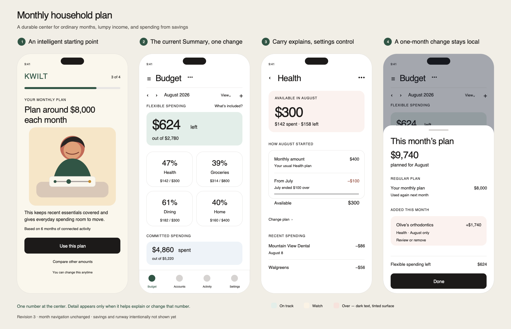

# Four-Screen Mockup: Monthly Household Plan

## Status

Revision two rendered for review after comparison with the current Money
runtime and source. This establishes the proposed hierarchy and copy
relationships; it does not prove production behavior, connected financial
evidence, accessibility, or native-device layout.

Editable source: [`monthly-household-plan-mockups.svg`](monthly-household-plan-mockups.svg)

## The Four Moments

### 1. An intelligent starting point

After connected evidence is available, setup asks the household to recognize
one answer: `Plan around $8,000 each month`. The evidence summary makes the
recommendation feel earned without requiring the user to choose a budgeting
method. `Compare other amounts` keeps control available without competing with
the three-second decision.

The screen intentionally does not claim that the amount preserves a particular
runway. That cannot be truthful until the savings and resource-pool design is
resolved.

### 2. The current Summary, reduced

Summary preserves the existing first answer: `$624 left`. The flexible answer
uses a borderless state surface instead of a white bordered card and red text.
`Monthly plan · $8,000` is now a top-level month statement above both Flexible
and Committed spending, not a child of the Flexible card.

The current month row remains unchanged: previous and next controls, month
label, View, Add category, and horizontal month swiping stay where they are.

Categories remain the next focal point and retain the current meter-tile
concept. The mockup no longer proposes replacing them with a new dollars-left
card inventory. Committed spending receives the same planned-versus-used read;
its individual categories continue below the visible viewport.

### 3. Carry makes lumpy spending calm

Health separates three meanings:

- the durable monthly amount: `$400`;
- the signed adjustment inherited from July: `−$100`; and
- the amount available when August begins: `$300`.

The detail screen explains carry but does not control it. Rollover enablement,
disablement, start month, and reset belong in Category settings. This preserves
both surplus and deficit without introducing a separate Reserve category mode
or a configuration card in the ordinary detail read.

### 4. A one-month change stays local

The plan drawer distinguishes the regular `$8,000` plan from an August-only
`+$1,740` addition for Olive's orthodontics. The addition is bound to Health
and explicitly says `August only`; it does not silently change September or
inflate general flexible spending.

The expense may be recognized before or after the transaction. The household
does not need to identify a funding account or annotate individual
transactions.

## Visual Review

The revision passes the intended first hierarchy check:

- setup reads amount, consequence, then action;
- ordinary Summary still reads flexible money, then plan, then categories;
- category detail makes `$300 available` dominant and its signed arithmetic
  directly inspectable without exposing a rollover switch; and
- the exceptional-month drawer separates the durable plan from the local
  addition without creating a permanent exception manager.

Month-header redesign is no longer part of this direction. The next native
review should focus on whether the state surface communicates on-track, watch,
and over clearly without changing the surrounding Summary hierarchy.

## Intentionally Not Shown

- a savings balance or runway number;
- which account funded Olive's orthodontics;
- automatic exception acceptance;
- a rollover control on category detail or a rollover badge on every category;
- the insufficient-evidence setup path;
- retroactive-start and reset drawers; and
- positive carry or a deficit larger than the monthly category amount.

Those are either unresolved product questions or second-pass edge states. They
should not be inferred from this sheet.

## Next Decision Boundary

Review whether these four screens make one coherent model feel obvious:

> We normally plan around one monthly amount. Categories can bring room or
> overage forward, and an unusual expense can change one month without changing
> the plan forever.

If that lands, the next design pass should address the missing resource layer:
where savings appears, what pool is being decremented, and how Kwilt can make a
truthful runway claim. If it does not land, revise the hierarchy before
rendering reset, partial-history, or implementation states.
