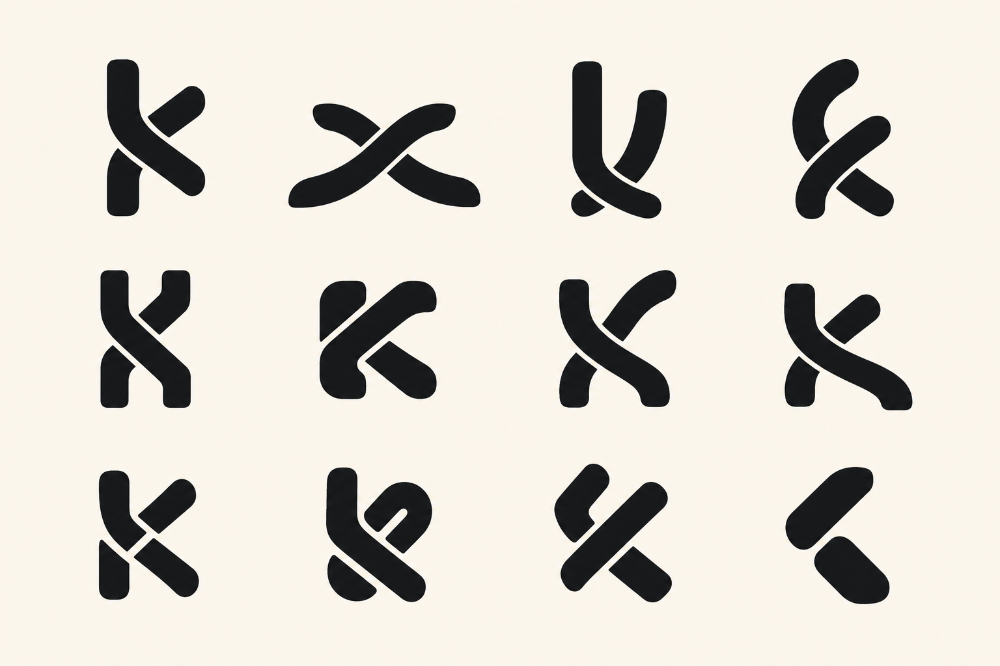
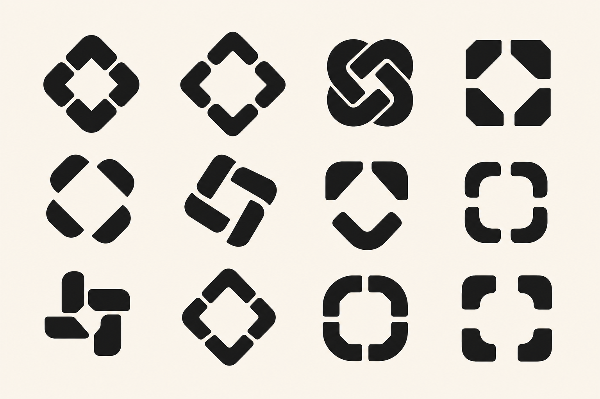
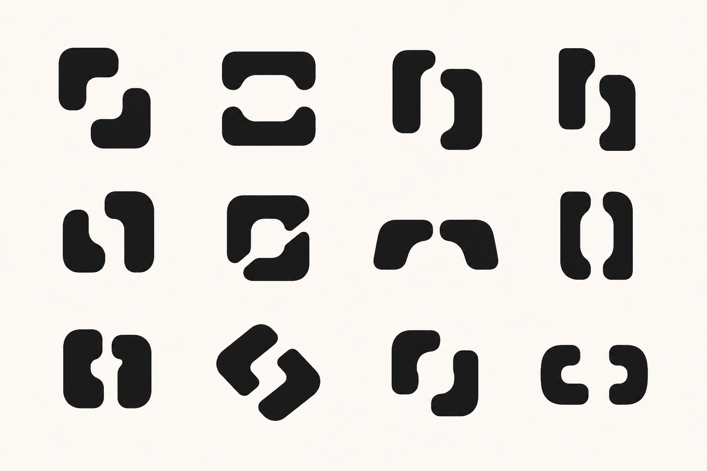
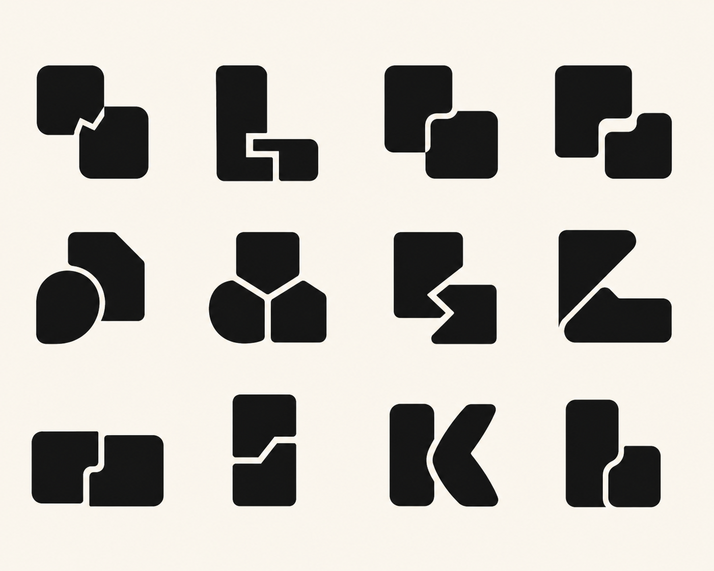
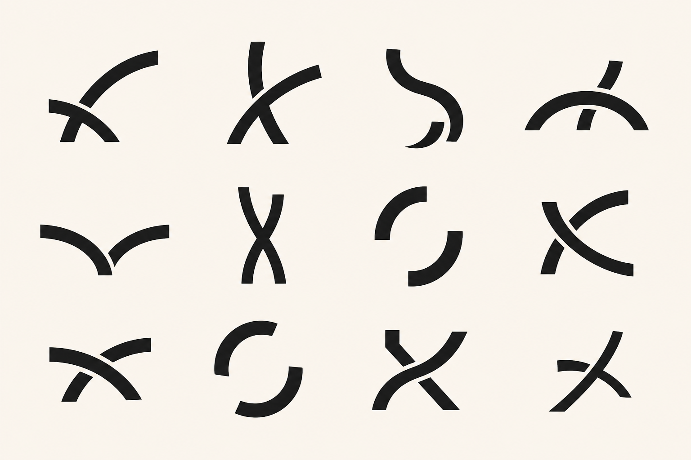

# Scalable Kwilt Mark Exploration

Status: visual exploration only. No production logo, app icon, or lockup has been changed.

## Objective

Find a quieter, more iconic Kwilt mark that preserves the idea of lives or threads being held together, while remaining recognizable in every current brand context.

The current mark reads as a woven emblem at larger sizes but loses its dominant shape at small sizes. This exploration tests five different reductions of the brand idea rather than trying to remove arbitrary lines from the existing artwork.

## Shared constraints

- One canonical geometry must work at 16, 24, 32, 64, and 1024 pixels.
- Begin in one-color black on warm ivory. Color must not rescue weak geometry.
- Prefer two to four broad filled shapes and one unmistakable spatial idea.
- Preserve generous internal gaps that remain open at 16 pixels.
- Use the system-provided app-icon container; do not bake a rounded-square frame into the standalone mark.
- The mark must work filled, reversed, tinted, beside the `Kwilt` wordmark, and alone as an assistant mark.
- Favor calm, rounded, human geometry over sharp, urgent, or high-energy forms.
- Avoid a six-lobed knot, an infinity symbol, a generic chain link, a literal quilt block, a sewing tool, a house, a checkmark, or an AI sparkle.
- Treat generated boards as ideation. Any selected candidate must be redrawn as exact SVG geometry and tested at actual rendered sizes.

## Directions

1. [The Join](the-join.md) — two ribbons form a subtle `K` through one crossing.
2. [Four Fold](four-fold.md) — four folded corners gather around one open center.
3. [The Bind](the-bind.md) — two independent forms clasp without becoming a chain icon.
4. [Joined Patch](joined-patch.md) — a small set of broad pieces becomes one whole through overlap.
5. [The Arc](the-arc.md) — two trajectories converge through one controlled crossing.

## Study-board format

Each direction gets one 4-by-3 board containing 12 distinct marks. Variants are read left to right, top to bottom. Boards intentionally omit names, wordmarks, app-icon masks, color, shadows, and presentation mockups so silhouette quality is easier to judge.

## Generated study boards

Generated on 2026-08-11 with the current Kwilt app icon supplied as brand-ancestry reference only. These PNGs are concept boards, not production vector assets.

Andrew selected two Four Fold candidates for a focused follow-up. See [Refinement Round 01](refinement-round-01/README.md) for 12 Gather refinements, 12 Weave refinements, and 12 Gathered Weave hybrids.

A later source study begins from historical quilt construction rather than abstract logo geometry. See [Quilt-Source Round](quilt-source-round/README.md) for three briefs and 36 additional candidates derived from curved quarter-blocks, bands around a center, and overlapping folded pieces.

After reviewing actual museum quilts, the [Flying Geese Exploration](flying-geese-round/README.md) isolates shared cadence, negative space, and meaningful variation from a ca. 1840–50 Flying Geese quilt without copying its triangle block.

### The Join

### Four Fold

### The Bind

### Joined Patch

### The Arc

## Evaluation gates

1. **16-pixel survival:** the core idea remains visible rather than becoming texture.
2. **One-glance recall:** the silhouette can be described from memory after a short view.
3. **Brand fit:** calm intelligence, continuity, and human connection are present without productivity or craft-store cues.
4. **Distinctiveness:** the mark does not depend on generic infinity, chain, sparkle, leaf, or software-tile conventions.
5. **System range:** the same geometry can serve the app icon, header lockup, assistant mark, favicon, launch screen, and monochrome system treatments.
