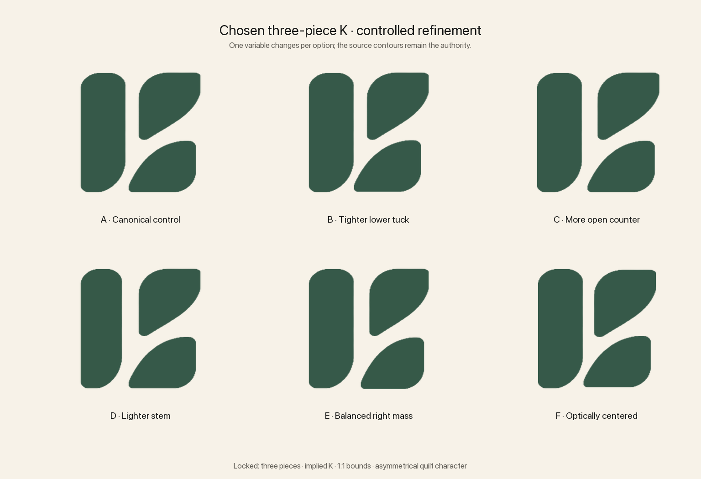

# Chosen Three-Piece K — Refinement Round 01

Status: visual refinement only. No production logo, app icon, or lockup has changed.

## Locked qualities

- Exactly three positive pieces.
- An implied `K`, discovered through the negative space rather than drawn literally.
- A stable vertical stem with two asymmetrical right pieces.
- A true 1:1 occupied silhouette.
- Rounded quilt-piece character, including the distinctive large lower curve on the stem.

## Controlled comparison

- **A — Canonical control:** the chosen source normalized without geometric changes.
- **B — Tighter lower tuck:** moves only the lower-right piece inward, strengthening the lower leg of the `K`.
- **C — More open counter:** moves both right pieces outward, prioritizing negative space and small-size separation.
- **D — Lighter stem:** reduces only stem width, balancing its visual weight against the two right pieces.
- **E — Balanced right mass:** subtly reduces both right pieces while preserving their right edge.
- **F — Optically centered:** small positional corrections bring the three-piece composition closer to the visual center without regularizing its character.

## Recommendation

Use **A** as the contour authority. The first meaningful decision is between **B** and **C**: whether the mark should reveal the `K` more strongly through nesting, or scale more cleanly through additional counter space. Stem and mass adjustments should follow that choice rather than being combined prematurely.
