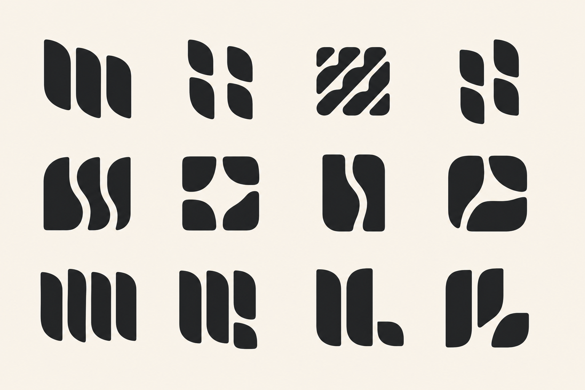

# Kwilt Mark: Flying Geese Exploration

Status: visual exploration only. No production logo, app icon, or lockup has changed.

## Source

[Quilt, Flying Geese pattern, ca. 1840–50](https://www.metmuseum.org/art/collection/search/13881), maker unidentified, The Metropolitan Museum of Art.

The source quilt is studied for composition rather than copied as an image or block. Its most relevant qualities are:

- many small pieces participating in one calm rhythm;
- generous ground keeping a dense system breathable;
- occasional saturated pieces giving variation meaning;
- a simple unit producing identity through repetition.

## Translation brief

Explore a Kwilt mark made from two to four distinct broad pieces participating in one coherent movement. Direction should be perceptible without producing literal arrows, birds, or navigation symbolism. Negative space should organize the pieces and remain open at 16 pixels. One controlled difference may create recognition, but the whole must remain optically balanced and calm.

Do not translate the Flying Geese triangle literally. Translate the relationship among repeated units, surrounding space, and meaningful variation.

## First diagnostic board

The board deliberately tests one principle per row:

- **Row 1 — Shared cadence:** repeated pieces form one cooperative rhythm.
- **Row 2 — Space as structure:** the passage between pieces carries the identity.
- **Row 3 — Meaningful exception:** one controlled departure makes the family memorable.

## Initial read

- Shared cadence creates the most distinct new territory, especially row 1, column 3.
- Space-as-structure is promising in row 2, columns 1 and 4, but column 2 returns too closely to the existing four-part Gather family.
- Meaningful exception works best in row 3, columns 2 and 4. The difference must remain quiet enough to feel intentional rather than broken.
- Row 3, column 1 is too repetitive and generic; row 3, column 3 feels incomplete rather than meaningfully varied.
- Several rounded pieces risk reading as leaves. Exact vector follow-up should use flatter sides, clipped terminals, and less botanical curvature.

## Next gate

Select the property first—cadence, negative passage, or exception—then redraw only the strongest two or three marks as exact geometry. Test monochrome 16, 24, 32, and 64 pixel renderings before adding color or app-icon presentation.

Andrew, Blaire, and Olive selected six related candidates and hypotheses for deterministic reconstruction. See [Precision Round 01](precision-round-01/README.md) for 24 exact SVG variants covering cadence, four-part rhythm, flowing seams, open passage, negative-space `K`, and a constructed positive `K`.

That first SVG reconstruction was rejected for becoming sterile and generic. The corrected [Character-Preserving Round 01](character-preserving-round-01/README.md) refines the successful generated silhouettes while preserving their tapered mass, organic curve tension, and optical rhythm.

Concept 1.3 is explored separately in [Segmented Ribbon Round 01](segmented-ribbon-round-01/README.md), with 12 refinements focused on coordinated curves, channel width, seam phase, terminal logic, and small-size reduction.

The three lead territories—segmented diagonal quilt, nested implied `K`, and woven vertical seams—are compared in [Finalist Round 01](finalist-round-01/README.md), with three focused options for each.

The two surviving territories are developed with more whitespace and precision in [Thread Path vs. Nested K — Duel Round 01](duel-round-01/README.md), including six variants of each and an exact-geometry comparison in the current left navigation.

One lead from each territory—T2 and K3—is reconstructed as native 1:1 vector geometry in [Square Leads — Round 01](lead-square-round-01/README.md), with 64, 32, 24, and 16 pixel tests.

Those first square redraws were rejected for losing the approved character. [Faithful Square Leads — Round 02](lead-square-round-02/README.md) instead preserves the source T2 and K3 silhouettes exactly and changes only their horizontal proportion until the occupied bounds are square.

The Thread Path is also tested as an integrated circular silhouette in [Thread Path Circle — Round 01](thread-path-circle-round-01/README.md), using three equal diagonal channels with staggered underpasses.

That inverted disc-and-channel construction was rejected. [Positive Thread Path Circle — Round 02](thread-path-circle-round-02/README.md) preserves T2 as positive artwork and uses the circle only to organize its outer silhouette.
