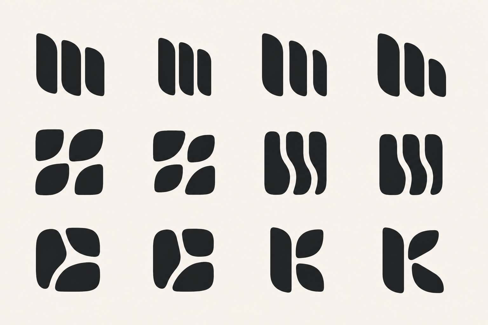

# Flying Geese Character-Preserving Round 01

Status: raster concept refinement only. No production brand asset has changed.

## Correction from the rejected precision round

The first deterministic SVG reconstruction was rejected because it translated "mathematical precision" into rigid rectangles, capsules, and font-like letter construction. That removed the tapered mass, soft tension, coordinated organic curves, and imperfect-but-balanced rhythm that made the selected generated concepts appealing.

This round returns to the successful first Flying Geese board as the sole visual parent. Precision means coordinated curve families, repeatable taper ratios, consistent optical gaps, balanced visible mass, and shared terminal logic—without replacing the silhouettes' character.

## Board structure

Variants are read left to right, top to bottom.

- **1–4:** 1.1 cadence refinements.
- **5–6:** 1.2 / 1.4 four-piece refinements.
- **7–8:** 2.1 flowing-seam refinements.
- **9:** faithful 2.4 open-passage cleanup.
- **10:** 2.4 with a subtle negative-space `K` hypothesis.
- **11–12:** 3.3 / 3.4 positive `K` boundary tests using the same soft module language.

## Initial read

- The 1.1 family preserves the strongest quality from the original board. Variants 1 and 4 retain the most presence; 2 becomes too narrow and bar-like.
- The four-piece family is cleaner, but must be watched for leaf or petal readings.
- The 2.1 family retains its appealing negative seams. Variant 7 has more character; 8 is calmer and likely more robust at small sizes.
- Variant 9 remains stronger as an abstract branching passage than as a forced letter.
- Variant 10 suggests a `K` without fully drawing one and is the more promising letter experiment.
- Variants 11 and 12 reveal `K` too immediately. They are useful boundary tests, not recommended finalists.

## Next gate

Select individual cells from this board. Only after selection should their real curved silhouettes be reconstructed as exact SVG paths, using the raster shapes as optical references rather than substituting generic primitives.
