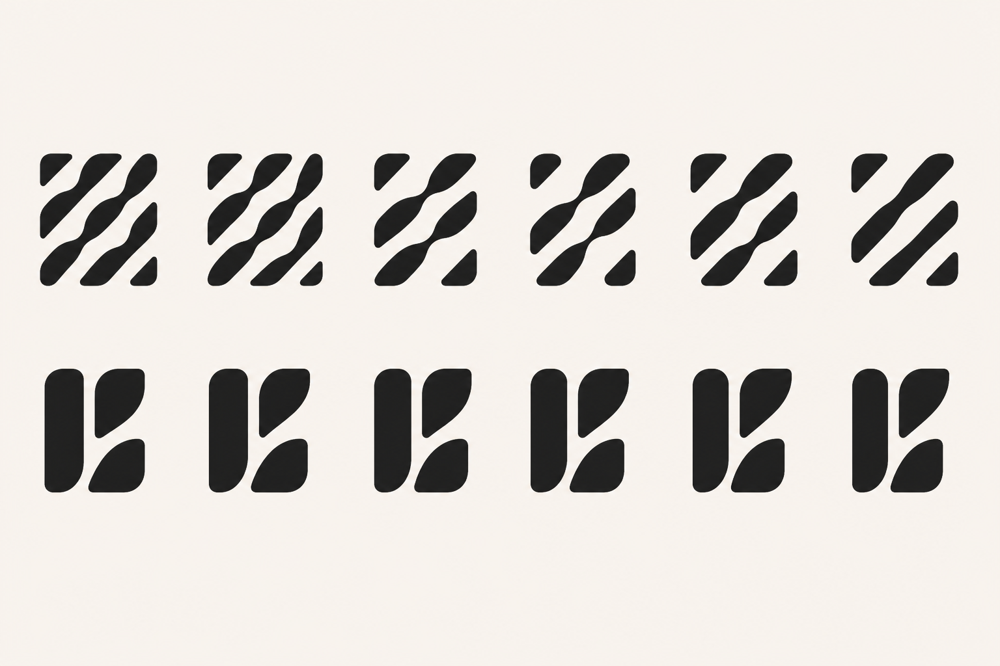
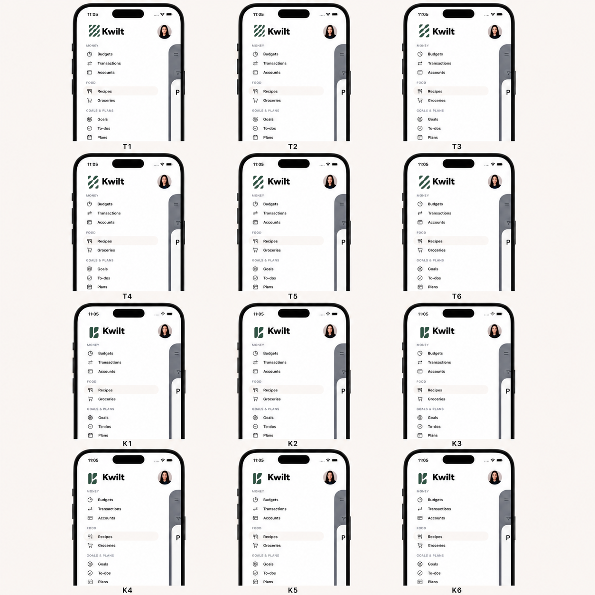

# Kwilt Mark: Thread Path vs. Nested K — Duel Round 01

Status: visual exploration only. No production logo, app icon, or lockup has changed.

This round narrows the Flying Geese exploration to the two directions that retained meaning in the current navigation: the segmented diagonal **Thread Path** and the three-piece **Nested K**. The same pine color, 28-pixel logo slot, wordmark, and navigation context are used throughout.

## Brief A — Thread Path

Create a compact field of diagonal fabric-like bands interrupted by deliberate white channels. The mark should evoke thread repeatedly surfacing and disappearing through cloth, while remaining abstract enough to avoid literal sewing imagery. Use a shared mathematical angle, consistent channel logic, controlled segment lengths, and generous negative space. Preserve some variation in the pieces so the result feels made rather than mechanically striped.

- **T1:** richest interruption rhythm; closest to the original woven/fabric story.
- **T2:** slightly calmer cadence with a clearer central channel.
- **T3:** reduced segment count and more open ground.
- **T4:** strongest single diagonal passage through the middle.
- **T5:** balanced two-band construction with restrained interruptions.
- **T6:** most reductive; clearest at size, but closest to generic diagonal stripes.

## Brief B — Nested K

Construct an implied lowercase or capital `K` from exactly three independent pieces: a stable vertical stem and two leaf-like diagonal pieces that nest toward it. The `K` should be discovered through spacing rather than drawn literally. Use one radius system, aligned terminals, repeatable offsets, and enough open ground that the pieces remain distinct at 16–28 pixels. Keep the forms clipped and geometric enough to avoid a botanical logo.

- **K1:** widest, softest stance; strongest fabric-piece character.
- **K2:** tighter upper nesting and a more active lower leg.
- **K3:** most even balance between legibility and open space.
- **K4:** strongest lower-leg tuck toward the stem.
- **K5:** slightly more upright and typographic.
- **K6:** most compact and direct `K` silhouette.

## Twelve-up geometry board

## Current left-navigation comparison

The image-generation step established one consistent navigation shell. The final comparison then replaces every placeholder with the exact candidate geometry from the twelve-up board, recolored to Kwilt pine and fit into the current 28-pixel logo slot.

The first composite was rejected because its replacement area was too small and allowed pixels from the generated placeholder marks to survive. Version 2 clears the complete placeholder region before inserting only the exact candidate geometry.

## Initial read

- **Thread Path:** T2 is the strongest balance of story, rhythm, and air. T1 preserves the most textile meaning but approaches the density limit. T4 is the best more-reductive alternative. T6 scales cleanly but gives away too much distinctiveness and begins to read as a generic striped monogram.
- **Nested K:** K3 is the strongest overall construction. K4 best tests the requested tighter lower-leg nesting. K6 is the quickest `K` read, but its compactness makes it feel more conventional and less like assembled quilt pieces.
- The Thread Path owns the richer Kwilt story. The Nested K owns faster recognition. Neither should be selected from the large board alone; the navigation comparison is the more useful gate.

## Recommended next gate

Advance **T2, T4, K3, and K4** to exact vector construction. Define each from a shared grid and radius system, then test the unmodified geometry at 16, 24, 28, 32, and 64 pixels in monochrome. The next round should compare optical corrections—not new silhouettes—and include app icon, favicon, one-color print, and reversed-out tests.
