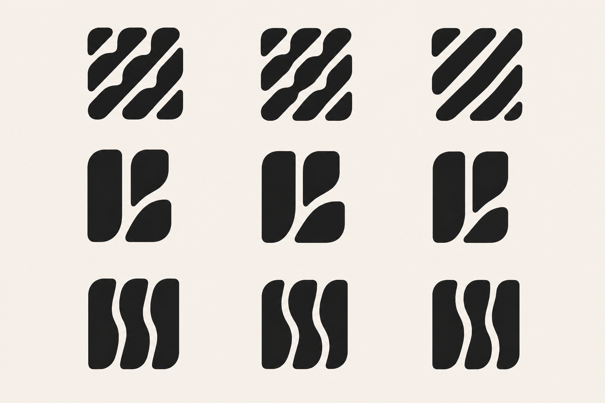
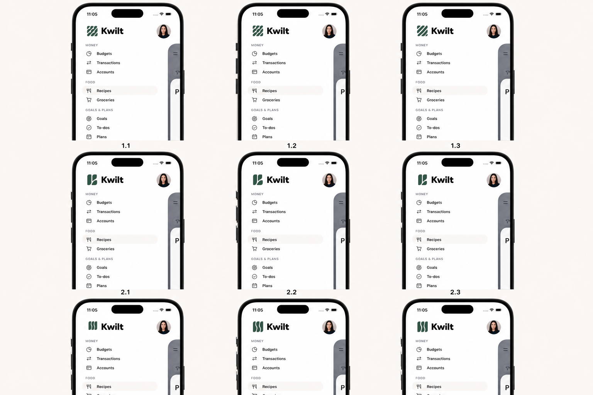

# Flying Geese Finalist Round 01

Status: visual exploration only. No production logo, app icon, or lockup has changed.

This board compares three focused refinements of each lead direction under the same scale, color, spacing, and rendering treatment.

## Current left-navigation comparison

The comparison holds the current navigation contract constant: white canvas, 16-point horizontal padding, 28-point pine-green mark, 8-point lockup gap, 22-point `Kwilt` wordmark, 36-point profile avatar, compact capability rows, and the translated foreground sheet visible at the right edge. The candidate shapes are composited directly from the finalist board so their geometry and piece counts remain unchanged.

## Row 1 — Segmented diagonal quilt

- **1.1 Faithful master:** coordinated channels and staggered seams while preserving the source's governed imperfection.
- **1.2 Rhythmic master:** more visible long-short cadence and seam phasing.
- **1.3 Iconic master:** minimum segmentation for small-size survival; this is also the boundary where the mark begins to risk reading as ordinary stripes.

## Row 2 — Nested implied K

- **2.1 Quiet K:** the lower leaf nests gently, keeping the symbol more abstract than alphabetic.
- **2.2 Balanced K:** the lower leg moves inward and its departure angle echoes the upper arm.
- **2.3 Compact K:** the tightest viable nesting and strongest small-icon silhouette without joining the pieces.

Each K is made from exactly three shapes. The letter should be discovered through their relationship rather than drawn as a conventional monogram.

## Row 3 — Woven vertical seams

- **3.1 Parallel cadence:** restrained related S-curves and the calmest complete block.
- **3.2 Woven exchange:** stronger controlled swelling through the center piece.
- **3.3 Human precision:** one more visible phase difference produces a deliberately imperfect rhythm.

## Next gate

Choose one candidate from each row. Reconstruct those three as exact vectors, then compare their monochrome renderings at 16, 24, 32, and 64 pixels. Mathematical precision at that stage should formalize the relationships seen here without erasing their organic tension.
