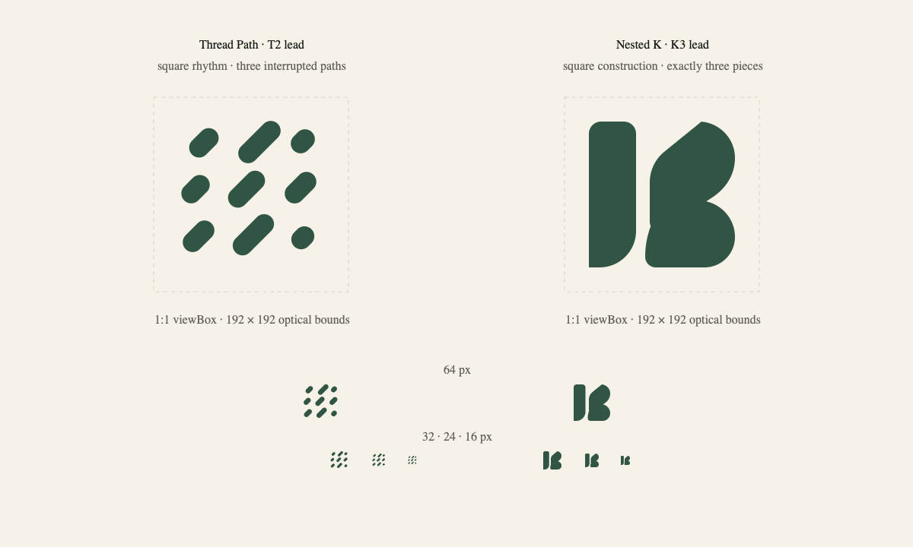

# Kwilt Mark: Square Leads — Round 01

Status: visual exploration only. No production logo, app icon, or lockup has changed.

This round selects one lead from each surviving pattern and rebuilds both as native 1:1 marks:

- **Thread Path lead:** derived from T2, selected for the strongest balance of textile meaning, interruption rhythm, and whitespace.
- **Nested K lead:** derived from K3, selected for the clearest balance between a discoverable `K`, three-piece construction, and open space.

Both assets use a `256 × 256` square viewBox and are intended to carry equal visual weight in the same icon slot. This is a geometric reconstruction, not a crop or a tall mark centered inside a square canvas.

## Square comparison

## Thread Path construction

- Nine contained pieces form three repeated paths.
- Every piece shares a 45-degree axis, 26-unit thickness, and fully rounded terminal system.
- The arrangement occupies a square optical field without clipped or accidental edge fragments.
- Controlled length variation preserves the thread surfacing/disappearing idea while a regular three-by-three cadence gives the mark mathematical structure.

Vector asset: [`thread-path-lead.svg`](marks/thread-path-lead.svg)

## Nested K construction

- Exactly three independent pieces occupy a `192 × 192` optical square.
- The left stem is stable and vertical; the two right pieces imply the upper and lower arms of a `K` through their nesting and central pinch.
- The outer corners, overall height, and overall width share one square boundary.
- The negative passage remains open rather than drawing a literal letterform.

Vector asset: [`nested-k-lead.svg`](marks/nested-k-lead.svg)

## Small-size read

The comparison board renders the unmodified square geometry at 64, 32, 24, and 16 pixels. At the smallest sizes, Nested K remains the faster symbol; Thread Path retains more pattern and fabric meaning but becomes texture sooner. Any later small-size optimization should be an explicitly named responsive-logo variant rather than silently changing the master geometry.

## Next gate

Compare these two exact SVGs in the current Kwilt lockup and app-icon field. Judge silhouette, spacing against the wordmark, and recognition at a real 28-pixel navigation slot before making further shape changes.
