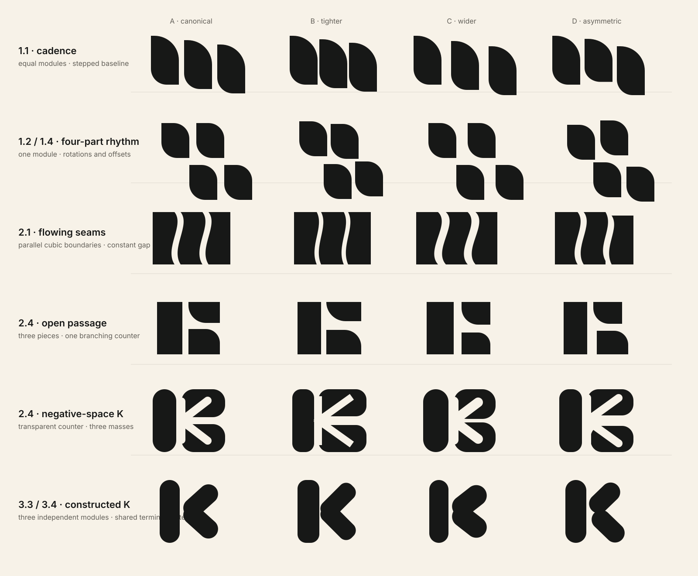

# Flying Geese Precision Round 01

Status: rejected deterministic vector exploration. No production brand asset changed.

This round was rejected because its primitive construction removed the character of the selected raster concepts. It is retained only as process evidence. See [Character-Preserving Round 01](../character-preserving-round-01/README.md) for the corrected approach.

## Selection input

- Andrew selected 1.1 for its vertical rhythm and module shape.
- Andrew selected the closely related 1.2 and 1.4 for geometric cleanup.
- Blaire and Olive selected 2.1 and 2.4.
- Andrew and Blaire identified a possible negative-space `K` inside 2.4.
- Andrew identified 3.3 and 3.4 as a possible construction language for a rough `K`.

## Method

This round does not use generated raster geometry. Every mark is constructed in SVG from repeatable paths, exact rotations, shared radii, controlled gaps, and explicit cubic boundaries.

Each row contains four proportional tests:

- **A — canonical:** balanced starting construction.
- **B — tighter:** reduced gaps or amplitude for a denser stamp.
- **C — wider:** increased breathing room or curvature.
- **D — asymmetric:** one controlled departure for distinctiveness.

A [PNG review proof](boards/precision-families-24.png) is included for renderers that do not display SVG.

## Six lanes

1. **1.1 cadence** — one exact module repeated three times on a measured descending baseline.
2. **1.2 / 1.4 four-part rhythm** — one module reused through exact rotation and offset.
3. **2.1 flowing seams** — cubic boundaries repeated at a constant horizontal gap.
4. **2.4 open passage** — three masses produce one branching counter without forcing a letter.
5. **2.4 negative-space K** — a true transparent `K` counter is subtracted from three surrounding masses.
6. **3.3 / 3.4 constructed K** — three independent rounded modules create a positive `K` silhouette.

## Review questions

- Does 1.1 feel like calm shared cadence or a row of leaves/books?
- Does the four-part family feel related and alive, or merely tiled?
- Does 2.1's seam carry enough identity without suggesting fabric waves or an `S`?
- Is 2.4 stronger before the `K` becomes explicit?
- Does the negative-space `K` reveal itself pleasantly, or feel engineered?
- Can the constructed `K` remain a symbol first and a letter second?

## Next gate

Choose at most one or two lanes. The next round should isolate their exact geometry into individual SVGs, normalize visible bounds, and produce true 16, 24, 32, and 64 pixel raster comparisons. Color and app-icon mockups remain downstream.
