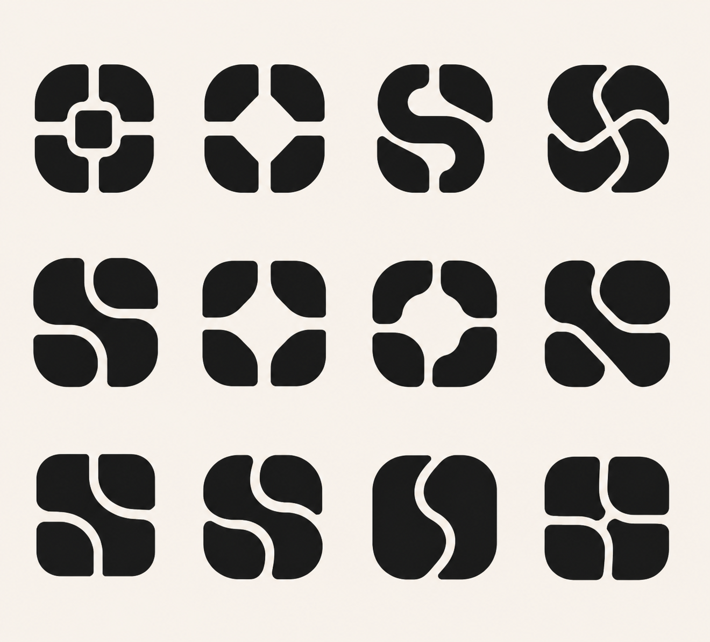
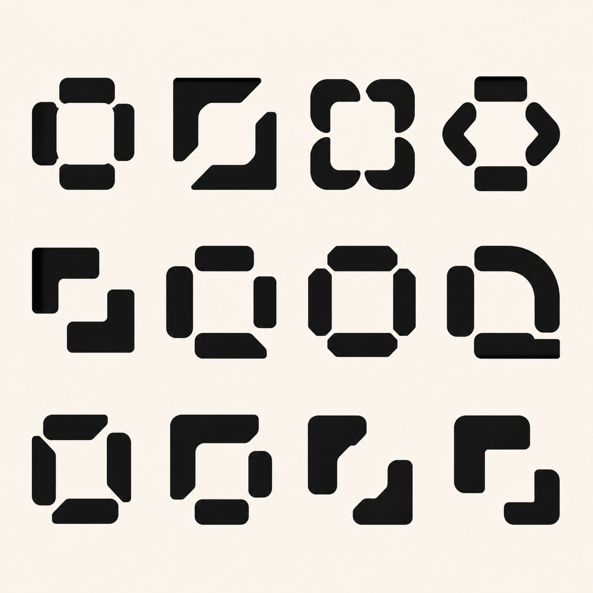
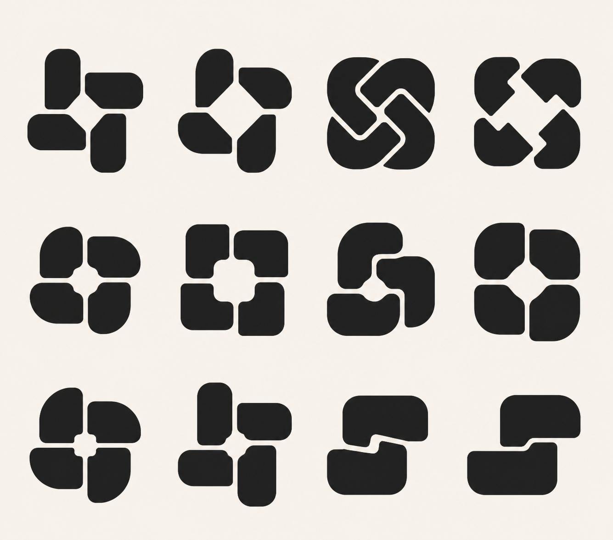

# Kwilt Mark Quilt-Source Round

Status: visual source study only. No production logo, app icon, or lockup has changed.

## Why this round exists

The prior exploration began with abstract brand ideas: gathering, joining, and weaving. This round begins with the construction grammar of historical quilt blocks. It does not trace a finished quilt or reproduce a maker's composition. Instead, it extracts a small set of operations that can survive as a one-color mark: rotate one unit, alternate light and dark, wrap a center, and imply an over-under order.

The target remains a calm, memorable Kwilt symbol that works at 16, 24, 32, 64, and 1024 pixels.

## Source guardrails

- Study traditional and historical pattern structures, with preference for museum collections and public-domain source images.
- Credit named makers and collections when a specific quilt is discussed.
- Do not extract or imitate the distinctive composition of a living or recently active artist.
- Translate construction rules rather than fabric, color, irregularities, or a complete quilt layout.
- Keep the final mark to two to four broad forms, one open spatial idea, and generous counters.
- Reject any result that reads primarily as a camera aperture, loading spinner, flower, sparkle, chain, sports emblem, or decorative craft-store mark.

## What the picture study revealed

### Curved quarter-blocks

Drunkard's Path uses a repeatable concave-and-convex quarter-circle unit. Rotation alone can create a circle, an S-curve, a chain, or an open four-part figure. This is the strongest bridge from The Gather to The Weave because it can feel modular at first glance and continuous on closer inspection.

### Bands around a center

Log Cabin and Courthouse Steps blocks build outward from a center with bands or strips. The full construction is too dense for a logo, but a single round can express a protected, trusted center without becoming a literal house.

### Overlapping folded pieces

Card Trick creates an over-under illusion from a small set of angular pieces. The traditional block contains too many triangles and sharp points for Kwilt; retaining only the passing order and four broad folded tabs creates a simpler, more human successor to The Weave.

## Direction A: Turning Path

### Brief

Create a compact Kwilt mark from the rotational logic of Drunkard's Path. Use four quarter-turn modules or two continuous curved paths to form one quiet, complete figure with a generous open center. The symbol should reveal two readings: four pieces gathered into relation, then a soft path moving through them. Curves must be broad and settled, not pinwheel-like or kinetic.

### Invariants

- Four quarter-turn reads or two continuous curved paths.
- One central opening that survives at 16 pixels.
- A compact near-square silhouette.
- No more than four pieces and no hairline channels.
- Calm rotational balance, not visible spinning.

### Twelve controlled variants

1. Four detached quarter-circle modules with a rounded-square center.
2. Four detached modules with a diamond center and wider channels.
3. Two opposing S-curves that imply four quilt units.
4. Two continuous paths with one restrained over-under crossing.
5. Four modules paired into two visible paths without touching at the center.
6. A squarer exterior with softened quarter-circle interior seams.
7. A rounder exterior with short, broad inward turns.
8. One open diagonal path passing through four balanced lobes.
9. Reduced rotational energy with flatter outer sides and a stable base.
10. A deliberate asymmetry in one turn to create an ownable silhouette.
11. A compact stamp version using only two forms and three large channels.
12. The most reductive version: four-part read at first glance, one quiet path on closer inspection.

## Direction B: Held Center

### Brief

Reduce Log Cabin and Courthouse Steps construction to a single architectural gesture: broad pieces gather around and protect an open center. Use two L-shaped bands or four short bars, not nested concentric strips. The mark should feel like a dependable place made from joined parts, with enough softness to remain human and enough openness to avoid a software tile or literal house.

### Invariants

- One unmistakable open center.
- One construction round only; no nested rings.
- Two or four broad pieces.
- Balanced horizontal and vertical weight.
- No literal roof, door, grid, or frame.

### Twelve controlled variants

1. Four broad bars around a rounded-square center with alternating lengths.
2. Two opposing L-shaped bands with open diagonal seams.
3. Four softened corner bands with a larger central counter.
4. A diamond-oriented center held by four orthogonal pieces.
5. Two offset Courthouse Steps forms that nearly meet but remain open.
6. Four unequal bands optically balanced around a quiet center.
7. A squarer stamp silhouette with restrained rounding.
8. A rounder silhouette with one flat resting edge.
9. A single implied seam order moving clockwise around the center.
10. One dominant band and three quieter supporting pieces.
11. Two forms only, each holding two sides of the center.
12. The most reductive version: one held center, two pieces, two generous seams.

## Direction C: Folded Hand

### Brief

Translate Card Trick's passing order into four broad, rounded folded tabs. Preserve the satisfaction of pieces visibly taking turns over and under, but remove its small triangles, sharp card points, and optical puzzle density. The result should feel cooperative and handcrafted without becoming a knot, clasp, or literal hand.

### Invariants

- A readable four-part passing order.
- Broad rounded tabs rather than thin ribbons.
- A simple central counter with no tiny triangular gaps.
- Two or four forms total.
- One-color silhouette must carry the entire idea.

### Twelve controlled variants

1. Four rounded folded tabs with one clear alternating passing order.
2. Four tabs with a larger diamond center and shorter overlaps.
3. Two continuous folded paths that create four visible ends.
4. Four detached tabs whose notches imply over-under order.
5. A softer exterior with flatter, simpler central folds.
6. A squarer exterior with rounded internal terminals.
7. One dominant fold and three implied passes.
8. Two opposing tabs visibly paired into one path each.
9. A minimal central opening with very wide survival channels.
10. A controlled asymmetry that breaks generic knot symmetry.
11. A compact two-form stamp with only two interruptions.
12. The most reductive version: four turns, two forms, one unmistakable pass.

## Patterns intentionally not advanced

- **Stars and pinwheels:** too easily read as achievement, sparkle, or motion.
- **Flying Geese:** directional and arrow-like rather than calm and encompassing.
- **Nine Patch and checkerboards:** scalable, but too generic and software-grid adjacent.
- **Double Wedding Ring and Pineapple:** culturally rich but structurally too intricate for the stated problem.
- **Orange Peel as a primary direction:** the curved aperture is elegant, but quickly becomes a flower, lens, or camera aperture. Its curve logic can still inform Turning Path.

## Generated study boards

Variants are read left to right, top to bottom. These PNGs are ideation boards, not production vector assets.

### Turning Path

### Held Center

### Folded Hand

## Findings after generation

- **Turning Path creates the most useful new territory.** Its strongest candidates make the negative seam—not a knot—the memorable idea. Advance row 2, column 1 and row 3, columns 1–2 for exact geometry studies.
- **Held Center is structurally sound but visually generic.** Most variants become brackets, frames, or software tiles. Keep it as supporting brand grammar rather than the primary logo direction.
- **Folded Hand validates the earlier selection.** Its better variants naturally return to The Gather or The Weave, while the more novel versions become knots or disconnected tiles. It is evidence that the selected pair already captured the useful part of Card Trick's passing logic.

## Picture-study references

- [The Met: Log Cabin, Straight Furrow variation, ca. 1875](https://www.metmuseum.org/art/collection/search/13901) — public-domain example of square Log Cabin units arranged through alternating direction.
- [International Quilt Museum: Drunkard's Path, 1880–1920](https://www.internationalquiltmuseum.org/quilt/20220010318) — historical curved-piecing reference.
- [The Met: Pictorial Quilt with Reel or Orange Peel blocks, 1832](https://www.metmuseum.org/art/collection/search/717944) — public-domain example used to evaluate the curved aperture family.
- [Create Whimsy: Card Trick block construction](https://createwhimsy.com/projects/how-to-make-the-card-trick-quilt-pattern/) — visual reference for the over-under block logic, not a composition copied into the marks.

## Evaluation order

1. Test every candidate as a black 16-pixel raster before discussing symbolism.
2. Reject candidates whose center or passing order closes up.
3. Compare the survivors for one-glance recall and brand ownership.
4. Redraw only the finalists as exact SVG geometry.
5. Test the same geometry in app icon, favicon, header lockup, assistant mark, monochrome, and reversed contexts.
