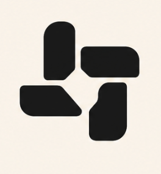
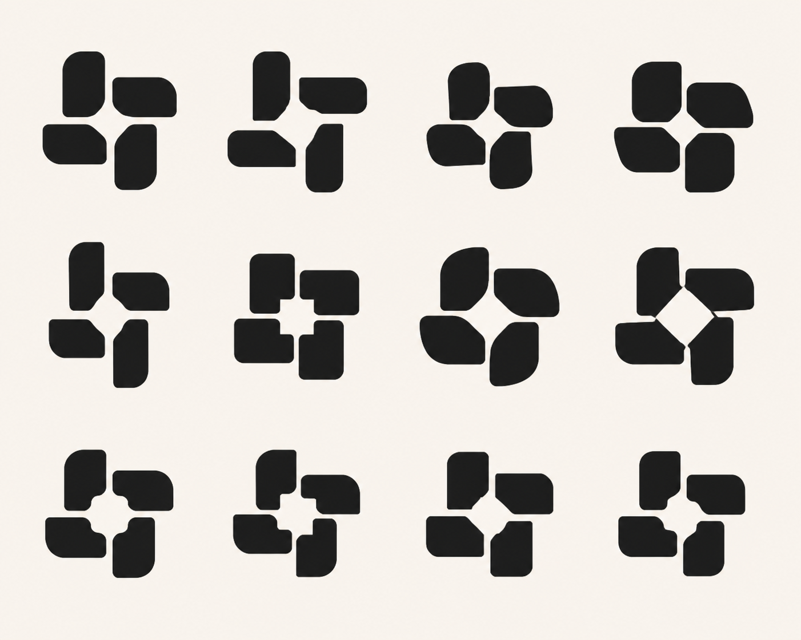
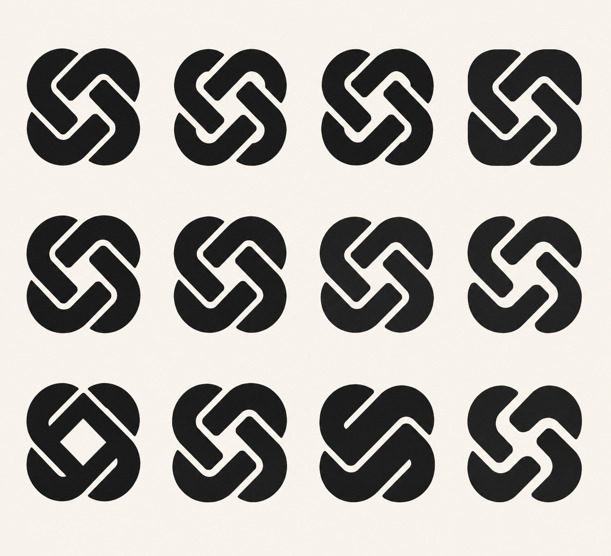
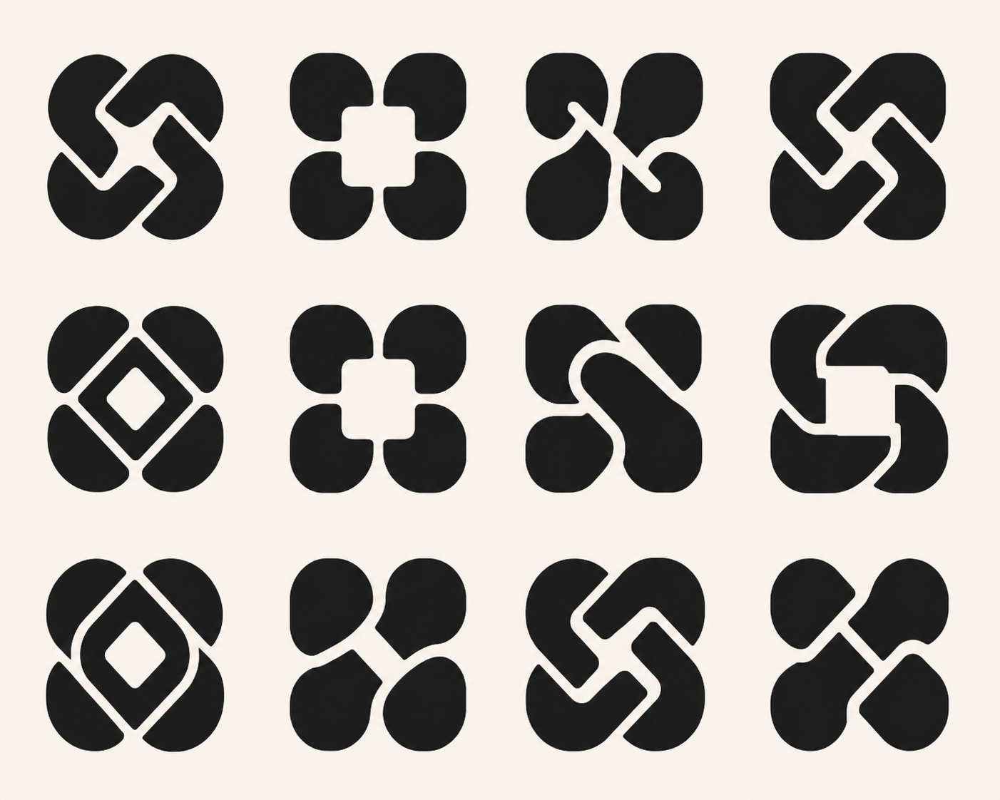

# Kwilt Mark Refinement Round 01

Status: visual selection study only. No production logo assets have changed.

## Selected starting points

Andrew selected two marks from the first Four Fold board:

- **The Gather** — four separate rounded modules gathered around an open center.
- **The Weave** — two continuous broad forms interlocked into a complete four-lobed symbol.

## Shared refinement objective

Preserve the centered, complete, rotational character Andrew preferred while improving ownability, optical balance, and 16-pixel survival.

Shared rules:

- One-color geometry first: near-black on warm ivory.
- A compact, nearly square silhouette with no exterior container.
- Broad filled forms and open negative space; no fine detail.
- Calm and settled rather than spinning or energetic.
- The same final geometry must work at 16, 24, 32, 64, and 1024 pixels.
- Avoid camera aperture, loading spinner, recycling, generic chain, six-lobed AI knot, flower, sparkle, pinwheel toy, and literal quilt imagery.
- Generated boards are prompts for exact vector reconstruction, not production masters.

## Generated refinement boards

Variants are read left to right, top to bottom.

### The Gather refinements

### The Weave refinements

### Gathered Weave hybrids

The first hybrid generation was rejected because it collapsed into generic detached corner tiles and did not retain visible woven continuity. Only the corrected hybrid board is preserved here.

## Family A: The Gather

### Invariants

- Exactly four separate modules.
- A stable 90-degree rotational relationship.
- One open center and four visible channels.
- No module touches another.
- The pieces feel gathered, not scattered.

### Twelve controlled variants

1. Faithful optical cleanup of the selected mark with equalized mass and gaps.
2. Larger central opening and wider channels for maximum 16-pixel clarity.
3. Smaller central opening with a denser, stamp-like silhouette.
4. Wider modules with shorter reach and calmer rotation.
5. Narrower modules with more surrounding air.
6. Squarer outer silhouette with restrained corner rounding.
7. Softer outer silhouette with one rounded outside corner per module.
8. Diamond-shaped central counter created by diagonal inner cuts.
9. Rounded-square central counter created by softened inner cuts.
10. Alternating inner notches that quietly imply over-under order without connecting pieces.
11. Reduced rotational energy through more orthogonal terminals and a stable base.
12. Subtle controlled asymmetry in one module and center, creating an ownable silhouette.

### Generation brief

Create exactly twelve refined variants of the supplied Gather reference in a clean 4-column by 3-row professional logo study board. Preserve exactly four separate broad rounded modules around one open center, a compact near-square silhouette, and the selected mark's gathered rotational relationship. Do not merge or connect the four modules. Apply the twelve controlled variations above in reading order. Improve optical balance, normalize gaps, and make every mark plausible at 16 pixels. Use solid near-black filled geometry on perfectly flat warm ivory `#F7F2E8`, equal optical sizing, crisp vector-like edges, and generous clearspace. No text, labels, numbers, grid lines, icon frames, shadows, gradients, texture, mockups, camera apertures, loading spinners, recycling marks, flowers, stars, playful pinwheels, Celtic knots, sewing tools, or literal quilt imagery.

## Family B: The Weave

### Invariants

- Two continuous broad forms create the complete symbol.
- Alternating over-under order remains visible.
- The four-lobed silhouette stays centered and nearly square.
- Negative channels never become hairlines.
- The result feels woven, not chained or locked.

### Twelve controlled variants

1. Faithful optical cleanup of the selected mark with smoother curves and balanced lobes.
2. Wider negative channels everywhere for maximum small-size survival.
3. Larger central opening while preserving two continuous paths.
4. Flatter outer sides and a squarer overall silhouette.
5. Rounder outer lobes with less pinching at the crossings.
6. Equalized four-lobe mass and symmetric crossing widths.
7. Slight diagonal asymmetry that prevents a generic perfect knot.
8. Shorter inward hooks so the center breathes more freely.
9. Stronger central diamond counter with simpler outer curves.
10. One dominant crossing and one quieter implied underpass.
11. Compact, bold stamp version with the fewest direction changes.
12. Most reductive interpretation: two broad continuous forms, two interruptions, one unmistakable woven whole.

### Generation brief

Create exactly twelve refined variants of the supplied Weave reference in a clean 4-column by 3-row professional logo study board. Preserve two continuous broad interlocking forms, alternating over-under order, a centered four-lobed near-square silhouette, and the selected mark's complete woven character. Apply the twelve controlled variations above in reading order. Widen fragile channels, correct optical mass, and make every mark plausible at 16 pixels without becoming a generic chain or six-lobed AI knot. Use solid near-black filled geometry on perfectly flat warm ivory `#F7F2E8`, equal optical sizing, crisp vector-like edges, and generous clearspace. No text, labels, numbers, grid lines, icon frames, shadows, gradients, texture, mockups, infinity symbols, chain links, locks, six-lobed knots, flowers, sparkles, sewing tools, or literal quilt imagery.

## Family C: Gathered Weave Hybrid

### Invariants

- Keep The Gather's open center, four-part rhythm, and small-size clarity.
- Introduce The Weave's visible continuity or alternating passing order.
- Use two or four broad forms only.
- Preserve a complete, centered near-square silhouette.
- Do not recreate the dense original Kwilt weave.

### Twelve controlled variants

1. Four Gather modules with alternating over-under notches at the inner corners.
2. Four modules visually paired into two implied continuous paths.
3. Two continuous paths interrupted by Gather-like open corner channels.
4. The Weave with a substantially enlarged Gather-style central opening.
5. The Gather with two restrained bridges on opposing sides.
6. Two broad bent paths forming four separate-looking lobes without losing continuity.
7. Four modules with one clear crossing and three implied relational seams.
8. Squared outer silhouette, open center, and two alternating diagonal channels.
9. Rounder outer silhouette with a diamond center and modular rhythm.
10. Deliberately asymmetric hybrid with one dominant join and generous air.
11. Compact stamp hybrid using only two forms and four large openings.
12. Most reductive hybrid: four-part read at first glance, two-path weave on closer inspection.

### Generation brief

Create exactly twelve refined hybrid variants using both supplied references in a clean 4-column by 3-row professional logo study board. Combine The Gather's four-part rhythm, open center, generous channels, and tiny-scale clarity with The Weave's two-path continuity and alternating over-under logic. Apply the twelve controlled variations above in reading order. Use only two or four broad filled forms, retain a complete centered near-square silhouette, and ensure every mark remains plausible at 16 pixels. The results must be simpler and more open than the current Kwilt logo. Use solid near-black geometry on perfectly flat warm ivory `#F7F2E8`, equal optical sizing, crisp vector-like edges, and generous clearspace. No text, labels, numbers, grid lines, icon frames, shadows, gradients, texture, mockups, camera apertures, loading spinners, chain links, infinity symbols, six-lobed AI knots, flowers, sparkles, sewing tools, or literal quilt imagery.
