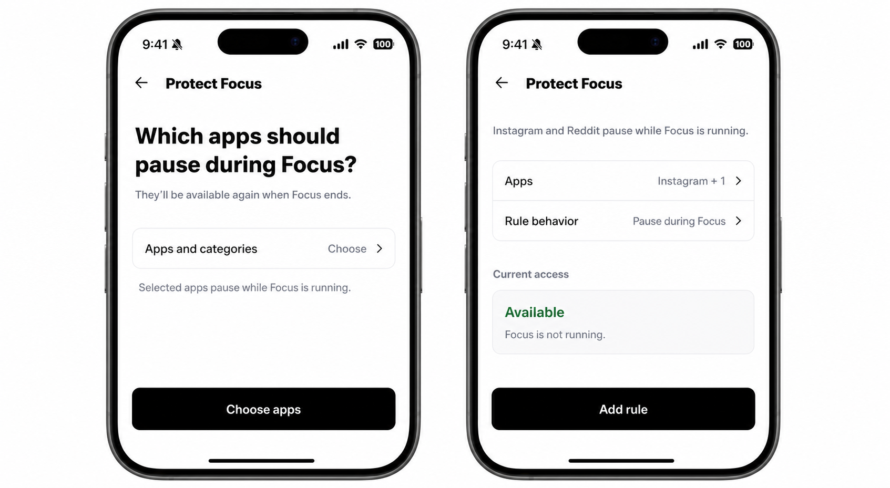
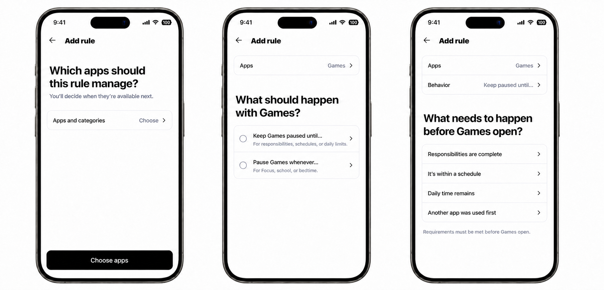
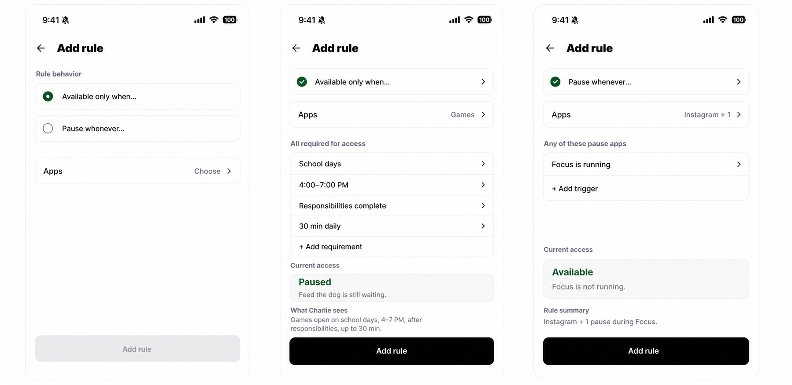

# Structured Screen Time Rule Builder Contract

## Decision

Replace the inline Mad-Libs editor with a structured, full-screen guided rule
builder after the established initial Screen Time setup pattern. Each step uses
the intent and scope the person already established, asks one unresolved
question, then preserves the answer as a quiet editable summary. A complete
sentence is the final receipt before save.

This supersedes the authoring direction in `06-sentence-builder-reduction.md`.
The grouped rule inventory remains the chosen information architecture.

The full family model distinguishes two consequential rule modes:

1. **Set when apps are available** — the selected apps begin unavailable and
   become available only when **every** selected requirement is satisfied.
2. **Pause apps at certain times** — the selected apps begin available and
   pause when **any** selected trigger applies.

`Available` is not an enabled/disabled toggle. It selects the rule's baseline
and evaluation semantics. The builder never asks the parent to choose `AND` or
`OR`; those operators are invariants of the selected mode.

Temporary **Allow until…** and **Pause until…** actions remain overrides. They
do not appear as rule modes and do not mutate the standing agreement.

## Why this model

The sentence-only prototype is pleasantly compact for two blanks, but the
representative family cases need schedules, responsibilities, usage allowances,
and prerequisite app activity. Making each phrase editable inside prose would
hide structure, wrap unpredictably, and become hard to navigate with VoiceOver
or large text. A generic `IF / AND / OR / THEN` builder would expose internal
logic that parents should not have to program.

The chosen composition keeps ordinary language without making prose carry the
interaction:

### Shipping personal slice

The current personal implementation deliberately exposes only the two rule
types already supported by runtime persistence: Focus and real-step. It does not
show the full future condition matrix or a speculative current-state receipt.

- **Settings > My rules > Add rule** already knows the subject is Me. It asks
  which apps to manage, then asks what should happen with those apps.
- **Contextual Focus setup** already knows the subject, behavior, and Focus
  condition. It asks only which apps should pause, then shows the rule sentence.
- **Contextual real-step setup** likewise asks only which apps should wait,
  then shows the rule sentence.
- Previous answers remain visible as compact editable summaries. The flow
  never asks the person to restate context supplied by the entry point.
- The large app-selection answer opens the Apple picker. The picker's **Done** action confirms a
  valid selection and advances directly to the next unresolved question. Cancel
  or an empty selection stays on the apps question; there is no redundant
  **Continue** action on this step.
- The flow reuses the initial Screen Time setup's full-screen pine surface,
  progress rail, close affordance, `titleMd` prompt hierarchy, inverse touch
  surfaces, and final inverse commit action. Choice cards use `titleSm` labels;
  supporting copy uses `body` or `bodySm`.





The larger family administration contract below remains the expansion model,
not a claim about the first personal slice.



```text
Add rule

RULE TYPE
(o) Set when apps are available
    Apps stay paused until every requirement is met.
( ) Pause apps at certain times
    Apps pause when any selected reason applies.

APPLIES TO
Apps and categories                       Games  >

AVAILABLE WHEN ALL ARE TRUE
[x] On school days                         >
[x] Between 4:00 PM and 7:00 PM            >
[x] Today's responsibilities are complete  >
[x] Daily allowance                    30 min  >
[ ] A prerequisite app has been used        >

AGREEMENT
Games are available to Charlie on school days from 4–7 PM,
after today's responsibilities are complete, for up to 30 minutes.

RIGHT NOW
Paused
Feed the dog is still waiting.

                                      [ Add rule ]
```

The pause variant retains the same anatomy and changes only the mode copy,
compatible choices, connector heading, sentence template, and evaluation.

## Representative coverage

| Administration need | Mode | Builder representation | Evaluation |
| --- | --- | --- | --- |
| Protect distracting apps during Focus | Pause | `Focus is running` | Pause while the trigger is active |
| Require one meaningful action first | Available | `A real step is complete today` | Available after the requirement passes |
| Games only after responsibilities | Available | `Today's responsibilities are complete` | Available after completion |
| Games on school days, 4–7 PM, for 30 minutes | Available | schedule plus allowance | Every requirement must pass |
| Games after 15 minutes in a learning app | Available | prerequisite app plus threshold | Available after recorded foreground use passes |
| Social apps during school hours or bedtime | Pause | school-hours plus bedtime triggers | Either trigger pauses the selection |
| Pause immediately until dinner | Temporary override | `Pause until…` outside builder | Expiring block claim |
| Allow 20 minutes after a request | Temporary override | `Allow until…` outside builder | Expiring exception, subject to other claims |

The model intentionally does not support mixed arbitrary groups such as
`(A AND B) OR (C AND D)`. If a future use case truly requires that expression,
it should be introduced as a named, owner-defined condition shape with a plain
explanation—not as exposed boolean syntax.

## UI contract

Job: Set a durable, understandable agreement for when selected apps should be
available or paused, then accurately predict what will happen now.

Authority chain: parent/caregiver authority and signed-device state -> accepted
Screen Time control-plane contracts -> Kwilt Settings and picker components ->
iOS Family Controls behavior -> platform accessibility conventions.

Three-second read: who the rule is for, whether it grants conditional access or
adds pause times, which apps it affects, and the resulting state right now.

Primary action: **Add rule** for a new draft or **Save changes** when editing.

Primary information: rule type, target selection, selected requirements or
triggers, agreement sentence, and current-state result.

Secondary information: delivery state, other rules that still restrict the same
apps, and condition-owner detail.

Reveal later: Apple app/category inventory; schedule, allowance, prerequisite,
and responsibility configuration; temporary override duration; technical device
recovery.

Scan order for the shipping personal slice: progress/close -> current unanswered
question -> large touch choices or receipt -> quiet editable answers -> final
commit action. The expanded family model adds
criteria, agreement, and current-state sections when those owners exist.

Must not add: generic wizard instructions or repeated context, editable sentence fragments, AND/OR controls, rule name,
priority, scoring, surveillance history, a global availability toggle, or an
override duration inside a standing rule.

Reuse map:

- guided shell: the initial Screen Time setup's full-screen pine surface,
  progress rail, close affordance, and inverse action hierarchy;
- app/category target: the existing Apple Family Activity picker bridge;
- bounded field values: `PickerFieldTrigger` and `SmallSetPickerField`;
- configured-condition detail: standard `BottomDrawer` header and mechanics;
- primary commit: `Button`;
- inventory, enabled state, and disclosure: existing Screen Time rule rows;
- two rule-mode choices: large accessible touch cards that state the consequence
  and advance directly when selected.

Nearest precedent: the initial Screen Time full-screen setup plus the existing
Screen Time Settings inventory and Apple selection flow.

External exemplar ledger: research informed the rejection of free-form policy
authoring and inline compound prose; no external visual is copied.

Behavior sources: the two rule modes and their fixed connector semantics are
explicit product decisions. Family criteria, temporary overrides, versioned
delivery receipts, and overlapping-claim behavior come from the existing Screen
Time control-plane and family briefs.

Unresolved decisions: which responsibility collection is eligible for a child's
`today` requirement, and whether school hours come from a stored family schedule
or a named preset. These block those individual condition adapters, not the
builder foundation.

Required states: create and edit; either mode selected; no target; no criteria;
invalid criterion; complete draft; current state available; current state
paused; current state unknown; another rule still blocking; Apple picker
cancelled; save pending; saved locally; family applying; family applied; family
delivery failed; permission revoked; duplicate detected; unsaved-change exit;
VoiceOver; largest Dynamic Type; smallest supported phone; Reduce Motion.

Proof path: Settings -> Screen Time -> scoped **Add rule** -> construct one rule
of each mode -> inspect agreement and Right now -> save -> reopen from inventory.
Use Simulator for layout, semantics, and local evaluation. Use a signed parent
and child device for Apple selection, enforcement, overlap, override, and family
delivery claims.

## Screen behavior

### Entry and scope

- **Add rule** under My rules opens the builder with subject `Me` fixed.
- **Add rule** under Household rules opens child selection only when more than
  one eligible child exists. With one child, it opens that child's builder.
- Contextual entry points may suggest a mode and one criterion, but the draft is
  visible and editable and nothing is saved automatically.
- Money-backed rules continue to be created in Money because Money owns their
  category and threshold semantics. Opening them from Screen Time routes to the
  Money editor; their inventory projection still uses the shared mode language.

### Rule type

Show the two choices as full labeled touch cards, not as a switch, compact
segmented control, or settings radio list. Each card needs its consequence
visible before selection and advances when tapped.

- **Set when apps are available**
  `Apps stay paused until every requirement is met.`
- **Pause apps at certain times**
  `Apps are normally available and pause when any selected reason applies.`

For a new draft, a contextual suggestion may be preselected. A neutral entry
requires a deliberate selection. Saving creates an active rule.

Changing type while creating clears incompatible criteria after a confirmation
when the draft contains any. Editing an existing rule shows **Change rule type**
as a separate destructive-of-configuration action; confirming creates a
replacement draft while retaining subject and target. It never behaves like an
ordinary On/Off switch.

The saved rule's direct On/Off control remains in its inventory/detail surface.
Turning it off preserves its configuration. This is distinct from its mode.

### Criteria

Mode controls which condition definitions are eligible:

```ts
type ScreenTimeRuleMode = 'available_when' | 'pause_when';

type ScreenTimeConditionDefinition = {
  id: ScreenTimeConditionType;
  mode: ScreenTimeRuleMode;
  owner: 'personal' | 'focus' | 'activities' | 'money' | 'household';
  title: string;
  summary: (value: ScreenTimeConditionValue) => string;
  configure: 'none' | 'drawer' | 'route';
};
```

The section title carries the fixed connector:

- `AVAILABLE WHEN ALL ARE TRUE`
- `PAUSE WHEN ANY ARE TRUE`

Selecting a condition that needs configuration opens one conventional drawer
or owner route. The builder shows the saved compact value on return. At least one
valid criterion is required. Duplicate condition types are not allowed unless a
future definition explicitly permits instances.

Initial compatible definitions:

| Condition | Mode | Owner | Configuration |
| --- | --- | --- | --- |
| A real step is complete today | Available | Personal/Activities | qualifying action policy, existing default first |
| Today's responsibilities are complete | Available | Household/Activities | selected responsibility collection |
| Within an allowed schedule | Available | Household | weekdays and time range |
| Daily allowance remains | Available | Household | minutes |
| A prerequisite app was used | Available | Household | source selection, threshold, daily reset |
| Focus is running | Pause | Focus | none |
| During school hours | Pause | Household | named schedule/preset |
| During bedtime | Pause | Household | named schedule/preset |
| A Money review is required | Pause | Money | Money-owned category policy; not created here |

### Agreement sentence

The agreement is a read-only receipt, not an input. Each domain owns a small,
deterministic formatter so clause order, prepositions, pluralization, subject
names, and localization remain intentional. Do not concatenate arbitrary labels.

Examples:

- `Instagram and Reddit pause while Focus is running.`
- `Games are available after I complete a real step today.`
- `Games are available to Charlie on school days from 4–7 PM, after today's responsibilities are complete, for up to 30 minutes.`
- `Games pause during school hours or bedtime.`

VoiceOver reads the entire receipt as one static text element. Every form field
also has an independent label, value, hint, and selected state; the sentence is
never the only accessible representation of configuration.

### Right now

The preview is a truthful evaluator receipt, not reassurance copy:

```ts
type ScreenTimeRulePreview =
  | { status: 'incomplete'; explanation: string }
  | { status: 'unknown'; explanation: string }
  | { status: 'available'; explanation: string }
  | { status: 'paused'; explanation: string }
  | {
      status: 'paused_by_other_rule';
      explanation: string;
      blockingRuleIds: string[];
    };
```

For access rules, any unsatisfied requirement pauses the target; the explanation
names the first actionable unsatisfied requirement, with a disclosure path to
all unmet requirements if needed. For pause rules, any active trigger pauses the
target; the explanation names the active trigger. If owner data or device state
is unavailable, show `Can't confirm right now` rather than guessing.

Evaluate the draft first, then compose it with current restriction claims. A
draft may say `This rule would allow Games` while the final receipt says
`Still paused — Bedtime also applies.` This preserves the control-plane rule
that one policy cannot clear another policy's claim.

The preview consumes privacy-bounded summaries. It must not log Apple tokens,
app labels, child names, responsibility titles, category names, or the generated
agreement sentence.

### Commit and delivery

- Disable the primary action until target, mode, and all selected criteria are
  valid. Keep the reason available to accessibility rather than adding a toast.
- Recheck authority, version, and native authorization at commit time.
- Personal save updates the local rule atomically and returns to the inventory.
- Household save writes one desired agreement version. The builder returns to a
  row marked **Applying** until a device receipt confirms that version.
- A failed family receipt shows **Needs attention** and routes to recovery; it
  never rolls the desired agreement back silently.
- Detect an exact semantic duplicate before save and route the user to the
  existing rule instead of creating another.
- Back navigation with a materially changed draft asks whether to discard. A
  merely opened builder or cancelled Apple picker does not trigger the prompt.

### Temporary changes

Temporary actions live on the child/rule management surface:

- **Allow until…** creates a versioned `allow` override with expiry or usage.
- **Pause until…** creates a versioned `block` override with expiry or usage.
- The receipt identifies the temporary action and its end condition.
- Ending an override restores evaluation of standing rules; it does not promise
  availability if Focus, Money, personal, family, or Apple restrictions remain.

## Domain and persistence design

Use one authoring contract and separate owner adapters. Do not create one generic
JSON automation object that replaces current personal, Money, and Household
models.

```ts
type ScreenTimeRuleAuthority =
  | { kind: 'personal'; personId: 'self' }
  | { kind: 'household'; childMembershipId: string };

type ScreenTimeRuleBuilderDraft = {
  schemaVersion: 1;
  authority: ScreenTimeRuleAuthority;
  mode: ScreenTimeRuleMode | null;
  selection: ScreenTimeSelectionDraft | null;
  conditions: ScreenTimeConditionDraft[];
};

type ScreenTimeRuleBuilderAdapter = {
  definitions: (draft: ScreenTimeRuleBuilderDraft) => ScreenTimeConditionDefinition[];
  validate: (draft: ScreenTimeRuleBuilderDraft) => ScreenTimeRuleDraftValidation;
  formatAgreement: (draft: ScreenTimeRuleBuilderDraft) => string | null;
  preview: (
    draft: ScreenTimeRuleBuilderDraft,
    context: ScreenTimeEvaluationContext,
  ) => ScreenTimeRulePreview;
  save: (draft: ScreenTimeRuleBuilderDraft) => Promise<ScreenTimeRuleSaveReceipt>;
};
```

`ScreenTimeRuleBuilderDraft` is transient UI state. Raw Family Controls tokens
remain in the existing selection stores/bridges and are referenced by stable
selection identity. Navigation params carry scope, subject, existing rule ID,
and optional suggestion—not the draft or native tokens.

Add `mode` to the shared `ScreenTimeRule` projection so inventory rows, guides,
and overlap explanations can speak consistently. It is derived for existing
records:

- personal `focus` -> `pause_when`;
- personal `real_step` -> `available_when`;
- Money review policies -> `pause_when`;
- existing family agreements -> `available_when`.

Personal persistence stays typed by `PersonalScreenTimeRuleKind`; Money remains
Money-owned. Family agreement JSON gains a discriminated, normalized schema:

```ts
type FamilyScreenTimeAgreementRuleV2 = {
  schemaVersion: 2;
  mode: ScreenTimeRuleMode;
  conditions: FamilyScreenTimeCondition[];
};
```

The server column already accepts JSON, but both client and server/RPC boundary
must validate the discriminant and condition fields before the V2 writer is
enabled. Existing family learning records normalize into an equivalent
`available_when` draft without changing IDs, versions, or selections. A legacy
reader remains until every supported client version can consume V2.

## Component and file boundaries

Create focused files rather than growing the current account screen:

```text
src/features/screen-time/rule-builder/
  screenTimeRuleBuilderModel.ts       transient types, validation, mode invariants
  screenTimeRuleBuilderCopy.ts        deterministic agreement formatting
  screenTimeRuleBuilderPreview.ts     tri-state evaluation and claim composition
  ScreenTimeRuleBuilderScreen.tsx     route orchestration and one-page composition
  ScreenTimeRuleModeField.tsx         two accessible consequential radio rows
  ScreenTimeConditionList.tsx         eligible choices and configured summaries
  ScreenTimeRuleReceipt.tsx           Agreement and Right now presentation
  personalRuleBuilderAdapter.ts       current personal record conversion and save
  familyRuleBuilderAdapter.ts         V2 family conversion, authority, version save
```

The account overview owns inventory and navigation only. Condition detail UI may
live beside its owner when it is substantial. The shared screen receives an
adapter selected from serialized route scope; it does not import Money business
logic or query every capability directly.

## Accessibility and responsive behavior

- Immediate-advance choice cards use `accessibilityRole="button"`, a concise
  label, and the consequence as hint/text.
- Condition rows expose checked state and configured value. Tapping anywhere in
  the 44-point row selects/configures it.
- Do not force rule type, criteria, or receipt onto one horizontal line.
- At large Dynamic Type, values move below labels and the primary action remains
  in normal scroll flow; no fixed footer may cover fields.
- Cancelling the Apple picker returns focus to the invoking row. Completing a
  valid selection advances focus to the next question; after save, return focus
  to the created inventory row.
- Respect Reduce Motion; state changes use no required animation.
- Color never carries selected, invalid, applying, or blocked meaning alone.
- Child-facing explanations use the same evaluation result as enforcement but a
  child-appropriate formatter; caregiver and child copy must not contradict.

## Delivery slices

### Slice 1: shared semantics and personal replacement

Build the shared model, full-page route, personal adapter, agreement receipt,
and current-state preview. Replace the uncommitted inline editor. This proves
both modes with the existing Focus and real-step rules without a backend change.

### Slice 2: household access agreements

Add typed V2 family agreement normalization and the schedule, allowance,
responsibility, and prerequisite condition adapters. Replace the fixed family
learning editor while preserving device setup, desired/applied versions, and
receipts.

### Slice 3: household pause triggers and temporary actions

Add named school-hours/bedtime pause conditions, then expose direct expiring
Pause/Allow actions through the existing override RPC contract. Verify combined
standing-rule and override claims on signed devices.

Money is not migrated into the shared create route in these slices. Its existing
editor adopts shared mode/receipt projection separately when its category-owned
flow is next revised.

## Acceptance evidence

This is not a comparative UI experiment. Research and product constraints have
already selected the structured builder. Evaluation is verification against the
model:

1. Create and correctly predict a personal Focus pause rule.
2. Create and correctly predict a real-step access rule.
3. Create a child schedule-only access agreement.
4. Create a schedule + responsibilities + daily allowance agreement and verify
   that one unmet requirement keeps the selection paused.
5. Add a prerequisite app threshold and verify daily reset behavior.
6. Create a school-hours + bedtime pause rule and verify either trigger pauses.
7. Apply and expire temporary Pause and Allow actions without changing the
   standing agreement.
8. Overlap two rules and verify that allowing from one never clears the other.
9. Complete the same tasks with VoiceOver and at the largest Dynamic Type size.
10. Compare the caregiver receipt, child explanation, desired policy, device
    receipt, and observed enforcement; record any mismatch as a release blocker.
