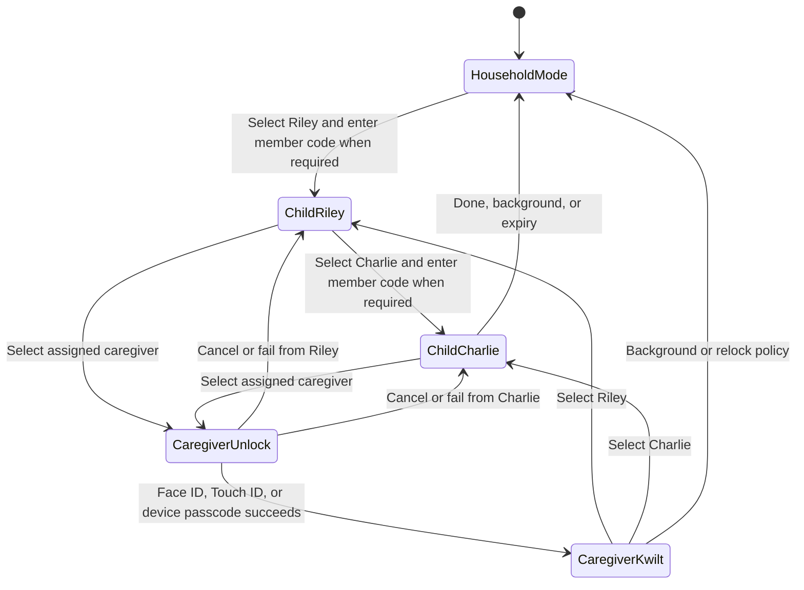

# Converge: Caregiver-anchored Household Mode

## Decision

Choose a **caregiver-anchored restricted Household Mode** with one mode-aware identity control shown in both the capability menu and capability headers where attribution matters.

The shared iPad remains signed into one individually assigned caregiver's real Kwilt account. Household Mode covers that full account with a family-facing experience. It is not a family account, a second household credential, or an operating-system-style collection of full account sessions.

## Identity and transition model

The switcher contains only:

- eligible dependent children in the Household; and
- the one caregiver assigned to this shared device.

A child's household member code identifies the acting child. It is not an account password and grants no caregiver authority. An authorized caregiver creates or resets it under Household settings.

Selecting the assigned caregiver starts fresh local authentication. Face ID, Touch ID, or device-passcode success removes the restricted layer and restores the caregiver's complete ordinary Kwilt account. Cancel or failure leaves the current child context unchanged.

iOS local authentication proves that an enrolled device user authorized the transition; it cannot tell Kwilt which enrolled adult supplied the biometric or passcode. Households needing person-specific adult proof would require account reauthentication rather than device authentication.

## Accepted identity-control treatment

Use one control with two presentations:

- **Capability menu:** the existing avatar becomes the Household Mode member switcher and visibly represents the active child.
- **Chores header:** repeat the active child's avatar and name because checking off work is an attributed action.

Both controls open the same member sheet. In the caregiver's full personal Kwilt, the avatar retains its current profile-and-settings role and can also enter a child context. In Household Mode, it switches among eligible children or offers authenticated caregiver re-entry.

A caregiver viewing another member's chores on a personal device remains a view/management scope. It must not be represented as acting as that child.

## Capability boundary

Household Mode initially exposes only explicit child or household projections:

- **Chores:** the active child's assigned/claimed chores and the shared household pool.
- **Arcs, Goals, and To-dos:** the selected child's own activated personal projections.
- **Recipes:** household-approved/shared recipes and eligible catalog content, never every private caregiver recipe.
- **Meal Plan:** the shared household plan and child-appropriate participation actions.
- **Groceries:** the shared household grocery list and child-appropriate list actions.

Chat, Chapters, Money, and every other capability remain unavailable until each defines a household-safe projection. Household membership alone never reveals another person's private data.

Every capability admitted to Household Mode must declare:

1. board eligibility;
2. exactly which data projection is readable;
3. which actions the selected member may perform;
4. whether an active member is required; and
5. what deactivation, caregiver relock, and device revocation do.

## Entry and relock

The accepted activation paths are:

- a secondary **Set up for your household** path on the signed-out welcome surface;
- **Settings > Household > Household devices** for designating the current iPad; and
- a contextual invitation after adding a dependent or activating a household-facing capability.

These paths assign the current caregiver account to the shared device and enter Household Mode. They do not create a new family login.

The exact timeout remains an implementation decision, but the safety invariant is locked: backgrounding or sufficient inactivity must cover caregiver content before a child can interact again. A dedicated family iPad should launch and return to Household Mode by default.

Apple Guided Access may separately keep the iPad inside Kwilt. Kwilt can teach that optional device setting but does not treat it as identity or household authorization.

## Implementation fit

Kwilt already includes `expo-local-authentication` and a Face ID, Touch ID, and device-passcode flow for Money. Household Mode may generalize that mechanism for caregiver re-entry. The existing iOS Face ID permission explanation names Money specifically and must be broadened truthfully before the same permission is used to protect the full caregiver account.

The implementation must preserve separate facts for:

- authenticated caregiver account;
- assigned shared device;
- Household membership;
- selected acting child;
- capability grant/activation; and
- recorder, performer, approver, and authorizer on consequential events.

## Reductive decisions

- One caregiver account beneath the restricted layer, not a family credential.
- One identity sheet, not separate switchers for every capability.
- Child member codes for attribution; native device authentication for caregiver re-entry.
- Capability-owned projections, not a family dashboard containing the caregiver's whole life.
- No Face ID or Touch ID claim that identifies a particular child or adult.
- No requirement that every dependent profile have a personal device or independent OAuth account.

## Product and release boundary

This document accepts the product model; it does not by itself authorize production use by children below Kwilt's current age boundary. A release serving under-13 children must also complete the parental notice/consent, data minimization, access/deletion, provider, analytics, retention, and policy work required for that audience.

## Bet

We're betting that a caregiver-anchored restricted layer provides enough privacy and authority separation for a trusted family iPad without requiring a new multi-account or device-credential platform. If reliably covering caregiver state proves difficult, revisit the separately enrolled household-terminal model before expanding Household Mode to sensitive capabilities.

## Remaining decisions

- Exact inactivity and background relock timing.
- Whether the neutral Household Mode state remembers the last child or always asks who is using Kwilt.
- Whether children without member codes can be selected directly.
- Whether the first Chores learning release contains the real caregiver lock or an internal simulated switcher.
