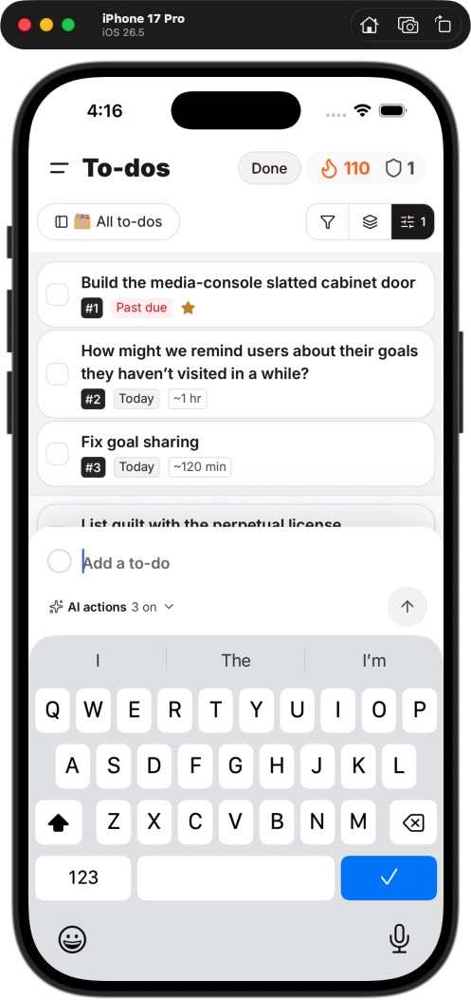

# Input unification evidence

Implementation is in progress. The global Input default is now filled/flat and transitional APIs are removed. Full native, embedded-host and accessibility acceptance remains open. The current [completion audit](../../../design-explorations/input-unification/completion-gates.md) supersedes the historical checkpoints below.

## Source and ownership

- Native source: `/Users/andrewwatanabe/Kwilt`, `main`, base `9baf1a4a8e14b83e806c1df9e25ee4d3e66d0678`, dirty shared checkout. Existing Input viewport behavior was preserved. The keyboard task restored its title draft and released a bounded Simulator interval for these pilots, then received ownership back with the Money clipping reproduction. This task navigated the existing development build; no install or rebuild.
- Workbench source: `/Users/andrewwatanabe/kwilt-site`, `codex/mature-pricing-page`, base `a5e46fb3d4053ab458d6bf8aa54d3da48fb7819a`, dirty shared checkout. Existing recovery/protocol and pricing work was preserved. No deployment or commit.
- Browser: local production build served on `127.0.0.1:3107`, isolated `agent-browser` session `kwilt-input-audit`. Protocol-v2 fixtures were injected into this page; bridge commands were captured in memory. No message was sent to a real host or audience.

## Automated receipts

| Check | Evidence / limit |
| --- | --- |
| Scanner and policy | 18 Node tests pass; initial missing-module failures and targeted red fixtures preceded scanner/default/barrel fixes. Exact identity and multiplicity reject additions and replacements; stale exceptions and corrupt baselines fail. |
| Shared Input | 7 accessibility/ref/viewport tests plus 2 appearance-default/viewport calculations pass. Original legacy viewport tests remain unchanged. |
| Search / pickers / FormField | Combined 19 tests across Input, SearchField, PickerFields and FormField pass. Search clears once without submitting; picker clear stays independent from opening. |
| Native token package | Typecheck and build pass. Legacy `fieldFill` and `fieldFillPressed` values unchanged. |
| App TypeScript | Standalone `tsc --noEmit --incremental` passed before final documentation/policy updates. Scoped completion receipt is recorded below when available. |
| Material contract | Export `--check` passes and native/site JSON files compare equal. `source.revision` hashes token source contents; it is not a deployment revision. |
| Workbench | 17 focused tests pass, including material drift and explicit field treatment. Production `next build` passes. Standalone `tsc --noEmit` reports an unrelated existing `lib/publicRecipeEditorial.test.ts:23` widened `costTier` type error; do not call the standalone typecheck green. |

Local logs: `/tmp/kwilt-input-policy-tests.log`, `/tmp/kwilt-input-foundation.log`, `/tmp/kwilt-input-adapters.log`, `/tmp/kwilt-input-tokens.log`, `/tmp/kwilt-input-types.log`, `/tmp/kwilt-web-input-tests.log`, `/tmp/kwilt-web-input-types.log`, `/tmp/kwilt-web-input-build.log`. These describe this dirty candidate, not an integrated release.

## Browser observations

| Scenario | Capture | Observation |
| --- | --- | --- |
| Empty, 393 × 852 | [Empty](web-empty.png) | Resting capture pill retains its distinct composition; neutral fill and no resting border. |
| Focused draft, 393 × 852 | [Focused](web-focused.png) | Computed fill `rgb(245,245,244)`, border `0px`, focus outline `2px`, text `17px`; ordinary typing leaves one textarea and emits draft/focus commands only. |
| Recording fixture | [Recording](web-recording.png) | Existing recording composition retains separate Stop and Send actions. This mode intentionally replaces the text editor; returning to idle restored the draft. Microphone capture and selection restoration were not exercised. |
| Long draft, 320 × 640 | [Long draft](web-long.png) | 337 characters; editor height 144, scrollHeight 274, scrollTop 130, selection at end337. Final line visible, Send bounds259–299 ×587–627 within viewport, no document horizontal overflow. |

Browser error inspection was empty. These captures do not emulate an iOS keyboard, a native bridge, system large text, VoiceOver/TalkBack or increased contrast. Artifact-title/content and correction fields have source/test coverage but still need rendered acceptance.

## Open acceptance

- All twelve pilot fields plus the Goals host are opted in. Home writing, photo descriptions/reply, Chore text/pickers and Global search have initial native evidence below. Goals reveal, Reward picker, edit-post mode and broader accessibility/device cases remain unverified. Money search and the Filter drawer footer passed their narrow repaired-host checks recorded below.
- Resting identifiability and contrast, normal/increased contrast, large text, selection/caret movement, first-tap completion, multiline scrolling, disabled/read-only semantics and supported Android evidence.
- Goals clear currently also collapses its revealed search row. Preserve this host behavior while removing duplicate query clearing; do not assume the shared field can remain focused after its host unmounts it.
- Wider adapter and feature migration, web native-host proof, default switch, removal of the compatibility bridge, permanent exception cleanup and integration gate.

The ledger remains the authority for coverage and terminal dispositions. `implemented-awaiting-native` and `implemented-awaiting-runtime` are intentionally nonterminal.

## Completion-gate correction

The first scoped gate passed app/test types and architecture, then exposed three Chore regressions among the broad checks: hiding the legacy picker's inner value broke existing selected-value queries. The unified trigger also needed its selected value on the button's accessible value. A focused failing regression was added (`/tmp/kwilt-picker-value-red.log`); legacy inner-value visibility is now preserved, and opted-in triggers expose `accessibilityValue.text` while hiding the duplicate inner renderer. The three affected suites then passed (`/tmp/kwilt-picker-value-green.log`). The complete scoped gate must be rerun for this corrected candidate.

The material exporter check is now included in architecture lint, alongside input debt checks. Neither gate verifies a companion repository's deployed revision.

The corrected implementation passed the full scoped gate on Node22.23.2: app/test types, code health, architecture, **1,233 Jest suites /7,610 passing tests (2 skipped)** and changed script tests. Receipt: `/tmp/kwilt-input-unification-local-final.log`,130.70 seconds;34 selected files,156 other changed files omitted. This does not approve omitted work, native rendering, merge or deployment.

A final scanner-only review then corrected the repository-root `@/` alias resolution and blocked new reuse of legacy field wrappers. The regression failed first and all18 scanner/policy/export tests pass afterward. This adds11 containing-component references (137 total), without changing the204-field census or application runtime. The script/document-only follow-up gate is recorded separately.

Tooling-only follow-up passed on Node22.23.2 in4.80 seconds (`/tmp/kwilt-input-tooling-local-final.log`): whitespace, code health, related Jest selection and12 changed/companion Node tests. The full18 scanner/policy/export tests also pass. Ledger reconciliation confirms204 native sites plus5 web sites, unique IDs, and an exact native-site multiset match to the latest AST snapshot. The local browser and port3107 server were closed after captures.

## Unlocked native pilot interval

Source: `/Users/andrewwatanabe/Kwilt`, `main`, base `9baf1a4a8e14b83e806c1df9e25ee4d3e66d0678`, shared dirty checkout. Installed development app **1.0.118 (118)**, iPhone 17 Pro / iOS26.5 (`D437E709-EF87-49B1-A6C1-7AE350C0BF8A`). Existing Metro PID64089, port8081, cwd `/Users/andrewwatanabe/Kwilt`. Pilot caller edits arrived through Metro; this is current JavaScript on an older development binary, not a rebuilt/released candidate.

| Pilot | Actual observation | Evidence / boundary |
| --- | --- | --- |
| Global search | Native onscreen keyboard entered `walk`; result filtering appeared; one tap cleared query and retained keyboard. | [Focused search](native-search-focused.png). No result mutation. |
| Home paragraph | Resting borderless fill; capped long draft scrolls. Tapping the final line and entering Return kept the new final caret above Post and keyboard. | [Resting](native-home-resting.png), [long draft and keyboard](native-home-long-keyboard.png). Originally empty draft restored; Post disabled afterward; no publication. |
| Chore text/pickers | Matching material for title, definition, assignee, repeat and missed rule. Definition and caret visible above Save/keyboard. Assignee opens on first tap from active text, selected Household retained. | [Resting](native-chore-resting.png), [keyboard](native-chore-keyboard.png). Original text restored and closed without Save; no chore mutation. Reward unavailable in this account state. Header scrolls out of view when keyboard opens; this is not proof of all host navigation behavior. |
| Money category search | Resting fill and filtering work; `gro` narrows categories; one-tap clear retains current Restaurants selection. **Focus moves search beneath the status bar.** | [Clipped search](native-money-search-clipped.png). Fails native acceptance. Query cleared, keyboard dismissed; no category or financial mutation. Handed to keyboard task with drawer still open for reproduction. |
| Goals | Source and focused regression prove one query-clear emission, host collapse and independent sort. Existing pull-to-reveal could not be reliably operated with current CUA gestures; one drag opened a card instead. | Native rendered acceptance remains open; no claim that reveal is broken in the app. |

The current Home composer uses a `BottomDrawer` with explicit Post footer, changed by concurrent Home work. Its behavior record now describes that observed host instead of the older header-Post design. Appearance work preserved that current composition.

Focused pilot verification: **5 suites /53 tests pass** (`/tmp/kwilt-input-pilots-focused.log`). The first scoped gate executed passing app/test types, code health, architecture and **10 suites /83 tests**, but marked the result **stale** because the checkout fingerprint changed during the run (captures were also being written). It is not a current completion receipt.

Task04 remains open and wider caller migration/default switching are held at the native gate. The concrete next dependency is the Money search host repair and recheck. Home reply/photo, Goals reveal and the full accessibility/platform matrix still need evidence. Runtime ownership was explicitly returned to **Standardize textarea keyboard UX** with the Money reproduction.

The final pilot scope passed `verify:local` on Node22.23.2 in **30.96s** after captures/ledger updates: app and test TypeScript, code health, architecture, whitespace, and **10 Jest suites /83 tests**. Receipt: `/tmp/kwilt-input-pilots-local-final.log`. This is the pilot JavaScript candidate before any subsequent keyboard-task repair; it does not clear the failed Money native gate or approve unrelated checkout files. The refreshed ledger exactly matches204 native fields plus5 web fields with209 unique IDs.

## Money repair and shared-composition follow-up

The keyboard task repaired only the Money category picker's host by selecting the existing `keyboardBehavior="resize"`. Its independent before/after native check verified header/search visibility, `gro` filtering, one-tap clear retaining focus and one-tap Close dismissing the picker and keyboard. Restaurants stayed selected. [Repaired native capture](native-money-search-resized.jpg); scoped20-test/typecheck receipt `/tmp/kwilt-money-search-local.log`. This task reviewed that source diff and capture. A redundant native recheck was interrupted by detected external Simulator interaction, so it adds no independent passing evidence. Runtime ownership was returned to the keyboard task. The Money failure above is resolved; the remaining Task04 matrix is still open.

Sixteen shared sites now use the unified family: `EditableField` delegates native editing/material to `Input`; both Combobox search presentations use `SearchField`; FilterDrawer and SortDrawer controls opt in; SettingsTextInputRow uses the deliberate plain treatment within its grouped row. Compact menu/filter sizing is retained. Tag filter entry remains an Input hybrid because Done adds a tag; it is not silently converted to query-only search. The grouped settings adapter retains right-aligned secondary text; the title adapter retains title typography through narrow owned-style exceptions. No shared keyboard/title-host files changed in this slice.

Two focused failures preceded changes: named editable-title access/commit flow and Combobox query clearing. All22 composition tests pass after migration. `EditableField` still has its prior invalid-blur reset behavior; these appearance tests do not certify a new draft-retention contract.

Storybook now renders the editing specimens. Its existing static Reanimated shim lacked two directional fades and `reduceMotion`, causing the shared motion module to fail loading. A regression failed before the Storybook-only compatibility correction and passes afterward (`/tmp/kwilt-storybook-shim-red.log`, `/tmp/kwilt-storybook-shim-green.log`). No app animation behavior was changed.

- [Editing specimens](storybook-editing.png): filled resting fields, named title/body/meta variants, error and disabled states. Browser editing retained a revised title after Enter and a move to another field.
- [Picker search](storybook-picker-search.png): filtering to Cook narrows results; clear restores all three options, selected outside goal remains checked, query retains focus. React Native Web/browser adds its own editor focus outline; this capture does not establish native focus styling.

These are local React Native Web Storybook observations on port6006, not iOS/Android/native-host proof. The app's native keyboard evidence remains separately recorded.

`EditableTextArea` and deprecated `ObjectPicker` were removed after repository-wide symbol/path, namespace-barrel, dynamic import/require/glob and package-export checks found no consumers. The application package is private. ObjectPicker's unused primitives export was removed. Their three site IDs remain in the ledger pending the final verification gate; the audit denominator does not shrink.

Shared-composition completion gate passed on Node22.23.2 in **150.42s**: app/test types, code health, architecture, whitespace and **1,237 suites /7,617 passing tests (2 skipped)**. The verifier broadened related Jest selection for the source deletions/shared export change; this was one completion gate, not an inner-loop full-suite run. Receipt: `/tmp/kwilt-input-compositions-local.log` (21 selected files;201 other changed files outside this scope). Retired rows INP-157/175/176 now have terminal `removed-verified-unused` dispositions. Current ledger:33 native sites implemented awaiting native acceptance,168 native sites planned,3 removed/verified, and5 web sites implemented awaiting runtime acceptance. All209 historical IDs remain.

Final compact-picker capture waited for `document.fonts.ready`; its initially missing visible labels were transient font loading, not a layout fault. Browser and the task-owned port6006 Storybook server were closed after captures. No new native install, publication, commit or integration gate occurred in this slice.

## Remaining native interval and Filter drawer failure

The keyboard task released a second bounded interval for remaining native checks. Checkout, base revision, installed development binary and Metro provenance remain as recorded above. The native Filter drawer's filled text and picker controls rendered consistently. In To-dos, Add a filter created a local Title / Contains / Value condition. With `walk*` entered in Value, the editor and caret remained visible but **Apply and Cancel were covered by the keyboard**. [Failure capture](native-filter-keyboard-footer-hidden.png). `FilterDrawer` explicitly passes `keyboardAvoidanceEnabled={false}` to `BottomDrawer` and places its footer below `KeyboardAwareScrollView`; repair belongs to the host's keyboard behavior. Keyboard Done followed by Cancel discarded the test condition; no filter was applied.

Goals pull-to-reveal again could not be exposed reliably through the automation gestures. This leaves rendered acceptance open and is not evidence of an application defect. The existing Developer tools > Preview Home connected moments route was opened to use fictional local data for remaining reply/photo checks. Its resulting UI was not inspected successfully before the Mac locked again. No reply, post or photo was submitted; those fields remain unverified.

Runtime ownership was explicitly returned to **Standardize textarea keyboard UX**, with the Filter failure and safe-state report. No native action is in flight or test draft pending. The last successful action opened the local Home preview; refresh accessibility state after unlock before acting. The keyboard task's tall-title selection and post-Done scroll-anchor failures remain separate unresolved behavior work. No acceptance status was advanced from these incomplete checks.

## Filter repair and completed Home fixture checks

The keyboard task replaced FilterDrawer's disabled avoidance/body-only adjustment with the existing drawer resize mode and `BottomDrawerScrollView`. Its native retest showed Value/caret and Apply/Cancel/Clear all above the keyboard with `walk*`. First-tap Cancel closed the drawer; reopening confirmed no retained condition. [Repaired footer](native-filter-keyboard-footer-visible.jpg). This task reviewed the source and received the independent native receipt. Apply persistence and multiple-condition scrolling remain unverified. Its two scoped gates passed static checks and4 suites/29 tests but were marked stale by concurrent checkout changes; they are not a stable completion receipt.

After explicit runtime release, this task navigated the existing HomeConnectedPreview using the same source/Metro/development binary provenance. Its injected repository stores fictional replies in memory. The composer, however, still uses the real photo uploader on Post; **Post was never invoked**. The following checks are local fixture proof, not backend publication proof:

| Scenario | Observed result | Evidence / cleanup |
| --- | --- | --- |
| Reply resting and long text | Named reply, neutral fill, disabled Send when empty. Accessible Scroll Down reaches the final lines of a nine-line draft. Tapping the final line, Return and then A left the new final caret visible above Send/keyboard. Return inserted a newline without sending. | [Resting reply](native-reply-resting.png), [final-line editing](native-reply-long-keyboard.png). Generic automation scroll/drag did not operate this editor reliably; its exposed accessible scroll action did. This is not a claim of a VoiceOver end-to-end pass. |
| Reply completion | First-tap Send while keyboard open added the complete multiline reply to the in-memory fixture, cleared the field, disabled Send and dismissed the keyboard. | Local fictional repository only; no real audience received anything. Closing the preview discarded its in-memory fixture state. Edit-post mode and failure/retry remain open. |
| Optional photo description | Stock Simulator flower photo selected into the fictional viewer's local draft. Focus revealed label, field and Post above keyboard; text retained after Return dismissed keyboard. Empty description did not disable Post for a photo-only draft. | [Photo-description keyboard](native-photo-description-keyboard.png). Photo removed afterward, draft empty and Post disabled, composer closed. No upload or post; original stock photo unchanged. |

Goals was revisited after fixture cleanup. Its menu has no alternate search entry; the final scroll gesture again failed to expose the pull-to-reveal search. Native search acceptance remains open without an application-defect claim. Simulator ownership was explicitly returned to the keyboard task at the Goals inventory with keyboard closed, menu dismissed and no draft pending. Wider platform/accessibility checks and Task04 remain open.

The earlier documentation-only `verify:local` attempt was refused because another local verifier was active (`/tmp/kwilt-input-evidence-local.log`); it is not a passing receipt. Source implementation receipts above remain scoped to their recorded candidates.

The updated four-file documentation/ledger scope subsequently passed local verification in3.10s (`/tmp/kwilt-input-evidence-local-final.log`): working-tree and staged whitespace checks.224 other changed files were omitted. This documentation-only pass does not certify subsequent shared source edits or replace the Filter repair's pending stable source gate.

## Rich-notes material slice

Task03 now provides explicit unified preview material through `LongTextField` and its internal `LongTextFieldPreview`. The existing feature callers keep legacy preview defaults until Task08 review. The preview shares `resolveInputAppearance`; its flat editorial treatment stays distinct. Pell remains the owned HTML editor, with its WebView typography, formatting, sanitization, debounce and Done flush unchanged. No shared keyboard/title source was edited by this slice.

The URL and optional link-label dialog fields now use named shared Inputs. Four focused material/interaction tests plus the two existing persistence tests pass (`/tmp/kwilt-rich-input-green.log`): trimmed link insertion, empty-label URL fallback, Cancel without insertion, a retained open rich draft across treatment changes, disabled preview, autosave/Done compatibility. The initial new test harness lacked PortalHost, so its first failure was not valid proof of the old naming defect; the harness was corrected before these passing assertions. These tests do not certify native link-dialog layout.

The internal Custom refine dialog was unreachable: its visibility state initialized false, every setter call set false, and neither state nor setter escaped through props/ref/export. That dialog, its instruction state and obsolete textbox style were removed. Existing reachable Refine presets remain. INP-173 remains in the ledger pending deletion verification; the rich editor and its two migrated link controls have nonterminal native statuses.

The first Storybook import encountered an existing native-only InputAccessoryView dependency in the editor host. Extracting the actual read-preview component allowed it to render without replacing the native editor with a web imitation. [Rich-notes preview capture](storybook-rich-notes.png),960×720 after fonts loaded: white/muted parents, filled/plain/disabled treatments and preserved bold content. Clicking Edit Notes invoked the specimen's editor-request callback. This is read-preview browser proof only. The isolated browser session `kwilt-input-rich` and task-owned Storybook server on6006 were closed afterward; the Simulator remained with the keyboard task.

Legacy fill classification now covers all90 references across49 current consumer files plus the token definition as the50th lexical file. A fresh exact file/token multiset matched the CSV after the preview extraction. The migration ledger likewise matches200 active native controls and137 hosts; all209 historical IDs remain. Scoped completion verification for this slice is pending below.

The rich-notes scope passed `verify:local` on Node22.23.2 in26.75s: app/test types, code health, architecture, whitespace and5 suites/29 tests (`/tmp/kwilt-rich-input-local.log`;12 selected files,224 other changed files omitted). All18 input policy tests also pass, and legacy token definitions match HEAD. The prior shared gate identified two moved legacy Edit-action color uses; exact brand-moment comments now preserve their original semantic action role. INP-173 is terminal removed/verified. Final native accounting is36 implemented awaiting native,164 planned and4 removed/verified;5 web rows remain awaiting runtime. Documentation of this receipt does not change the verified source candidate. No commit, merge, default switch, native install or deployment occurred.

## Task05 account and Chore source slice

Fourteen fields now opt into unified material. Existing parent-owned save/blur/verification contracts are documented per ledger row. Grouped notification triggers keep their custom SettingsRow presentation; both destination-library queries use SearchField. The destination test first failed on the missing named clear action, then passed for inline and drawer modes, confirming restored results and no navigation/drawer dismissal. Five focused suites/58 tests pass (`/tmp/kwilt-account-input-focused.log`), including existing sign-in, profile, notification and Chore behavior tests. This is source proof only; secure/code/amount, profile picker and these query hosts still need native acceptance.

All209 historical IDs remain. The fresh AST and active ledger match exactly at200 native controls plus137 hosts;14 reviewed baseline allowances were removed. Native counts are50 implemented awaiting native,150 planned and4 removed/verified;5 web entries await runtime. This source slice proceeds while the keyboard task retains Simulator ownership. No native runtime action, global default change, installation, release or real account/financial mutation was performed.

The14-file account/Chore completion gate passed (`/tmp/kwilt-account-input-local.log`): app/test types, code health, architecture, whitespace and7 suites/62 tests.230 other changed files were omitted. The passing result certifies this source slice only; native acceptance and integration remain separate.

## Additional ordinary form opt-ins

Eleven fields in DestinationDetailScreen, HouseholdSettingsScreen, UgcReportDrawer and SharedLifeLibrary now explicitly use unified treatment. The diff changes only treatment and removes household outline overrides. Source review retained explicit create/update/invitation/review/join/report/collection actions, failure draft retention, busy guards and existing hosts. No real mutation was invoked. INP-192 records the pre-existing Textarea alias discrepancy; command normalization of pasted newlines is not proof of usable multiline entry. Exactly11 further debt allowances were removed and active identities reconcile with the fresh AST. Current ledger:61 native awaiting native,139 planned,4 removed/verified and5 web awaiting runtime. Scoped verification follows.

The additional10-file form scope passed local verification in34.80s (`/tmp/kwilt-forms-input-local.log`): app types, code health, architecture, whitespace and9 suites/98 tests;238 other changed files omitted. The prior account/Chore scope took41.67s. Both process handles completed with exit0 and neither receipt was marked stale. These results do not certify all dirty checkout work or native acceptance.

### Task05 query, inline and sentence adapters

Eight additional sites converge: both Activity area editors, destination-library query, default/proposal calendar pickers, Plan slot search, Screen Time sentence picker and saved-moment search. Area rename uses plain material in its existing row; Add uses filled. Proposal Calendar retains its custom inline trigger. The sentence adapter uses one PickerFieldTrigger with selected-value accessibility; its narrow exception forwards audited placement styles only. Plan search uses canonical compact geometry rather than its old36-point local surface. Native rest/keyboard/Dynamic Type acceptance remains open for all eight.

Focused tests cover the sentence trigger's current-value announcement and single action (red before replacement), Plan query clear/filter continuity, and saved-moment clear issuing exactly one existing read query without a write. The saved-browser harness initially lacked a valid AppState subscription cleanup object; correcting the mock resolved that test-only failure without a production behavior change. Current ledger:69 native implemented awaiting native,131 planned,4 removed/verified and5 web awaiting runtime;200 active native controls and137 hosts still reconcile exactly. Eight old debt allowances were retired and one reviewed owned-adapter placement exception added. Scoped completion follows in the evidence receipt.

The16-file query/inline/sentence adapter scope passed in37.67s (`/tmp/kwilt-input-adapters-local.log`): app/test types, architecture, code health, whitespace and8 suites/53 tests;242 other changed files omitted. Process exit0 and no stale marker.

### Task05 specialized forms

Eight more source sites converge across admin detail/search, developer feedback, managed-device code and four onboarding controls. Admin keeps an exact owned-adapter exception for its existing empty-status-value/badge layout; route/authorization guards are unchanged. Device setup uses the contrasting muted-parent material and retains numeric normalization plus explicit Continue. Developer feedback now uses a named capped multiline Input, with existing per-chat AsyncStorage save and failure retention. Onboarding preserves refs, Return/Next/Done, caps and state transitions; custom answers use their question title as accessible name, and field margin belongs to the container.

Both focused suites/four tests pass, including managed-code formatting, incomplete-code disabling and explicit six-digit submission. No backend setup, invitation, feedback publication or admin action was invoked. Current ledger:77 native implemented awaiting native,123 planned,4 removed/verified and5 web awaiting runtime. Active controls/hosts remain200/137. All direct Task05 fields are source-migrated; its remaining planned INP-199 is the QuickAddDock composition shared with Task08. This does not close Task05 native acceptance or the recorded destination-command multiline issue.

The specialized-form scope passed local verification in32.42s (`/tmp/kwilt-input-specialized-local.log`): app/test types, architecture, code health, whitespace and7 related tests. The process completed exit0 without a stale marker. Ledger receipt updates do not alter the verified source. No Simulator navigation or shared keyboard/title edit occurred; those acceptance dependencies remain open.

### Task06 recipe editor and repeated rows

Four historical control sites now use shared Input: IngredientLineEditor, InstructionSectionEditor and RecipeEditScreen's AI draft plus seven-use Field adapter. Existing parent-owned row identity, callbacks, explicit Remove/Save and AI Apply-to-draft behavior remain. The shared field owns label and material once; yield widths/flex move to the container. Instruction and description/notes controls use capped multiline editing. Native long-text, keyboard and repeated-row acceptance remains open.

The original six RecipeEditScreen tests passed after migration. An additional behavior test verifies the second instruction keeps its stable id and complete multiline text when the first row is removed, without saving until Save is pressed. Scoped completion follows. Exactly four legacy debt entries are removed, with one reviewed Field prop-forwarding exception. The ledger has81 native awaiting native,119 planned,4 removed/verified and5 web awaiting runtime; all209 IDs and200 active controls/137 host references reconcile. Three obsolete legacy fieldFill consumers were removed from these exact files; the remaining87 references in46 consumer files match fresh source, with the token definition excluded and unchanged.

The11-file recipe-editor scope passed local verification in20.37s (`/tmp/kwilt-input-recipe-local.log`): app/test types, code health, whitespace and1 suite/7 tests;255 other changed files omitted. Input policy was also checked directly and passed. The new instruction-row test passes. Native behavior and integration remain separate.

### Task06 cooking and meal feedback

Four additional controls migrate: used-instead value, substitution note, cooking note and optional meal hard-pass explanation. The fields keep their existing local state and explicit Done/Save actions. Cooking notes default to private; choosing a recipe-edit proposal retains the existing review step, with no automatic editing/publication. Hard-pass text keeps its140-character limit and trimmed Other-reason payload. Existing rating and card surfaces remain unchanged, including their legitimate legacy selection fill.

Current ledger:85 native implemented awaiting native,115 planned,4 removed/verified and5 web awaiting runtime. Four exact debt allowances were retired; all209 historical rows and200 active controls/137 hosts still reconcile. Native keyboard, long-text and surface-state acceptance remains open. Scoped verification follows in evidence.

The cooking/meal-feedback scope passed local verification in16.12s (`/tmp/kwilt-input-cook-local.log`): application types, code health, whitespace and3 suites/64 tests. Input policy was separately checked and passed. Both recipe-wave process handles completed exit0; neither result was stale. Ledger evidence updates do not change the verified source. No native runtime, real reaction, recipe save/publication, commit or deployment action was performed.

### Task06 grocery, occasion and reminder forms

Five historical control sites now use Input: six store-opportunity fields, three grocery-edit fields, occasion date, reminder clock and trip target. Labels and material are owned once, while parent draft callbacks, decimal/time/date interpretation, explicit save/review actions and existing hosts remain. The grocery adapter has one exact reviewed prop-forwarding exception. No Money semantics, reminder, grocery update or real store opportunity was created during implementation.

Focused coverage passes across the four existing component suites. An overly broad style cleanup initially removed the reminder-builder parameter type; the focused test exposed it. The original signature was restored and only the obsolete style was removed. A direct source comparison verifies the complete reminder builder and scheduling functions are identical to HEAD; all three reminder tests pass. Scoped completion follows in evidence.

Current ledger:90 native awaiting native,110 planned,4 removed/verified and5 web awaiting runtime. Five exact debt allowances retired; all209 historical IDs and200-control/137-host identities reconcile. Three obsolete fieldFill input consumers were removed; the remaining84 references in45 consumer files match current source. Native keyboard, decimal/time/date and multi-field drawer acceptance remains open.

The first food-form scope passed local verification in10.13s (`/tmp/kwilt-food-forms-local.log`): application types, code health, whitespace and5 suites/20 tests;261 other changed files omitted. Process exit0. This does not certify native form layout or integration.

### Task06 remaining food controls

Nine remaining sites migrate: store search, meal suggestion, four plan-editor fields, URL/text recipe import, coverage name and custom food need. Search clears through the owned composition without performing retailer actions. Recipe import retains its mode-specific native props and explicit extraction/review flow; text mode uses a180-220 viewport. Plan count/date validation, local meal-note Add, food-need Return/Add and outer save actions remain unchanged. The sole coverage-name appearance style is removed after reference audit.

Three focused suites/28 tests pass, including a new assertion that clearing store search does not search, select a store or add to a cart. Current ledger:99 native implemented awaiting native,101 planned,4 removed/verified and5 web awaiting runtime. All Task06 sites are now source-migrated, while its native acceptance remains open. Nine exact debt allowances retired; all209 historical IDs and200 active controls/137 hosts reconcile. Four more obsolete input token consumers were removed;80 remaining references in44 consumer files match fresh source. Scoped completion follows in evidence.

The remaining-food scope passed local verification in42.24s (`/tmp/kwilt-food-remaining-local.log`): app/test types, architecture, code health, whitespace and7 suites/93 tests. Process exit0 without a stale marker. All Task06 controls are source-migrated; native long recipe/import/grocery/capture-sheet and wider accessibility acceptance remain open. Final current token inventory is80 references in44 consumer files, excluding token definitions. No native runtime, retailer/cart submission, meal response, food-need mutation or recipe publication was performed.

### Task07 Money fields

Twelve remaining Money Input callers explicitly opt into unified material; four category SettingsTextInputRow callers are reviewed against their already-unified plain grouped adapter. The grouped presentation stays intact. Source review preserves category currency parsing, optional forecast money/day/month validation, allocation-plan validation, coverage rounding/clamping, note caps, saving locks and explicit review/save actions. Monthly category blur remains a preview, not a write. The previously repaired category-search host is unchanged by this slice.

A red/green scanner regression now recognizes SettingsTextInputRow as the owned canonical adapter while still rejecting caller appearance overrides. All19 scanner/policy tests pass. Four focused Money suites/33 tests pass. Exactly16 obsolete debt allowances are retired; all209 historical rows and200 active native controls/137 host references reconcile. Current ledger:115 native implemented awaiting native,85 planned,4 removed/verified and5 web awaiting runtime. No actual transaction, allocation, category, merchant rule or Money plan mutation was performed. Native amount error/empty/keyboard and full acceptance remain open; scoped completion follows in evidence.

The Money scope passed local verification in16.68s (`/tmp/kwilt-money-input-local.log`): application types, code health, whitespace, related Jest and scanner script tests. The process completed exit0 without a stale marker. All19 input-tooling tests also passed directly. Source changes are explicit treatment opt-ins plus canonical grouped-adapter classification; prior category-search/keyboard work remains preserved. No native runtime or real financial action was performed. Native acceptance and integration remain open.

### Task07 Games and Explore

Seven remaining Task07 sites migrate. Games names/code/answer use canonical fields while max lengths, ref forwarding, code normalization, submit guards, seat identity and explicit game actions remain. Setup's existing Remove button moves into Input's trailing slot, avoiding a nested field enclosure. Common Thread keeps its80-character local answer and explicit reveal/next flow. Its obsolete shared input/multiline styles were removed after reference audit. A replacement initially malformed the join name-ref type; focused tests caught the parse error and the original TextInput ref annotation was restored before passing tests.

Explore now uses SearchField for visited Places and Input for naming. The custom outer search box/icon and obsolete field styles are removed; nearby recommendations, map geometry, result-selection behavior and place persistence handlers remain unchanged. The expanded test confirms clear restores visited results without moving the map. Games focused tests pass20 cases and Explore passes39; a further seat-removal action regression is included in scoped verification.

All Task07 controls are source-migrated. Current ledger:122 native implemented awaiting native,78 planned,4 removed/verified and5 web awaiting runtime. Seven exact debt entries retired, all209 historical IDs retained,200 controls/137 hosts reconcile. Two obsolete Explore fieldFill uses removed;78 remaining token references in43 consumer files reconcile with source. Native Games keyboard/theme contrast and Explore map/drawer acceptance remain open. No real remote game, place visit, sharing or financial action was performed.

The Games/Explore scope passed local verification in24.92s (`/tmp/kwilt-games-explore-local.log`): app/test types, code health, whitespace and10 suites/108 tests. The new seat-removal and search-clear behaviors pass. Direct input-policy validation also passed. Process exit0 without a stale marker. All Task07 sites are source-migrated; native/runtime and integration acceptance remain open. No Simulator/shared-keyboard source operation, remote join or actual place creation occurred.

### Task08 rich-note callers and creation fields

All six LongTextField feature callers now explicitly select unified treatment. Activity detail/draft/peek and Arc/Goal creation use filled previews; Goal detail retains its documented flat/plain editorial presentation beside narrative content. Autosave900ms/zero-debounce behavior, local versus persisted draft ownership, disabled peek, AI callbacks, editor snap points and empty-value normalization remain unchanged. No shared editor, title or keyboard implementation was edited.

The scanner now requires explicit unified treatment for LongTextField callers during migration. Its new alias regression failed before the rule and passes afterward; all20 input-tooling tests pass. Existing rich-note material/behavior suites pass6 tests. Five additional creation fields converge: view name, Arc custom answers, Goal prompt/timeframe and invitation email. Question-title/recipient names are explicit, and Arc spacing belongs to the field container. Existing Goal/share suites pass8 tests; no goal, Arc, view or invitation was created or sent during verification.

Current ledger:133 native implemented awaiting native,67 planned,4 removed/verified and5 web awaiting runtime. Five exact creation-field debt entries retired; the six rich callers had no baseline allowances, so enforcement was strengthened rather than adding exceptions. All209 historical IDs and200 active controls/137 hosts reconcile. Native rich-editor/caller, plain Goal context, disabled peek and creation-flow acceptance remain open. Scoped completion follows in evidence.

The rich-note/creation scope passed local automation in29.97s (`/tmp/kwilt-rich-creation-local.log`): application types, architecture, code health, whitespace,6 Jest suites/34 tests and script tests. No native runtime or invitation/persistence action was performed. Native acceptance and integration remain open.

### Task08 Activity and Goal standard pickers

Ten default picker callers now opt into unified filled treatment: Activity status/area/type, draft difficulty/area/type, AI Goal proposal Arc, Goal detail Arc/priority, and Goal creation Arc. Required selections retain their fallbacks; optional relations retain null normalization and clear behavior. Draft versus persisted callbacks, timestamps, disabled empty-Arc state, compact sizing and outer confirmation actions remain unchanged. Custom row triggers remain separately planned.

Current ledger:143 native implemented awaiting native,57 planned,4 removed/verified and5 web awaiting runtime. Ten exact legacy allowances retired; all209 historical IDs and200 active controls/137 hosts reconcile. Direct input policy passes337 sites. Scoped local verification passed36.41s (`/tmp/kwilt-pickers-local.log`): app/test types, architecture, code health, whitespace and2 suites/10 tests. The scope omitted292 other changed files and does not approve that work. Architecture retained10 warnings; no gate errors or stale marker. Native selection/clear, keyboard search and accessibility acceptance remain open. No Simulator, real Goal/Activity change or shared keyboard/title implementation was performed.

### Check-in, tag search and remaining textarea callers

Six sites migrate: tag search, check-in composer, check-in reply, pending draft editor, AI identity context and AI view customization. SearchField owns query clear/refocus while tag application remains separate. Check-ins use named canonical inputs with existing character limits and explicit Send; the compact composer no longer has a duplicate outer border, and its error uses shared field anatomy. Pending editing uses the contrasting fill on its muted card. Identity retains blur/back profile commit and empty-to-undefined normalization; AI customization retains its explicit Apply callback, loading lock and88-140 multiline range. Identity and check-in multiline editors have bounded180-point maximums. No service/persistence action was executed against a real account.

Acceptance review found a pre-existing pending-draft bug: Done displayed the original draft and a later Send discarded local edits. A failing regression reproduced it. Done/reopening now retain local text for explicit Send; parent draft id/text changes refresh local text. Two behavior tests cover edit retention and parent-draft replacement. This is a local editor correction, not a new save-on-Done behavior.

Current ledger:149 native implemented awaiting native,51 planned,4 removed/verified and5 web awaiting runtime. Six exact legacy allowances retired; all209 historical IDs and200 active controls/137 hosts reconcile. Direct input policy passes337 sites. Check-in/search scope passed35.89s (2 suites/2 tests, app/test types, architecture and code health; `/tmp/kwilt-checkin-local.log`,298 unrelated changed files omitted). Textarea scope passed24.68s (2 suites/2 tests, app types, architecture and code health; `/tmp/kwilt-final-textareas-local.log`,303 omitted). Final pending-draft correction passed27.46s (1 suite/2 tests, app/test types, architecture and code health; `/tmp/kwilt-pending-edit-local.log`,305 omitted). All three processes exited0, with10 retained architecture warnings and no stale marker. Whitespace passes. Native long text, compact/expanded contexts, accessibility and keyboard acceptance remain open. No Simulator/shared keyboard/title operation or integration/publication occurred.

### Chapter notes, inline view creation and reviewed adapter callers

Four controls migrate: inline AI view description, banner image search and Chapter personal/feedback notes. Inline view creation moves its sparkles and existing create/loading action into shared Input, removing the custom bordered enclosure; Go, ref/autofocus, trimmed callback and busy edit lock remain. Banner SearchField owns clear/refocus while existing Return/Search retains remote query behavior. Chapter editors retain personal-note Save/Cancel, feedback optional-save semantics, limits, ref and busy state; shared bounded multiline material replaces local styles. No Chapter service handler was changed.

Scoped local automation passed38.01s (`/tmp/kwilt-chapter-view-local.log`): app/test types, architecture, code health, whitespace and4 suites/19 tests, including an explicit-create regression. The scope omitted306 other changed files;10 existing architecture warnings remain. No stale marker or gate error. Four exact debt allowances retired. One obsolete inline-view fieldFill consumer removed; remaining77 references in42 files exactly match current source by file/token multiplicity.

Four already-canonical callers were separately reviewed: Activities layout/group FormFields retain segmented choice anatomy, and Arc/Goal creation titles retain EditableField's validation and local draft commits. They require no redundant opt-in or styling. Their source ASTs have zero override violations;2 shared-adapter suites/5 tests pass (`/tmp/kwilt-adapter-callers-focused.log`) covering changed-value commit once, rejected empty values, label/error and disabled semantics. No baseline allowances existed for these four callers.

Current ledger:157 native implemented awaiting native,43 planned,4 removed/verified and5 web awaiting runtime. All209 historical IDs remain;200 controls/137 hosts reconcile. Native Chapter long text, view/banner search keyboard, segmented controls and creation-title context acceptance remain open. No Simulator/shared keyboard/title implementation, remote image search, actual view creation or Chapter publication occurred.

### Reviewed store-finder export and obsolete Arc/Goal editors

The two store-finder callers now resolve as canonical composed inputs through an exact module/export registry. The existing SearchField, query callbacks, current-location behavior, explicit store choose and separate preferred-store action remain unchanged. Scanner regression covers aliases, rejects material overrides and a same-named unrelated wrapper, and still discovers raw controls inside the reviewed implementation. The fixture initially used a non-forwarding shape; it was corrected to the actual destructured-query pattern before passing19 scanner/policy tests. Two exact legacy-wrapper allowances retired. Scoped gate passed10.36s (`/tmp/kwilt-store-adapter-local.log`): app types, code health,2 suites/23 tests and script tests;310 other changed files omitted.

Removed two unreachable module-local implementations: ArcNarrativeEditorSheet and ArcSelectorModal. Whole-source references showed definitions only, with no caller/export or dynamic lookup. Their two historical control IDs remain removed-verified-unused. Removed the unused Arc editor state/imports and exclusive styles. The active GoalActivityComposerModal remains and now uses two canonical labeled fields, preserving open reset, title nonempty gate, type choice, optional note normalization and explicit Add. Its multiline note is capped120-180. Four exact legacy entries retired for these deletions/migrations.

The first automated check caught a duplicate Input import introduced in this slice; it was removed. Inventory reconciliation also detected a concurrent LongTextField list/link CSS update. The four CSS rules were reviewed, its already-updated owned-rich-editor exception was preserved, and INP-170's fingerprint was refreshed without changing that implementation or adopting a new native claim. The corrected final gate passed25.68s (`/tmp/kwilt-old-editors-final-local.log`): app types, architecture, code health, whitespace and5 suites/29 tests, process exit0 with no stale marker. Existing10 architecture warnings remain. The prior failed candidate is superseded, not counted as a pass.

Current ledger:161 native implemented awaiting native,37 planned,6 removed/verified and5 web awaiting runtime. All209 historical IDs retained;198 active native controls/137 hosts reconcile. Direct policy passes335 sites. Legacy material inventory still exactly matches77 references in42 files. Native Add To-do, store finder, broader editor acceptance, final default switch and integration remain open. No Simulator/title/keyboard source action, actual store change, Goal/To-do creation or publication occurred in this slice.

### Activity steps and custom relation rows

Six sites migrated: four existing/new Activity and draft step editors now explicitly use unified plain treatment and accessible names, with shared body typography replacing redundant local text/padding overrides. The detail step retains a single exact reviewed exception for completion color/strike-through; its parent style contains only those two semantic properties. Multiline expansion, existing viewport clamp, no nested scroll, single-line draft add, ref/testID, focus/blur and continue/exit commit callbacks remain unchanged. Removed now-unused step/new-step styles after reference audit. The linked-Goal and difficulty custom rows retain their navigation/choice composition while explicitly opting into canonical picker ownership; Goal relation search uses the shared material.

Scoped local automation passed40.71s (`/tmp/kwilt-step-inputs-local.log`): app/test types, architecture, code health, whitespace and11 suites/86 tests, including existing step-completion and picker coverage. Process exited0 without stale marker;10 existing architecture warnings remain. Six exact legacy allowances retired and one precise completion-text exception added. Current ledger:167 native implemented awaiting native,31 planned,6 removed/verified and5 web awaiting runtime. All209 historical IDs and198 active native controls/137 hosts reconcile; direct policy passes335 sites. Native long-step expansion, keyboard and custom-row acceptance remain open. No Simulator, title/keyboard implementation or actual Activity/Goal mutation occurred.

### AI Arc proposal fields

Three proposal fields now use canonical filled Input: Arc name, narrative and optional feedback note. Each has an accessible name; feedback label/material are owned once. Narrative and feedback retain their three-line minimum and use a180-point maximum. Existing local draft setters, Adopt Arc trim/fallback flow, Not now/reset, Save feedback payload and Cancel remain unchanged. Obsolete local typography/border/padding styles removed. Diff review caught an over-broad placeholder cleanup affecting a separate suggestion input; that input was restored before exact identity reconciliation and verification.

Scoped gate passed28.14s (`/tmp/kwilt-ai-proposal-local.log`): app types, architecture, code health, whitespace and1 related navigation suite/3 tests. This is source/static evidence, not an AI proposal interaction test. Process exited0 without a stale marker;10 existing architecture warnings remain. Three exact legacy entries retired; all209 historical IDs and198 active native controls/137 hosts reconcile. Current ledger:170 native implemented awaiting native,28 planned,6 removed/verified and5 web awaiting runtime. Native proposal editing, keyboard/long-text and explicit adoption/feedback acceptance remain open. No AI request, Arc adoption, feedback submission, Simulator or shared keyboard/title action occurred.

### Activity location trigger

The location Combobox now uses canonical PickerFieldTrigger for its selected preview, pin icon and clear action. Existing controlled query/search, result/current-location selection, preview/map movement, platform presentation, portal, radius and outer Save/Cancel remain. PickerFieldTrigger adds optional clearAccessibilityLabel with the unchanged Remove selection default; this caller retains Clear location. A regression failed before implementation and passes afterward, verifying the named clear callback and stopped propagation without opening the picker.

INP-092 is migrated; new explicit composition site INP-205 is appended without renumbering historical controls. Current accounting:210 historical rows,172 native implemented awaiting native,27 planned,6 removed/verified and5 web awaiting runtime. All199 active native controls/137 hosts reconcile, and policy passes336 sites. One obsolete location fill removed;76 remaining legacy references in41 files exactly match source. Scoped gate passed85.92s (`/tmp/kwilt-location-trigger-local.log`): app/test types, architecture, code health, whitespace and95 suites/620 tests. Process exited0 without stale marker. Native location/map/keyboard acceptance and integration remain open; no actual location persistence or Simulator operation occurred.

### Verification-command multiline acceptance correction

INP-192 used the Textarea alias without enabling multiline, despite promising one command per line. A failing rendered-field regression established that it rendered single-line. It now explicitly enables multiline88-180 and disables automatic capitalization/correction; existing command splitting, trimming, blank removal,20-command limit and explicit Install/Save persistence remain. The regression also verifies a two-line payload is saved as two separate commands only after Install, with no write on blur. Fixture corrections stabilized navigation and enabled the simulated Pro path; the initial failed fixture gate is superseded by the final candidate.

Final scoped automation passed25.97s (`/tmp/kwilt-command-lines-final-local.log`): app/test types, architecture, code health, whitespace and1 suite/1 behavior test. Process exited0 without stale marker;10 existing architecture warnings remain. No actual destination, subscription or command execution occurred. Counts remain172 native awaiting native,27 planned,6 removed/verified and5 web awaiting runtime across210 historical IDs;199 active controls/137 hosts reconcile. Native command-entry keyboard acceptance remains open.

The tag-entry audit confirms that INP-080/089 need one owned chip-and-text composition. Merely replacing their raw input would retain feature-local field fill, radius and padding. The next implementation must preserve wrapped chips, detail empty-state width, AI-autofill clearance, measured host/ref and focus behavior, comma/Done/blur commit semantics, and Backspace/removal semantics while moving material and the plain inner Input into a shared UI adapter. These sites remain planned; no partial migration is claimed.

### Shared tag-entry composition

Added Candidate TagEntryField: shared appearance resolver/InputFrame owns one filled chip surface and focus indicator, with one plain Input and removable chips inside. Native input callbacks and ref forward through the adapter; parsing and persistence stay in Activity callers. Both detail/draft tag entries now use it. Exact comparison verifies all prior native semantic props/callbacks, excluding replaced appearance props, are unchanged. Detail keeps its measured outer host, suggestion guard, Backspace removal, focus/reveal callbacks, test IDs and AI-autofill clearance. The AI-autofill block is preserved verbatim. Draft empty-space press now focuses its field. Chip removal stops propagation before calling its owner. Two tests cover native callback forwarding and isolated chip removal.

An initial typecheck exposed read-only ActivityPeekFields consumers of the shared tag styles. Those preview styles were restored, preserving the read-only surface. Their legacy token row now explicitly records content-preview use; editable tag copies no longer own field material. One precise internal native-prop forwarding exception was added; two legacy raw-input allowances were removed. Public TagEntryField props omit style/material and multiline overrides. Added its barrel export, Candidate inventory/guidance and a Forms/Editing/TagEntry Storybook specimen; no visual/native promotion is claimed.

Final scoped gate passed83.98s (`/tmp/kwilt-tags-final-local.log`): app/test types, architecture, code health, whitespace,92 suites/607 tests and script tests. Process exited0 without stale marker;308 other changed files were omitted and existing architecture warnings remain. Current ledger:211 historical rows,175 native implemented awaiting native,25 planned,6 removed/verified and5 web awaiting runtime. All200 native controls/137 hosts reconcile; policy passes337 sites. Legacy inventory exactly matches75 references in41 files, including the retained read-only preview. Native chip wrapping, tap targets, keyboard/caret, AI badge clearance, accessibility and Storybook visual review remain open. No Simulator, shared title/keyboard change, tag persistence or AI request occurred.

### AI target-date trigger and internal adapters

AI Goal proposals now use PickerFieldTrigger for the target date, replacing a custom Pressable/read-only Input and opacity override. Existing displayed date, inactive disabled state and native-picker toggle remain, with shared selected-value accessibility and no clear action. No date parsing or persistence changed. The remaining internal picker legacy branches are intentionally retained for Task10's default-switch gate.

The scanner now recognizes exact private module/name pairs for FilterDrawer ValueInput and PickerFields FixedSetPickerField, while still scanning their internals. A red/green regression covers both adapters and confirms unresolved forwarding remains visible. The filter dispatch already selects canonical fields; enum/small-set wrappers retain typed SinglePickerProps forwarding. Four exact legacy allowances retired; the two fixed-set forwarding sites receive precise owned-adapter exceptions, with public unified opt-in still enforced. No blanket module exclusion was introduced.

Final scoped gate passed52.52s (`/tmp/kwilt-internal-adapters-final-local.log`): app/test types, architecture, code health, whitespace,3 suites/14 tests and script tests. Direct scanner/policy tests pass20 cases. Process exited0 without stale marker;314 other changed files were omitted. The first command had selected a nonexistent .tsx test path and did not run checks; the corrected .ts path is included in the final gate. Current ledger:179 native implemented awaiting native,21 planned,6 removed/verified and5 web awaiting runtime, across211 historical IDs. All200 native controls/137 hosts reconcile; compatibility defaults and native/integration acceptance remain open. No actual Goal/date mutation or Simulator operation occurred.

### Regular AI chat composer

INP-105 now uses shared unified Input with composer material and a footer for feature-owned Expand and Send. The old feature border, shadow and placeholder typography are removed. Native ref/test ID, controlled draft, content-size expansion threshold, explicit Return/Send handler and sending/empty guards remain. Both footer actions now have44-point targets. The measured outer composer fence remains; the expanded editor is still INP-106 planned so its full-pane geometry can be preserved deliberately. Native acceptance must cover empty-surface focus, long text/caret, first-tap Send, expansion continuity and keyboard-open message clearance. No AI message was sent.

Scoped gate passed26.80s (`/tmp/kwilt-chat-composer-local.log`): app/test types, architecture, code health, whitespace and3 suites/15 tests; script checks passed31 cases. Focused shared-input/draft-storage tests passed12 cases. These are shared contracts and draft tests, not live chat interaction proof.317 other changed files are outside the gate;10 existing architecture warnings remain. No stale marker; process exited0. Current accounting:180 native implemented awaiting native,20 planned,6 removed/verified and5 web awaiting runtime across211 historical IDs. All200 active controls/137 hosts reconcile; one exact legacy allowance retired. Default-switch, remaining migrations and native/integration acceptance are still open. No Simulator or shared keyboard/title implementation changed.

### AI inline fields and rendered tag-entry refinement

INP-097/098/101 now explicitly use unified Input. Goal title retains titleMd and its existing hidden line-measurement/controlled draft behavior; Goal description uses plain small Input with the existing three-line minimum/220 maximum. The suggested To-do title retains its15pt semibold display role, native ref and Done/blur editing exit; Input owns platform metrics and material. Three legacy allowances retired. Two exact semantic typography exceptions preserve heading/item hierarchy, with no general feature styling exemption. Proposal confirmation and selection/create callbacks are unchanged. An intermediate review caught bodySm's14pt default;15pt was restored before final verification.

The real TagEntry Storybook specimen exposed long-chip overflow at393 points. A saved rendered regression check failed for overflow and undersized removal targets, then caught a shrinking close icon at320 points. The adapter now constrains chip width, wraps its label, reserves44-point targets and keeps the icon14 points. Red/green checks pass at320 and393 after fonts load. Browser interaction added Weekend via Enter and removed only that chip, restoring the original specimen; disabled controls expose disabled semantics. Captures: `storybook-tags-320.png` and `storybook-tags-393.png` in the input-unification evidence directory. Reproduce with Storybook Forms/Editing/TagEntry and `npx agent-browser --session kwilt-input-storybook eval --stdin < docs/design-system/evidence/input-unification/tag-entry-layout-check.js`. This is rendered web-composition proof, not native keyboard/accessibility acceptance. The dedicated browser and port6006 server were closed.

Final scoped gate passed69.83s (`/tmp/kwilt-ai-tags-final-local.log`), process exit0, not stale:95 suites/620 tests, app/test types, architecture, code health and whitespace.317 other changed files are outside scope;10 existing architecture warnings remain. A preceding run was marked stale after inputs changed and is superseded. Current ledger:183 native implemented awaiting native,17 planned,6 removed/verified and5 web awaiting runtime across211 historical IDs. All200 native controls/137 hosts reconcile. Remaining title/quick-add, expanded-editor, legacy-default, native and integration work remains open. No Simulator/shared title or keyboard implementation changed; no proposal was adopted or actual AI message sent.

### Expanded AI chat editor

INP-106 now renders shared unified plain Input inside the existing EditorSurface body. The host body reports its available height through onLayout; equal multiline minimum/maximum values let the input fill that space and scroll internally. No new keyboard-height offset, shared keyboard/title edit or EditorSurface change was introduced. The same controlled draft, ref, autofocus, Return-send handler and header Close/Send guards remain. Removed the redundant feature font/color/flex text style. A focused test confirms a long draft and native editor instance survive host shrink180/expand500 with the expected shared-input height, without a second content-size event. This proves the shared resize contract, not native caret behavior.

Final scoped local gate passed26.88s (`/tmp/kwilt-expanded-local.log`), process exit0 and not stale:3 suites/16 tests, app/test types, architecture, code health and whitespace; direct input policy passes337 sites. Current ledger:184 native implemented awaiting native,16 planned,6 removed/verified and5 web awaiting runtime across211 historical IDs. All200 controls/137 hosts reconcile; one exact raw-input allowance retired. Native expanded-editor caret/scroll, close-reopen draft continuity and first-tap Send remain open. No Simulator or actual message send occurred. QuickAdd still requires its own composition review; its checkbox, measured text growth and action row cannot be silently flattened into a generic field.

### QuickAdd adapter and all seven callers

INP-095 now uses unified plain Input within QuickAdd's established single white drawer surface. The existing test explicitly requires that surface treatment; the visual migration does not add a second filled box inside it. Checkbox, AI/action row, measured22-96 text growth, scroll threshold, focus/blur guard, empty Done collapse and one-create behavior remain. Matching min/max values retain the host-owned height; exact15pt semibold/22-line-height typography is the only retained input-style exception. UnderKeyboardDrawer/EditorSurface code and positioning were not changed. Native caret and first-tap action acceptance remain open.

Audited all seven callers without editing their callbacks: Chores opens an enriched local draft before separate commit; Groceries owns async add success/failure and dismissAfterSubmit false; Activities retains its controller/filter/receipt behavior; both Goal placements retain goal scope, order, chat and location actions; Plan recommendations and slot capture retain their forwarded quick-add models and separate scheduling decisions. INP-183/184/193/195/196/198/199 now record those boundaries. Duplicate Goal identities retain both census rows. The scanner recognizes only the exact owned QuickAdd module/name and continues to audit its internal Input; a red/green regression proves this. Eight legacy allowances retired and one precise semantic typography exception added.

Final scoped gate passed31.73s (`/tmp/kwilt-quick-add-local.log`), exit0 and not stale:9 suites/137 tests, app/test types, architecture, code health, whitespace and script tests. Focused QuickAdd/controller41 tests include submit-once/blur, empty submission, capability anatomy and measured drawer height. Direct scanner/policy21 tests pass.319 other changed files are outside scope;10 existing architecture warnings remain. Current accounting:192 native implemented awaiting native,8 planned,6 removed/verified and5 web awaiting runtime across211 historical IDs. All200 controls/137 hosts reconcile. No actual create/enrichment action, Simulator operation or shared title/keyboard implementation edit occurred. Native acceptance/default cleanup and integration remain open.

### Editorial title caller audit and remaining gates

INP-074/109/113 retain the existing shared NarrativeEditableTitle adapter with exact heading/host-spacing exceptions; no runtime source changed. Audited To-do titleLg/bold, centered Arc titleLg/display lineHeight46 and centered Goal titleLg roles, plus their existing trim/update/edit-state/validation callbacks. Three legacy allowances became reviewed editorial exceptions. The internal native title renderer INP-174 and controlled draft title INP-084 remain planned; this audit does not close their keyboard/caret work.

Scoped gate /tmp/kwilt-title-audit-local.log passed25.03s, exit0, not stale:1 suite/5 shared-title behavior tests, app/test types, architecture, code health and whitespace. Current census195 native source dispositions awaiting native,5 planned,6 removed/verified and5 web awaiting runtime;200 controls/137 hosts reconcile. See docs/design-explorations/input-unification/completion-gates.md for the exact remaining sites, ownership handoff and native/default/enforcement/integration gates. No Simulator or shared title/keyboard implementation edit occurred.

### User-reported To-do Banner header and search

Andrew supplied a screenshot with the banner header too near the handle and the old bordered search field, and requested a fix then continuation. Current source already uses shared SearchField (INP-107); it supplies filled/flat material, search/clear icons and a single clear owner. No Metro process was listening before verification, so the screenshot does not establish current-source rendering.

Reproduced the header bug with a failing rendered-component regression: a nested BottomDrawerScrollView removed the drawer's handle spacer even though the title/tabs were fixed above it. Added underlapsHandle (default true) to the shared scroll wrapper. ArcBannerSheet sets false, retaining the standard handle allowance above the fixed header and avoiding duplicate allowance inside its results. Existing default edge-underlap behavior is unchanged. The new prop is consumed by the wrapper rather than forwarded to native ScrollView. No custom header padding or search styling was added.

Focused drawer/SearchField checks pass25 tests. Final scoped gate /tmp/kwilt-banner-header-local.log passed86.46s, exit0, not stale:124 suites/764 tests, app/test types, architecture, code health and whitespace.321 other changed files were omitted; the input census remains200 controls/137 hosts. Mac UI access reported a locked Mac with automatic unlock paused after physical input, so native visual acceptance is pending manual unlock. Booted Simulator is iPhone17Pro/iOS26.5 D437E709-EF87-49B1-A6C1-7AE350C0BF8A; source is main9baf1a4a plus shared dirty work. A new task-owned localhost Metro8081 process was started from the normal checkout (session1908, /tmp/kwilt-input-metro.log); no build/install or image selection occurred. Resume by checking the current app state and loading this bundle after unlock, then continue the remaining unification gates.

### Banner native visual confirmation after unlock

On 2026-09-10, CUA inspected the iPhone 17 Pro / iOS 26.5 Simulator (D437E709-EF87-49B1-A6C1-7AE350C0BF8A). Source: normal checkout `/Users/andrewwatanabe/Kwilt`, main at `9baf1a4a8e14b83e806c1df9e25ee4d3e66d0678`, shared dirty state. Installed native shell remains build118; the Expo developer menu reports runtime exposdk:55.0.0 and project version1.0.122. This is a freshly reloaded development bundle, not a new installed build or release.

The previous Metro bound only IPv6 localhost, while the developer menu connected to127.0.0.1:8081. Restarted Metro from the same checkout on8081 with IPv4 reachable, then used the native developer Reload button; bundling and app startup were observed. Server log: `/tmp/kwilt-input-metro.log`.

Opened the existing reminder to-do and its Banner sheet without choosing an image. Before reload, the title remained too close to the handle. After reload, the title visibly moves below the handle with the intended clearance, while the preview keeps its position and the search shows neutral filled material, leading search icon and a single clear action. This directly confirms the requested resting visual treatment.

Keyboard/clear/first-tap dismissal acceptance is not claimed: concurrent Simulator navigation from the active task “Fix keyboard avoidance for inputs” changed the route during the next interaction. Stopped native actions and handed the single runtime lane to that task. No banner image or to-do content was saved. Existing scoped source gate remains the earlier124-suite/764-test receipt; ongoing shared edits have not received a fresh integration gate here.

### Editorial title consolidation

Replaced the remaining two duplicate title renderers with owned `TitleInput`, retaining parent-controlled draft updates in ActivityDraftDetailFields and local validation/commit behavior in NarrativeEditableTitle. Draft title now has the stable accessible name “To-do title”. Existing heading styles, Return policies and content-size reveal callback remain at their owners. The shared renderer has no paragraph height minimum/cap or internal scrolling. Its exact native exception is INP-207; the two callers retain narrow editorial typography exceptions, replacing three historical baseline allowances. Scanner regression ensures title aliases are recognized while the native implementation remains scanned.

Current census:212 historical IDs,198 native implemented-awaiting-native,3 native planned,6 verified removals and5 web awaiting runtime.201 active native controls plus137 hosts =338 AST sites, exact identity/multiplicity reconciliation. Also reconciled the keyboard task’s reviewed wrapperStyle and Areas submit changes; no callbacks were changed by reconciliation.

Scoped `/tmp/kwilt-title-consolidation-local.log` passed36.22s, exit0: app/test types, architecture, code health, whitespace,2 Jest suites/6 tests and44 script tests. Scoped evidence does not approve unrelated dirty work or integration.

Native observation: existing iPhone17Pro/iOS26.5 development shell, same main checkout/HEAD9baf1a4 plus dirty source via Metro8081. After the chat task was confirmed completed, opened persisted reminder To-do title, entered a temporary local539-character draft, positioned the cursor after “Visible ending”, and captured `native-title-long.png`: ending caret is above the keyboard and Done stays visible. Automated type_text did not visibly insert the requested marker, so insertion/selection editing is not certified. Restored the exact original title before first-tap Done; keyboard dismissed and editing ended. No temporary title was intentionally committed. This is narrow native evidence, not full editorial acceptance; draft-title, other hosts, Dynamic Type and platform coverage remain open.

### Relation search renderer retirement

Removed INP-180, the compatibility-only raw TextInput branch and its unused styles. Existing SearchField is now the sole relation-query renderer regardless of trigger treatment. Query state, normalization, filtering, recommended options, close reset and selection callback remain unchanged. The new regression fails on the old branch’s missing accessible query/clear and passes after consolidation:11 focused picker/search tests.

Native iPhone17Pro/iOS26.5, existing development shell and current dirty main/9baf1a4 source via Metro8081: opened Change linked goal, entered desk, observed only the matching goal, cleared in one tap with keyboard remaining open, re-entered query, closed in one tap and reopened to an empty query/all options. Closed without selecting; original linked goal remained visible. Captures native-relation-filter.png and native-relation-reset.png. No real selection/persistence mutation was performed; one selection callback is covered by the regression. Wider accessibility/platform acceptance remains open.

Census212 historical rows:198 native awaiting acceptance,2 planned forwarding/default sites,6 unused removals,1 consolidated removal and5 web awaiting runtime.200 active controls+137 hosts=337 exactly reconciled sites. Initial scoped automation passed its checks but was marked stale as checkout inputs changed during the run; it is not a stable-candidate pass. Fresh gate follows after artifact writes.

Stable relation-search gate: `/tmp/kwilt-picker-search-stable.log` passed80.16s, exit0,96 suites/627 tests plus app/test types,architecture,health and whitespace.337-site policy check passes.363 unrelated changed files were outside selected scope; no integration or release claim. This supersedes the earlier stale run for the selected source.

Banner follow-through: after title/detail checks, opened Banner, observed corrected header clearance, focused populated canonical SearchField and confirmed its caret/input and separate Search action remain above the keyboard. First-tap Clear search emptied query while keyboard stayed open; first-tap Close dismissed the sheet. Saved `native-banner-search-keyboard.png`. No image selected, upload, explicit search submission or to-do content change. This completes the requested Banner resting/focus/clear/close check on the existing iOS Simulator development bundle, not device/platform-wide acceptance.

### Picker forwarding audit

Current AST has30 external picker-family calls; all explicitly pass unified, and fieldVariant is either absent or filled. Custom triggers remain at their original owners. FixedSetPickerField now passes only the named trigger contract (value/options/placeholder/accessibility/size/icon/variant/treatment/surface and owned open/clear handlers), replacing its broad props spread. RelationPickerField already forwards that contract explicitly. Neither adapter changes controlled/uncontrolled open, optional deselect or selection callbacks.

INP-178/179 now have implemented-awaiting-native dispositions and exact temporary forwarding exceptions, with Task10 removal conditions. The old migration-debt sites array is empty; this does not mean full acceptance or completion.212 historical rows:200 native awaiting acceptance,5 web awaiting runtime,6 unused removals and1 consolidated removal.337 active AST sites reconcile exactly. Both Input and picker defaults still have legacy compatibility; Task10 removes this after completion of the caller-acceptance gate. Existing focused picker/search coverage passes11 tests.

Picker forwarding scoped gate `/tmp/kwilt-picker-forwarding-local.log` passed82.55s, exit0,96 suites/627 tests, app types,architecture,health and whitespace. Earlier focused picker/search run11 tests passes; no persistence/selection handler changes. No new default switch or full-native acceptance claim.

Explore additional native evidence: opened existing Explore recap (dismissed without recording), Places > My Places, focused Search Places and filtered Park. Search/caret and three matching results visible above keyboard; first-tap Clear Places search restored list while keyboard stayed open. `native-explore-places-search.png`. An AX attempt to open a saved-place row after clearing yielded no confirmed navigation change; keep that interaction unverified rather than claiming a pass or a product defect. No new place saved or path recording started. Same existing iPhone17Pro/iOS26.5 development shell and current dirty main source via Metro8081. Wider map/material states remain required.

### Canonical default and API retirement

Input, picker triggers and rich-note previews now default to the filled/flat/body-text/neutral-label treatment. Removed InputTreatment, JSX migration flags, legacy frame/preview renderers, surface/ghost input variants and elevated input type support. Plain/inline/editorial and explicit outline choices remain. Native editing/ref/events and caller persistence callbacks were retained. Existing callers had already opted into unified; the final source reconciliation checked337 sites with exact multiplicity and only the expected attribute/shared-renderer changes. Unrelated feed-card and financial treatment concepts remain intact. The source cleanup proceeded after completed caller-source coverage; full native acceptance remains a separate gate, and this does not assert those pending rows are accepted.

Architecture policy now rejects removed treatment props through the same alias/spread-aware scan; no migration debt remains, with30 exact owned/semantic exceptions retained. Those exceptions still require final acceptance review. Storybook source/examples and current authoring guidance use the new API. Removed two dead compatibility uses of fieldFill;73 existing non-input/action references across39 files remain, matched to the legacy-token ledger.

Verification: `/tmp/kwilt-default-switch-local.log` passed112.69s, exit0 and not stale;96 selected files,272 other changed files omitted. App/test types,architecture,health,whitespace,131 related Jest suites/816 tests and script checks pass. Focused default/editor/picker/rich suites pass25 tests. Initial implementation failures (remaining preview references and legacy viewport expectations) were resolved; the first gate caught a trailing blank line and the stable run supersedes it.

Material export --check and native/site JSON cmp both passed. Provenance: native main9baf1a4a8e14b83e806c1df9e25ee4d3e66d0678 plus dirty source; site a5e46fb3d4053ab458d6bf8aa54d3da48fb7819a plus its existing work. No deployment or integration gate claimed.

Post-switch native Places search shows the same filled/focused geometry and visible caret/results as the prior capture: `native-default-places-search.png`, current Metro source in the existing iPhone17Pro/iOS26.5 development shell. One attempted row navigation did not yield a confirmed selected-place route, so that remains open. Full Dynamic Type/contrast/assistive/platform, ordinary-form/composer/default-switch representatives, rich editing and embedded-host acceptance still require completion. Source migrations/API cleanup are not full-plan completion.

### Integration checkpoint and final API audit

`/tmp/kwilt-input-integration.log`: verify:changed exit0,1251 suites/7680 tests pass with2 skipped; configured Supabase,product,chat contracts,agent-map,architecture and verification-tooling gates pass. Then removed the unused EditableField elevation type/prop (both production callers omit it); `/tmp/kwilt-editable-api-cleanup.log` passes35.95s. A fresh final-candidate integration run is still required after this source change.

Site17 focused input tests and production build pass. Standalone site typecheck fails before and after build on publicRecipeEditorial.test.ts:23 costTier literal-union inference; not silently fixed outside input scope. Current completion-gates.md now consolidates the actual remaining requirements and supersedes old ownership waits/counts. Canonical component inventory now describes the shipped-in-source default API and SearchField ownership, preserving pending runtime acceptance. No full-plan completion or release is claimed.

### Post-default Place-name drawer acceptance

INP-010, ExploreMapScreen: native Name current Place opens the filled Place name field with keyboard and Save initially disabled. Entered a temporary long local draft; ending caret, Cancel and enabled Save were visible above the alphabetic keyboard. Switched to the taller emoji keyboard: drawer shifted upward and retained the complete field/actions. Emptied the draft, observed Save disabled, and first-tap Cancel dismissed the drawer/keyboard. No Place saved and no path recording started. Captures `native-place-name-long.png` and `native-place-name-emoji.png`.

Provenance remains normal main9baf1a4 dirty source through Metro8081, existing iPhone17Pro/iOS26.5 development shell. This is a post-default ordinary drawer-form/keyboard-frame/empty-state observation. It does not prove save persistence, assistive technology, larger text, Android, or all Explore controls. Ledger evidence updated while retaining awaiting-native for the broader matrix. No production source changed in this pass.

### Editorial component handoff browser check

Added `Forms/Editing/Editorial Titles` with parent-controlled draft, validated commit-on-blur and read-only examples. The Storybook build completed successfully in `/tmp/kwilt-input-storybook-final` (`/tmp/kwilt-input-storybook-build.log`). In the local in-app browser at port6006, changing the editable saved title and moving focus committed the new local value. Clearing it and moving focus restored that saved value. The read-only specimen exposed no textbox. These actions changed only Storybook state.

The 414px preview exposed a browser sizing limitation: a 95-character draft had clientHeight48 and scrollHeight72, clipping the final line. Capture: `storybook-editorial-title-overflow.png`. This is not long-title visual acceptance and does not establish a native regression; native TitleInput delegates growth to multiline TextInput. The specimen now explicitly states this limitation. Editorial maturity remains Candidate. Editing metadata now distinguishes canonical Input from contextual adapters.

The initial scoped local verification attempt (`/tmp/kwilt-editorial-story-local.log`) was refused because another task owned the local verifier. It is not a passing receipt. The successful Storybook build predates the final documentation-copy clarification; subsequent validation must include that clarification.

Follow-up: rebuilt Storybook after the clarification; build exited0 and a fresh browser reload displayed the limitation copy. `git diff --check` passed for the four changed handoff documents/story files. The final scoped verifier attempt (`/tmp/kwilt-editorial-story-local-final.log`, four selected files/367 omitted) was also refused while the separate ExploreMapScreen verifier remained active. No verifier process was interrupted. Shared input guidance now removes stale compatibility advice for surface/ghost variants and explicitly names the two editorial entry points.

### Browser title sizing regression fixed

Reproduced the95-character draft clipping before editing: clientHeight48, scrollHeight72. React Native Web retains the default textarea height; native non-scrolling multiline TextInput already grows. TitleInput now applies `fieldSizing: content` only on web, without changing native styles, refs, selection or event forwarding. The connected browser reports support for that CSS property.

After rebuilding, the same draft measures72/72px client/scroll height at414px. At320px it measures96/96px with214/214px client/scroll width. Replacing it with “Short title” shrinks to24/24px. A long NarrativeEditableTitle also grows (66/66px at414px); changing focus commits it and a subsequent empty edit restores it. Capture: `storybook-editorial-title-growth-320.png`. This supersedes the preceding open browser-clipping limitation, without claiming native, assistive, font-loading or all-browser acceptance.

Focused title tests: `/tmp/kwilt-title-sizing-tests.log`,2 suites/6 tests passed. The337-site census is unchanged; only INP-207's exact fingerprint and web-sizing rationale changed. Scoped local verification and the final copy-inclusive Storybook build are running; completion receipts follow when terminal.

Terminal receipts: final Storybook build `/tmp/kwilt-title-sizing-build-final.log` exited0; fresh reload displayed the corrected description and retained96/96px title growth at320px. `/tmp/kwilt-title-sizing-local-stable.log` exited0,44.12s, with app/test types, health, whitespace, architecture and2 suites/6 related tests passing. The preceding local run was stale and is superseded. This scoped receipt covers the title fix, exact exception/census update and component handoff, not the rest of the shared checkout or full integration/native acceptance.

### Native Games join form keyboard correction

INP-012/013: the original join drawer combined default lift behavior with automatic scroll keyboard insets. Focusing the code field moved the name/header into the status-bar area (`native-games-code-lift-regression.png`). A regression using the real BottomDrawer failed with keyboardVerticalOffset0 rather than the sheet origin180 (`/tmp/kwilt-games-keyboard-red.log`).

JoinTableDrawer now uses resize behavior and its existing Join/Return actions occupy the fixed bottomAccessory. Their conditions, handlers, native submit behavior and game button appearance are retained. Automatic scroll keyboard insets were removed because the resize host owns that space. The two existing Input fingerprints are unchanged. The join tests' drawer mock now renders the fixed accessory, preserving behavioral coverage of its actions.

After a clean close/reopen on iPhone17Pro/iOS26.5, the entire focused code field and enabled/disabled Join action remain above the alphabetic keyboard (`native-games-code-resize.png`). Switching focus to the name field reveals it; the taller emoji keyboard retains the complete name field and Join action (`native-games-name-emoji.png`). A six-character normalized local code enables Join; clearing name or code disables it. Original name restored, test code cleared, and the drawer dismissed through accessibility Cancel. No Go/Join action, table claim, profile save or remote game mutation was performed. The scrollable header is not claimed to remain simultaneously visible at the compact snap while typing.

Provenance: main9baf1a4 plus shared dirty source; Metro PID8447 at8081 verified with cwd `/Users/andrewwatanabe/Kwilt`; existing development shell, not a new installed build. Focused intermediate run passed2 suites/14 tests. Final source-scoped verification follows. Broad Games, assistive, Dynamic Type, error/network and persistence acceptance remain open.

Final scoped receipt: `/tmp/kwilt-games-keyboard-local.log` exited0,35.61s. App/test types, architecture, code health, whitespace and3 related suites/20 tests passed. This verifies the final preserved token/return branches and fixed-action composition, with the native observations above; it does not approve omitted checkout changes or integration/release.

### Native recipe repeated-field and instruction acceptance

Used Add a recipe → Start blank, with a temporary local title, two ingredient rows and one instruction. Source confirms RecipeEditView keeps its draft in component state until explicit Save. The second long ingredient shows its ending text and separate Remove action above the software keyboard; Save remains in the fixed screen header (`native-recipe-ingredient-long.png`).

Entered a long instruction and observed the complete value in accessibility state, bounded internal scrolling and ending text/caret above the software keyboard (`native-recipe-instruction-long.png`). Selected “little extra sauce” and pressed the on-screen x key: the value changed only that phrase to x. Selected all instruction text and used the on-screen Delete key; the empty placeholder returned with the field and Remove action still visible (`native-recipe-instruction-empty.png`). Back opened the unsaved-change prompt; Discard returned to the recipe library. No recipe Save was invoked.

Computer-use keyboard setup mattered: hardware keyboard connection was initially off, so clipboard paste timed out and direct typing did not reach the multiline input. Temporarily connecting it enabled direct entry; it was then disconnected again for software-keyboard geometry and on-screen selection/replacement/deletion. The restored menu again showed Toggle Software Keyboard disabled, confirming the original connection state. Clipboard-paste acceptance remains open; direct entry does not substitute for that proof.

Before the blank-draft flow, library hydration/navigation changed and the tool reported user-changed state; the next screen displayed an existing “Meal not planned” error and Meal plan drawer. Dismissed the error/drawer and restarted from fresh state; no successful meal-plan operation is claimed or used as evidence. The recipe count after hydration and after draft discard remained602. Do not infer backend mutation success/failure beyond the visible error.

This pass changed evidence only. Native provenance remains main9baf1a4 shared dirty source through Metro8447/8081 in the normal checkout and existing iPhone17Pro/iOS26.5 shell. INP-040/041/047 evidence updated without broad maturity promotion. Decimal/error, larger-text, paste, assistive and save/reopen persistence checks remain open. Rechecked site standalone tsc: `/tmp/kwilt-input-site-types-current.log` exited1 on the same unrelated publicRecipeEditorial.test.ts:23 costTier inference error; site source revision remainsa5e46fb.

### Quick-add plain focus correction

User review found a tight green rectangle around the embedded quick-add title. The shared Input now suppresses the decorative focus frame for plain/inline variants; filled/outline fields retain it, and error indicators plus associated error text remain intact. Native editing callbacks and keyboard ownership are unchanged. Regression tests first failed for both borderless variants before the correction.

Observed on the existing iPhone 17 Pro/iOS 26.5 Simulator development shell, using the dirty main checkout at 9baf1a4a8e14b83e806c1df9e25ee4d3e66d0678 through Metro 8081: empty quick-add title has a visible caret without the inner green rectangle; checkbox, AI actions, disabled submit and software keyboard remain visible. No to-do was created. This does not certify hardware-keyboard or assistive focus behavior.

The preceding full candidate gate completed successfully (1254 Jest suites, 7702 tests, 2 skipped; /tmp/kwilt-input-candidate-integration.log), but predates this focus correction and is not final-candidate proof for it.

### Responsive canonical catalog and browser input sizing

The 320px Storybook review reproduced clipped specimen containers and unavailable static font URLs. Specimen containers now respect the available width, including the fixed-width editing examples. Font CSS is imported by the preview so Vite packages all seven Inter/Urbanist font assets instead of referencing absent node_modules URLs. The production Storybook build passes (/tmp/kwilt-input-storybook-final-review.log); the loaded preview visibly uses the intended fonts and wraps the long field label.

A populated SearchField then exposed an inner browser input minimum width that pushed its clear action outside the fill. Shared Input now permits the editor to shrink with minWidth:0. On web, the browser's additional outline is disabled because the shared frame owns focus material; native focus styling is unaffected. At320px, populated search shows one surrounding focus indicator and a contained clear action. Clicking clear empties the shared specimen state and retains search focus. These are React Native Web catalog observations, not companion-site or native WebView acceptance.

Before: [clipped catalog](storybook-family-overflow-320.png), [overflowing search action](storybook-search-action-overflow-320.png). After: [contained populated search](storybook-search-contained-320.png), [cleared focused search](storybook-search-cleared-320.png).

The prior quick-add correction completed its stable scoped gate: /tmp/kwilt-plain-focus-local-stable.log,104.29s,131 suites/822 tests plus app/test types, architecture, health and whitespace. This predates the browser sizing correction above.

### Local native WebView acceptance interval

Native source remained dirty main at9baf1a4a8e14b83e806c1df9e25ee4d3e66d0678. Site source remained dirty codex/mature-pricing-page at a5e46fb3d4053ab458d6bf8aa54d3da48fb7819a. A fresh local production site build passed (/tmp/kwilt-input-site-native-host-build.log), and all17 focused material/composer tests passed (/tmp/kwilt-input-site-host-tests.log). Native material export and the two checked-in snapshots still match. No site deployment occurred.

The existing iPhone17Pro/iOS26.5 development client reports1.0.122 in its developer menu; this is a runtime display, not fresh binary/install provenance. Metro was temporarily restarted on8081 with a backed-up local workbench override at3107. Reload alone retained the prior launch configuration; reopening the project from the development launcher fetched the new manifest and loaded the local workbench in the actual native drawer.

Observed: the empty resting composer renders as one filled surface. First tap focuses it, expands the composer, opens the software keyboard, and leaves the caret, attachment/context/voice controls and drawer heading visible. [Focused native WebView](native-webview-focused.png). This is narrow iOS host proof for WEB-INP-001, not artifact/correction, long text, assistive, voice-recording or platform-wide acceptance.

The attempted long-draft procedure was invalid: clipboard delivery timed out, and hardware-keyboard typing included Enter, which the existing workbench handler submits. A short, partially delivered test line was sent to Kwilt and received a brief acknowledgement. Stop was attempted after the run had already completed; a conversation-mode error was subsequently dismissed. The test-only conversation161fb703-73f9-4f21-9ac8-99cb3be22abf was visually verified, deleted through the app confirmation, and its absence from the recent-chat list verified. Do not describe this interval as wholly unsent or as long-paste acceptance. Future long-draft testing must use a non-submitting input method or an isolated fixture; preserve existing Enter semantics.

Cleanup: original environment bytes restored; temporary backup/override files removed; hardware keyboard disconnected and disabled Toggle Software Keyboard observed. The original workbench URL was localhost3012, with no server initially listening. The verified local build now runs there (PID13735, exec55659); port3107 is closed. Restored Metro is PID13556 on8081 (exec32538), same native checkout. The Simulator is back on To-dos. Neither an installed app rebuild nor a hosted release is claimed.

Prior catalog slice verification passed84.17s (/tmp/kwilt-input-catalog-local-stable.log):131 suites/822 tests, app types, architecture, health and whitespace. Its first stale-exception failure was resolved by reviewing only the canonical Input native-editor fingerprint, now243f235ce5740047b89741c9;337 active sites remain reconciled.

### Canonical authoring entry and exception-record cleanup

Canonical field examples now live under Forms/Input Family rather than the generic Candidates catalog. Standalone Fields retains canvas/muted material, search, picker, error, read-only, disabled, compact and outlined examples. Embedded Editors compares a plain editor inside an existing surface with a standalone filled composer; local typing and borderless focus were rendered at414px. [Embedded editor focus](storybook-embedded-editor-focus.png). Guidance and the Storybook index point to this entry. No Candidate adapter was promoted by this documentation change.

Reviewed exception metadata: removed redundant copied props from five records because the current AST inventory and exact fingerprint are authoritative. Corrected four stale recipe/grocery/picker notes that still described the removed treatment bridge. No allowance, identity, fingerprint or violation set changed. The CLI success message now says the current sites match reviewed policy instead of claiming migration debt remains. Exact scope is still337 sites,0 baseline debt records and30 exceptions. CLI/policy focused tests pass; the canonical catalog builds successfully (/tmp/kwilt-input-canonical-catalog-build.log). Native/runtime dispositions remain open.

### Account form larger-text and contrast observations

Current native checkout remained main at9baf1a4a8e14b83e806c1df9e25ee4d3e66d0678 with shared dirty work; existing iPhone17Pro/iOS26.5 development shell used Metro PID13556 on8081. No source change, rebuild, account-field edit or save was made in this interval.

Opened Settings > Profile & account. At the original preferred text setting, Full name, Birthday placeholder and Email were visible inside the filled fields. Increased the Simulator preferred text size exactly three menu steps. The heading, labels and existing name/email values enlarged and remained contained. First-tap Email focus opened its email keyboard with the complete field and caret above the keyboard. Switching directly to Full name retained the keyboard and exposed the name/caret. Toggled Increase Contrast once: focused field, labels and existing values remained visible; this is visual observation, not a measured contrast or screen-reader certification.

Restoration: toggled contrast a second time and decreased preferred text size exactly three steps. Captured the restored form, verified the original values in accessibility state, and used Back while the keyboard was open to return to Settings, then To-dos. The profile commit handler was inspected before this exercise: unchanged values return before updateProfile. No text was entered, no birthday picker was opened, and no account action was invoked.

Captures: [original text](native-account-text-default.png), [three steps larger](native-account-text-larger.png), [email keyboard](native-account-larger-email-keyboard.png), [name keyboard](native-account-larger-name-keyboard.png), [contrast toggled](native-account-larger-contrast.png), [restored text](native-account-text-restored.png).

This adds narrow native evidence for INP-066/068 and resting containment only for INP-067. Empty/long edits, selection, persistence, actual VoiceOver/TalkBack, maximum accessibility sizes and other hosts remain open. It does not certify all ordinary forms or a whole platform.

### Native rich-note draft formatting observation

Opened an unsaved To-do draft from an existing board and switched its creation drawer to Manual. With the title left empty, Create to-do remained disabled throughout. In Edit Notes, entered `Formatting draft for input review`, selected “Formatting”, applied Bold, pressed Done, and reopened the editor. The selected word remained bold both in the draft preview and after reopening the rich editor: [bold draft](native-rich-draft-bold.png), [reopened editor](native-rich-draft-reopen-bold.png).

This is narrow iPhone17Pro/iOS26.5 evidence for INP-170 through the INP-088 draft caller. It verifies a local unsaved rich-value update, formatting command, Done flush to the parent draft, and reopen rendering. No to-do was created, no persisted record was reopened, and link/list/italic/underline, paste, larger text, assistive technology and cross-platform behavior remain open.

After the second Done, Fast Refresh briefly displayed `Property 'spacing' doesn't exist` from AgentModeHeader. The current file already imported `spacing`, TypeScript reported no AgentModeHeader/spacing error, and the overlay cleared without a source edit when the current module refreshed. The draft drawer was then absent, hardware keyboard was toggled back off, and All to-dos was restored. No runtime-error fix is claimed because no current-source defect was reproduced.

### Final settled-checkout integration receipt

The uncached integration gate completed every configured stage against the settled shared checkout (`/tmp/kwilt-input-final-candidate-stable.log`):1257 Jest suites and7715 tests passed, with2 skipped. App/test TypeScript, code-health ratchets, Supabase TypeScript and Deno tests, product lint, Unified Chat delivery/contracts, generated agent map, architecture/input policy and verification-tool tests all passed. Architecture retained10 warning-only raw-Text records.

Two earlier attempts were invalidated by concurrent Kanban source/test additions. The final checkout includes contract-complete Activity fixtures for both new Kanban tests and the required same-line brand-moment annotation for the selected move destination; their focused tests and the final full suite pass. This receipt proves the checked source and configured automation, not the remaining native/assistive/platform matrix, a fresh installed binary, companion-site standalone typecheck, deployment or release.
