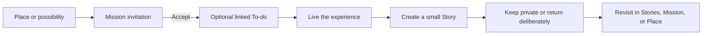

# Explore Missions and Stories System

## Context

Explore already creates a private record of traveled territory and is gaining a durable Places layer. The next opportunity is to turn the map from a passive record into a gentle loop: discover or receive something worth doing, make it actionable, capture what happened, and preserve or return the result. Missions, friend/family sharing, To-dos, media attachments, Places, and a future Stories capability can support that loop, but only if their responsibilities and privacy boundaries remain distinct.

The system should not be framed as a universal asset library. Files are reusable infrastructure; Stories are the meaningful objects people revisit. This brief defines the complete product and platform contract, then narrows the first build to one place-linked Mission whose result is a minimal Story.

## Target audience

`audience-aspirational-family-organizers` wants help creating and preserving meaningful family experiences without adopting a project-management system, a social network, or a family file repository.

## Representative persona

Maya wants to send a small local adventure to a child, invite a family member to tell a Story about a Place, or save something meaningful while traveling. She expects the invitation to be durable, the next step to be clear, the resulting Story to be easy to find, and the sharing boundary to be obvious. She does not want to watch another person’s location or configure content relationships manually.

Olive is the simplicity and child-safety stress test: the smallest successful result must be understandable as one photo and one sentence, with no asset, permission, or graph vocabulary.

## Aspirational design challenge

How might we help Maya turn a place into a private invitation, a doable experience, and a story worth revisiting or sharing—while keeping each object’s purpose, ownership, location use, and audience unmistakably clear?

## Hero JTBD

`jtbd-move-the-few-things-that-matter` is the demand spine because the system should move a meaningful family intention into lived action. A large media or location graph that does not help someone go, notice, preserve, or connect is not success.

## Job flow step

`job-flow-maya-move-family-life-forward` currently scores **Know the next doable action**, **Schedule or hand off**, and **Family participation** at 2/5. Explore can reveal territory, Activities can hold work, and sharing foundations exist, but Kwilt cannot yet carry one invitation coherently from Place through acceptance, scheduling, completion, Story, and return.

## JTBD framing

When a place might become a meaningful experience, Maya wants to invite herself or someone trusted into one clear action, let the recipient decide, and preserve the result with very little effort. The result should remain findable and shareable without exposing unrelated Stories, media, family data, or location behavior. This directly serves `jtbd-capture-and-find-meaning`, `jtbd-carry-intentions-into-action`, `jtbd-invite-the-right-people-in`, and `jtbd-trust-this-app-with-my-life` under the hero job.

## Design

### Product thesis

Kwilt should build a private **invitation-to-memory loop**:



The product is reductive when each object owns one durable question:

| Object | User-facing question | Authoritative responsibility |
| --- | --- | --- |
| Place | Where did or could this happen? | Geographic identity, label, user-approved meaning |
| Mission | What am I being invited to do? | Invitation, objective, participants, status, completion contract, result |
| To-do / Activity | When and how will I follow through? | Schedule, reminder, priority, responsible person |
| Story | What happened, and what is worth keeping? | Narrative, authorship, ordered media, people/Place context, audience |
| MediaAsset | How is the file stored and delivered safely? | Original, derivatives, technical metadata, upload state, technical owner |

`MediaAsset` is not a primary navigation concept. **Stories are the user-facing library.**

### Explore surface

The Explore map should reserve stable affordances for future behavior without allowing contextual content to rearrange controls:

- Bottom Places search remains fixed.
- A fixed vertical **Here** pill sits above the bottom-right edge: collect/name the current Place on top, recenter below.
- A separate persistent Mission button sits above the Here pill and opens the durable Mission inventory.
- Ordinary contextual Mission offers appear in an inset bottom guide. The guide covers the lower controls temporarily rather than pushing them upward. Ordinary offers use no modal scrim.
- Places is an optional map layer, separate from map style.
- Story indicators belong to the Places layer initially. Do not add a Stories map layer until users need independent control.
- Place sheets can show authorized linked Stories and eligible Missions.
- Fog hides unrevealed or unauthorized Place/Story/Mission visuals, hit targets, search results, labels, and accessibility elements. Authorization and revealed-territory checks are independent and both must pass.

### Mission inventory

The Mission button opens a durable destination:

| Section | Contents |
| --- | --- |
| Active | Accepted Missions awaiting a result |
| For You | Incoming invitations and private recommendations awaiting Accept/Pass |
| Sent | Invitations the user sent, with only explicitly shared mission-level state |
| Completed | Finished Missions with stable result links |

The launcher is persistent because Mission cards are durable. It should not show a pressure badge for generic recommendations. A restrained indicator may represent a new incoming person-to-person invitation that requires a decision.

### Mission creation and invitation

A Mission can begin from a Place sheet, the Mission destination, a Story request, or a future nearby recommendation.

The sender defines:

- a short objective;
- optional guidance;
- one Place in the first release;
- completion kind;
- optional target date;
- recipient or self; and
- what mission-level status the recipient will return if accepted.

Before sending, preview the exact invitation. Sending does not create work in the recipient’s To-dos and grants no Story, Place, or location access.

The recipient sees:

- who sent it;
- objective and Place context;
- what completion requires;
- what the sender can see before and after acceptance; and
- **Accept** and **Pass**.

Only acceptance creates recipient Mission participation.

### Mission state

```text
draft → invited → accepted → in_progress → completed
                  ↘ passed
         ↘ expired / revoked
```

Rules:

- Sender can edit a draft freely.
- An invited Mission is immutable except for revoke/expire; material changes require a new invitation or recipient re-acceptance.
- Pass is calm and final for that invitation; sender receives only the allowed mission-level result.
- Sender revocation before acceptance removes recipient access.
- Sender cancellation after acceptance ends the shared agreement but cannot delete recipient-authored Story or assets.
- GPS, geofence entry, upload completion, or linked To-do state never silently completes a Mission.
- Completion is an idempotent server-authorized mutation with a valid result matching the completion contract.

### Completion contracts

Mission completion behavior is typed rather than inferred:

```ts
type MissionCompletionKind =
  | 'confirmation'
  | 'visit'
  | 'media'
  | 'story';
```

The first release implements only `story`. The type exists to prevent later scavenger hunts or visits from becoming ad hoc boolean fields.

For `story`, completion requires one saved Story authored or explicitly contributed by the recipient and linked as the Mission result. The Story may be minimal:

- one photo plus one sentence;
- text only;
- one audio recording with optional title/transcript; or
- one video with optional sentence.

The initial learning scenario requires photo plus sentence while retaining text-only accessibility and permission-denial recovery.

### To-do projection

An accepted Mission may create a linked Activity so it can participate in Today, Plan, reminders, and responsibility.

The systems must not have competing status authority:

| Event | Mission behavior | To-do behavior |
| --- | --- | --- |
| Recipient accepts | Becomes Active | Create linked To-do if policy or recipient chooses |
| To-do date changes | No lifecycle change | Update schedule/reminder only |
| To-do checked first | Open/propose required Mission completion | Remain pending until result or explicitly unlink/cancel |
| Mission completes | Store result and completion receipt | Complete idempotently with Mission source receipt |
| Mission cancelled | End shared agreement | Cancel or unlink with visible explanation |
| To-do deleted | Mission remains Active | Remove planning projection only after confirmation |

The relationship is explicit, not duplicated fields on both objects. Mission owns objective, acceptance, completion, and result. Activity owns date, priority, reminders, recurrence policy, and responsible-person presentation.

Automatic To-do creation is a learning-release bet, not an irreversible platform rule. If recipients experience duplicate administration, replace it with **Add to To-dos** while retaining Mission durability.

### Story

A Story is an authored, revisitable object. It is not merely a collection of files and is not required to be long.

Minimum Story fields:

```ts
type Story = {
  id: string;
  ownerPersonId: string;
  primaryAuthorPersonId: string;
  title: string | null;
  body: string | null;
  occurredOn: string | null;
  status: 'draft' | 'saved' | 'deleted';
  createdAt: string;
  updatedAt: string;
};
```

Related facts live in typed tables rather than arrays embedded in the Story row:

- ordered assets;
- happened-at/about Places;
- attributed or mentioned people;
- contributors;
- direct-person or Space audience grants;
- Mission result; and
- optional Activity provenance.

Stories supports four simple starts:

- **Photo + sentence**
- **Record audio**
- **Video**
- **Write**

Permissions are requested only after selecting the related medium. After save, the Story has a stable detail destination and appears in Stories. Sharing is optional and separate from save.

### Stories library

The first library can be one chronological inventory with simple **Yours** and **Shared** filters. It should support search across authorized titles, captions, and transcripts.

A future **Requests** section may project Story-result Missions, but the Mission remains authoritative. Do not create a second Story-request state machine.

Story detail shows:

- author and contributors;
- ordered media and narrative;
- Place context when deliberately linked;
- audience summary with inspect/revoke;
- originating Mission when useful; and
- remove/delete actions with explicit scope.

### Place relationships

Use semantic relationships:

| Relationship | Meaning |
| --- | --- |
| Story `happened_at` Place | The event occurred there |
| Story `is_about` Place | The Place is the subject, even if recorded elsewhere |
| Asset `captured_at` Place | Optional precise capture context, private unless deliberately surfaced |
| Mission `at` Place | The invitation concerns this Place |
| Mission `resulted_in` Story | The Story satisfies completion |
| Activity `projects` Mission | The To-do schedules accepted work |

A Story can concern several Places, but the first Mission release uses one Place. Linking a Story to a Place never makes the Place visible to the Story audience unless the share preview includes that context.

At home, Place sheets may offer family context such as **Add a Story**, **Ask someone about this Place**, or an authorized old Story. While traveling, foreground region may scope nearby suggestions for the current session. Kwilt does not infer or persist a trip from distance alone and does not replace Saved Home meaning with a nearby candidate.

### Media infrastructure

The current `ActivityAttachment` implementation provides useful upload/download/delete machinery but is not the target domain model. It is Activity-owned, stores paths in the private `activity_attachments` bucket, and uses `sharedWithGoalMembers` as a broad object-specific sharing switch.

Extract reusable primitives while preserving existing behavior:

```ts
type MediaAsset = {
  id: string;
  ownerPersonId: string;
  kind: 'photo' | 'video' | 'audio' | 'document';
  originalStorageKey: string;
  mimeType: string | null;
  sizeBytes: number | null;
  durationSeconds: number | null;
  width: number | null;
  height: number | null;
  uploadStatus: 'pending' | 'uploading' | 'processing' | 'ready' | 'failed';
  checksum: string | null;
  createdAt: string;
  updatedAt: string;
};
```

Derivatives are separate records with purpose and processing state:

- thumbnail;
- display image;
- streaming/transcoded media;
- sanitized share derivative; and
- optional waveform/transcript artifacts.

Storage contract:

- Originals and derivatives live in private buckets.
- Storage keys use opaque asset IDs; filenames are presentation metadata, not authorization.
- Direct client listing is unavailable.
- Upload initialization and finalization are authenticated and idempotent.
- Retrieval returns short-lived signed URLs only after effective-access evaluation.
- Share derivatives remove exact EXIF coordinates and unnecessary device metadata.
- The private original is not sent when a sanitized derivative satisfies the experience.
- Clients cache according to authorization-sensitive policy and cannot treat an expired URL as durable access.

### Explicit relationship schema

Do not begin with a universal `object_type/object_id` link table. Use explicit typed relationships whose foreign keys, role values, uniqueness, and RLS can be tested:

| Table | Important fields | Purpose |
| --- | --- | --- |
| `stories` | owner, author, body/title, status | Durable narrative |
| `story_assets` | story, asset, role, order, caption | Ordered Story composition |
| `story_places` | story, place, relationship | `happened_at` or `is_about` |
| `story_people` | story, person, relationship | attribution/mention without implicit access |
| `story_contributors` | story, person, contribution role | Authorship and contribution rights |
| `story_audience_grants` | story, subject person/Space, access level | Explicit read/contribute access |
| `missions` | sender, objective, Place, completion kind, state | Durable invitation and result contract |
| `mission_recipients` | mission, recipient, state, timestamps | Recipient consent and lifecycle |
| `mission_story_results` | mission, recipient, story | Valid completion result |
| `mission_activity_links` | mission, recipient, activity | Planning projection |
| `media_assets` | owner, technical file state | Canonical file |
| `media_derivatives` | asset, purpose, storage key, status | Safe delivery forms |

An Activity-only file that is not a Story can continue through `activity_attachments` initially. Migration to canonical `media_assets` should be additive and compatibility-backed; do not rewrite existing attachment data as fake Stories.

### Access resolution

There is no global `MediaAsset.visibility`.

A viewer may retrieve an asset when at least one non-revoked authorized path exists:

1. viewer owns the asset; or
2. viewer can read a Story that references the asset; or
3. viewer can read the owning Activity attachment under its capability policy; or
4. a future typed container policy grants access.

Access through one path does not reveal other containers that reference the same asset. A viewer of a shared Story cannot discover that its photo also supports a private Activity.

The server owns access evaluation. RLS should keep base ownership and explicit relationship predicates understandable; signed-URL functions may perform the composed authorization transaction. Never authorize through client-supplied container type and ID without validating the typed relationship.

### Participation and sharing

Relationship state and content access remain separate:

- A Friend is a reusable recipient, not a standing audience.
- Household membership reveals no Stories by default.
- A named participation Space may hold a shared Story collection only after repeated shared value earns one.
- One-off direct sharing does not create a Space.
- A broader family Space and a Household are separate boundaries even when they contain some of the same people.
- A person may be a Story contributor without owning the Story.
- Mentioning/tagging a person does not grant access.
- Sender, author, owner, contributor, subject, recipient, and responsible person remain separate facts.

Story access levels should begin narrowly:

- `read`
- `contribute` for adding an explicitly reviewed contribution

Defer general co-editing and administrative roles.

The share preview states:

- exactly which Story is shared;
- whether Place label/context is included;
- which assets are included;
- who can view or contribute;
- whether the recipient may download/export; and
- what revocation can and cannot retract after export.

### Child participation and safety

Stories and Missions are optional child capabilities. Household membership or a child role does not activate them.

An accepted child-participation policy must define:

- who may invite the child;
- whether child-to-adult and child-to-child sending is allowed;
- which audiences the child may select;
- whether caregiver review is required by age/policy;
- blocking/reporting and safety exit;
- contribution ownership as the child becomes independent; and
- what deactivation hides, preserves, exports, or queues for cleanup.

The first production release may restrict child Mission recipients to approved Household people and direct returned sharing to the sender. It must not imply that every caregiver can browse all child Stories.

### Offline, conflicts, and idempotency

- Local Story drafts survive app restarts before upload.
- Asset upload initialization uses a client operation ID so retries do not create duplicate rows.
- Derivative processing is retryable and monotonic.
- Mission accept/pass/complete requires server acknowledgement; offline UI may show **Waiting to sync**, not final shared state.
- Safe Story editing may queue offline against an optimistic version.
- Concurrent Story edits use explicit version conflict handling; do not silently last-write-win ordered assets.
- Mission completion and linked To-do completion use source receipts and idempotency keys to prevent loops.
- Revocation and authority changes require server acknowledgement.

### Deletion, revocation, export, and retention

Every destructive action uses object-specific language:

| Action | Effect |
| --- | --- |
| Remove from Story | Delete `story_assets` relationship only |
| Delete Story | Delete Story relationships; retain other referenced assets; recoverably delete newly orphaned owned assets |
| Delete everywhere | Owner-only preview, then delete every authorized reference and underlying asset |
| Revoke Story access | End future authorized retrieval; do not claim exported copies are erased |
| Cancel Mission | End agreement; preserve recipient-owned result unless recipient deletes it |
| Delete Place | Remove/repair semantic Place links according to Places policy; do not delete Stories or assets |

Account export includes owned Stories, original assets where lawful, captions/transcripts, Place relationships, Mission invitation/participation/result records, contribution attribution, and audience/grant history needed to interpret the export.

Account deletion includes canonical assets and derivatives, not only the legacy Activity bucket. Shared copies versus live references must be explicit before implementation; this brief’s first release uses live references and explicit exports, not hidden copies.

### Search, AI, and metadata

- Search indexes only content the viewer is authorized to read.
- Revocation removes material from future search and AI retrieval indexes.
- Transcription is opt-in or clearly disclosed when audio/video is used.
- AI may help draft titles, captions, or questions from user-provided content, but never invents people, places, dates, or family facts as truth.
- AI output remains editable and attributable as assistance, not authorship.
- Agent requests show the participating Story/Place/Mission scope and use capability-owned mutations.
- Precise asset coordinates remain private technical metadata unless the user deliberately links a Place and previews that context.

### Analytics and observability

Product analytics may record coarse lifecycle facts:

- entry surface;
- Mission invitation/accept/pass/complete;
- Story draft/save/share/open;
- asset kind and count bucket;
- direct-person versus Space audience type;
- upload/processing error class; and
- revocation/deletion operation outcome.

Never send Mission text, Story text, transcript text, filenames, media contents, Place names, exact coordinates, recipient names, or relationship labels to analytics.

Operational logs use opaque IDs, bounded error metadata, retention limits, and access controls. Content inspection for support requires an explicit user-provided artifact or separately governed support flow.

### Notifications

- Invitation: one actionable notification with sender and safe Mission summary.
- Acceptance: sender may receive the explicitly promised mission-level state.
- Reminder: belongs to the recipient’s linked To-do and follows notification preferences.
- Completion/return: sender receives one notification only when a Story is deliberately returned.
- No arrival, route, dwell, camera-opened, upload-started, or draft-created notifications to another person.
- No streak, urgency, or guilt copy.

### Current implementation boundary

The following are currently reusable evidence, not completion of this brief:

- Explore and its private fog/recording contract.
- Places system design and Activity place links.
- Activity attachment file kinds, client upload states, private bucket, signed delivery, and deletion functions.
- Household identity/grant foundation.
- Existing shared-Goal and emerging Friend invitation concepts.
- Guided Overture’s conceptual photo-plus-sentence Stories offer.

Not currently implemented as one system:

- Stories capability and library;
- canonical cross-capability media assets and derivatives;
- Mission model/inventory/invitations/results;
- Story audience/contributor grants;
- Mission-to-To-do projection; or
- Explore Mission/Story UI.

### First learning release

Build one coherent promise: **Invite someone to explore one Place and bring back a small Story.**

Must be real:

- persistent Mission launcher and inventory;
- one recipient, one Place, `story` completion;
- Accept/Pass and no work before acceptance;
- linked To-do after acceptance;
- photo-plus-sentence Story capture and library;
- explicit keep-private versus return choice;
- one canonical Story reachable from Mission, Stories, and Place;
- typed media/relationship schema, signed delivery, offline upload, deletion/export;
- negative authorization, revocation, fog non-leakage, and signed-device media proof.

Intentionally defer nearby algorithms, multi-stop hunts, badges, raw asset library, live co-editing, public links, and AI-generated family history.

Detailed learning and evaluation contracts live in:

- [`04-learning-release.md`](../design-explorations/explore-missions-stories-system/04-learning-release.md)
- [`05-evaluate-learning.md`](../design-explorations/explore-missions-stories-system/05-evaluate-learning.md)

### Engineering sequence

1. Introduce canonical media primitives behind compatibility adapters for current Activity attachments.
2. Add Story, typed relationships, private capture, upload/derivative delivery, and library.
3. Add Mission invitation, recipient, result, and durable inventory.
4. Add Mission-to-Activity projection with idempotent reconciliation.
5. Add explicit Story return/audience grants and revocation.
6. Add Explore launcher, Place sheet integration, layer/fog behavior, and bottom-guide offers.
7. Prove export, account deletion, child policy, negative RLS, offline retry, signed-device metadata, battery, and TestFlight behavior.

Implementation plans should preserve these as independent checkpoints rather than creating the entire generic platform before the first Story exists.

## Success signal

Maya can send one place-linked invitation, Olive can understand and accept it, the linked To-do helps her remember it, and she can complete it with one photo and one sentence. Both can later find the same canonical Story in the expected place, and both correctly explain that Maya never saw Olive’s route, arrival, discarded media, private drafts, or unrelated Stories.

The job-flow score moves only after real use demonstrates improved follow-through and family participation. Infrastructure, schema, or a visually complete map alone does not change delivery.

## Open questions

- Should automatic linked To-do creation remain the default after the learning release, or become **Add to To-dos**?
- What child invitation/audience policy is acceptable for the first production cohort?
- Does a returned Story remain recipient-owned with a live share, or should users also be offered an explicit independent copy?
- Which original metadata, if any, is valuable enough to preserve privately after sanitized derivatives exist?
- When a Place is deleted or forgotten, should a Story keep a plain historical label, lose Place context, or ask the author?
- What evidence would justify a raw **Media** library rather than only **Add from Kwilt** inside composers?
