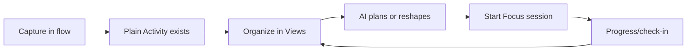
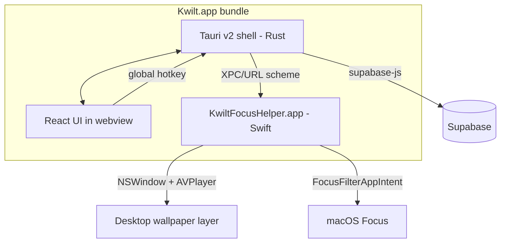

## PRD — Kwilt Desktop App (v1)

### Purpose

Design a Mac-only Kwilt desktop app as the full-power workspace for Arcs, Goals, Activities, Views, AI planning/chat, and Focus. Mobile remains the lightweight daily companion; desktop is where users organize, plan, execute, and reshape their Kwilt system. Use Tauri v2 (TS/React + Rust) as the primary shell and a tiny Swift sidecar for the features that genuinely need AppKit (Focus Filter extension + wallpaper video layer). Share types and data access with the mobile app via a new `@kwilt/sdk` workspace package and reuse the existing Supabase auth + PAT infrastructure.

### References

- Mobile app theme source: `src/theme/*`
- Mobile AI client + quotas: `src/services/ai.ts`, `docs/prds/ai-proxy-and-quotas-prd.md`
- Mobile auth + Supabase storage adapter: `src/services/backend/auth.ts`, `src/services/backend/supabaseAuthStorage.ts`
- Existing edge functions: `supabase/functions/ai-chat/index.ts`, `supabase/functions/pats-create/index.ts`
- Entitlements: `src/services/entitlements.ts`
- Web tokens target: `kwilt-site/`

---

## 0. Product thesis, wedge, and non-goals

### Why this app exists

Mobile Kwilt is the lightweight daily companion: check-ins, on-the-go capture, quick review, and habit-level progress. The knowledge worker's actual planning and execution environment is the Mac. Desktop is where Kwilt can become a richer command center: dense views, keyboard-first editing, AI-assisted planning, and Focus sessions tied to real work.

**One-line thesis.** *Kwilt Desktop is the command center for shaping your life system: capture fast, organize deeply, use AI as an operator, and enter Focus when it is time to execute.*

### Wedge

Three differentiated moments, with one clear rule: quick capture stays simple, while the desktop workspace carries the power.

1. **Full-power workspace.** Desktop exposes Arcs, Goals, Activities, and user-defined Views / View configurations in a dense, keyboard-first interface. The wedge vs mobile is not parity; it is leverage.
2. **AI operator.** AI chat is not only a coach. It can inspect, explain, plan, and modify the user's Kwilt system with permission: make views, clean up activities, build goal plans, suggest focus blocks, and summarize progress.
3. **Capture + Focus loop.** The global hotkey creates a plain Activity reliably from anywhere. Focus mode turns selected Activities into an environment for execution.

Everything else (tray, preferences, onboarding, distribution) is supporting infrastructure so the command center feels trustworthy.

### Retention loop



The loop only works if (a) capture never fails (offline-first), (b) the workspace makes the user's system easier to understand and edit than mobile, (c) AI actions are inspectable and reversible, and (d) Focus delivers on the emotional promise (motion/sound design budget). Each of these drives a non-negotiable earlier in this plan.

### Success metrics (v1 targets, to be tuned)

- **D7 retention:** ≥45% of installers active day 7 (mobile-app baseline comparison).
- **Captures / DAU:** ≥4, median.
- **Activities acted on / WAU:** ≥5 created, edited, completed, planned, or focused.
- **Views used / WAU:** ≥2 distinct saved or system Views opened.
- **AI operator successful actions / WAU:** ≥2 accepted plans, edits, summaries, or view changes.
- **Focus sessions / WAU:** ≥2.
- **Time to first capture after install:** <90s, p50.

Every M3+ analytics event maps to one of these.

### Explicit boundaries for v1

- **Todo / Activity management is core.** Activities are the main work-object on desktop and should support todo-like workflows: quick add, list management, completion, planning, grouping, filtering, and Focus handoff. The open naming question is whether "Activity" remains user-facing or becomes "Todo" / "Task" in desktop surfaces.
- **Calendar planning matters.** Mobile already has a day-planning calendar surface; desktop should eventually make calendar-style planning better, not ignore it. v1 should avoid becoming a full external calendar replacement, but scheduled Activities, day planning, and calendar-aware Views are in scope.
- **Focus should welcome timer people.** Focus mode is timer-based and should appeal to Pomodoro users. The distinction is that Kwilt Focus is not limited to strict 25/5 discipline mechanics; it can support Pomodoro-like presets while keeping the larger emotional / environmental Focus promise.
- **Not an email/Slack client or notifier.** Desktop may help turn commitments from those tools into Activities, but it should not become an inbox for external messages.
- **Not a Notion/Obsidian competitor.** Kwilt can hold notes, plans, and AI summaries around life/work objects, but long-form knowledge-base authoring is not the v1 center.
- **Not a pixel-for-pixel clone of mobile.** Desktop is the power surface, so it can expose denser Views, richer editing, and AI-operated workflows while mobile stays the daily companion. **Data-model parity is a floor, not the ceiling:** all mobile object types (Arcs, Goals, Chapters, Activities, Check-ins, Tasks) remain readable and editable on desktop (see §4.7).

Keeping these as explicit non-goals protects the command-center scope from turning into generic productivity software.

### Pricing stance (v1)

**Desktop app is free for all Kwilt users.** Pro gates the premium Focus scene library and raises heavy AI operator / enrichment usage. Rationale: desktop is a growth surface for mobile Pro, not a standalone revenue product. Free desktop → daily planning and execution → natural upsell once the user values AI planning and Focus sessions. Non-Pro users still get core workspace, quick capture, and 1–2 Focus scenes.

## 1. Stack recommendation

**Primary shell: Tauri v2.** Rust core + React/TypeScript webview UI. You already live in TS/React across [Kwilt mobile](../../package.json) and [kwilt-site](../../../kwilt-site/package.json), and Cursor/Composer is strongest on TS + Rust. Tauri gives:

- Small binary (~10–20 MB vs Electron's ~200 MB)
- System tray / menu bar icon, global hotkey, autoupdater, deep-link handler — all first-party Tauri v2 plugins
- Native macOS hooks when needed (`tauri::AppHandle` + `cocoa`/`objc2` crates or Swift sidecar via XPC)

**Native Swift sidecar (`KwiltFocusHelper.app`)** — bundled inside the Tauri `.app` as a login-item-capable helper. Only hosts the two features that AppKit demands:

1. **Focus Filter App Extension** — required to integrate with System Settings → Focus. You cannot programmatically toggle macOS Focus, but you *can* ship a Focus Filter the user enables inside e.g. a "Deep Work" Focus that calls back into your helper to start/stop Kwilt's focus session. This API is Swift-only (`INFocusStatusCenter` / `FocusFilterAppIntent`).
2. **Portal-style wallpaper window** — an `NSWindow` positioned at `CGWindowLevelForKey(kCGDesktopIconWindowLevel) - 1` with an `AVPlayerLayer` for video and `AVAudioEngine` for spatialized audio. This is not achievable from a sandboxed webview with acceptable quality.

Everything else — UI, auth, quick-capture popover, workspace, Views, AI chat, settings, onboarding, checkout — is TS in the Tauri webview. **~90% of development in Cursor-friendly TS.**



## 2. Repo layout

Add a sibling repo **`/Users/andrewwatanabe/kwilt-desktop`** (keep it separate from the Expo repo — different toolchain, different release cadence). Inside `Kwilt/`, promote shared code into a new workspace package so both clients depend on it.

- `Kwilt/packages/kwilt-tokens/` *(new)* — pure TS constants + Tailwind preset. Sourced from `src/theme/colors.ts`, `src/theme/typography.ts`, `src/theme/spacing.ts`, `src/theme/motion.ts`, `src/theme/surfaces.ts`, `src/theme/overlays.ts`. Mobile's `src/theme/*` files become thin re-exports so the three clients (mobile, web, desktop) can never drift on color, spacing, typography, or motion.
- `Kwilt/packages/kwilt-sdk/` *(new)* — pure TS: Supabase client factory, typed queries for `goals`, `tasks`, `arcs`, `chapters`, `activities`; copy from `src/services/backend/supabaseClient.ts`, `src/services/ai.ts`, `src/services/checkins.ts`, `src/services/goalFeed.ts`, and the domain types under `src/domain/`. Mobile imports this from `@kwilt/sdk` instead of relative paths.
- `kwilt-desktop/`
  - `src-tauri/` — Rust: hotkey, tray, deep-link, keychain, window management, IPC to Swift helper.
  - `src/` — React + Vite + Tailwind (with `@kwilt/tokens` preset) + shadcn/ui primitives, consuming `@kwilt/sdk` for all data access.
  - `helper-mac/` — Xcode project producing `KwiltFocusHelper.app` (menu bar-less LSUIElement) + `KwiltFocusFilter.appex` extension. Built by a `build.rs` step and copied into the Tauri bundle's `Contents/Library/LoginItems/`.

## 3. Auth — how it works alongside mobile

Reuse the existing Supabase project, providers (Apple/Google), and custom domain `auth.kwilt.app`. Do **not** invent a new auth mechanism.

**Flow on desktop:**

1. User clicks "Continue with Apple" / "Continue with Google" in the Tauri UI.
2. App generates PKCE verifier, opens the system browser to `https://auth.kwilt.app/auth/v1/authorize?…&redirect_to=kwilt-desktop://auth/callback`. Mirror logic from `src/services/backend/auth.ts` (`signInWithProvider`).
3. macOS routes the `kwilt-desktop://auth/callback?code=…` URL back to the Tauri app via `tauri-plugin-deep-link` (requires adding the scheme to `Info.plist` `CFBundleURLTypes` and allowlisting it in Supabase → Auth → URL Configuration).
4. Tauri calls `supabase.auth.exchangeCodeForSession(code)`, stores the session in the **macOS Keychain** via the Rust `keyring` crate (one entry per key: `kwilt.supabase.auth.access`, `…refresh`, `…expires_at`).
5. `supabase-js` is instantiated in the Rust-hosted webview with a custom `storage` adapter that calls Tauri IPC to read/write those Keychain entries — same pattern as `src/services/backend/supabaseAuthStorage.ts`, just a different backing store.

**Key design choices:**

- **Separate storage key per client.** Mobile uses `kwilt.supabase.auth`; desktop uses `kwilt.supabase.auth.desktop` in Keychain — prevents cross-device session confusion and lets a user sign out of desktop without killing mobile.
- **No PAT for user-facing flows.** You already have `supabase/functions/pats-create` — keep that for MCP/external agents. Desktop uses the user's real JWT so RLS and audit logs work identically to mobile.
- **One-tap "Sign in with your iPhone" shortcut** *(optional v1.1)*: show a QR code that the mobile app can scan to vend a short-lived JWT via a new `desktop-pair` edge function. Nice, but not required for v1.

**Supabase config changes needed:**
- Add `kwilt-desktop://auth/callback` to the Redirect URLs allowlist.
- Add `kwilt-desktop` to Additional Redirect URLs in the Apple/Google provider configs if they whitelist per scheme.

## 4. UI architecture

### 4.1 North-star shell model

Kwilt Desktop should borrow the interaction architecture of Codex's desktop UI: a calm collapsible left rail, an active agent/workspace column, and a right-side canvas for structured work. The product is different, but the spatial model is right for Kwilt's command-center ambition.

```text
left rail            workspace / agent surface             canvas / detail surface
navigation           conversation, activity stream,        selected object, View,
projects/views       AI action cards, quick edits          document, table, plan
```

Non-negotiables:

- **Collapsible left rail.** Primary navigation lives in a quiet rail that can compress without disorienting the user. It holds top-level areas (Today, Activities, Goals, Arcs, Views, Plan, Focus, Friends), recent Views, and lightweight system actions.
- **Workspace middle column.** The middle area is the user's active work stream: selected View rows, AI operator chat, activity history, action cards, and short-form editing. It should feel like a place to work, not a marketing dashboard.
- **Right canvas.** The right side hosts the durable object/detail canvas: Activity detail, Goal plan, Arc overview, View configuration, generated plan, or document-like AI summary. It can open/close or resize without taking over the app.
- **Fluid surface choreography.** Opening and closing rails, agent panels, inspectors, and canvases should animate with shared motion tokens. Motion should be quick, soft, and confidence-building: no snapping, no jarring layout jumps, no modal pileups for primary work.
- **Soft geometry.** Use restrained radii and subtle borders similar to Codex: small cards and rows around 8px, larger panels around 10-12px, with gentle separators instead of heavy outlines.
- **Quiet density.** The interface should be dense enough for repeated daily work while still having breathing room. Avoid oversized hero sections, decorative cards, and one-note marketing composition.

### 4.2 Surface-to-layer mapping (app-shell + canvas rule)

The app-shell / canvas layering rule (primary nav + canvas margins for the "main" experience; chromeless for utilities) applies per-surface. Classify up front so every later PR knows which chrome it inherits.

| Surface | Layer | Notes |
|---|---|---|
| Main window (Today, Activities, Goals, Arcs, Views, Plan, Focus, Friends) | **Rail + Workspace + Canvas** | Collapsible rail for navigation, middle workspace for active lists / AI operator, right canvas for details and View configuration. Full object coverage — see §4.7. Desktop-native density and keyboard flows, not a mobile clone. |
| Menu bar tray popover | Chromeless utility | `NSStatusItem`; left-click popover shows today summary + quick actions; right-click quick menu. No shell. |
| Quick-capture HUD | Chromeless, single-focus | Borderless, centered, `alwaysOnTop`. Single input, Esc closes, Return submits. No shell. |
| Command palette (⌘K) | Chromeless, single-focus | Same window class as quick-capture; different mode. Fuzzy jump to object/View, start focus, create object, run common AI actions, preferences. |
| Preferences (⌘,) | Own chrome | Single-instance window, sidebar categories (Account, Hotkeys, Focus scenes, Notifications, Advanced). No global app shell. |
| Focus mode HUD | Chromeless immersive | Intentionally breaks the app-shell rule — this is the signature brand moment, designed for minimal distraction. |
| Onboarding | Full-screen wizard | Own chrome; drives first-run permission + hotkey setup sequence. |

### 4.3 Design-system strategy

Three UI universes exist today: mobile's mature `src/ui/` (60+ RN components) + tokens in `src/theme/`; web's seven shadcn primitives in `kwilt-site/components/ui/`; desktop has nothing.

- **Tokens are shared.** `@kwilt/tokens` is the single source of truth for color, type, spacing, motion, surface, and overlay scales. Both web and desktop consume its Tailwind preset; mobile's `src/theme/*` re-exports from it.
- **Primitives are per-platform, API-aligned.** v1 desktop uses shadcn/ui, extending `kwilt-site`'s set as needed. Names and prop shapes stay close to mobile primitives (`Button`, `Card`, `Stack`, `Heading`, `Input`, `Dialog`, `Toast`) so concepts transfer. v1.5 target: extract `@kwilt/ui-web` if reuse between desktop and site proves meaningful.
- **Density.** Desktop lists run ~2× denser than mobile; define desktop-specific `ListRow` and `MasonryTile` variants rather than scaling RN components.
- **Dark + light modes** tied to the system; `tauri-plugin-theme` plus `@media (prefers-color-scheme)` for webview CSS. No in-app theme toggle in v1.

### 4.4 macOS HIG conformance (non-negotiables for v1)

- **Vibrancy + materials.** Left rail can use `NSVisualEffectView` via `tauri-plugin-window-vibrancy`; workspace/canvas panels use webview surfaces with tokenized backgrounds and borders; HUD surfaces use the `hudWindow` material.
- **Traffic lights + titlebar.** Main window: default traffic lights, transparent titlebar integrated with sidebar. HUDs: `titleBarStyle: "overlay"` with no traffic lights.
- **Keyboard-first navigation.** Every row focusable; ⌘F per canvas; Esc dismissal conventions; Return/Enter to commit; Tab cycles; arrow-key row navigation in lists. Exported Tailwind focus-ring utility drives consistency.
- **Multi-window model.** Quick-capture HUD and command palette are singletons (pre-warmed). Preferences is a singleton. Goal detail opens in the main window by default; `⌘-click` opens it in a new window. Focus HUD uses `.canJoinAllSpaces`.
- **Drag-and-drop.** Files dropped onto a goal row → attach via `attachments-init-upload` edge function. Dropped images on a check-in composer → inline attach. Dropping on the dock icon opens quick-capture pre-filled with the payload.
- **Spotlight-style fuzzy search** for the command palette and goal picker, not substring matching.
- **System menu bar.** Full `NSMenu` with Kwilt, File (New Capture, New Check-in, New Goal), Edit, View, Window, Help. All commands have keyboard shortcuts.

### 4.5 Motion + sound (the Portal-class brand moment)

The Portal comparison is primarily a motion/audio brand statement, not a feature list. Treat it as such.

- **Motion tokens in `@kwilt/tokens/motion`** define the shared easing curves and durations. Desktop gets a richer set than mobile (GPU-friendly spring animations for window transitions, scene cross-fades).
- **Focus enter/exit** is a scripted cinematic: desktop icons fade out, wallpaper layer cross-fades from current desktop, audio fades in over 2–3s. Exit reverses. This sequence is what sells the product on first demo.
- **Subtle UI sounds** (capture confirm, goal complete, focus tick) respecting `NSWorkspace.accessibility.reduceMotion` and system mute; off by default, on for Pro with easy toggle.
- **Celebration moments** translate mobile's GIF/haptic celebrations into desktop equivalents: confetti particle layer on `<canvas>`, gentle window bounce, optional sound.

### 4.6 First-run & permission onboarding

Getting this wrong is the #1 cause of Mac app churn. Explicit sequence:

1. Sign-in (§3).
2. Hotkey picker. Default `⌘⇧Space`; detect Raycast/Spotlight conflicts by probing `defaults read com.apple.symbolichotkeys` and offer alternatives.
3. Accessibility permission prompt (required for global hotkey in some macOS versions).
4. Notifications permission.
5. Focus Filter install CTA: deep-links to System Settings → Focus with brief instructions.
6. First capture walk-through: trigger the hotkey, show the popover, type "Try Kwilt desktop" → demo the assignment.
7. Optional: install Login Item to start Kwilt at login.

Each step is skippable and re-accessible from Preferences.

### 4.7 Object coverage (data-model parity with mobile)

Desktop is not a reduced surface — it must let the user read, create, edit, and navigate **every first-class object in the Kwilt data model**, the same ones mobile exposes. The wedge narrows what's *featured* (capture + focus); it does not narrow what's *accessible*.

| Object | Desktop surface in v1 | Source of truth |
|---|---|---|
| **Arcs** | Browsable list + detail view; inline rename + status change; create from ⌘K or File → New Arc. | `arcs` table, mirrors mobile `src/services/arcs*` patterns. |
| **Goals** | Browsable list, filterable by Arc / Chapter / status; detail view with check-ins, tasks, attachments; inline check-in composer. | `goals` table + `src/services/goalFeed.ts` logic lifted into `@kwilt/sdk`. |
| **Chapters** | Nested under each Goal detail view; standalone "All Chapters" timeline surface accessible via sidebar or ⌘K. Create/edit chapters inline from a Goal. | `chapters` table + domain types from `src/domain/`. |
| **Activities** | Dedicated power surface with list, kanban-style groupings, filters, saved Views, inline edit, batch actions, and scoped rails inside each Goal/Arc detail view. Quick capture creates plain Activities. | `kwilt_activities` domain sync table via `@kwilt/sdk`. |
| **Views / View configurations** | First-class desktop feature: saved filters, sorts, grouping, visible fields, density, and focus presets for Activities and Goals. System Views include Today, Unplanned, Recently Captured, Blocked, and Focus Candidates. | New View config model in `@kwilt/sdk`; can start local-first before backend sync if needed. |
| **Check-ins** | Create from Goal detail view, mobile, or ⌘K. Past check-ins readable inline on each Goal. Quick capture does not auto-convert text into check-ins. | Mobile `src/services/checkins.ts` logic lifted into `@kwilt/sdk`. |
| **Tasks** | Existing task-like Activities listed in Today, nested under Goals, and surfaced in the Focus HUD. Create from quick capture or inline from a Goal. | Activity model (`type: task`); no new task table. |
| **Friends / social** | Basic read-only v1: friends list, their shared goals, and activity. Writes (invites, messages) stay on mobile in v1. | Existing social tables. |

**Implementation rule.** Every one of these is reachable (a) from the left sidebar or ⌘K, (b) via deep link (`kwilt-desktop://arc/<id>`, `…/goal/<id>`, `…/chapter/<id>`, `…/activity/<id>`, `…/view/<id>`), and (c) from AI operator actions with explicit user approval before writes. Quick capture creates plain Activities only. The SDK package (`@kwilt/sdk`) MUST export typed read + write helpers for all of them on day one — see §2 repo layout.

**Non-goals for v1 (desktop-specific reductions).**
- No Arc/Goal archive management UI beyond a toggle filter (bulk ops stay on mobile).
- No rich-media check-in composer (voice memos, long photo carousels) — desktop composer is text + drag-dropped attachments only.
- No friends write operations (invites, shared-goal creation, social reactions) — read-only in v1, writes stay on mobile.

## 5. Use case 1 — quick capture

**UX:** default hotkey `⌘⇧Space` (user-configurable; warn if it collides with Raycast/Spotlight). Shows a small centered Tauri window (`alwaysOnTop`, transparent, no titlebar) with one input. Enter creates a basic Activity. Esc dismisses. The window animates in in <80ms (keep it a pre-created hidden `WebviewWindow` you just `.show()` — don't cold-start per invocation).

**Implementation:**
- `tauri-plugin-global-shortcut` for the hotkey.
- `tauri-plugin-window-state` not needed (capture is always centered).
- A new edge function **`supabase/functions/create-activity/index.ts`**:
  - Input: `{ title: string, idempotencyKey: string }`.
  - Authenticates with the user's JWT.
  - Writes one mobile-compatible Activity JSON blob to `kwilt_activities` with `type: task`, `status: planned`, `goalId: null`, and `creationSource: manual`.
  - Returns the created Activity id. Replays with the same idempotency key return the existing row.
- AI enrichment is a follow-up pass after the Activity exists; quick capture itself never waits on interpretation.

## 6. Use case 2 — AI operator and planning chat

Desktop's AI is not hidden inside the hotkey. It is a visible operator inside the workspace: a chat/planning surface that can inspect the user's Arcs, Goals, Activities, Views, and recent progress, then propose or apply changes with explicit approval.

### 6.1 Core AI jobs

The first desktop AI jobs should be operational, not mystical:

- **Plan from a Goal:** turn a Goal into a sequenced set of Activities, checkpoints, and suggested Views.
- **Organize captured work:** review uncategorized / unplanned Activities and suggest grouping, priority, schedule, tags, or related Goals.
- **Create and edit Views:** build a View from natural language, e.g. "show me blocked work items for Health and Career, grouped by Goal."
- **Clean up the system:** suggest duplicate Activities, stale Goals, overloaded Views, and missing next actions.
- **Focus recommendation:** pick a good Activity for the next Focus session based on energy, deadlines, and recent progress.
- **Explain the system:** answer "what changed this week?", "what am I avoiding?", or "what should I do next?" using actual Kwilt state.

### 6.2 Permission model

AI can draft freely, but writes are explicit and inspectable.

- Read access uses the signed-in user's normal Kwilt data scope.
- Any write action is previewed as a structured diff: create Activity, update Goal, create View, archive item, etc.
- User can accept all, accept selected changes, or ask the AI to revise.
- Bulk actions include an undo trail where feasible.
- AI never silently moves quick-captured Activities into Goals as part of hotkey submission.

### 6.3 Chat surface

The AI chat should feel like a desktop workbench, not a mobile coach bubble:

- persistent conversation rail or panel in the main window
- object-aware context picker (current View, selected Activities, selected Goal, whole workspace)
- structured action cards for proposed changes
- "apply" buttons that call typed `@kwilt/sdk` mutations
- links back to affected objects and Views
- compact summaries that can be pinned to a Goal or View

### 6.4 Privacy and context

The AI operator only needs Kwilt state by default. Context from macOS is optional and later:

- `activeAppName` may be opt-in for Focus/session recommendations.
- Window titles, browser URLs, clipboard, and screenshots are not collected in v1.
- Any future app-context collection must show a visible indicator and have a Preferences toggle.

### 6.5 Cost model

Gate heavy AI operator usage behind Pro, aligned with mobile's existing quota model from `docs/prds/ai-proxy-and-quotas-prd.md`. The free tier should include enough AI planning to show value, while core workspace, Views, quick capture, and basic Focus remain useful without AI.

The hotkey always works because quick capture creates a plain Activity without an AI call.

## 7. Use case 3 — Focus mode (Portal-style)

**What "Focus mode" does in v1:**
- Dims the menu bar (hide it via `NSApplication.presentationOptions`), hides desktop icons (`defaults write com.apple.finder CreateDesktop -bool false`, restore on exit).
- Plays a full-screen looping video + ambient audio that **sits behind your app windows and desktop icons** — this is the Portal trick.
- Optionally triggers macOS Focus via a **Focus Filter** the user pre-configures.
- Shows an unobtrusive HUD with: current task from capture queue, timer, now-playing, stop button.

**Wallpaper layer implementation (Swift helper):**

```swift
let window = NSWindow(contentRect: screen.frame, styleMask: .borderless, ...)
window.level = NSWindow.Level(rawValue: Int(CGWindowLevelForKey(.desktopIconWindow)) - 1)
window.collectionBehavior = [.canJoinAllSpaces, .stationary, .ignoresCycle]
window.isOpaque = false
window.ignoresMouseEvents = true
let player = AVQueuePlayer(...); let layer = AVPlayerLayer(player: player)
window.contentView?.layer = layer
```

The Tauri side sends the selected scene ID to the helper via an `xpc` mach service (cleanest) or a localhost `unix:` socket (simpler). Helper owns the `NSWindow` so it survives Tauri reloads.

**Focus Filter integration:**

Ship `KwiltFocusFilter.appex` implementing `FocusFilterIntent`. When the user creates a Focus (e.g. "Deep Work") and adds the Kwilt filter, macOS will call our intent on enter/exit, which fires an event back through `NSWorkspace` notification to the helper, which tells Tauri to enter/exit focus mode. This is the only correct way to integrate with system Focus — apps **cannot** toggle Focus themselves.

**Premium video/audio backgrounds:**

- Store scenes as MP4 (HEVC) + AAC in Supabase Storage, gated by the same RevenueCat entitlement your mobile paywall uses. See `src/services/entitlements.ts`.
- Cache scenes locally under `~/Library/Application Support/Kwilt/scenes/` with a manifest file; prefetch on Focus-start.
- Free tier gets 1–2 static gradients + a lofi loop; Pro gets the full library.
- RevenueCat has a web/Stripe offering; desktop checkout opens `https://kwilt.app/account/subscribe?ret=kwilt-desktop://checkout/return` in the browser. Your mobile Pro users already get Pro on desktop via the entitlement lookup.

## 8. Build, distribute, autoupdate

- **Signing:** Developer ID Application + Developer ID Installer, notarize via `notarytool`. The extension and helper must be signed with the same team ID and "inherited" entitlements.
- **Distribution:** direct DMG download from `kwilt.app/download` + Homebrew cask (trivial once signed). Skip the Mac App Store in v1 — the wallpaper window level and login-item helper are cleaner outside the sandbox.
- **Updates:** `tauri-plugin-updater` with a static JSON manifest on the kwilt-site CDN.
- **CI:** GitHub Actions macOS runner; secrets for signing cert + notary API key.

## 9. Milestones

Total ≈ 10 engineer-weeks assuming one focused engineer. Double it for solo while maintaining mobile.

- **M0 (0.5 week) — design tokens + primitives.** Extract `@kwilt/tokens` from `src/theme/*`; wire Tailwind preset; stand up the shadcn primitive set desktop needs (Button, Card, Input, Dialog, Toast, Popover, Command, Tooltip, Sheet). Mobile's theme becomes a thin re-export. Lands before any feature PR so every later surface builds on the same visual foundation.
- **M1 (1.5 weeks) — skeleton + auth + onboarding shell + distribution spike + observability.** Tauri app boots, system tray, global hotkey opens a stub popover, Supabase OAuth round-trip works, session in Keychain. First-run onboarding flow (sign-in → hotkey → permissions) wired with stubs. **Codesigning spike** proves a signed + notarized Tauri `.app` can ship with a signed empty Focus Filter `.appex` and a signed login-item helper, and that a dev-iteration loop exists — if not tractable, scope-change the Focus Filter to "in-app start button only" before M4. **PostHog wired** for hotkey_fired / capture_submitted / error_* events. **Testing harness** (cargo test, Vitest, Playwright smoke, Swift XCTest) wired into CI.
- **M2 (1.5 weeks) — quick capture end-to-end, offline-first.** `create-activity` edge function, chromeless HUD popover, Enter submits → plain `kwilt_activities` row → toast confirmation. A local queue buffers pending Activity creates when offline; drains with idempotency keys on reconnect so the hotkey never silently fails. Post-create AI enrichment is a follow-up slice.
- **M3 (2 weeks) — command-center workspace + Views.** App-shell main window (sidebar + canvas). Sidebar order: Today, Activities, Goals, Arcs, Views, Plan, Focus, Friends. Full data-model parity with mobile (see §4.7), plus desktop-native saved Views / View configurations for filters, grouping, visible fields, density, and focus candidates. Activities get the richest surface first: list, grouped/kanban-style views, inline edit, batch actions, and deep links. ⌘K command palette jumps to any object or View and creates common objects. Success metrics dashboard in PostHog live before milestone closes.
- **M4 (2 weeks) — AI operator and planning chat.** Persistent AI workbench in the main window. Object-aware context picker, structured action cards, apply/revise flow, typed `@kwilt/sdk` mutations, undo trail where feasible. Core jobs: plan from Goal, organize captured work, create Views, clean up stale items, recommend Focus candidates, explain recent progress.
- **M5 (2 weeks) — Focus mode.** Swift helper + wallpaper window + built-in scenes. Focus Filter extension (or scoped-down fallback if M1 spike said so). Focus HUD. Signature enter/exit motion sequence. Battery-saver mode (dim/pause on battery, HEVC hardware only). Pro gating on premium scenes.
- **M6 (1 week) — preferences, polish, signing, notarization, autoupdate, internal beta.** Preferences window (⌘,), tray popover with today summary, motion/sound pass, dark/light parity audit, drag-and-drop attachments, accessibility pass, Developer ID signing, notarytool, `tauri-plugin-updater` manifest on kwilt-site CDN, and Sparkle-style alpha channel for internal testers.

## 10. Open items to decide later (not blockers for v1)

- Windows port — most of v1 code (Rust + TS) ports cleanly; only the Swift helper is Mac-only. Windows Focus-Assist integration is a separate design.
- Raycast extension as a lighter-weight alternative entry point for quick-capture — it hits the same `create-activity` endpoint, so zero server-side work for the M2 contract.
- QR-pair sign-in from the iPhone app for installs without typing a password (§3 footnote).
- Whether AI operator history should sync across mobile and desktop, or remain desktop-local in v1.

## 11. Testing, telemetry, and success metrics

### 11.1 Testing foundation

Wired in M1 so it grows alongside the code, not retrofitted in M5.

- **Rust (src-tauri):** `cargo test` for command handlers, deep-link parsing, keychain adapter, and native shell behavior. TypeScript tests cover the current local queue.
- **TypeScript UI:** Vitest + React Testing Library for hooks and components. Snapshot-test tokens → Tailwind class mapping to catch drift.
- **E2E:** Playwright against the Tauri webview for the golden paths — sign in, hotkey capture, edit Activity, create View, ask AI to draft changes, start focus. Runs on the macOS CI runner.
- **Swift helper + extension:** XCTest for wallpaper window lifecycle and FocusFilterIntent round-trip.
- **QA matrix:** macOS 13 (min), 14, 15, and current beta, on both Intel and Apple Silicon. Codified as a pre-release checklist in `kwilt-desktop/QA.md`.

### 11.2 Telemetry (PostHog, shared project with mobile)

Core events from M1; shared schema with mobile so funnels cross surfaces.

- `hotkey_fired { ms_to_popover }`
- `capture_submitted { chars }`
- `activity_created { source: "quick_capture" | "workspace" | "ai_operator" }`
- `view_opened { view_type, is_saved }`
- `view_created { source: "manual" | "ai_operator" }`
- `ai_operator_action_proposed { action_type, object_count }`
- `ai_operator_action_applied { action_type, object_count }`
- `focus_started { scene_id, duration_planned, is_pro }`
- `focus_ended { duration_actual, reason: "user_stop" | "timer" | "crash" }`
- `error_* { surface, code, message_hash }`

### 11.3 Success metrics (tied to §0)

Dashboard stood up in PostHog before M3 closes so we don't fly blind through the highest-stakes milestone:

- D7 retention of installers
- Captures / DAU (median + p90)
- Time-to-first-capture post-install (p50)
- Activities acted on / WAU
- Saved Views used / WAU
- AI operator actions proposed → applied conversion
- Focus sessions / WAU
- Focus session completion rate (ended via timer, not user_stop)

## 12. Risks + mitigations

| Risk | Likelihood | Impact | Mitigation |
|---|---|---|---|
| Codesigning Tauri + `.appex` + helper doesn't compose cleanly | High | High | M1 spike; fallback path = in-app-only focus start, no Focus Filter |
| Wallpaper layer tanks battery on MacBooks | Med | High | Battery-saver mode in M4 (dim/pause on battery, HEVC hardware only, 30fps cap); measure in internal beta |
| RevenueCat cross-platform entitlements unreliable for desktop | Med | Med | Verify with test accounts during M4 Pro-gating work; fall back to Stripe-direct if needed |
| Default ⌘⇧Space conflicts with Raycast/Spotlight → users give up at onboarding | Med | High | Collision detection + pre-selected alternate; onboarding telemetry to see drop-off |
| AI operator proposes low-trust changes | Med | High | Structured diffs, explicit approval, partial accept, undo trail, and no silent writes |
| Tauri deep-link plugin flakiness on first install | Low | Med | Manual test matrix; fallback "enter code" flow if deep-link doesn't fire within 10s |
| Supabase session storage adapter races with webview reloads | Low | Med | Mirror the mobile flush-before-suspend pattern from `src/services/backend/supabaseClient.ts` |
| Focus Filter Extension needs macOS 13+ → cuts out older users | Low | Low | Minimum macOS 13 is already industry-standard; document + gate feature below |

## 13. Rollout plan

- **Internal alpha (post-M6):** signed DMG + Sparkle alpha channel to a private list of Kwilt Pro users (10–20).
- **Private beta (2 weeks after):** waitlist form on kwilt.app/desktop; invite in batches of 50 with a feedback Slack/Discord.
- **Public beta:** DMG on kwilt.app/download, mentioned in-app on mobile (settings → "Try Kwilt on Mac"), announcement to mailing list.
- **1.0 launch:** Homebrew cask, Product Hunt, coordinated with a mobile app update that links to the download page.

---

## Build plan index

This PRD is the strategic roadmap. Each milestone below maps to one (or more) small, executable `.plan.md` files under `~/.cursor/plans/`. Create each in order; earlier milestones unblock later ones. Don't mix milestones in a single build plan.

| Milestone | Build plan file | Status |
|---|---|---|
| M0 — tokens package | `kwilt-desktop-m0-tokens.plan.md` | done |
| M1a — desktop repo scaffold | `kwilt-desktop-m1a-scaffold.plan.md` | done |
| M1b — auth + keychain | `kwilt-desktop-m1b-auth.plan.md` | done |
| M1c — onboarding shell + telemetry + codesigning spike | `kwilt-desktop-m1c-onboarding.plan.md` | done |
| M2 — quick capture end-to-end (offline-first) | `kwilt-desktop-m2-capture.plan.md` | in progress (core slice landed) |
| M3 — command-center workspace + Views | `kwilt-desktop-m3-workspace-views.plan.md` | ready to build |
| M4 — AI operator and planning chat | `kwilt-desktop-m4-ai-operator.plan.md` | not started |
| M5 — Focus mode (Swift helper + extension) | `kwilt-desktop-m5-focus.plan.md` | not started |
| M6 — preferences, polish, signing, autoupdate | `kwilt-desktop-m6-ship.plan.md` | not started |

Rules for each build plan:

- Scope = a few hours to ~1 day of focused work.
- Every todo names concrete files/paths to create or modify.
- No "decide later" or "if not tractable" language — those decisions happen in this PRD or in chat before Build runs.
- Always link back to the relevant section of this PRD for *why*.
