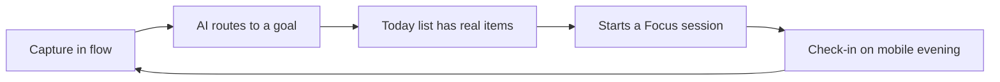
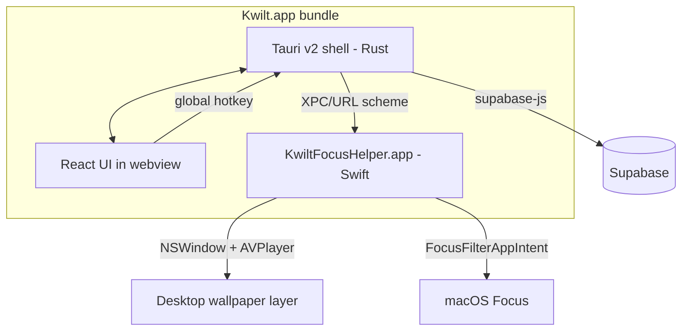

## PRD — Kwilt Desktop App (v1)

### Purpose

Design a Mac-only Kwilt desktop app with quick-capture hotkey, AI goal-cataloging, and a Portal-style Focus mode. Use Tauri v2 (TS/React + Rust) as the primary shell and a tiny Swift sidecar for the two features that genuinely need AppKit (Focus Filter extension + wallpaper video layer). Share types and data access with the mobile app via a new `@kwilt/sdk` workspace package and reuse the existing Supabase auth + PAT infrastructure.

### References

- Mobile app theme source: `src/theme/*`
- Mobile AI client + quotas: `src/services/ai.ts`, `docs/prds/ai-proxy-and-quotas-prd.md`
- Mobile auth + Supabase storage adapter: `src/services/backend/auth.ts`, `src/services/backend/supabaseAuthStorage.ts`
- Existing edge functions: `supabase/functions/ai-chat/index.ts`, `supabase/functions/pats-create/index.ts`
- Entitlements: `src/services/entitlements.ts`
- Web tokens target: `kwilt-site/`

---

## 0. Product thesis, wedge, and non-goals

### Why this app exists

Mobile Kwilt captures *intentional* moments — scheduled check-ins, planned goal reviews, set-aside Arc work. But the knowledge worker's life runs through the Mac, and the bulk of valuable signal (thoughts, task slivers, commitments made in meetings) never reaches mobile Kwilt because there's no low-friction desktop surface. A Mac app closes that loop.

**One-line thesis.** *The desktop app is the bridge between your in-flow work on the Mac and your goal structure in Kwilt — built around two moments: a frictionless capture while you're working, and a sustained focus session when you want to make progress.*

### Wedge

Two differentiated moments, not ten features:

1. **Capture-in-flow.** A hotkey that works from anywhere, with AI that routes the capture to the right goal without a picker UI. The wedge vs Things/Raycast/Sunsama is the AI assignment + the fact that it feeds into a goal-and-chapters structure mobile users already invest in.
2. **Focus-as-environment.** A Portal-class cinematic focus session that makes deep work the best-feeling part of the day, tied to the task you captured 20 minutes ago. The wedge vs Freedom/Cold Turkey/Apple Focus is the *feel* — it's branded, emotional, and pulls from Kwilt's goal context.

Everything else (main window, preferences, tray) is supporting infrastructure so those two moments feel trustworthy.

### Retention loop



The loop only works if (a) capture never fails (offline-first), (b) assignment is right ≥80% of the time (confidence UX + Inbox fallback), and (c) Focus delivers on the emotional promise (motion/sound design budget). Each of these drives a non-negotiable earlier in this plan.

### Success metrics (v1 targets, to be tuned)

- **D7 retention:** ≥45% of installers active day 7 (mobile-app baseline comparison).
- **Captures / DAU:** ≥4, median.
- **% high-confidence assignments** (≥0.85): ≥70% after two weeks of usage.
- **Focus sessions / WAU:** ≥2.
- **Time to first capture after install:** <90s, p50.

Every M3+ analytics event maps to one of these.

### Explicit non-goals for v1

- Not a todo list manager (no recurring tasks, no subtasks, no priorities beyond goal membership).
- Not a calendar (we read calendars via mobile's existing integration; desktop doesn't re-implement).
- Not a Pomodoro timer (Focus is a session, not a discipline tool — no 25/5 cycles, no enforced breaks).
- Not an email/Slack client or notifier.
- Not a Notion/Obsidian competitor (captures are short; long-form lives in mobile or external tools).
- Not a feature-parity clone of mobile — we deliberately ship fewer *interaction surfaces* (no rich-media composer, no social writes, etc.), better. **Data-model parity is a goal, not a non-goal:** all mobile object types (Arcs, Goals, Chapters, Activities, Check-ins, Tasks) remain readable and editable on desktop (see §4.6).

Keeping these as explicit non-goals protects M3/M5 scope from sprawl.

### Pricing stance (v1)

**Desktop app is free for all Kwilt users.** Pro gates the premium Focus scene library and raises the monthly AI capture quota. Rationale: desktop is a growth surface for mobile Pro, not a standalone revenue product. Free desktop → daily usage → natural upsell to Pro scenes once the user values Focus sessions. Non-Pro users still get 1–2 Focus scenes + a lofi loop (enough for the wedge to land).

## 1. Stack recommendation

**Primary shell: Tauri v2.** Rust core + React/TypeScript webview UI. You already live in TS/React across [Kwilt mobile](../../package.json) and [kwilt-site](../../../kwilt-site/package.json), and Cursor/Composer is strongest on TS + Rust. Tauri gives:

- Small binary (~10–20 MB vs Electron's ~200 MB)
- System tray / menu bar icon, global hotkey, autoupdater, deep-link handler — all first-party Tauri v2 plugins
- Native macOS hooks when needed (`tauri::AppHandle` + `cocoa`/`objc2` crates or Swift sidecar via XPC)

**Native Swift sidecar (`KwiltFocusHelper.app`)** — bundled inside the Tauri `.app` as a login-item-capable helper. Only hosts the two features that AppKit demands:

1. **Focus Filter App Extension** — required to integrate with System Settings → Focus. You cannot programmatically toggle macOS Focus, but you *can* ship a Focus Filter the user enables inside e.g. a "Deep Work" Focus that calls back into your helper to start/stop Kwilt's focus session. This API is Swift-only (`INFocusStatusCenter` / `FocusFilterAppIntent`).
2. **Portal-style wallpaper window** — an `NSWindow` positioned at `CGWindowLevelForKey(kCGDesktopIconWindowLevel) - 1` with an `AVPlayerLayer` for video and `AVAudioEngine` for spatialized audio. This is not achievable from a sandboxed webview with acceptable quality.

Everything else — UI, auth, quick-capture popover, goal cataloging, settings, onboarding, checkout — is TS in the Tauri webview. **~90% of development in Cursor-friendly TS.**



## 2. Repo layout

Add a sibling repo **`/Users/andrewwatanabe/kwilt-desktop`** (keep it separate from the Expo repo — different toolchain, different release cadence). Inside `Kwilt/`, promote shared code into a new workspace package so both clients depend on it.

- `Kwilt/packages/kwilt-tokens/` *(new)* — pure TS constants + Tailwind preset. Sourced from `src/theme/colors.ts`, `src/theme/typography.ts`, `src/theme/spacing.ts`, `src/theme/motion.ts`, `src/theme/surfaces.ts`, `src/theme/overlays.ts`. Mobile's `src/theme/*` files become thin re-exports so the three clients (mobile, web, desktop) can never drift on color, spacing, typography, or motion.
- `Kwilt/packages/kwilt-sdk/` *(new)* — pure TS: Supabase client factory, typed queries for `goals`, `tasks`, `arcs`, `chapters`, `activities`; copy from `src/services/backend/supabaseClient.ts`, `src/services/ai.ts`, `src/services/checkins.ts`, `src/services/goalFeed.ts`, and the domain types under `src/domain/`. Mobile imports this from `@kwilt/sdk` instead of relative paths.
- `kwilt-desktop/`
  - `src-tauri/` — Rust: hotkey, tray, deep-link, keychain, window management, IPC to Swift helper.
  - `src/` — React + Vite + Tailwind (with `@kwilt/tokens` preset) + shadcn/ui primitives, consuming `@kwilt/sdk` for all data access.
  - `helper-mac/` — Xcode project producing `KwiltFocusHelper.app` (menu bar-less LSUIElement) + `KwiltFocusFilter.appex` extension. Built by a `build.rs` step and copied into the Tauri bundle's `Contents/Library/LoginItems/`.

## 3. Auth — how it works alongside mobile

Reuse the existing Supabase project, providers (Apple/Google), and custom domain `auth.kwilt.app`. Do **not** invent a new auth mechanism.

**Flow on desktop:**

1. User clicks "Continue with Apple" / "Continue with Google" in the Tauri UI.
2. App generates PKCE verifier, opens the system browser to `https://auth.kwilt.app/auth/v1/authorize?…&redirect_to=kwilt-desktop://auth/callback`. Mirror logic from `src/services/backend/auth.ts` (`signInWithProvider`).
3. macOS routes the `kwilt-desktop://auth/callback?code=…` URL back to the Tauri app via `tauri-plugin-deep-link` (requires adding the scheme to `Info.plist` `CFBundleURLTypes` and allowlisting it in Supabase → Auth → URL Configuration).
4. Tauri calls `supabase.auth.exchangeCodeForSession(code)`, stores the session in the **macOS Keychain** via the Rust `keyring` crate (one entry per key: `kwilt.supabase.auth.access`, `…refresh`, `…expires_at`).
5. `supabase-js` is instantiated in the Rust-hosted webview with a custom `storage` adapter that calls Tauri IPC to read/write those Keychain entries — same pattern as `src/services/backend/supabaseAuthStorage.ts`, just a different backing store.

**Key design choices:**

- **Separate storage key per client.** Mobile uses `kwilt.supabase.auth`; desktop uses `kwilt.supabase.auth.desktop` in Keychain — prevents cross-device session confusion and lets a user sign out of desktop without killing mobile.
- **No PAT for user-facing flows.** You already have `supabase/functions/pats-create` — keep that for MCP/external agents. Desktop uses the user's real JWT so RLS and audit logs work identically to mobile.
- **One-tap "Sign in with your iPhone" shortcut** *(optional v1.1)*: show a QR code that the mobile app can scan to vend a short-lived JWT via a new `desktop-pair` edge function. Nice, but not required for v1.

**Supabase config changes needed:**
- Add `kwilt-desktop://auth/callback` to the Redirect URLs allowlist.
- Add `kwilt-desktop` to Additional Redirect URLs in the Apple/Google provider configs if they whitelist per scheme.

## 4. UI architecture

### 4.1 Surface-to-layer mapping (app-shell + canvas rule)

The app-shell / canvas layering rule (primary nav + canvas margins for the "main" experience; chromeless for utilities) applies per-surface. Classify up front so every later PR knows which chrome it inherits.

| Surface | Layer | Notes |
|---|---|---|
| Main window (Inbox, Today, Arcs, Goals, Chapters, Activities, Plan, Friends) | **Shell + Canvas** | `NSVisualEffectView` sidebar for primary nav, `PageHeader` at top of canvas, `CanvasScrollView`-equivalent body. Full object coverage — see §4.6. Mirrors mobile mental model. |
| Menu bar tray popover | Chromeless utility | `NSStatusItem`; left-click popover shows today summary + quick actions; right-click quick menu. No shell. |
| Quick-capture HUD | Chromeless, single-focus | Borderless, centered, `alwaysOnTop`. Single input, Esc closes, Return submits. No shell. |
| Command palette (⌘K) | Chromeless, single-focus | Same window class as quick-capture; different mode. Fuzzy jump to goal, start focus, new check-in, preferences. |
| Preferences (⌘,) | Own chrome | Single-instance window, sidebar categories (Account, Hotkeys, Focus scenes, Notifications, Advanced). No global app shell. |
| Focus mode HUD | Chromeless immersive | Intentionally breaks the app-shell rule — this is the signature brand moment, designed for minimal distraction. |
| Onboarding | Full-screen wizard | Own chrome; drives first-run permission + hotkey setup sequence. |

### 4.2 Design-system strategy

Three UI universes exist today: mobile's mature `src/ui/` (60+ RN components) + tokens in `src/theme/`; web's seven shadcn primitives in `kwilt-site/components/ui/`; desktop has nothing.

- **Tokens are shared.** `@kwilt/tokens` is the single source of truth for color, type, spacing, motion, surface, and overlay scales. Both web and desktop consume its Tailwind preset; mobile's `src/theme/*` re-exports from it.
- **Primitives are per-platform, API-aligned.** v1 desktop uses shadcn/ui, extending `kwilt-site`'s set as needed. Names and prop shapes stay close to mobile primitives (`Button`, `Card`, `Stack`, `Heading`, `Input`, `Dialog`, `Toast`) so concepts transfer. v1.5 target: extract `@kwilt/ui-web` if reuse between desktop and site proves meaningful.
- **Density.** Desktop lists run ~2× denser than mobile; define desktop-specific `ListRow` and `MasonryTile` variants rather than scaling RN components.
- **Dark + light modes** tied to the system; `tauri-plugin-theme` plus `@media (prefers-color-scheme)` for webview CSS. No in-app theme toggle in v1.

### 4.3 macOS HIG conformance (non-negotiables for v1)

- **Vibrancy + materials.** Sidebar uses `NSVisualEffectView` via `tauri-plugin-window-vibrancy`; HUD surfaces use the `hudWindow` material.
- **Traffic lights + titlebar.** Main window: default traffic lights, transparent titlebar integrated with sidebar. HUDs: `titleBarStyle: "overlay"` with no traffic lights.
- **Keyboard-first navigation.** Every row focusable; ⌘F per canvas; Esc dismissal conventions; Return/Enter to commit; Tab cycles; arrow-key row navigation in lists. Exported Tailwind focus-ring utility drives consistency.
- **Multi-window model.** Quick-capture HUD and command palette are singletons (pre-warmed). Preferences is a singleton. Goal detail opens in the main window by default; `⌘-click` opens it in a new window. Focus HUD uses `.canJoinAllSpaces`.
- **Drag-and-drop.** Files dropped onto a goal row → attach via `attachments-init-upload` edge function. Dropped images on a check-in composer → inline attach. Dropping on the dock icon opens quick-capture pre-filled with the payload.
- **Spotlight-style fuzzy search** for the command palette and goal picker, not substring matching.
- **System menu bar.** Full `NSMenu` with Kwilt, File (New Capture, New Check-in, New Goal), Edit, View, Window, Help. All commands have keyboard shortcuts.

### 4.4 Motion + sound (the Portal-class brand moment)

The Portal comparison is primarily a motion/audio brand statement, not a feature list. Treat it as such.

- **Motion tokens in `@kwilt/tokens/motion`** define the shared easing curves and durations. Desktop gets a richer set than mobile (GPU-friendly spring animations for window transitions, scene cross-fades).
- **Focus enter/exit** is a scripted cinematic: desktop icons fade out, wallpaper layer cross-fades from current desktop, audio fades in over 2–3s. Exit reverses. This sequence is what sells the product on first demo.
- **Subtle UI sounds** (capture confirm, goal complete, focus tick) respecting `NSWorkspace.accessibility.reduceMotion` and system mute; off by default, on for Pro with easy toggle.
- **Celebration moments** translate mobile's GIF/haptic celebrations into desktop equivalents: confetti particle layer on `<canvas>`, gentle window bounce, optional sound.

### 4.5 First-run & permission onboarding

Getting this wrong is the #1 cause of Mac app churn. Explicit sequence:

1. Sign-in (§3).
2. Hotkey picker. Default `⌘⇧Space`; detect Raycast/Spotlight conflicts by probing `defaults read com.apple.symbolichotkeys` and offer alternatives.
3. Accessibility permission prompt (required for global hotkey in some macOS versions).
4. Notifications permission.
5. Focus Filter install CTA: deep-links to System Settings → Focus with brief instructions.
6. First capture walk-through: trigger the hotkey, show the popover, type "Try Kwilt desktop" → demo the assignment.
7. Optional: install Login Item to start Kwilt at login.

Each step is skippable and re-accessible from Preferences.

### 4.6 Object coverage (data-model parity with mobile)

Desktop is not a reduced surface — it must let the user read, create, edit, and navigate **every first-class object in the Kwilt data model**, the same ones mobile exposes. The wedge narrows what's *featured* (capture + focus); it does not narrow what's *accessible*.

| Object | Desktop surface in v1 | Source of truth |
|---|---|---|
| **Arcs** | Browsable list + detail view; inline rename + status change; create from ⌘K or File → New Arc. | `arcs` table, mirrors mobile `src/services/arcs*` patterns. |
| **Goals** | Browsable list, filterable by Arc / Chapter / status; detail view with check-ins, tasks, attachments; inline check-in composer. | `goals` table + `src/services/goalFeed.ts` logic lifted into `@kwilt/sdk`. |
| **Chapters** | Nested under each Goal detail view; standalone "All Chapters" timeline surface accessible via sidebar or ⌘K. Create/edit chapters inline from a Goal. | `chapters` table + domain types from `src/domain/`. |
| **Activities** | Dedicated surface listing recent activity across all objects; also shown scoped inside each Goal/Arc detail view (right-hand rail). | `activities` table via `@kwilt/sdk`. |
| **Check-ins** | Create from quick-capture (classified as `create_checkin`), from Goal detail view, or from ⌘K. Past check-ins readable inline on each Goal. | Mobile `src/services/checkins.ts` logic lifted into `@kwilt/sdk`. |
| **Tasks** | Listed in Today (due today), nested under Goals, and surfaced in the Focus HUD. Create from quick-capture (`create_task`) or inline from a Goal. | Existing tasks schema; no new table. |
| **Inbox** | Unassigned low-confidence captures (§6.3). Sidebar item with unread count. | Virtual view over `captures` without `goal_id`. |
| **Friends / social** | Basic read-only v1: friends list, their shared goals, and activity. Writes (invites, messages) stay on mobile in v1. | Existing social tables. |

**Implementation rule.** Every one of these is reachable (a) from the left sidebar or ⌘K, (b) via deep link (`kwilt-desktop://arc/<id>`, `…/goal/<id>`, `…/chapter/<id>`, `…/activity/<id>`), and (c) as a creation target from the quick-capture agent's structured output. The SDK package (`@kwilt/sdk`) MUST export typed read + write helpers for all of them on day one — see §2 repo layout.

**Non-goals for v1 (desktop-specific reductions).**
- No Arc/Goal archive management UI beyond a toggle filter (bulk ops stay on mobile).
- No rich-media check-in composer (voice memos, long photo carousels) — desktop composer is text + drag-dropped attachments only.
- No friends write operations (invites, shared-goal creation, social reactions) — read-only in v1, writes stay on mobile.

## 5. Use case 1 — quick capture

**UX:** default hotkey `⌘⇧Space` (user-configurable; warn if it collides with Raycast/Spotlight). Shows a small centered Tauri window (`alwaysOnTop`, transparent, no titlebar) with one multi-line input and a subtle "Goal: auto-detecting…" hint. Enter submits. Esc dismisses. The window animates in in <80ms (keep it a pre-created hidden `WebviewWindow` you just `.show()` — don't cold-start per invocation).

**Implementation:**
- `tauri-plugin-global-shortcut` for the hotkey.
- `tauri-plugin-window-state` not needed (capture is always centered).
- A new edge function **`supabase/functions/agent-capture/index.ts`** (modeled on `supabase/functions/ai-chat/index.ts`):
  - Input: `{ text: string, context?: { activeAppName, windowTitle } }`.
  - Pulls the caller's active goals + recent check-ins.
  - Runs a small structured-output LLM prompt: `{ action: "create_task" | "create_checkin" | "create_arc_draft", goal_id: uuid | null, title, notes, confidence }`.
  - Writes to DB with RLS (user JWT). Returns the assignment so the UI can show "Added to *Ship Kwilt Desktop beta*" with an Undo + "Change goal" affordance.
- Reuse the mobile `workflowRegistry` pattern so the same capture→goal logic can eventually run on mobile (via long-press share sheet, etc.).

## 6. Use case 2 — intelligent cataloging

The cataloging decision runs server-side in `agent-capture` (not on device) so prompt and model changes don't require desktop releases and every client (desktop, mobile share extension, Raycast plugin, MCP) gets identical behavior. Reuses the existing AI proxy, quota enforcement, and RevenueCat entitlement lookups from `src/services/ai.ts`.

### 6.1 Confidence thresholds

The edge function returns `{ goal_id, action, title, notes, confidence }`. Desktop acts on confidence bands:

| Confidence | Behavior | UI |
|---|---|---|
| ≥ 0.85 | Silent auto-file to matched goal | Toast: "Added to *Goal Name* · Change" |
| 0.6 – 0.85 | File but surface the match prominently | Toast with inline goal picker (3 alternatives) + Undo |
| < 0.6 | Route to **Inbox** (no goal) | Toast: "Added to Inbox · Assign a goal" |

Thresholds are constants in the edge function response-handler, so we can tune from a single place once we have real data (success-metrics todo feeds this).

### 6.2 Optimistic UX — the popover never waits

The popover dismisses in <100ms after Enter, showing an immediate "Added to Inbox" toast. The LLM call runs in the background; when it resolves with a confident assignment, the toast smoothly re-parents ("Moved to *Ship Kwilt Desktop beta*") with an Undo. The user is already back in flow.

This matters because LLM latency is 1–3s. Never block the user on it.

### 6.3 Inbox is a first-class surface

Low-confidence captures must have a home. Add **Inbox** as the top item in the main-window sidebar (above Today). Shows unassigned captures with one-click "Assign to goal" dropdowns. Captures aged >7 days prompt a weekly review nudge. Without Inbox, low-confidence captures disappear into the void and users lose trust.

### 6.4 Correction-as-signal

When the user changes the assigned goal, log `{ capture_text, from_goal_id, to_goal_id, confidence, user_goals }` to a `kwilt_capture_corrections` table. This is the training data for a future fine-tune or few-shot prompt revision. Zero-cost to log, high-value to accumulate.

### 6.5 Privacy stance for capture context

The popover can send contextual signals alongside the captured text: what app was frontmost, what window was focused, what URL if browser. These are powerful for assignment but genuinely sensitive.

v1 rules:
- `activeAppName` (e.g. "Cursor", "Slack") — **opt-in, off by default.** Preferences toggle.
- `windowTitle` — **never sent in v1.** Window titles leak PII (bank account numbers, client names, private doc titles). If we ever enable, it needs on-device redaction first.
- Browser URL — not collected.
- Clipboard — not collected.
- Visual indicator in the popover ("Sending app context: Cursor") when opt-in is on, so users are never surprised.

Retention: captures are stored per-user; capture *context* signals are dropped after 30 days. Documented in the privacy page of kwilt-site before launch.

### 6.6 Cost model

Back-of-napkin at GPT-4o-mini-class pricing (~$0.002/capture call):

- 1k DAU × 5 captures/day × 30 = **$300/month**
- 10k DAU × 5 × 30 = **$3,000/month**
- 100k DAU × 5 × 30 = **$30,000/month**

Gate heavy users behind the Pro AI capture quota (aligns with mobile's existing quota model from `docs/prds/ai-proxy-and-quotas-prd.md`). Free tier: 30 AI-assisted captures/day, unassigned captures still go to Inbox when quota exceeded — the hotkey *always* works.

### 6.7 Local goals cache

Cache the user's top 20 active goals in desktop state on login and refresh when the main window is focused. Used by the command palette goal picker, the "change goal" dropdown, and the optimistic "looks like this might be *X*" hint shown while the LLM is thinking. No dropdown ever blocks on network.

## 7. Use case 3 — Focus mode (Portal-style)

**What "Focus mode" does in v1:**
- Dims the menu bar (hide it via `NSApplication.presentationOptions`), hides desktop icons (`defaults write com.apple.finder CreateDesktop -bool false`, restore on exit).
- Plays a full-screen looping video + ambient audio that **sits behind your app windows and desktop icons** — this is the Portal trick.
- Optionally triggers macOS Focus via a **Focus Filter** the user pre-configures.
- Shows an unobtrusive HUD with: current task from capture queue, timer, now-playing, stop button.

**Wallpaper layer implementation (Swift helper):**

```swift
let window = NSWindow(contentRect: screen.frame, styleMask: .borderless, ...)
window.level = NSWindow.Level(rawValue: Int(CGWindowLevelForKey(.desktopIconWindow)) - 1)
window.collectionBehavior = [.canJoinAllSpaces, .stationary, .ignoresCycle]
window.isOpaque = false
window.ignoresMouseEvents = true
let player = AVQueuePlayer(...); let layer = AVPlayerLayer(player: player)
window.contentView?.layer = layer
```

The Tauri side sends the selected scene ID to the helper via an `xpc` mach service (cleanest) or a localhost `unix:` socket (simpler). Helper owns the `NSWindow` so it survives Tauri reloads.

**Focus Filter integration:**

Ship `KwiltFocusFilter.appex` implementing `FocusFilterIntent`. When the user creates a Focus (e.g. "Deep Work") and adds the Kwilt filter, macOS will call our intent on enter/exit, which fires an event back through `NSWorkspace` notification to the helper, which tells Tauri to enter/exit focus mode. This is the only correct way to integrate with system Focus — apps **cannot** toggle Focus themselves.

**Premium video/audio backgrounds:**

- Store scenes as MP4 (HEVC) + AAC in Supabase Storage, gated by the same RevenueCat entitlement your mobile paywall uses. See `src/services/entitlements.ts`.
- Cache scenes locally under `~/Library/Application Support/Kwilt/scenes/` with a manifest file; prefetch on Focus-start.
- Free tier gets 1–2 static gradients + a lofi loop; Pro gets the full library.
- RevenueCat has a web/Stripe offering; desktop checkout opens `https://kwilt.app/account/subscribe?ret=kwilt-desktop://checkout/return` in the browser. Your mobile Pro users already get Pro on desktop via the entitlement lookup.

## 8. Build, distribute, autoupdate

- **Signing:** Developer ID Application + Developer ID Installer, notarize via `notarytool`. The extension and helper must be signed with the same team ID and "inherited" entitlements.
- **Distribution:** direct DMG download from `kwilt.app/download` + Homebrew cask (trivial once signed). Skip the Mac App Store in v1 — the wallpaper window level and login-item helper are cleaner outside the sandbox.
- **Updates:** `tauri-plugin-updater` with a static JSON manifest on the kwilt-site CDN.
- **CI:** GitHub Actions macOS runner; secrets for signing cert + notary API key.

## 9. Milestones

Total ≈ 7.5 engineer-weeks assuming one focused engineer. Double it for solo while maintaining mobile.

- **M0 (0.5 week) — design tokens + primitives.** Extract `@kwilt/tokens` from `src/theme/*`; wire Tailwind preset; stand up the shadcn primitive set desktop needs (Button, Card, Input, Dialog, Toast, Popover, Command, Tooltip, Sheet). Mobile's theme becomes a thin re-export. Lands before any feature PR so every later surface builds on the same visual foundation.
- **M1 (1.5 weeks) — skeleton + auth + onboarding shell + distribution spike + observability.** Tauri app boots, system tray, global hotkey opens a stub popover, Supabase OAuth round-trip works, session in Keychain. First-run onboarding flow (sign-in → hotkey → permissions) wired with stubs. **Codesigning spike** proves a signed + notarized Tauri `.app` can ship with a signed empty Focus Filter `.appex` and a signed login-item helper, and that a dev-iteration loop exists — if not tractable, scope-change the Focus Filter to "in-app start button only" before M4. **PostHog wired** for hotkey_fired / capture_submitted / error_* events. **Testing harness** (cargo test, Vitest, Playwright smoke, Swift XCTest) wired into CI.
- **M2 (1.5 weeks) — quick capture end-to-end, offline-first.** `agent-capture` edge function, chromeless HUD popover, Enter submits → row in DB → toast confirmation. **SQLite queue** in the Rust core buffers captures when offline; drains with idempotency keys on reconnect so the hotkey never silently fails. Extract `@kwilt/sdk` package along the way. Capture-privacy controls (opt-in app context; no window titles) wired.
- **M3 (2 weeks) — main window + Inbox + full object coverage + command palette + cataloging UX.** App-shell main window (sidebar + canvas). Sidebar order: **Inbox**, Today, Arcs, Goals, Chapters, Activities, Plan, Friends — full data-model parity with mobile (see §4.6). Today shows today's tasks + check-ins due + planned items from mobile Plan. Goals list with filter-by-Arc/Chapter/status, inline check-in, keyboard navigation. Arcs/Chapters/Activities each get a list + detail surface backed by `@kwilt/sdk`. ⌘K command palette jumps to any object type. Deep links (`kwilt-desktop://arc|goal|chapter|activity/<id>`) resolve to the right canvas. Confidence-band assignment UX, optimistic toasts, correction logging. Success metrics dashboard in PostHog live before milestone closes.
- **M4 (2 weeks) — Focus mode.** Swift helper + wallpaper window + built-in scenes. Focus Filter extension (or scoped-down fallback if M1 spike said so). Focus HUD. Signature enter/exit motion sequence. Battery-saver mode (dim/pause on battery, HEVC hardware path only). Pro gating on premium scenes.
- **M5 (1 week) — preferences, tray, polish.** Preferences window (⌘,), tray popover with today summary, motion/sound pass, dark/light parity audit, drag-and-drop attachments, accessibility pass (VoiceOver labels, Reduce Motion respect, Dynamic Type sizes).
- **M6 (1 week) — signing, notarization, autoupdate, internal beta.** Developer ID signing, notarytool, `tauri-plugin-updater` manifest on kwilt-site CDN. Sparkle-style alpha channel for internal testers.

## 10. Open items to decide later (not blockers for v1)

- Windows port — most of v1 code (Rust + TS) ports cleanly; only the Swift helper is Mac-only. Windows Focus-Assist integration is a separate design.
- Raycast extension as a lighter-weight alternative entry point for quick-capture — it hits the same `agent-capture` endpoint, so zero server-side work.
- QR-pair sign-in from the iPhone app for installs without typing a password (§3 footnote).
- Fine-tuned or few-shot cataloging model trained on the `kwilt_capture_corrections` dataset (§6.4).

## 11. Testing, telemetry, and success metrics

### 11.1 Testing foundation

Wired in M1 so it grows alongside the code, not retrofitted in M5.

- **Rust (src-tauri):** `cargo test` for command handlers, deep-link parsing, keychain adapter, SQLite queue logic.
- **TypeScript UI:** Vitest + React Testing Library for hooks and components. Snapshot-test tokens → Tailwind class mapping to catch drift.
- **E2E:** Playwright against the Tauri webview for the golden paths — sign in, hotkey capture, assign goal, start focus. Runs on the macOS CI runner.
- **Swift helper + extension:** XCTest for wallpaper window lifecycle and FocusFilterIntent round-trip.
- **QA matrix:** macOS 13 (min), 14, 15, and current beta, on both Intel and Apple Silicon. Codified as a pre-release checklist in `kwilt-desktop/QA.md`.

### 11.2 Telemetry (PostHog, shared project with mobile)

Core events from M1; shared schema with mobile so funnels cross surfaces.

- `hotkey_fired { ms_to_popover }`
- `capture_submitted { chars, has_app_context, confidence_band }`
- `capture_assigned { goal_id_hash, confidence, was_corrected }`
- `capture_corrected { from, to, confidence }`
- `focus_started { scene_id, duration_planned, is_pro }`
- `focus_ended { duration_actual, reason: "user_stop" | "timer" | "crash" }`
- `error_* { surface, code, message_hash }`

### 11.3 Success metrics (tied to §0)

Dashboard stood up in PostHog before M3 closes so we don't fly blind through the highest-stakes milestone:

- D7 retention of installers
- Captures / DAU (median + p90)
- Time-to-first-capture post-install (p50)
- % captures with confidence ≥ 0.85
- % captures corrected by user (target: <15%)
- Focus sessions / WAU
- Focus session completion rate (ended via timer, not user_stop)

## 12. Risks + mitigations

| Risk | Likelihood | Impact | Mitigation |
|---|---|---|---|
| Codesigning Tauri + `.appex` + helper doesn't compose cleanly | High | High | M1 spike; fallback path = in-app-only focus start, no Focus Filter |
| Wallpaper layer tanks battery on MacBooks | Med | High | Battery-saver mode in M4 (dim/pause on battery, HEVC hardware only, 30fps cap); measure in internal beta |
| RevenueCat cross-platform entitlements unreliable for desktop | Med | Med | Verify with test accounts during M4 Pro-gating work; fall back to Stripe-direct if needed |
| Default ⌘⇧Space conflicts with Raycast/Spotlight → users give up at onboarding | Med | High | Collision detection + pre-selected alternate; onboarding telemetry to see drop-off |
| LLM assignment accuracy below expectation (<70% confident) | Med | High | Inbox fallback + correction logging + prompt iteration without app release |
| Tauri deep-link plugin flakiness on first install | Low | Med | Manual test matrix; fallback "enter code" flow if deep-link doesn't fire within 10s |
| Supabase session storage adapter races with webview reloads | Low | Med | Mirror the mobile flush-before-suspend pattern from `src/services/backend/supabaseClient.ts` |
| Focus Filter Extension needs macOS 13+ → cuts out older users | Low | Low | Minimum macOS 13 is already industry-standard; document + gate feature below |

## 13. Rollout plan

- **Internal alpha (post-M6):** signed DMG + Sparkle alpha channel to a private list of Kwilt Pro users (10–20).
- **Private beta (2 weeks after):** waitlist form on kwilt.app/desktop; invite in batches of 50 with a feedback Slack/Discord.
- **Public beta:** DMG on kwilt.app/download, mentioned in-app on mobile (settings → "Try Kwilt on Mac"), announcement to mailing list.
- **1.0 launch:** Homebrew cask, Product Hunt, coordinated with a mobile app update that links to the download page.

---

## Build plan index

This PRD is the strategic roadmap. Each milestone below maps to one (or more) small, executable `.plan.md` files under `~/.cursor/plans/`. Create each in order; earlier milestones unblock later ones. Don't mix milestones in a single build plan.

| Milestone | Build plan file | Status |
|---|---|---|
| M0 — tokens package | `kwilt-desktop-m0-tokens.plan.md` | done |
| M1a — desktop repo scaffold | `kwilt-desktop-m1a-scaffold.plan.md` | done |
| M1b — auth + keychain | `kwilt-desktop-m1b-auth.plan.md` | done |
| M1c — onboarding shell + telemetry + codesigning spike | `kwilt-desktop-m1c-onboarding.plan.md` | not started |
| M2 — quick capture end-to-end (offline-first) | `kwilt-desktop-m2-capture.plan.md` | not started |
| M3 — main window + Inbox + command palette | `kwilt-desktop-m3-main-window.plan.md` | not started |
| M4 — Focus mode (Swift helper + extension) | `kwilt-desktop-m4-focus.plan.md` | not started |
| M5 — preferences, tray, polish | `kwilt-desktop-m5-polish.plan.md` | not started |
| M6 — signing, notarization, autoupdate | `kwilt-desktop-m6-ship.plan.md` | not started |

Rules for each build plan:

- Scope = a few hours to ~1 day of focused work.
- Every todo names concrete files/paths to create or modify.
- No "decide later" or "if not tractable" language — those decisions happen in this PRD or in chat before Build runs.
- Always link back to the relevant section of this PRD for *why*.
