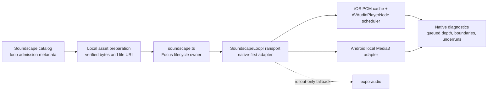

# Universal Seamless Focus Loop Transport Implementation Plan

> **For agentic workers:** REQUIRED SUB-SKILL: Use superpowers:executing-plans to implement this plan task-by-task. Steps use checkbox (`- [ ]`) syntax for tracking. Do not dispatch subagents unless Andrew explicitly requests delegation.

**Goal:** Make every admitted Focus soundscape loop on a native audio timeline without an audible transport gap, while preserving immediate Focus start, gentle fades, offline fallback, background playback, and a repeatable admission path for future tracks.

**Architecture:** Separate loop quality into two enforced layers: an asset admission contract proves that a master has a musically compatible seam, and a platform transport loops a verified local file without JavaScript end-of-track timing. On iOS, decode each selected compressed asset once into a temporary PCM CAF and keep multiple `AVAudioPlayerNode` segments queued on the native sample timeline; on Android, use a verified local item with Media3 repeat mode first, retaining the same bridge contract and requiring the same device proof before parity is claimed. `src/services/soundscape.ts` remains the public Focus lifecycle owner and delegates playback to a native-first adapter, with the current Expo player retained only as a rollback fallback during rollout.

**Tech Stack:** TypeScript, React Native 0.83, Expo SDK 55 local modules, Swift/AVFAudio, Kotlin/AndroidX Media3, Expo FileSystem/Asset, Jest, Node audio tooling, FFmpeg, Xcode/Simulator, signed iPhone, Android hardware.

---

## Product and proof contract

This plan implements the accepted brief at `docs/feature-briefs/focus-seamless-soundscapes.md`. It does not add UI or make users manage loop settings.

- “Any track” means any track admitted as a Kwilt Focus soundscape. A composed ending and unrelated intro cannot be made musically invisible by transport code alone.
- Focus starts immediately. If a remote track is not local yet, the timer and visual environment start while audio prepares; audio enters with the existing 700 ms fade when ready.
- Bundled Deep Work Drift is the offline fallback. A failed download, decode, or native start must never stop or delay Focus.
- Source audit, rendered transport probe, Simulator behavior, signed-device listening, TestFlight, and production are separate proof levels.
- No implementation is called “imperceptible” until signed physical-device listening passes on built-in speaker, wired/USB or Bluetooth headphones, locked screen, background, interruption, and route-change cases.
- iOS is the first production gate because the observed defect and accepted brief are iPhone-specific. Android may share the release only after its own hardware gate; otherwise keep the existing Android fallback and report parity as pending.

## State and ownership



The lifecycle state machine is `idle -> preparing -> ready -> playing <-> paused -> idle`, with `error` recoverable through unload and one fallback attempt. Module destruction is terminal but is not exposed as a reusable playback state. Every async operation carries a monotonically increasing generation so a late prepare, fade, route callback, or interruption cannot revive a track the user stopped or replaced.

## File map

### Create

- `modules/kwilt-seamless-loop/expo-module.config.json` — registers Apple and Android native modules.
- `modules/kwilt-seamless-loop/package.json` — local Expo module metadata.
- `modules/kwilt-seamless-loop/index.ts` — typed native bridge and events.
- `modules/kwilt-seamless-loop/ios/KwiltSeamlessLoop.podspec` — AVFAudio local pod.
- `modules/kwilt-seamless-loop/ios/KwiltSeamlessLoopModule.swift` — bridge, lifecycle, audio-session notifications, and diagnostics.
- `modules/kwilt-seamless-loop/ios/LoopPCMCache.swift` — atomic compressed-to-PCM CAF decode and one-active-track cache eviction.
- `modules/kwilt-seamless-loop/ios/LoopScheduler.swift` — sample-timeline queue, native fades, pause/resume, and route recovery.
- `modules/kwilt-seamless-loop/android/build.gradle` — Expo module and Media3 dependency.
- `modules/kwilt-seamless-loop/android/src/main/AndroidManifest.xml` — empty library manifest.
- `modules/kwilt-seamless-loop/android/src/main/java/expo/modules/kwiltseamlessloop/KwiltSeamlessLoopModule.kt` — local Media3 repeat adapter and diagnostics.
- `src/services/soundscapeLoopAsset.ts` — resolves every soundscape to a verified local URI and cache identity.
- `src/services/soundscapeLoopAsset.test.ts` — bundled, cached, download, cancellation, and fallback contract tests.
- `src/services/soundscapeLoopTransport.ts` — transport interface, native adapter, Expo rollback adapter, and rollout selection.
- `src/services/soundscapeLoopTransport.test.ts` — bridge selection and lifecycle contract tests.
- `scripts/audio/soundscape-loop-contract.mjs` — validates catalog/admission metadata.
- `scripts/audio/soundscape-loop-contract.test.mjs` — regression coverage for the admission rules.
- `scripts/audio/rendered-loop-probe.mjs` — evaluates native probe JSON and fails on underruns or discontinuities.
- `assets/audio/SOUNDSCAPE_LOOP_ADMISSION.json` — machine-readable identity, source, and format contract shared by app and tooling.
- `docs/qa/focus-seamless-loop-acceptance.md` — exact Simulator, device, TestFlight, and production evidence sheet.

### Modify

- `src/services/audioAssetCatalog.ts` — add immutable loop identity and admission metadata to every Focus asset.
- `src/services/audioAssetDelivery.ts` — expose an awaited verified-local resolver; preserve immediate remote resolution for non-looping consumers.
- `src/services/audioAssetDelivery.test.ts` — prove exact-byte verification, atomic download, deduplication, and local-only resolution.
- `src/services/soundscapeCatalog.ts` — make loop admission explicit for every visible soundscape.
- `src/services/soundscapeCatalog.test.ts` — reject visible tracks without admitted loop metadata.
- `src/services/soundscape.ts` — delegate lifecycle to the transport and remove Canyon-only dual-player scheduling.
- `src/services/soundscape.test.ts` — prove each current soundscape maps to one admitted local asset descriptor.
- `src/services/soundscapePlayback.test.ts` — prove cancellation, switching, fallback, fades, and unload through the transport contract.
- `src/features/activities/FocusSessionRuntimeHost.test.tsx` — preserve start/stop ownership and timer independence while audio prepares.
- `src/features/activities/useActivityFocusController.test.tsx` — preserve best-effort prefetch on Focus entry.
- `src/features/activities/useStandaloneFocusController.test.tsx` — preserve widget/deep-link prefetch behavior.
- `scripts/audio/audit-loop-seams.mjs` — emit machine-readable frame and codec facts required by admission.
- `scripts/audio/loop-seam-lib.mjs` — enforce endpoint discontinuity as well as silence and RMS rules.
- `scripts/audio/loop-seam-lib.test.mjs` — regression tests for the stronger policy.
- `scripts/verify-changed.mjs` — route native loop changes to audio tooling, TypeScript, Jest, and native build instructions.
- `assets/audio/AUDIO_MANIFEST.md` — document admitted masters, measurements, provenance, and device evidence without committing working WAVs.
- `package.json` — add loop-contract and rendered-probe scripts and exclude the local module from React Native Directory warnings.
- `ios/Podfile.lock` and the generated iOS project only after `npx pod-install` links the module.
- Android Gradle lock/generated native files only when changed by the normal Expo native build.

## Task 1: Freeze the admission and transport contracts

**Files:**
- Modify: `src/services/audioAssetCatalog.ts`
- Modify: `src/services/soundscapeCatalog.ts`
- Modify: `src/services/soundscapeCatalog.test.ts`
- Create: `assets/audio/SOUNDSCAPE_LOOP_ADMISSION.json`
- Create: `scripts/audio/soundscape-loop-contract.mjs`
- Create: `scripts/audio/soundscape-loop-contract.test.mjs`
- Modify: `package.json`

- [ ] **Step 1: Write the failing catalog test.** Require every `SOUND_SCAPES` item to carry `loopPlayback: 'seamless'`, a stable `assetKey`, and an admitted format. The bundled and remote descriptors use the same shape:

```ts
export type SoundscapeLoopAdmission = {
  id: SoundscapeId;
  assetKey: string;
  source: { kind: 'bundled'; key: 'deep-work-drift' | 'canyon-spring' }
    | { kind: 'remote'; id: RemoteAudioAssetId };
  loopPlayback: 'seamless';
  sampleRateHz: 48_000;
  channels: 2;
};

export type Soundscape = {
  id: SoundscapeId;
  title: string;
  loop: SoundscapeLoopAdmission;
};
```

- [ ] **Step 2: Run `npm test -- --runInBand src/services/soundscapeCatalog.test.ts`.** Expect failure because current catalog entries have only `id` and `title`.

- [ ] **Step 3: Add explicit specs for all eleven current choices to `SOUNDSCAPE_LOOP_ADMISSION.json`.** `assetKey` is the immutable filename stem for remote assets and a versioned identifier such as `bundled-deep-work-drift-v1` for bundled assets. In `soundscapeCatalog.ts`, parse the JSON, map the two allowed bundled keys through static `require(...)` calls, and reject invalid data in development/tests. Do not infer transport behavior from display names or special-case `canyonSpring` in playback code.

- [ ] **Step 4: Add a pure Node contract validator over `SOUNDSCAPE_LOOP_ADMISSION.json`.** Export `validateSoundscapeLoopContract(admissions)`; reject duplicate IDs/keys, non-48 kHz stereo admission, malformed remote IDs, unknown bundled keys, or an entry without `loopPlayback: 'seamless'`. In `soundscapeCatalog.test.ts`, cross-check the validated JSON against the visible IDs and `REMOTE_AUDIO_ASSETS`, including the content-addressed `.mp3` filename rule.

```js
export function validateSoundscapeLoopContract(admissions) {
  const failures = [];
  const ids = new Set();
  const keys = new Set();
  for (const item of admissions) {
    if (ids.has(item.id)) failures.push(`duplicate soundscape id: ${item.id}`);
    if (keys.has(item.assetKey)) failures.push(`duplicate loop asset key: ${item.assetKey}`);
    if (item.loopPlayback !== 'seamless') failures.push(`${item.id}: not admitted for seamless looping`);
    if (item.sampleRateHz !== 48_000 || item.channels !== 2) {
      failures.push(`${item.id}: expected 48 kHz stereo`);
    }
    if (item.source?.kind === 'remote' && !/^focus\.[a-z0-9-]+$/.test(item.source.id)) {
      failures.push(`${item.id}: malformed remote asset id`);
    }
    if (item.source?.kind === 'bundled' && !['deep-work-drift', 'canyon-spring'].includes(item.source.key)) {
      failures.push(`${item.id}: unknown bundled asset key`);
    }
    ids.add(item.id);
    keys.add(item.assetKey);
  }
  return failures;
}
```

- [ ] **Step 5: Test valid and invalid catalogs with `node --test scripts/audio/soundscape-loop-contract.test.mjs`.** Expect all tests to pass.

- [ ] **Step 6: Add `audio:audit:soundscape-contract` to `package.json` and run it against the real admission JSON.** Expected: `PASS 11 admitted Focus soundscapes`. The Node tool reads JSON directly; it does not attempt to import TypeScript at runtime. The Jest catalog test owns JSON-to-TypeScript catalog cross-validation.

- [ ] **Step 7: Commit only the contract files.**

```bash
git add src/services/audioAssetCatalog.ts src/services/soundscapeCatalog.ts src/services/soundscapeCatalog.test.ts assets/audio/SOUNDSCAPE_LOOP_ADMISSION.json scripts/audio/soundscape-loop-contract.mjs scripts/audio/soundscape-loop-contract.test.mjs package.json
git commit -m "test: enforce Focus loop admission contract"
```

## Task 2: Strengthen source-master seam admission

**Files:**
- Modify: `scripts/audio/loop-seam-lib.mjs`
- Modify: `scripts/audio/loop-seam-lib.test.mjs`
- Modify: `scripts/audio/audit-loop-seams.mjs`
- Modify: `assets/audio/AUDIO_MANIFEST.md`

- [ ] **Step 1: Add failing tests for an endpoint sample jump and channel-specific discontinuity.** A mono downmix can hide opposite-polarity channel defects, so measure each channel and report the worst endpoint jump.

```js
assert.deepEqual(evaluateLoopSeam({
  leadingSilenceSeconds: 0,
  trailingSilenceSeconds: 0,
  startRmsDbfs: -24,
  endRmsDbfs: -24,
  worstEndpointJumpDbfs: -24,
}).failures, ['endpoint jump -24 dBFS exceeds the -36 dBFS loop ceiling']);
```

- [ ] **Step 2: Run `node --test scripts/audio/loop-seam-lib.test.mjs`.** Expect failure because the current policy does not enforce endpoint jumps.

- [ ] **Step 3: Replace derivative-only reporting with both `worstEndpointJumpDbfs` and `worstDerivativeJumpDbfs`.** Retain the 30 ms silence and 3 dB boundary-window limits; add a conservative `-36 dBFS` endpoint-jump ceiling. A master must satisfy every rule, but passing is still not equivalent to perceived musical continuity.

- [ ] **Step 4: Make `audit-loop-seams.mjs --json` emit `durationFrames`, `sampleRateHz`, `channels`, codec, bitrate, and all seam measurements.** Calculate `durationFrames` from the fully decoded PCM frame count rather than rounded container duration.

- [ ] **Step 5: Run the audit on every locally available bundled master and every downloaded remote delivery object.** Use an explicit temporary directory outside Git for remote downloads. Expected: no missing format data; any seam failure blocks migration for that track and returns it to mastering.

```bash
npm run audio:audit:loops -- --enforce --json /tmp/kwilt-focus-loop-audit.json <explicit-track-paths>
```

- [ ] **Step 6: Update `AUDIO_MANIFEST.md`.** For each track, record immutable object name, source provenance, master command, frame count, seam metrics, three-repeat audition status, and separate columns for Simulator, signed device, TestFlight, and production. Never mark an unperformed proof as passed.

- [ ] **Step 7: Commit the stronger admission tooling and manifest facts.**

```bash
git add scripts/audio/loop-seam-lib.mjs scripts/audio/loop-seam-lib.test.mjs scripts/audio/audit-loop-seams.mjs assets/audio/AUDIO_MANIFEST.md
git commit -m "feat: strengthen Focus loop seam admission"
```

## Task 3: Guarantee a verified local file without blocking Focus

**Files:**
- Modify: `src/services/audioAssetDelivery.ts`
- Modify: `src/services/audioAssetDelivery.test.ts`
- Create: `src/services/soundscapeLoopAsset.ts`
- Create: `src/services/soundscapeLoopAsset.test.ts`

- [ ] **Step 1: Add failing delivery tests for `resolveLocalAudioAsset(id)`.** It must return an existing exact-size cache file, await an atomic download on a miss, deduplicate concurrent callers, delete a size-mismatched temporary file, and never return an HTTP URL.

```ts
await expect(resolveLocalAudioAsset('focus.open-road')).resolves.toEqual({
  uri: 'file:///cache/kwilt-audio/focus-open-road-707dfde8b7ee.mp3',
  sourceKind: 'cache',
});
expect(result.uri.startsWith('file:')).toBe(true);
```

- [ ] **Step 2: Run `npm test -- --runInBand src/services/audioAssetDelivery.test.ts`.** Expect failure because only `resolveAudioAsset` exists and it returns the remote URL on a miss.

- [ ] **Step 3: Implement `resolveLocalAudioAsset` as an awaited wrapper around the existing atomic `cacheAudioAsset`.** Keep `resolveAudioAsset` unchanged for non-looping consumers. Exact expected byte count plus immutable content-addressed object identity is the delivery verification; successful native decode is the format verification.

- [ ] **Step 4: Add failing `soundscapeLoopAsset` tests.** Bundled assets must use `Asset.fromModule(module).downloadAsync()` and require `localUri`; remote assets must use `resolveLocalAudioAsset`; both return `{ uri, assetKey, sampleRateHz, channels }`. Abort stale results with a generation supplied by the caller.

```ts
export type PreparedSoundscapeLoopAsset = {
  uri: string;
  assetKey: string;
  sampleRateHz: 48_000;
  channels: 2;
};

export async function prepareSoundscapeLoopAsset(
  id: SoundscapeId,
): Promise<PreparedSoundscapeLoopAsset>;
```

- [ ] **Step 5: Implement bundled and remote preparation.** Throw a typed `SoundscapeAssetError` with code `download_failed`, `bundled_asset_unavailable`, or `invalid_local_uri`; do not silently hand an HTTP URI to the native engine.

- [ ] **Step 6: Run both focused suites.** Expected: all local-delivery and asset-preparation tests pass.

- [ ] **Step 7: Commit exact files.**

```bash
git add src/services/audioAssetDelivery.ts src/services/audioAssetDelivery.test.ts src/services/soundscapeLoopAsset.ts src/services/soundscapeLoopAsset.test.ts
git commit -m "feat: prepare verified local Focus loop assets"
```

## Task 4: Define the native module and transport boundary

**Files:**
- Create: `modules/kwilt-seamless-loop/expo-module.config.json`
- Create: `modules/kwilt-seamless-loop/package.json`
- Create: `modules/kwilt-seamless-loop/index.ts`
- Create: `src/services/soundscapeLoopTransport.ts`
- Create: `src/services/soundscapeLoopTransport.test.ts`
- Modify: `package.json`

- [ ] **Step 1: Write failing transport tests with the native module mocked as available and unavailable.** Prove method forwarding, state-event forwarding, single disposal, generation cancellation, and Expo rollback selection.

- [ ] **Step 2: Run `npm test -- --runInBand src/services/soundscapeLoopTransport.test.ts`.** Expect module-not-found or missing-contract failure.

- [ ] **Step 3: Define the bridge in `modules/kwilt-seamless-loop/index.ts`.** Keep the public API platform-neutral and serializable:

```ts
export type LoopState = 'idle' | 'preparing' | 'ready' | 'playing' | 'paused' | 'error';
export type LoopDiagnostics = {
  state: LoopState;
  assetKey: string | null;
  queuedSegments: number;
  completedBoundaries: number;
  underrunCount: number;
  lastErrorCode: string | null;
};
export type PrepareOptions = {
  uri: string;
  assetKey: string;
  expectedSampleRateHz: number;
  expectedChannels: number;
};

declare class KwiltSeamlessLoopNativeModule extends NativeModule<{
  onStateChanged(event: LoopDiagnostics): void;
}> {
  isAvailable(): boolean;
  prepare(options: PrepareOptions): Promise<LoopDiagnostics>;
  play(volume: number, fadeDurationMs: number): Promise<LoopDiagnostics>;
  pause(fadeDurationMs: number): Promise<LoopDiagnostics>;
  setVolume(volume: number, fadeDurationMs: number): Promise<LoopDiagnostics>;
  unload(): Promise<LoopDiagnostics>;
  getDiagnostics(): LoopDiagnostics;
  runContinuityProbe(loopCount: number): Promise<LoopDiagnostics & { worstBoundaryJumpDbfs: number }>;
}
```

- [ ] **Step 4: Register `KwiltSeamlessLoopModule` for Apple and Android and declare only Expo/React Native peers.** Add the module name to `expo.doctor.reactNativeDirectoryCheck.exclude`.

- [ ] **Step 5: Define the app interface.** `SoundscapeLoopTransport` exposes `prepare`, `play`, `pause`, `setVolume`, `unload`, `subscribe`, and `getDiagnostics`. `createSoundscapeLoopTransport({ mode })` accepts `native-first`, `expo-only`, or `native-only`; production defaults to `native-first`, while tests inject a transport directly.

- [ ] **Step 6: Implement only selection and typed forwarding.** The native adapter is selected when `isAvailable()` is true. The Expo adapter wraps the existing one-player behavior for rollback and non-linked development clients; it must be named `rollback`, emit a diagnostic breadcrumb, and never be treated as seamless proof.

- [ ] **Step 7: Run the focused suite and TypeScript checks.**

```bash
npm test -- --runInBand src/services/soundscapeLoopTransport.test.ts
npm run lint
npm run lint:tests
```

- [ ] **Step 8: Commit exact bridge files.**

```bash
git add modules/kwilt-seamless-loop/expo-module.config.json modules/kwilt-seamless-loop/package.json modules/kwilt-seamless-loop/index.ts src/services/soundscapeLoopTransport.ts src/services/soundscapeLoopTransport.test.ts package.json
git commit -m "feat: define seamless soundscape transport"
```

## Task 5: Build the iOS PCM cache

**Files:**
- Create: `modules/kwilt-seamless-loop/ios/KwiltSeamlessLoop.podspec`
- Create: `modules/kwilt-seamless-loop/ios/LoopPCMCache.swift`
- Create: `modules/kwilt-seamless-loop/ios/KwiltSeamlessLoopModule.swift`

- [ ] **Step 1: Add the podspec.** Target iOS 15.1, Swift 5.9, static framework, `ExpoModulesCore`, and `AVFAudio`.

- [ ] **Step 2: Implement `LoopPCMCache.prepare`.** Resolve only `file://` URLs; reject HTTP. Decode with `AVAudioFile.read(into:)` into a temporary linear-PCM CAF at the source processing sample rate/channel count, writing chunks so memory stays bounded. Validate 48 kHz stereo and a positive frame length. Atomically move `<assetKey>.partial.caf` to `<assetKey>.caf` only after close and re-open validation.

```swift
struct PreparedLoopFile {
  let url: URL
  let frameLength: AVAudioFramePosition
  let format: AVAudioFormat
}

enum LoopPCMCacheError: String, Error {
  case nonLocalSource
  case unsupportedFormat
  case emptyAudio
  case decodeFailed
}
```

- [ ] **Step 3: Bound disk use.** Store PCM under `Library/Caches/kwilt-loop-pcm`; retain only the active asset and its `.partial` file while preparing, delete stale partials at startup, and apply `URLResourceKey.isExcludedFromBackupKey`. Expected worst-case disk is approximately 115 MB for a five-minute 48 kHz stereo Float32 track, not multiplied by the catalog.

- [ ] **Step 4: Make prepare idempotent and cancellable.** Re-open and validate an existing CAF before reuse. Use an actor or one serial dispatch queue keyed by generation; a newer asset request prevents the older decode from becoming active.

- [ ] **Step 5: Wire only `isAvailable`, `prepare`, `unload`, and diagnostics in the module.** `prepare` returns `ready` with `queuedSegments: 0`; `unload` closes files and removes inactive PCM. Playback remains intentionally unavailable until Task 6.

- [ ] **Step 6: Link and compile the module.**

```bash
npx pod-install
xcodebuild -workspace ios/Kwilt.xcworkspace -scheme Kwilt -configuration Debug -sdk iphonesimulator -destination 'generic/platform=iOS Simulator' CODE_SIGNING_ALLOWED=NO build
```

Expected: the module autolinks and the iOS Simulator build succeeds. Do not claim audio behavior from compilation.

- [ ] **Step 7: Commit exact module and generated link files.** Inspect `git diff` first; stage the new module, `ios/Podfile.lock`, and only the generated project changes caused by autolinking.

## Task 6: Schedule iOS loops on the native sample timeline

**Files:**
- Create: `modules/kwilt-seamless-loop/ios/LoopScheduler.swift`
- Modify: `modules/kwilt-seamless-loop/ios/KwiltSeamlessLoopModule.swift`

- [ ] **Step 1: Implement `LoopScheduler` with one `AVAudioEngine`, one `AVAudioPlayerNode`, the prepared CAF, and a serial control queue.** Connect the player to the main mixer using the CAF processing format.

- [ ] **Step 2: Keep three segments queued.** Schedule the first segment from frame zero, then two full-file segments with `at: nil`. Each `.dataRendered` completion increments `completedBoundaries` and schedules one replacement for the same generation. Two already-queued segments provide minutes of refill headroom, so scheduling does not depend on a just-in-time callback. Never wait for `.dataPlayedBack`, JavaScript status, or end-of-file notification to enqueue the next iteration.

```swift
private let targetQueuedSegments = 3

private func fillQueue(generation: UInt64) throws {
  guard generation == self.generation, let file else { return }
  while queuedSegments < targetQueuedSegments {
    queuedSegments += 1
    player.scheduleSegment(
      file,
      startingFrame: 0,
      frameCount: AVAudioFrameCount(file.length),
      at: nil,
      completionCallbackType: .dataRendered
    ) { [weak self] _ in
      self?.controlQueue.async {
        guard let self, generation == self.generation else { return }
        self.queuedSegments -= 1
        self.completedBoundaries += 1
        do { try self.fillQueue(generation: generation) }
        catch { self.fail(error) }
      }
    }
  }
}
```

- [ ] **Step 3: Implement play/pause/unload idempotently.** `play` starts the engine before the node, does not reschedule an already queued paused node, and records `shouldResumeAfterInterruption`. `pause` stops rendering without clearing scheduled segments. `unload` increments generation, stops/resets the node and engine, closes the file, clears callbacks, and returns `idle`.

- [ ] **Step 4: Detect underruns conservatively.** While `playing`, `queuedSegments < 2` increments `underrunCount` once per depletion episode and emits `onStateChanged`. Any underrun fails the synthetic transport acceptance even if it was not heard.

- [ ] **Step 5: Expose diagnostics through the module and emit events only on state changes, errors, boundary milestones in development, or underruns.** Do not send one JavaScript event per audio frame or drive scheduling from bridge callbacks.

- [ ] **Step 6: Compile and run in Simulator with a current local track.** Expected diagnostics after three repetitions: `state=playing`, `queuedSegments>=2`, `completedBoundaries>=3`, `underrunCount=0`.

- [ ] **Step 7: Commit the scheduler and bridge wiring.**

## Task 7: Add native fades, interruptions, and route recovery on iOS

**Files:**
- Modify: `modules/kwilt-seamless-loop/ios/LoopScheduler.swift`
- Modify: `modules/kwilt-seamless-loop/ios/KwiltSeamlessLoopModule.swift`

- [ ] **Step 1: Move all gain ramps into the native control queue.** Clamp gain to `0...1`; cancel the prior ramp when generation or target changes; update `player.volume` every 20 ms with the same cubic ease-in/out used today; set the exact final value at completion.

- [ ] **Step 2: Configure `AVAudioSession` on each explicit play.** Use category `.playback`, mode `.default`, options `.duckOthers`, then activate. This preserves silent-switch and background behavior without requesting recording.

- [ ] **Step 3: Observe interruptions, route changes, engine configuration changes, and media-services reset.** On interruption begin, remember whether playback was desired and pause. On a resumable end, reconfigure the session and resume only when still desired. On route/configuration reset, capture the current loop frame modulo file length, rebuild the graph, schedule the remainder followed by full segments, and resume at the prior gain.

- [ ] **Step 4: Make late callbacks harmless.** Every notification, completion, and fade tick checks generation and desired state. `unload` removes observers in `OnDestroy` and cannot be followed by an automatic resume.

- [ ] **Step 5: Add crash breadcrumbs at the TypeScript boundary for `prepare`, `play`, `pause`, `route_rebuild`, `underrun`, and `error`.** Include only soundscape ID, state, source kind, and numeric diagnostics—never local paths.

- [ ] **Step 6: Simulator-check pause/resume, control-center interruption, simulated route changes where available, and Fast Refresh.** Expected: one owned player, no detached audio, and no unexpected resume after stop. Mark unavailable Simulator cases pending for device testing.

- [ ] **Step 7: Commit native lifecycle hardening.**

## Task 8: Implement and gate the Android adapter

**Files:**
- Create: `modules/kwilt-seamless-loop/android/build.gradle`
- Create: `modules/kwilt-seamless-loop/android/src/main/AndroidManifest.xml`
- Create: `modules/kwilt-seamless-loop/android/src/main/java/expo/modules/kwiltseamlessloop/KwiltSeamlessLoopModule.kt`
- Modify: `modules/kwilt-seamless-loop/expo-module.config.json`

- [ ] **Step 1: Add the local Expo Android module with the Media3 ExoPlayer dependency version already resolved by `expo-audio`; do not import or patch ExpoAudio internals.** Resolve the installed version from Gradle dependency output and pin the compatible Media3 artifacts in the module.

- [ ] **Step 2: Implement the same bridge contract.** Require `file://`, prepare one `MediaItem`, set `repeatMode = Player.REPEAT_MODE_ONE`, disable shuffle, set `AudioAttributes` for media, and implement native 20 ms gain ramps. Map player state and errors to the shared diagnostics fields.

- [ ] **Step 3: Treat `queuedSegments` as `1` while the local MediaItem is ready and count `completedBoundaries` from position discontinuities caused by auto-repeat.** `underrunCount` increments only for an unexpected buffering transition after initial ready.

- [ ] **Step 4: Preserve audio-focus behavior.** Pause or duck according to the system callback, resume only if playback remains desired, and dispose player/listeners on unload or module destroy.

- [ ] **Step 5: Build and run the Android native app on hardware.**

```bash
npx expo run:android
```

Expected: bridge parity and local repeat work. This is not yet a gapless claim; if the synthetic/hardware boundary tests in Tasks 11 and 13 expose a repeat gap, keep `native-first` disabled on Android and create a follow-up implementation using `MediaCodec` decode plus a circular `AudioTrack` writer behind the unchanged bridge.

- [ ] **Step 6: Commit Android adapter files and only resulting intentional Gradle changes.**

## Task 9: Replace the Canyon special case with the shared transport

**Files:**
- Modify: `src/services/soundscape.ts`
- Modify: `src/services/soundscape.test.ts`
- Modify: `src/services/soundscapePlayback.test.ts`
- Modify: `src/features/activities/FocusSessionRuntimeHost.test.tsx`

- [ ] **Step 1: Rewrite playback tests against an injected `SoundscapeLoopTransport`.** Cover: timer start does not await preparation, start eventually prepares and fades in, stop during download prevents late play, switching IDs unloads the prior generation, pause keeps the decoded active asset warm, unload releases it, volume updates use native fades, and one native failure falls back to bundled Deep Work Drift.

- [ ] **Step 2: Run the focused suites.** Expect failure because `soundscape.ts` directly owns Expo players and Canyon-only crossfade state.

```bash
npm test -- --runInBand src/services/soundscape.test.ts src/services/soundscapePlayback.test.ts src/features/activities/FocusSessionRuntimeHost.test.tsx
```

- [ ] **Step 3: Refactor `soundscape.ts` to own orchestration only.** Keep the exported API and `SOUNDSCAPE_FADE_DURATION_MS`. Replace `sound`, `warmStandbySound`, playback listeners, Canyon constants, JavaScript crossfade timers, and end-of-track resume logic with one transport instance and one preparation generation.

```ts
let preparationGeneration = 0;
let transport = createSoundscapeLoopTransport({ mode: 'native-first' });

async function prepareSelected(id: SoundscapeId, generation: number) {
  const asset = await prepareSoundscapeLoopAsset(id);
  if (generation !== preparationGeneration || pendingStop) return;
  await transport.prepare(asset);
}
```

- [ ] **Step 4: Preserve immediate Focus semantics.** `FocusSessionRuntimeHost` starts the session synchronously; its effect invokes `startSoundscapeLoop` best-effort. An uncached remote download may delay only the fade-in. `preloadSoundscape` remains best-effort on setup/selection so normal sessions are already ready.

- [ ] **Step 5: Implement failure policy once.** For a selected asset failure, record the typed failure, prepare bundled Deep Work Drift through the same native transport, and fade it in if playback is still desired. If native transport itself fails, create the Expo rollback adapter once for the session. Never recursively retry the failed selected asset.

- [ ] **Step 6: Re-run focused tests and both typechecks.** Expected: all pass; source test confirms no `canyonCrossfade`, `warmStandbySound`, or JavaScript EOF scheduling remains.

- [ ] **Step 7: Commit the shared migration.** Stage exact audio/Focus files only.

## Task 10: Add a controlled canary and rollback seam

**Files:**
- Modify: `src/services/soundscapeLoopTransport.ts`
- Modify: `src/services/soundscapeLoopTransport.test.ts`
- Modify: `src/services/soundscape.ts`

- [ ] **Step 1: Add failing rollout tests.** The parser accepts `off`, `canary`, and `all`; unknown/missing values default to `canary` for the first TestFlight. Canary IDs are exactly `cedarWorkshop` and `canyonSpring` because they reproduce the defect through remote and bundled delivery paths.

```ts
export type SeamlessLoopRollout = 'off' | 'canary' | 'all';
export const SEAMLESS_LOOP_CANARY_IDS: ReadonlySet<SoundscapeId> = new Set([
  'cedarWorkshop',
  'canyonSpring',
]);
```

- [ ] **Step 2: Implement one environment-driven selection using `EXPO_PUBLIC_FOCUS_SEAMLESS_LOOP`.** `off` uses Expo rollback, `canary` selects native only for the two IDs, and `all` selects native for every admitted catalog item. This flag selects a transport; it does not create per-track scheduling code.

- [ ] **Step 3: Add a breadcrumb whenever rollback is selected or entered after an error.** This makes TestFlight evidence honest without adding UI noise.

- [ ] **Step 4: Run transport and playback tests.** Expected: deterministic selection for all three modes and no behavior based on title, duration, or source URL.

- [ ] **Step 5: Commit the rollout seam.**

## Task 11: Build deterministic transport probes

**Files:**
- Modify: `modules/kwilt-seamless-loop/ios/KwiltSeamlessLoopModule.swift`
- Modify: `modules/kwilt-seamless-loop/ios/LoopScheduler.swift`
- Modify: `modules/kwilt-seamless-loop/android/src/main/java/expo/modules/kwiltseamlessloop/KwiltSeamlessLoopModule.kt`
- Create: `scripts/audio/rendered-loop-probe.mjs`
- Modify: `package.json`

- [ ] **Step 1: Add `runContinuityProbe(loopCount)` in development builds.** Generate a 250 ms, 48 kHz stereo PCM sine loop whose phase ends exactly where the next iteration begins. Use the real scheduler for at least 500 boundaries. On iOS, use `AVAudioEngine` manual offline rendering to inspect rendered samples; on Android, use ExoPlayer analytics plus a loopback capture when available and report hardware proof separately.

- [ ] **Step 2: Return exact probe diagnostics.** Require `completedBoundaries >= loopCount`, `underrunCount === 0`, and `worstBoundaryJumpDbfs <= -60` for offline PCM rendering. Never reuse the production audio session or leave probe files behind.

- [ ] **Step 3: Add `rendered-loop-probe.mjs` to validate captured JSON.** Test its failure paths with Node’s test runner or exported pure validation: missing boundaries, any underrun, or excessive boundary jump exits nonzero.

- [ ] **Step 4: Add `audio:probe:loops` to `package.json`.** The command accepts a JSON result exported from the dev screen/console and prints the proof platform and level.

- [ ] **Step 5: Run 500 iOS Simulator boundaries twice: once foreground and once after a pause/resume cycle.** Expected: zero underruns and the threshold passes. Record this as synthetic Simulator proof only.

- [ ] **Step 6: Run the corresponding Android probe on supported hardware.** If Media3 cannot pass the captured-boundary test, leave Android on `off`; do not weaken the threshold or infer parity from iOS.

- [ ] **Step 7: Commit probe code and scripts.** Ensure release builds cannot invoke the developer probe.

## Task 12: Canary Cedar Workshop and Canyon Spring on a signed iPhone

**Files:**
- Create: `docs/qa/focus-seamless-loop-acceptance.md`
- Modify: `assets/audio/AUDIO_MANIFEST.md`

- [ ] **Step 1: Record build provenance before listening.** Capture checkout path, branch, commit, dirty state, Xcode scheme/configuration, device model, iOS version, and `EXPO_PUBLIC_FOCUS_SEAMLESS_LOOP=canary`.

- [ ] **Step 2: Install a signed development or ad hoc build containing the native module.** Metro-only refresh on an older binary is not valid native proof.

- [ ] **Step 3: Listen to at least three natural boundaries for Cedar Workshop and Canyon Spring on the built-in speaker at a quiet but audible system volume.** Do not watch the timer while judging; separately note whether any gap, click, level pump, duplicated transient, or obvious musical reset is perceived.

- [ ] **Step 4: Repeat with AirPods/Bluetooth and with the screen locked/backgrounded.** Include one Control Center interruption, one phone/voice interruption if safely reproducible, and one route change from speaker to Bluetooth and back. Route-change interruption itself is not a loop-boundary failure; an unexpected restart or detached playback is.

- [ ] **Step 5: Inspect diagnostics after each run.** Required: no underruns, no unexpected rollback breadcrumb, no duplicate active transport, and no audio after Focus ends.

- [ ] **Step 6: Record pass/fail per proof level.** If either canary has an audible musical seam but zero transport underruns, return that master to Task 2; if there is silence/click with a synthetic transport failure, repair Tasks 5–7. Do not mask a root cause by lengthening a JavaScript crossfade.

- [ ] **Step 7: Commit only the evidence document updates after the evidence exists.**

## Task 13: Migrate every admitted track and prove future-track onboarding

**Files:**
- Modify: `src/services/soundscapeLoopTransport.ts`
- Modify: `src/services/soundscapeLoopTransport.test.ts`
- Modify: `assets/audio/AUDIO_MANIFEST.md`
- Modify: `docs/qa/focus-seamless-loop-acceptance.md`

- [ ] **Step 1: Set a candidate build to `EXPO_PUBLIC_FOCUS_SEAMLESS_LOOP=all`.** Do this only after both canaries pass signed-iPhone acceptance.

- [ ] **Step 2: Exercise all eleven current soundscapes.** For each, verify first preparation, cached preparation, fade in/out, pause/resume, one natural boundary, switch to another track, Focus end, and relaunch. Listen to three boundaries for the shortest or most obviously structured masters; audit evidence may cover the remainder only when prior three-repeat master auditions are already recorded.

- [ ] **Step 3: Perform a clean-room onboarding rehearsal.** Add a temporary catalog fixture in tests with a new ID and remote asset descriptor. Prove it is admitted and routed to the same local/native transport without modifying `soundscape.ts`, either native platform module, or rollout selection logic. Remove the temporary fixture after the test passes; keep the generalized test.

- [ ] **Step 4: Make `all` the production default only after the complete iPhone matrix passes.** Retain `off` as an OTA rollback value for one release cycle. Remove `canary` and the Expo playback implementation in a follow-up release after TestFlight/production evidence is clean; keeping permanent dual engines would allow behavior to drift.

- [ ] **Step 5: If Android hardware passed its independent gate, enable `all` there.** Otherwise leave it explicitly `off` and file the circular `AudioTrack` follow-up described in Task 8; do not describe the release as cross-platform seamless.

- [ ] **Step 6: Commit migration configuration and factual evidence.**

## Task 14: Complete automated, native, and release verification

**Files:**
- Modify: `scripts/verify-changed.mjs`
- Modify: `assets/audio/AUDIO_MANIFEST.md`
- Modify: `docs/qa/focus-seamless-loop-acceptance.md`

- [ ] **Step 1: Teach changed-file verification about the native loop module and audio contract.** Changes under `modules/kwilt-seamless-loop`, `src/services/soundscape*`, `src/services/audioAsset*`, `scripts/audio`, or `assets/audio` must select TypeScript, focused Jest, Node audio tooling, product/architecture lint, and print the required native build/device follow-ups.

- [ ] **Step 2: Run focused automated verification.**

```bash
node --test scripts/audio/loop-seam-lib.test.mjs scripts/audio/soundscape-loop-contract.test.mjs
npm test -- --runInBand src/services/audioAssetDelivery.test.ts src/services/soundscapeLoopAsset.test.ts src/services/soundscapeLoopTransport.test.ts src/services/soundscapeCatalog.test.ts src/services/soundscape.test.ts src/services/soundscapePlayback.test.ts src/features/activities/FocusSessionRuntimeHost.test.tsx src/features/activities/useActivityFocusController.test.tsx src/features/activities/useStandaloneFocusController.test.tsx
npm run lint
npm run lint:tests
```

Expected: every command exits zero. Existing unrelated warnings must be reported separately from failures.

- [ ] **Step 3: Run the repository completion gate.**

```bash
npm run verify:changed -- --run
git diff --check
```

Expected: selected checks pass and there are no whitespace errors. Because this checkout is heavily dirty, inspect the exact diff and do not attribute unrelated failures or changes to this implementation.

- [ ] **Step 4: Rebuild both native shells that are in release scope.** iOS Simulator compile is required; a signed iPhone build is required for acceptance. Android compile/hardware proof is required only before enabling Android `all`.

- [ ] **Step 5: Run TestFlight acceptance.** Repeat one canary boundary on speaker and Bluetooth, locked and foreground, from the exact uploaded build. Confirm no rollback/underrun diagnostics in the available logs.

- [ ] **Step 6: Separate the final report by proof level.** Report source/master audit, unit/contract tests, synthetic transport probe, Simulator, signed device, TestFlight, and production independently. The completion sentence may say “practically imperceptible on the tested devices” only if physical listening passed; otherwise say precisely which gate remains.

- [ ] **Step 7: After one clean production release, remove rollout debt.** Delete the Canyon-era JS tests if any remain, the `canary` mode, and the Expo rollback adapter only after production monitoring provides no reason to retain rollback. Re-run this entire task and commit the removal separately.

## Acceptance matrix

| Layer | Pass condition | What it proves | What it does not prove |
|---|---|---|---|
| Master admission | Format, silence, RMS, endpoint, provenance, and three-repeat audition pass | The file has a plausible musical seam | Native playback continuity |
| JS/unit contracts | Local-only preparation, cancellation, fallback, and lifecycle tests pass | Correct orchestration | Native timing or audibility |
| Native synthetic probe | 500 boundaries, zero underruns, boundary jump at or below -60 dBFS | Scheduler continuity under the probe | Production-master musical quality or hardware route behavior |
| Simulator | Lifecycle, pause, switch, cleanup, and available interruption cases pass | App/native integration | Speaker, Bluetooth, lock-screen acoustic experience |
| Signed iPhone | Three repeats per canary across required routes/states with no perceived defect | Practical imperceptibility on that device/build | TestFlight packaging or all devices |
| TestFlight | Exact distributed build repeats device matrix | Distribution/native packaging correctness | Broad production outcome |
| Production | No loop/rollback/underrun regressions through one release cycle | Release confidence sufficient to remove rollback | A mathematical guarantee for every future master/device |

## Future soundscape onboarding checklist

- [ ] Create a purpose-mastered 48 kHz stereo loop at the Focus loudness policy; do not use an ordinary song export with unrelated ending and intro.
- [ ] Run `audio:master:loop`, full audio audit, seam audit with enforcement, and a three-repeat audition.
- [ ] Reject speech, alarms, bells, prominent one-shot events, tonal artifacts, clicks, level pumping, or a perceptually obvious musical reset.
- [ ] Publish one immutable content-addressed object and record exact expected bytes/provenance.
- [ ] Add one remote or bundled asset descriptor and one `SOUND_SCAPES` entry with its loop spec.
- [ ] Run the soundscape contract; no playback-engine edit is allowed or expected.
- [ ] Verify first download, cached start, three boundaries, pause/resume, lock/background, Bluetooth, switching, and Focus end on a signed device.
- [ ] Record each proof level factually in `AUDIO_MANIFEST.md`; never promote Simulator or measurements to physical-listening proof.

## Self-review results

- Spec coverage: immediate Focus start, stable selection, bundled fallback, cache delivery, gentle fades, background playback, all current tracks, future-track admission, source audit, and signed-iPhone proof each map to an explicit task.
- Root-cause coverage: source seam quality is handled in Tasks 1–2; remote/local delivery in Task 3; iOS end/seek transport gaps in Tasks 5–7; Canyon-only code removal in Task 9; rollout and rollback in Tasks 10–13.
- Scope discipline: no picker/UI redesign, no `expo-audio` patch, no permanent per-track workaround, and no claim that transport can repair a musically invalid master.
- Type consistency: `PreparedSoundscapeLoopAsset`, `PrepareOptions`, `LoopDiagnostics`, transport lifecycle methods, rollout modes, and diagnostic fields use the same names throughout the plan.
- Placeholder scan: implementation branches and failure actions are specified; there are no deferred acceptance decisions. Android has an explicit pass gate and an explicit unchanged-interface fallback design if Media3 repeat fails hardware proof.
